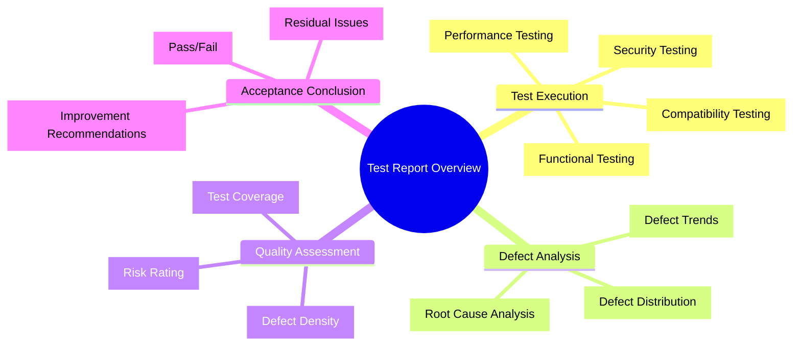
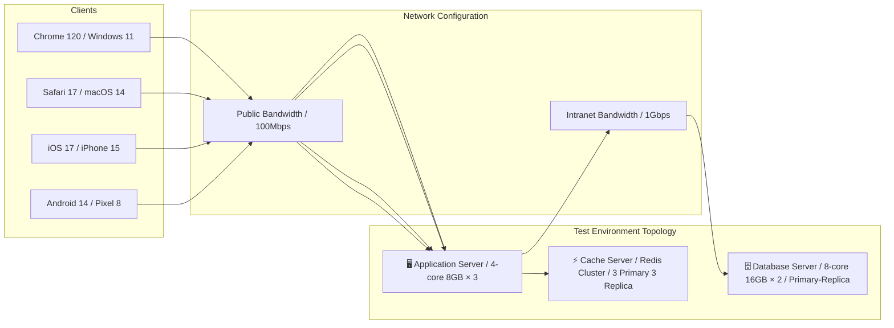
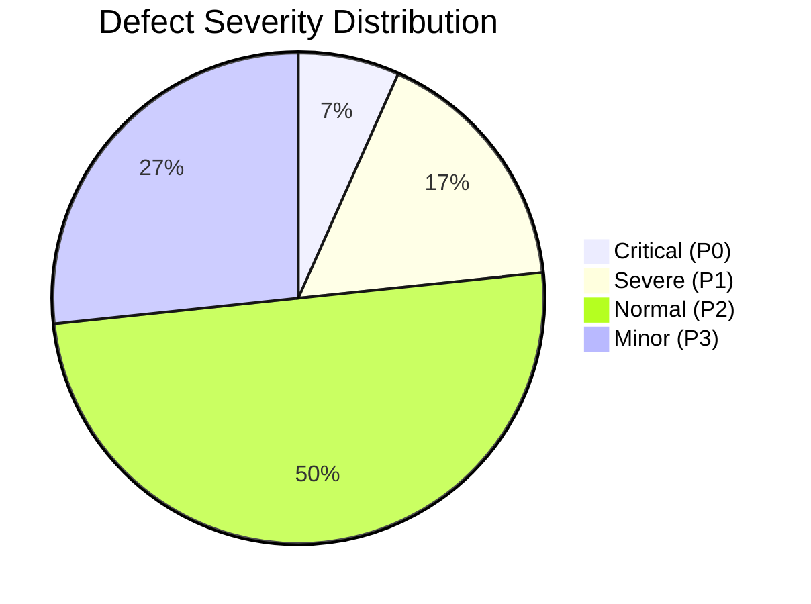
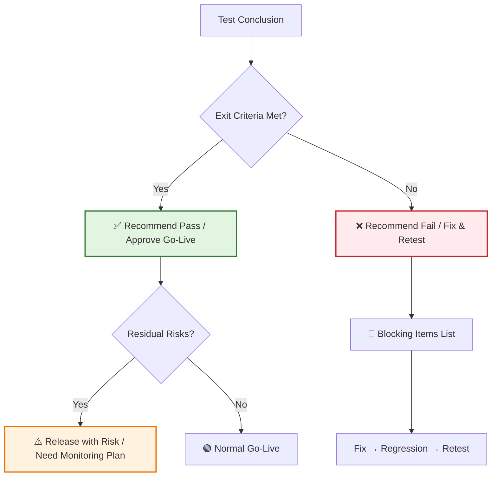

# [Product/System Name (English)] - Test Report

> **Document Status:** 🟡 Under Review / 🟢 Passed / 🔴 Failed / ⚪ Archived
>
> **Confidentiality Level:** Internal / Confidential
>
> **Version:** v0.7.1
>
> **Date:** YYYY-MM-DD
>
> **Author:** [Name]
>
> **Reviewer:** [Name/Role]
>
> **Audience:** [Role List]
>
> **Report ID:** TEST-2026-XXX
>
> **Related Requirements:** [PRD ID] / [BRD ID]
>
> **Related Release Plan:** [Release Plan ID]
>
> **Test Type:** 🟢 Functional Acceptance / 🟡 Regression / 🔴 Performance / 🔵 Security Penetration
>
> **Test Cycle:** YYYY-MM-DD ~ YYYY-MM-DD ([N] working days)
>
> **Test Team:** [Member List]

---

## 0. Document Guide

### 0.1 Document Purpose & Scope

[Describe the purpose, applicable scenarios, and non-applicable scenarios of this document]

### 0.2 Related Documents

| Document Type | Filename | Related Sections |
| -------- | ------------------- | ---------- |
| [Type] | [Filename] [Line Range] | [Section Description] |

> **Reference Format**: Related documents use the `filename line range` format (e.g., `【Template】Technical Requirements Document (TRD).md 3-17`). Line numbers may change as documents are updated; refer to the actual content.

### 0.3 Change Log

| Version | Date | Author | Changes | Reviewer |
| :----- | :--------- | :----- | :------------------------------------------------- | :----------- |
| v0.1 | YYYY-MM-DD | [Name] | Initial draft | |
| v0.2 | YYYY-MM-DD | [Name] | Added performance/security test results | |
| v0.3 | YYYY-MM-DD | [Name] | Added defect root cause analysis | |
| v0.4 | YYYY-MM-DD | [Name] | Formal release | [Test Lead] |
| v0.5 | 2026-06-09 | Xie Dong | Fix: quadrantChart template changed to table format (Feishu incompatible) | — |
| v0.6 | 2026-06-09 | Xie Dong | Fix gantt chart to table for Feishu rendering compatibility | — |
| v0.7 | 2026-06-09 | Xie Dong | Fix §3.2 test execution timeline gantt chart to table for Feishu compatibility | — |
| v0.5.1 | 2026-06-09 | Xie Dong | Fix xychart-beta chart to table for Feishu rendering compatibility | — |
| v0.7.1 | 2026-06-20 | Xie Dong | Message middleware example Kafka→Pulsar (unified event bus standard) | — |

---

## 1. Executive Summary

> **Management/Release Manager 30-Second Guide:** What was tested, results, and whether it's ready to ship.

| Element | Content |
| :----------- | :----------------------------------------------------------- |
| **Test Objective** | [One sentence, e.g.: Verify Order System V2.1 core functionality and performance meet go-live standards] |
| **Test Scope** | [e.g.: X functional modules, Y APIs, Z performance scenarios] |
| **Test Case Execution** | Total [N] cases, [M] passed, [P] failed, pass rate [Q]% |
| **Defect Summary** | Critical [A] / Severe [B] / Normal [C] / Minor [D], fix rate [R]% |
| **Core Conclusion** | [e.g.: Core functionality passed, P0 defects fixed, recommend go-live approval] |
| **Residual Risks** | [e.g.: 1 P2 defect pending fix, does not affect core flow, recommend post-launch follow-up] |

---

## 2. Test Overview

### 2.1 Test Background

> **Reference**: For functional acceptance criteria, non-functional requirements, and performance requirements, see **【Template】Functional Requirements Document (FRD).md §8** and **【Template】Technical Requirements Document (TRD).md §3-4**. This document only references key test basis.

| Item | Content | Reference Document |
| :----------- | :-------------------------------------------------------- | :--- |
| **Test Purpose** | [e.g.: Verify new version functional completeness, fix effectiveness, performance compliance] | — |
| **Test Basis** | Functional requirements, acceptance criteria, performance metrics in PRD/FRD/TRD | Ref FRD §8, TRD §3-4 |
| **Test Strategy** | [e.g.: Primarily black-box functional testing, supplemented by automated regression, performance load testing for capacity verification] | — |
| **Entry Criteria** | [e.g.: Developer self-testing passed, smoke test passed, test environment ready] | — |
| **Exit Criteria** | P0/P1 defect fix rate 100%, test case pass rate ≥95%, performance metrics met | Ref FRD §8.1 |

> **Acceptance Criteria**: For detailed acceptance criteria (Given-When-Then format) and performance acceptance metrics, see **【Template】Functional Requirements Document (FRD).md §8.1-8.2**.

### 2.2 Test Environment

| Environment Item | Configuration |
| :----------- | :-------------------------------------------------- |
| **Operating System** | CentOS 7.9 / Windows Server 2022 |
| **Database** | PostgreSQL 16.0 (Primary-Replica) / Redis 7.0 |
| **Middleware** | Nginx 1.24 / Pulsar 3.x / Elasticsearch 8.11 |
| **Application Container** | Docker 24.0 / K8s 1.28 |
| **Browser** | Chrome 120 / Firefox 121 / Safari 17 / Edge 120 |
| **Mobile** | iOS 17 (iPhone 15) / Android 14 (Pixel 8 / Xiaomi 14) |

### 2.3 Test Tools

| Test Type | Tool | Version | Purpose |
| :------- | :----------------------------------- | :--- | :----------------------- |
| Test Case Management | TestRail / Zentao / JIRA | vX.X | Test case design, execution, defect tracking |
| API Testing | Postman / Apifox / JMeter | vX.X | API functional/performance testing |
| UI Automation | Selenium / Playwright / Cypress | vX.X | Web regression testing |
| Performance Load Testing | JMeter / Locust / Gatling | vX.X | Load/stress/stability testing |
| Security Scanning | Burp Suite / OWASP ZAP | vX.X | Penetration testing/vulnerability scanning |
| Code Coverage | JaCoCo / Istanbul / Coverage.py | vX.X | Unit test coverage statistics |
| CI/CD | Jenkins / GitLab CI / GitHub Actions | vX.X | Automated pipeline |

---

## 3. Test Execution

### 3.1 Test Case Execution Statistics

> **Note**: xychart-beta is a Feishu-incompatible Mermaid type; replaced with table description (template sample data).

**Test Case Execution Distribution**

| Test Type | Case Count |
| :--------- | :----: |
| Functional Testing | 150 |
| API Testing | 80 |
| Performance Testing | 20 |
| Compatibility Testing | 40 |
| Security Testing | 15 |
| Automated Regression | 120 |

| Test Type | Total Cases | Executed | Passed | Failed | Blocked | Skipped | Pass Rate |
| :------------- | :------: | :-----: | :-----: | :----: | :---: | :---: | :-------: |
| **Functional Testing** | 150 | 150 | 142 | 6 | 2 | 0 | 94.7% |
| **API Testing** | 80 | 80 | 78 | 2 | 0 | 0 | 97.5% |
| **Performance Testing** | 20 | 20 | 18 | 2 | 0 | 0 | 90.0% |
| **Compatibility Testing** | 40 | 40 | 40 | 0 | 0 | 0 | 100% |
| **Security Testing** | 15 | 15 | 14 | 1 | 0 | 0 | 93.3% |
| **Automated Regression** | 120 | 120 | 118 | 2 | 0 | 0 | 98.3% |
| **Total** | **425** | **425** | **410** | **13** | **2** | **0** | **96.5%** |

### 3.2 Test Execution Timeline

> **Note**: Gantt chart is incompatible with Feishu; replaced with table description.

| Phase | Task | Start Date | End Date | Duration | Status |
| :------- | :----------------- | :--------- | :--------- | :--: | :--: |
| Preparation | Environment setup & smoke testing | YYYY-MM-DD | YYYY-MM-DD | 2d | ⚪ |
| Execution | Functional test execution | YYYY-MM-DD | YYYY-MM-DD | 5d | ⚪ |
| Execution | API test execution | YYYY-MM-DD | YYYY-MM-DD | 4d | ⚪ |
| Execution | Performance load test execution | YYYY-MM-DD | YYYY-MM-DD | 2d | ⚪ |
| Execution | Compatibility testing | YYYY-MM-DD | YYYY-MM-DD | 2d | ⚪ |
| Execution | Security penetration testing | YYYY-MM-DD | YYYY-MM-DD | 2d | ⚪ |
| Execution | Automated regression execution | YYYY-MM-DD | YYYY-MM-DD | 1d | ⚪ |
| Wrap-up | Defect verification & regression | YYYY-MM-DD | YYYY-MM-DD | 2d | ⚪ |
| Wrap-up | Report writing & review | YYYY-MM-DD | YYYY-MM-DD | 1d | ⚪ |

---

## 4. Defect Analysis

### 4.1 Defect Severity Distribution

| Severity | Definition | Count | Fixed | Pending Fix | Fix Rate |
| :---------- | :----------------------------- | :----: | :----: | :----: | :-------: |
| **P0 Critical** | System crash/data loss/core flow blocked | 2 | 2 | 0 | 100% |
| **P1 Severe** | Major function abnormal/severe performance degradation | 5 | 5 | 0 | 100% |
| **P2 Normal** | Minor function defect/experience issue | 15 | 12 | 3 | 80% |
| **P3 Minor** | UI imperfection/copy error/optimization suggestion | 8 | 6 | 2 | 75% |
| **Total** | | **30** | **25** | **5** | **83.3%** |

### 4.2 Defect Module Distribution

> **Note**: xychart-beta is a Feishu-incompatible Mermaid type; replaced with table description (template sample data).

**Defect Module Distribution (Top 5)**

| Module | Defect Count |
| :------- | :----: |
| Order Module | 10 |
| Payment Module | 8 |
| User Center | 5 |
| Product Module | 4 |
| Message Notification | 3 |

| Module | Defect Count | Percentage | Main Issue Types |
| :----------- | :----: | :---: | :------------------- |
| **Order Module** | 10 | 33.3% | State machine anomaly, concurrency issues |
| **Payment Module** | 8 | 26.7% | Callback handling, amount precision |
| **User Center** | 5 | 16.7% | Permission verification, data synchronization |
| **Product Module** | 4 | 13.3% | Stock deduction, price calculation |
| **Message Notification** | 3 | 10.0% | Push delay, template rendering |

### 4.3 Defect Trend Analysis

<svg xmlns="http://www.w3.org/2000/svg" viewBox="0 0 600 420" style="max-width:600px;height:auto">
<rect width="600" height="420" fill="#fafafa" rx="8"/>
<text x="300" y="28" text-anchor="middle" font-size="16" font-weight="bold" fill="#333">Defect Discovery & Fix Trend (Daily)</text>
<line x1="60" y1="370.0" x2="580" y2="370.0" stroke="#eee" stroke-width="1"/>
<text x="55" y="374.0" text-anchor="end" font-size="11" fill="#999">0</text>
<line x1="60" y1="304.0" x2="580" y2="304.0" stroke="#eee" stroke-width="1"/>
<text x="55" y="308.0" text-anchor="end" font-size="11" fill="#999">4</text>
<line x1="60" y1="238.0" x2="580" y2="238.0" stroke="#eee" stroke-width="1"/>
<text x="55" y="242.0" text-anchor="end" font-size="11" fill="#999">8</text>
<line x1="60" y1="172.0" x2="580" y2="172.0" stroke="#eee" stroke-width="1"/>
<text x="55" y="176.0" text-anchor="end" font-size="11" fill="#999">13</text>
<line x1="60" y1="106.0" x2="580" y2="106.0" stroke="#eee" stroke-width="1"/>
<text x="55" y="110.0" text-anchor="end" font-size="11" fill="#999">17</text>
<line x1="60" y1="40.0" x2="580" y2="40.0" stroke="#eee" stroke-width="1"/>
<text x="55" y="44.0" text-anchor="end" font-size="11" fill="#999">22</text>
<text x="16" y="205" text-anchor="middle" font-size="12" fill="#666" transform="rotate(-90, 16, 205)">Defect Count</text>
<line x1="60" y1="370" x2="580" y2="370" stroke="#ccc" stroke-width="1"/>
<polyline points="97.1,190.0 171.4,250.0 245.7,295.0 320.0,325.0 394.3,340.0 468.6,355.0 542.9,370.0" fill="none" stroke="#ee6666" stroke-width="2.5" stroke-linejoin="round" stroke-linecap="round"/>
<circle cx="97.1" cy="190.0" r="4" fill="#ee6666" stroke="#fff" stroke-width="1.5"/>
<text x="97.1" y="180.0" text-anchor="middle" font-size="10" fill="#ee6666" font-weight="bold">12</text>
<circle cx="171.4" cy="250.0" r="4" fill="#ee6666" stroke="#fff" stroke-width="1.5"/>
<text x="171.4" y="240.0" text-anchor="middle" font-size="10" fill="#ee6666" font-weight="bold">8</text>
<circle cx="245.7" cy="295.0" r="4" fill="#ee6666" stroke="#fff" stroke-width="1.5"/>
<text x="245.7" y="285.0" text-anchor="middle" font-size="10" fill="#ee6666" font-weight="bold">5</text>
<circle cx="320.0" cy="325.0" r="4" fill="#ee6666" stroke="#fff" stroke-width="1.5"/>
<text x="320.0" y="315.0" text-anchor="middle" font-size="10" fill="#ee6666" font-weight="bold">3</text>
<circle cx="394.3" cy="340.0" r="4" fill="#ee6666" stroke="#fff" stroke-width="1.5"/>
<text x="394.3" y="330.0" text-anchor="middle" font-size="10" fill="#ee6666" font-weight="bold">2</text>
<circle cx="468.6" cy="355.0" r="4" fill="#ee6666" stroke="#fff" stroke-width="1.5"/>
<text x="468.6" y="345.0" text-anchor="middle" font-size="10" fill="#ee6666" font-weight="bold">1</text>
<circle cx="542.9" cy="370.0" r="4" fill="#ee6666" stroke="#fff" stroke-width="1.5"/>
<text x="542.9" y="360.0" text-anchor="middle" font-size="10" fill="#ee6666" font-weight="bold">0</text>
<polyline points="97.1,340.0 171.4,295.0 245.7,250.0 320.0,190.0 394.3,145.0 468.6,100.0 542.9,70.0" fill="none" stroke="#3ba272" stroke-width="2.5" stroke-linejoin="round" stroke-linecap="round"/>
<circle cx="97.1" cy="340.0" r="4" fill="#3ba272" stroke="#fff" stroke-width="1.5"/>
<text x="97.1" y="330.0" text-anchor="middle" font-size="10" fill="#3ba272" font-weight="bold">2</text>
<circle cx="171.4" cy="295.0" r="4" fill="#3ba272" stroke="#fff" stroke-width="1.5"/>
<text x="171.4" y="285.0" text-anchor="middle" font-size="10" fill="#3ba272" font-weight="bold">5</text>
<circle cx="245.7" cy="250.0" r="4" fill="#3ba272" stroke="#fff" stroke-width="1.5"/>
<text x="245.7" y="240.0" text-anchor="middle" font-size="10" fill="#3ba272" font-weight="bold">8</text>
<circle cx="320.0" cy="190.0" r="4" fill="#3ba272" stroke="#fff" stroke-width="1.5"/>
<text x="320.0" y="180.0" text-anchor="middle" font-size="10" fill="#3ba272" font-weight="bold">12</text>
<circle cx="394.3" cy="145.0" r="4" fill="#3ba272" stroke="#fff" stroke-width="1.5"/>
<text x="394.3" y="135.0" text-anchor="middle" font-size="10" fill="#3ba272" font-weight="bold">15</text>
<circle cx="468.6" cy="100.0" r="4" fill="#3ba272" stroke="#fff" stroke-width="1.5"/>
<text x="468.6" y="90.0" text-anchor="middle" font-size="10" fill="#3ba272" font-weight="bold">18</text>
<circle cx="542.9" cy="70.0" r="4" fill="#3ba272" stroke="#fff" stroke-width="1.5"/>
<text x="542.9" y="60.0" text-anchor="middle" font-size="10" fill="#3ba272" font-weight="bold">20</text>
<text x="97.1" y="390" text-anchor="middle" font-size="12" fill="#333">Day1</text>
<text x="171.4" y="390" text-anchor="middle" font-size="12" fill="#333">Day2</text>
<text x="245.7" y="390" text-anchor="middle" font-size="12" fill="#333">Day3</text>
<text x="320.0" y="390" text-anchor="middle" font-size="12" fill="#333">Day4</text>
<text x="394.3" y="390" text-anchor="middle" font-size="12" fill="#333">Day5</text>
<text x="468.6" y="390" text-anchor="middle" font-size="12" fill="#333">Day6</text>
<text x="542.9" y="390" text-anchor="middle" font-size="12" fill="#333">Day7</text>
<line x1="210.0" y1="414" x2="222.0" y2="414" stroke="#ee6666" stroke-width="2.5"/>
<circle cx="216.0" cy="414" r="3" fill="#ee6666" stroke="#fff" stroke-width="1"/>
<text x="226.0" y="418" font-size="12" fill="#333">New Defects</text>
<line x1="300.0" y1="414" x2="312.0" y2="414" stroke="#3ba272" stroke-width="2.5"/>
<circle cx="306.0" cy="414" r="3" fill="#3ba272" stroke="#fff" stroke-width="1"/>
<text x="316.0" y="418" font-size="12" fill="#333">Cumulative Fixes</text>
</svg>

**Trend Analysis Conclusion:**

- Days 1-3 were the peak defect discovery period, as expected
- New defects significantly decreased after Day 4, converging
- Cumulative fix curve continuously rising, fix pace keeps up with discovery
- Day 7 had zero new defects, reaching convergence criteria

### 4.4 Defect Root Cause Analysis

| Root Cause Category | Count | Percentage | Typical Case | Prevention Measure |
| :------------- | :--: | :---: | :-------------- | :------------------- |
| **Requirement Omission** | 5 | 16.7% | Boundary conditions undefined | Include testers in requirement reviews |
| **Design Defect** | 3 | 10.0% | Missing concurrency control | Add technical solution in design review |
| **Coding Error** | 15 | 50.0% | Null pointer/array out of bounds | Strengthen Code Review |
| **Configuration Error** | 4 | 13.3% | Inconsistent environment configuration | Centralized configuration management |
| **Compatibility Issue** | 3 | 10.0% | Browser differences | Front-load compatibility testing |

---

## 5. Specialized Testing

### 5.1 Performance Testing Results

**Test Objective:** Verify system response time and throughput under target concurrency

| Test Scenario | Concurrent Users | Avg Response Time | P99 Response Time | Throughput (TPS) | Error Rate | Result |
| :------------- | :-----------: | :----------: | :---------: | :---------: | :----: | :-----: |
| **Baseline** | 100 | 120ms | 200ms | 850 | 0% | ✅ Pass |
| **Load Test** | 500 | 180ms | 350ms | 2,400 | 0.01% | ✅ Pass |
| **Stress Test** | 1,000 | 320ms | 580ms | 3,800 | 0.05% | ✅ Pass |
| **Capacity Test** | 2,000 | 650ms | 1,200ms | 4,500 | 0.8% | ⚠️ Warning |
| **Stability Test** | 500 (8h sustained) | 200ms | 380ms | 2,350 | 0.02% | ✅ Pass |

> **Note**: xychart-beta is a Feishu-incompatible Mermaid type; replaced with table description (template sample data).

**Performance Load Test Results (Response Time vs Concurrency)**

| Concurrency | Response Time (ms) |
| :----: | :----------: |
| 100 | 120 |
| 500 | 180 |
| 1,000 | 320 |
| 2,000 | 650 |

**Performance Conclusion:** System performs well at 1,000 concurrency. At 2,000 concurrency, P99 response time exceeds 1s; recommend optimization before capacity expansion.

### 5.2 Security Testing Results

| Test Item | Test Method | Result | Risk Level |
| :------------------- | :-------------------- | :---------------- | :------: |
| **SQL Injection** | Automated scan + manual verification | Not found | 🟢 Low |
| **XSS Cross-Site Scripting** | Automated scan + manual verification | 1 stored XSS found | 🟡 Medium |
| **CSRF Cross-Site Request Forgery** | Manual verification | Not found | 🟢 Low |
| **Sensitive Info Leak** | Code audit + packet capture analysis | Password printed in logs | 🔴 High |
| **Unauthorized Access** | Manual verification | Not found | 🟢 Low |
| **API Authentication** | Automated scan | 1 unauthenticated API found | 🟡 Medium |

**Security Conclusion:** 2 medium-risk and 1 high-risk issues must be fixed before go-live. High-risk issue (password printed in logs) has been pushed for fix and verified.

### 5.3 Compatibility Testing Results

| Platform | Browser/Version | Test Result | Notes |
| :------ | :---------- | :------: | :----------- |
| Windows | Chrome 120 | ✅ Pass | |
| Windows | Firefox 121 | ✅ Pass | |
| Windows | Edge 120 | ✅ Pass | |
| macOS | Safari 17 | ✅ Pass | |
| macOS | Chrome 120 | ✅ Pass | |
| iOS | Safari 17 | ✅ Pass | |
| iOS | Chrome 120 | ✅ Pass | |
| Android | Chrome 120 | ✅ Pass | |
| Android | WebView | ⚠️ Pass | Some animation stuttering |

### 5.4 Automated Test Coverage

| Module | Statement Coverage | Branch Coverage | Function Coverage | Target Achieved |
| :------- | :--------: | :--------: | :--------: | :---------: |
| Order Module | 87% | 82% | 91% | ✅ Achieved |
| Payment Module | 92% | 88% | 95% | ✅ Achieved |
| User Center | 78% | 71% | 85% | ⚠️ Not Achieved |
| Product Module | 85% | 80% | 89% | ✅ Achieved |
| **Overall** | **85.5%** | **80.3%** | **90.0%** | **✅ Achieved** |

---

## 6. Risk Assessment & Recommendations

### 6.1 Residual Defect Risk

| Defect ID | Description | Severity | Impact Scope | Mitigation | Recommendation |
| :------ | :------------------------ | :------: | :------- | :------------------ | :--------- |
| BUG-028 | Order export Excel large file timeout | P2 | Operations backend | Limit single export ≤5000 records | Optimize post-launch |
| BUG-029 | Message push occasional delay (>5min) | P2 | Some users | Add retry mechanism | Optimize post-launch |
| BUG-030 | iOS WebView animation stutter | P3 | iOS users | Degrade to static effect | Fix in next version |

### 6.2 Go-Live Risk Assessment

> **Note**: This quadrant chart template has been converted to a table description.

<!--
Original quadrantChart structure reference:
- title: Go-Live Risk Matrix (Impact vs Probability)
- x-axis: "Low Probability" --> "High Probability"
- y-axis: "Low Impact" --> "High Impact"
- quadrant-1: High Risk (High Impact/High Probability)
- quadrant-2: Key Watch (High Impact/Low Probability)
- quadrant-3: Low Risk (Low Impact/Low Probability)
- quadrant-4: General Attention (Low Impact/High Probability)
- Data points: "Residual P2 Defect": [0.3, 0.5]; "Performance Capacity Bottleneck": [0.5, 0.7]; "Security Vulnerability": [0.2, 0.8]; "Compatibility Issue": [0.4, 0.3]
-->

| Quadrant | Region Characteristics | Recommended Strategy |
| :--------------------- | :------------------------ | :--------------------------- |
| Quadrant 1 (High Probability · High Impact) | High Risk (High Impact/High Probability) | Must close loop before go-live, otherwise block release |
| Quadrant 2 (Low Probability · High Impact) | Key Watch (High Impact/Low Probability) | Key monitoring post-launch, prepare contingency plan |
| Quadrant 3 (Low Probability · Low Impact) | Low Risk (Low Impact/Low Probability) | Routine attention, can release with known risks |
| Quadrant 4 (High Probability · Low Impact) | General Attention (Low Impact/High Probability) | Schedule fix in subsequent versions |

| Name | X Value | Y Value | Quadrant |
| :----------- | :-: | :-: | :---------------- |
| Residual P2 Defect | 0.3 | 0.5 | Quadrant 2 (Key Watch) |
| Performance Capacity Bottleneck | 0.5 | 0.7 | Quadrant 1 (High Risk) |
| Security Vulnerability | 0.2 | 0.8 | Quadrant 2 (Key Watch) |
| Compatibility Issue | 0.4 | 0.3 | Quadrant 3 (Low Risk) |

| Risk Item | Level | Notes |
| :------------- | :---: | :-------------------------------------- |
| **Functional Risk** | 🟢 Low | All P0/P1 defects fixed, core flow validation passed |
| **Performance Risk** | 🟡 Medium | Stable within 1,000 concurrency, peak needs rate limiting |
| **Security Risk** | 🟡 Medium | High-risk vulnerabilities fixed, medium-risk needs post-launch follow-up |
| **Compatibility Risk** | 🟢 Low | All major platforms passed, only iOS WebView minor stutter |

---

## 7. Test Conclusion & Acceptance Recommendation

### 7.1 Overall Quality Assessment

| Dimension | Rating | Notes |
| :------------- | :--------: | :-------------------------- |
| **Functional Completeness** | ⭐⭐⭐⭐⭐ | All core functionality verified |
| **Performance Stability** | ⭐⭐⭐⭐ | Stable within target capacity, peak needs optimization |
| **Security Compliance** | ⭐⭐⭐⭐ | High-risk fixed, medium-risk pending follow-up |
| **Compatibility** | ⭐⭐⭐⭐⭐ | Full coverage of major platforms |
| **Code Quality** | ⭐⭐⭐⭐ | Coverage 85.5%, some modules need improvement |

### 7.2 Acceptance Conclusion

**Final Conclusion:** 🟢 **Recommend Pass, Approve Go-Live**

**Reasons:**

1. All P0/P1 critical/severe defects fixed and verified
2. Core functional test case pass rate 96.5%, meeting exit criteria (≥95%)
3. Performance tests all passed within target capacity (1,000 concurrency)
4. High-risk security vulnerabilities fixed; remaining medium-risk issues don't affect core flow
5. 3 residual P2/P3 defects have mitigation plans; recommend iterative fix post-launch

### 7.3 Follow-up Recommendations

| Priority | Recommendation | Owner | Timeline |
| :----: | :----------------------------------- | :------- | :---------- |
| P1 | Optimize order export large file performance, support async export | Backend Dev | Within 1 week post-launch |
| P1 | Improve User Center unit test coverage to 80% | Test Team | Next version iteration |
| P2 | Establish performance baseline monitoring, auto-trigger capacity alerts | SRE Team | Within 2 weeks post-launch |
| P2 | Introduce security scanning into CI pipeline, shift-left security testing | Security Team | Next version iteration |

---

## 8. Appendix

### 8.1 Glossary

| Term | Definition |
| :------------------ | :--------------------------------------- |
| **P0/P1/P2/P3** | Defect severity levels: Critical/Severe/Normal/Minor |
| **TPS** | Transactions Per Second |
| **P95** | 95th percentile response time, 95% of requests are below this value |
| **Code Coverage** | Code coverage, measures the extent to which test cases cover code |
| **Smoke Test** | Quick test to verify core functionality is usable |
| **Regression Test** | Regression test, verifies modifications haven't introduced new defects |

### 8.2 Related Documents

| Document | ID | Link |
| :------------------ | :----------------- | :----- |
| Product Requirements Document (PRD) | PRD-2026-XXX | [Link] |
| Test Plan | TEST-PLAN-2026-XXX | [Link] |
| Test Cases | TEST-CASE-2026-XXX | [Link] |
| Defect Tracking | BUG-TRACK-2026-XXX | [Link] |
| Performance Test Report | PERF-2026-XXX | [Link] |
| Security Test Report | SEC-2026-XXX | [Link] |

## 9. Test Review Sign-off

> The test report must be reviewed and signed by the following roles before it can serve as the basis for go-live.

| Role | Name | Signature | Date | Review Comments |
| :------------- | :--- | :--: | :--: | :----------------------- |
| **Test Lead** | | | | [Test conclusion confirmed] |
| **Development Lead** | | | | [Defect fix confirmed] |
| **Product Lead** | | | | [Functional acceptance confirmed] |
| **Tech Lead** | | | | [Technical risk confirmed] |
| **Release Manager** | | | | [Go-live decision confirmed] |
| **Security Lead** | | | | [Security compliance confirmed] (if applicable) |
