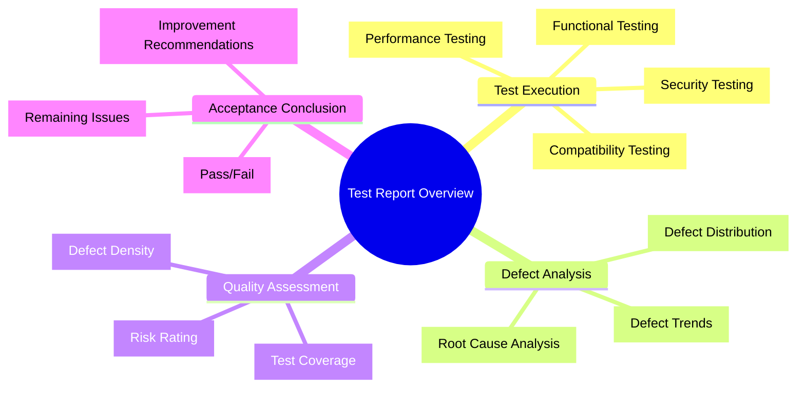
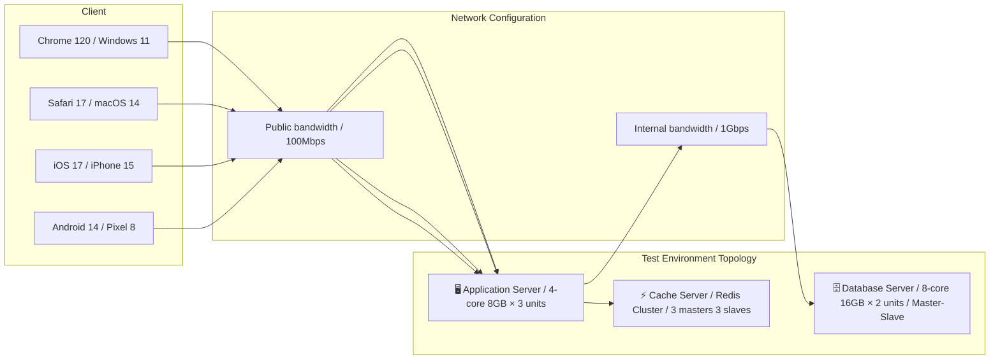
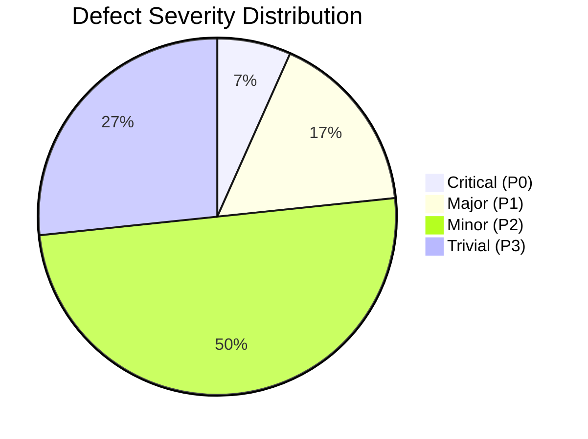
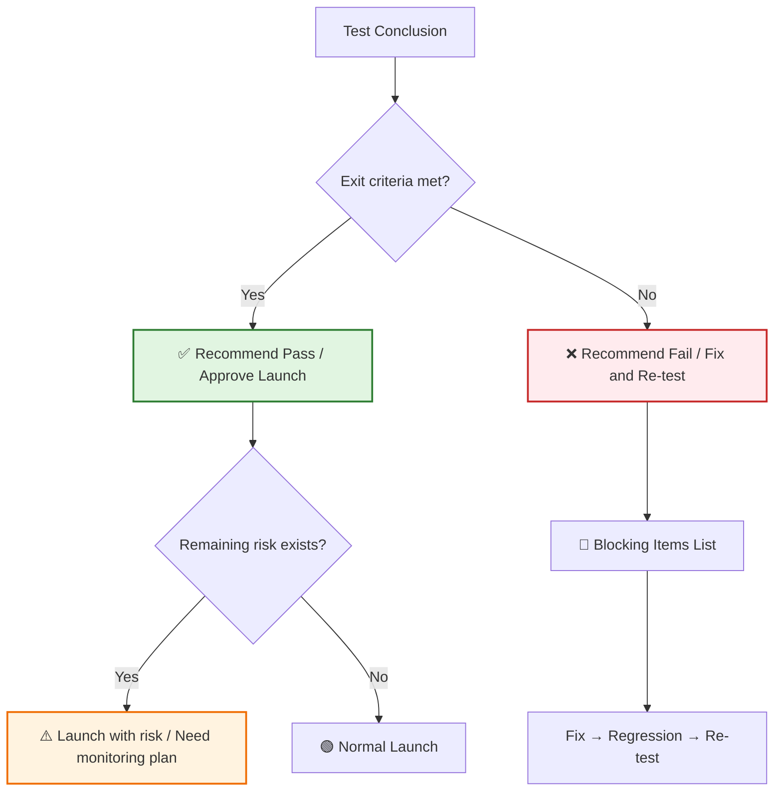

# [Product/System Name (English)] - Test Report

> **Document Status:** 🟡 Under Review / 🟢 Passed / 🔴 Failed / ⚪ Archived
>
> **Confidentiality Level:** Internal Public / Confidential
>
> **Version:** v0.7.1
>
> **Date:** YYYY-MM-DD
>
> **Author:** [Name]
>
> **Reviewer:** [Name/Role]
>
> **Audience:** [Role List]
>
> **Report Number:** TEST-2026-XXX
>
> **Related Requirements:** [PRD Number] / [BRD Number]
>
> **Related Release Plan:** [Release Plan Number]
>
> **Test Type:** 🟢 Functional Acceptance Test / 🟡 Regression Test / 🔴 Performance Load Test / 🔵 Security Penetration Test
>
> **Test Period:** YYYY-MM-DD ~ YYYY-MM-DD (Total [N] working days)
>
> **Test Team:** [Member List]

---

## 0. Document Guide

### 0.1 Document Purpose and Scope

[Explain the purpose, applicable scenarios, and non-applicable scenarios of this document]

### 0.2 Related Documents

| Document Type | Filename | Related Sections |
| -------- | ------------------- | ---------- |
| [Type] | [Filename] [Line Range] | [Section Description] |

> **Reference Format Note**: Related documents use the `filename line range` format (e.g., `【Template】Technical Requirements Document(TRD).md 3-17`). Line numbers may change as documents are updated; please refer to actual content.

### 0.3 Change Log

| Version | Date | Reviser | Change Content | Reviewer |
| :--- | :--- | :--- | :--- | :--- |
| v0.1 | YYYY-MM-DD | [Name] | Initial draft | |
| v0.2 | YYYY-MM-DD | [Name] | Added performance/security test results | |
| v0.3 | YYYY-MM-DD | [Name] | Added defect root cause analysis | |
| v0.4 | YYYY-MM-DD | [Name] | Official release | [Test Lead] |
| v0.5 | 2026-06-09 | Xie Dong | Fixed quadrantChart template to table format (Feishu incompatible) | — |
| v0.6 | 2026-06-09 | Xie Dong | Fixed Gantt chart to table for Feishu rendering compatibility | — |
| v0.7 | 2026-06-09 | Xie Dong | Fixed §3.2 test execution timeline Gantt chart to table for Feishu compatibility | — |
| v0.5.1 | 2026-06-09 | Xie Dong | Fixed xychart-beta chart to table for Feishu rendering compatibility | — |
| v0.7.1 | 2026-06-20 | Xie Dong | Message middleware example Kafka→Pulsar (unified event bus specification) | — |

---

## 1. Executive Summary

> **Management/Release Manager 30-second guide:** What was tested, results, whether it can be released.

| Element | Content |
| :--- | :--- |
| **Test Objective** | [One sentence, e.g., Verify Order System V2.1 core functionality and performance meet launch standards] |
| **Test Scope** | [e.g., X functional modules, Y APIs, Z performance scenarios] |
| **Test Case Execution** | Total [N] cases, [M] passed, [P] failed, pass rate [Q]% |
| **Defect Statistics** | Critical [A] / Major [B] / Minor [C] / Trivial [D], fix rate [R]% |
| **Core Conclusion** | [e.g., Core functionality passed, P0 defects fixed, recommend approval for launch] |
| **Remaining Risk** | [e.g., 1 P2 defect pending fix, doesn't affect core flow, recommend follow-up after launch] |

---

## 2. Test Overview

### 2.1 Test Background

> **Reference Note**: Functional acceptance criteria, non-functional requirement indicators, performance requirements please refer to **【Template】Functional Requirements Document(FRD).md §8** and **【Template】Technical Requirements Document(TRD).md §3-4**. This document only references key test basis.

| Item | Content | Reference Document |
| :--- | :--- | :--- |
| **Test Purpose** | [e.g., Verify new version feature completeness, fix effectiveness, performance compliance] | — |
| **Test Basis** | Functional requirements, acceptance criteria, performance indicators in PRD/FRD/TRD | Reference FRD§8, TRD§3-4 |
| **Test Strategy** | [e.g., Black-box functional testing as main, automated regression as supplement, performance load testing to verify capacity] | — |
| **Entry Criteria** | [e.g., Developer self-test passed, smoke test passed, test environment ready] | — |
| **Exit Criteria** | P0/P1 defect fix rate 100%, test case pass rate ≥95%, performance indicators meet standards | Reference FRD§8.1 |

> **Acceptance Criteria**: Detailed acceptance criteria (Given-When-Then format), performance acceptance indicators please refer to **【Template】Functional Requirements Document(FRD).md §8.1-8.2**.

### 2.2 Test Environment

| Environment Item | Configuration |
| :--- | :--- |
| **Operating System** | CentOS 7.9 / Windows Server 2022 |
| **Database** | PostgreSQL 16.0 (Master-Slave) / Redis 7.0 |
| **Middleware** | Nginx 1.24 / Pulsar 3.x / Elasticsearch 8.11 |
| **Application Container** | Docker 24.0 / K8s 1.28 |
| **Browser** | Chrome 120 / Firefox 121 / Safari 17 / Edge 120 |
| **Mobile** | iOS 17 (iPhone 15) / Android 14 (Pixel 8 / Xiaomi 14) |

### 2.3 Test Tools

| Test Type | Tool | Version | Purpose |
| :--- | :--- | :--- | :--- |
| Test Case Management | TestRail / Zentao / JIRA | vX.X | Case design, execution, defect tracking |
| API Testing | Postman / Apifox / JMeter | vX.X | API functional/performance testing |
| UI Automation | Selenium / Playwright / Cypress | vX.X | Web regression testing |
| Performance Load Testing | JMeter / Locust / Gatling | vX.X | Load/Stress/Stability testing |
| Security Scanning | Burp Suite / OWASP ZAP | vX.X | Penetration testing/Vulnerability scanning |
| Code Coverage | JaCoCo / Istanbul / Coverage.py | vX.X | Unit test coverage statistics |
| Continuous Integration | Jenkins / GitLab CI / GitHub Actions | vX.X | Automated pipeline |

---

## 3. Test Execution

### 3.1 Test Case Execution Statistics

> **Note**: xychart-beta is not compatible with Feishu, converted to table description (template sample data).

**Test Case Execution Distribution**

| Test Type | Case Count |
| :--- | :---: |
| Functional Testing | 150 |
| API Testing | 80 |
| Performance Testing | 20 |
| Compatibility | 40 |
| Security Testing | 15 |
| Automated Regression | 120 |

| Test Type | Total Cases | Executed | Passed | Failed | Blocked | Skipped | Pass Rate |
| :--- | :---: | :---: | :---: | :---: | :---: | :---: | :---: |
| **Functional Testing** | 150 | 150 | 142 | 6 | 2 | 0 | 94.7% |
| **API Testing** | 80 | 80 | 78 | 2 | 0 | 0 | 97.5% |
| **Performance Testing** | 20 | 20 | 18 | 2 | 0 | 0 | 90.0% |
| **Compatibility Testing** | 40 | 40 | 40 | 0 | 0 | 0 | 100% |
| **Security Testing** | 15 | 15 | 14 | 1 | 0 | 0 | 93.3% |
| **Automated Regression** | 120 | 120 | 118 | 2 | 0 | 0 | 98.3% |
| **Total** | **425** | **425** | **410** | **13** | **2** | **0** | **96.5%** |

### 3.2 Test Execution Timeline

> **Note**: Gantt chart is not compatible with Feishu, converted to table description.

| Phase | Task | Start Date | End Date | Duration | Status |
| :--- | :--- | :--- | :--- | :--: | :--: |
| Preparation Phase | Environment setup and smoke testing | YYYY-MM-DD | YYYY-MM-DD | 2d | ⚪ |
| Execution Phase | Functional testing execution | YYYY-MM-DD | YYYY-MM-DD | 5d | ⚪ |
| Execution Phase | API testing execution | YYYY-MM-DD | YYYY-MM-DD | 4d | ⚪ |
| Execution Phase | Performance load testing execution | YYYY-MM-DD | YYYY-MM-DD | 2d | ⚪ |
| Execution Phase | Compatibility testing | YYYY-MM-DD | YYYY-MM-DD | 2d | ⚪ |
| Execution Phase | Security penetration testing | YYYY-MM-DD | YYYY-MM-DD | 2d | ⚪ |
| Execution Phase | Automated regression execution | YYYY-MM-DD | YYYY-MM-DD | 1d | ⚪ |
| Wrap-up Phase | Defect verification and regression | YYYY-MM-DD | YYYY-MM-DD | 2d | ⚪ |
| Wrap-up Phase | Report writing and review | YYYY-MM-DD | YYYY-MM-DD | 1d | ⚪ |

---

## 4. Defect Statistics and Analysis

### 4.1 Defect Severity Distribution

| Severity | Definition | Count | Fixed | Pending Fix | Fix Rate |
| :--- | :--- | :---: | :---: | :---: | :---: |
| **P0 Critical** | System crash/Data loss/Core flow blocked | 2 | 2 | 0 | 100% |
| **P1 Major** | Main function abnormal/Severe performance degradation | 5 | 5 | 0 | 100% |
| **P2 Minor** | Secondary function defect/Experience issue | 15 | 12 | 3 | 80% |
| **P3 Trivial** | UI blemish/Copy error/Optimization suggestion | 8 | 6 | 2 | 75% |
| **Total** | | **30** | **25** | **5** | **83.3%** |

### 4.2 Defect Module Distribution

> **Note**: xychart-beta is not compatible with Feishu, converted to table description (template sample data).

**Defect Module Distribution (Top 5)**

| Module | Defect Count |
| :--- | :---: |
| Order Module | 10 |
| Payment Module | 8 |
| User Center | 5 |
| Product Module | 4 |
| Message Notification | 3 |

| Module | Defect Count | Percentage | Main Issue Types |
| :--- | :---: | :---: | :--- |
| **Order Module** | 10 | 33.3% | State machine anomaly, concurrency issues |
| **Payment Module** | 8 | 26.7% | Callback processing, amount precision |
| **User Center** | 5 | 16.7% | Permission validation, data synchronization |
| **Product Module** | 4 | 13.3% | Inventory deduction, price calculation |
| **Message Notification** | 3 | 10.0% | Push delay, template rendering |

### 4.3 Defect Trend Analysis

**Trend Analysis Conclusion:**

- Test Days 1-3 were the defect discovery peak period, as expected
- After Day 4, new defect discoveries significantly decreased, trending toward convergence
- Cumulative fix curve continuously rising, fix speed keeping up with discovery speed
- Day 7 new defect count was 0, meeting defect convergence standard

### 4.4 Defect Root Cause Analysis

| Root Cause Category | Count | Percentage | Typical Case | Prevention Measure |
| :--- | :---: | :---: | :--- | :--- |
| **Requirement Omission** | 5 | 16.7% | Boundary condition undefined | Include testers in requirement review |
| **Design Defect** | 3 | 10.0% | Concurrency control missing | Add technical solutions to design review |
| **Coding Error** | 15 | 50.0% | Null pointer/Array out of bounds | Strengthen Code Review |
| **Configuration Error** | 4 | 13.3% | Environment configuration inconsistent | Centralized configuration management |
| **Compatibility Issue** | 3 | 10.0% | Browser differences | Move compatibility testing earlier |

---

## 5. Specialized Testing Results

### 5.1 Performance Testing Results

**Test Objective:** Verify system response time and throughput under target concurrency

| Test Scenario | Concurrent Users | Average Response Time | P95 Response Time | Throughput (TPS) | Error Rate | Result |
| :--- | :---: | :---: | :---: | :---: | :---: | :---: |
| **Baseline Test** | 100 | 120ms | 200ms | 850 | 0% | ✅ Pass |
| **Load Test** | 500 | 180ms | 350ms | 2,400 | 0.01% | ✅ Pass |
| **Stress Test** | 1,000 | 320ms | 580ms | 3,800 | 0.05% | ✅ Pass |
| **Capacity Test** | 2,000 | 650ms | 1,200ms | 4,500 | 0.8% | ⚠️ Warning |
| **Stability Test** | 500 (sustained 8h) | 200ms | 380ms | 2,350 | 0.02% | ✅ Pass |

> **Note**: xychart-beta is not compatible with Feishu, converted to table description (template sample data).

**Performance Load Test Results (Response Time vs Concurrency)**

| Concurrency | Response Time (ms) |
| :---: | :---: |
| 100 | 120 |
| 500 | 180 |
| 1,000 | 320 |
| 2,000 | 650 |

**Performance Conclusion:** System performs well under 1,000 concurrency; at 2,000 concurrency P95 response time exceeds 1s, recommend optimization before capacity expansion.

### 5.2 Security Testing Results

| Detection Item | Detection Method | Result | Risk Level |
| :--- | :--- | :--- | :---: |
| **SQL Injection** | Automated scanning + Manual verification | Not found | 🟢 Low |
| **XSS Cross-site Scripting** | Automated scanning + Manual verification | Found 1 stored XSS | 🟡 Medium |
| **CSRF Cross-site Request Forgery** | Manual verification | Not found | 🟢 Low |
| **Sensitive Information Leak** | Code audit + Packet capture analysis | Found password printed in logs | 🔴 High |
| **Unauthorized Access** | Manual verification | Not found | 🟢 Low |
| **API Authentication** | Automated scanning | Found 1 unauthenticated API | 🟡 Medium |

**Security Conclusion:** 2 medium risk, 1 high risk issues need to be fixed before launch. High risk issue (password printed in logs) has been pushed for fix and verified.

### 5.3 Compatibility Testing Results

| Platform | Browser/Version | Test Result | Notes |
| :--- | :--- | :---: | :--- |
| Windows | Chrome 120 | ✅ Pass | |
| Windows | Firefox 121 | ✅ Pass | |
| Windows | Edge 120 | ✅ Pass | |
| macOS | Safari 17 | ✅ Pass | |
| macOS | Chrome 120 | ✅ Pass | |
| iOS | Safari 17 | ✅ Pass | |
| iOS | Chrome 120 | ✅ Pass | |
| Android | Chrome 120 | ✅ Pass | |
| Android | WebView | ⚠️ Pass | Partial animation stuttering |

### 5.4 Automated Test Coverage

| Module | Statement Coverage | Branch Coverage | Function Coverage | Target Achievement |
| :--- | :---: | :---: | :---: | :---: |
| Order Module | 87% | 82% | 91% | ✅ Achieved |
| Payment Module | 92% | 88% | 95% | ✅ Achieved |
| User Center | 78% | 71% | 85% | ⚠️ Not Achieved |
| Product Module | 85% | 80% | 89% | ✅ Achieved |
| **Overall** | **85.5%** | **80.3%** | **90.0%** | **✅ Achieved** |

---

## 6. Risk Assessment and Recommendations

### 6.1 Remaining Defect Risk

| Defect ID | Description | Severity | Impact Scope | Mitigation Measure | Recommendation |
| :--- | :--- | :---: | :--- | :--- | :--- |
| BUG-028 | Order export Excel large file timeout | P2 | Operations backend | Limit single export ≤5000 records | Optimize after launch |
| BUG-029 | Message push occasional delay (>5min) | P2 | Some users | Add retry mechanism | Optimize after launch |
| BUG-030 | iOS WebView animation stuttering | P3 | iOS users | Degrade to static effect | Fix in next version |

### 6.2 Launch Risk Assessment

> **Note**: This quadrant chart template has been converted to table description.

<!--
Original quadrantChart structure reference:
- title: Launch Risk Matrix (Impact vs Probability)
- x-axis: "Low Probability" --> "High Probability"
- y-axis: "Low Impact" --> "High Impact"
- quadrant-1: High Risk (High Impact/High Probability)
- quadrant-2: Key Observation (High Impact/Low Probability)
- quadrant-3: Low Risk (Low Impact/Low Probability)
- quadrant-4: General Attention (Low Impact/High Probability)
- Data points: "Remaining P2 defects": [0.3, 0.5]; "Performance capacity bottleneck": [0.5, 0.7]; "Security vulnerabilities": [0.2, 0.8]; "Compatibility issues": [0.4, 0.3]
-->

| Quadrant | Area Characteristics | Strategy Suggestions |
| :--- | :--- | :--- |
| Quadrant 1 (High Probability · High Impact) | High Risk (High Impact/High Probability) | Must close loop before launch, otherwise block release |
| Quadrant 2 (Low Probability · High Impact) | Key Observation (High Impact/Low Probability) | Key monitoring after launch, prepare emergency plan |
| Quadrant 3 (Low Probability · Low Impact) | Low Risk (Low Impact/Low Probability) | General attention, can launch with risk |
| Quadrant 4 (High Probability · Low Impact) | General Attention (Low Impact/High Probability) | Schedule for next version fix |

| Name | X Value | Y Value | Quadrant |
| :--- | :---: | :---: | :--- |
| Remaining P2 defects | 0.3 | 0.5 | Quadrant 2 (Key Observation) |
| Performance capacity bottleneck | 0.5 | 0.7 | Quadrant 1 (High Risk) |
| Security vulnerabilities | 0.2 | 0.8 | Quadrant 2 (Key Observation) |
| Compatibility issues | 0.4 | 0.3 | Quadrant 3 (Low Risk) |

| Risk Item | Level | Description |
| :--- | :---: | :--- |
| **Functional Risk** | 🟢 Low | P0/P1 defects all fixed, core flow verification passed |
| **Performance Risk** | 🟡 Medium | Stable within 1,000 concurrency, peak needs rate limiting protection |
| **Security Risk** | 🟡 Medium | High risk vulnerabilities fixed, medium risk needs post-launch follow-up |
| **Compatibility Risk** | 🟢 Low | All mainstream platforms passed, only iOS WebView slight stuttering |

---

## 7. Test Conclusion and Acceptance Recommendation

### 7.1 Comprehensive Quality Assessment

| Dimension | Rating | Description |
| :--- | :---: | :--- |
| **Feature Completeness** | ⭐⭐⭐⭐⭐ | All core functionality verified |
| **Performance Stability** | ⭐⭐⭐⭐ | Stable within target capacity, peak needs optimization |
| **Security Compliance** | ⭐⭐⭐⭐ | High risk fixed, medium risk pending follow-up |
| **Compatibility** | ⭐⭐⭐⭐⭐ | Full mainstream platform coverage |
| **Code Quality** | ⭐⭐⭐⭐ | Coverage 85.5%, some modules need improvement |

### 7.2 Acceptance Conclusion

**Final Conclusion:** 🟢 **Recommend Pass, Approve Launch**

**Reasons:**

1. P0/P1 Critical/Major defects all fixed and verified
2. Core functionality test case pass rate 96.5%, meeting exit standard (≥95%)
3. Performance testing all met standards within target capacity (1,000 concurrency)
4. High risk security vulnerabilities fixed, remaining medium risk issues don't affect core flow
5. 3 remaining P2/P3 defects have mitigation measures, recommend iterative fix after launch

### 7.3 Follow-up Recommendations

| Priority | Recommendation | Owner | Planned Time |
| :---: | :--- | :--- | :--- |
| P1 | Optimize order export large file performance, support async export | Backend Development | Within 1 week after launch |
| P1 | Improve User Center unit test coverage to 80% | Test Team | Next version iteration |
| P2 | Establish performance baseline monitoring, auto-trigger capacity alerts | SRE Team | Within 2 weeks after launch |
| P2 | Introduce security scanning to CI pipeline, shift-left security testing | Security Team | Next version iteration |

---

## 8. Appendix

### 8.1 Glossary

| Term | Definition |
| :--- | :--- |
| **P0/P1/P2/P3** | Defect severity levels: Critical/Major/Minor/Trivial |
| **TPS** | Transactions Per Second |
| **P95** | 95th percentile response time, 95% of requests below this value |
| **Code Coverage** | Code coverage, measures extent of test case code coverage |
| **Smoke Test** | Quick test to verify core functionality is usable |
| **Regression Test** | Test to verify modifications haven't introduced new defects |

### 8.2 Related Documents

| Document | Number | Link |
| :--- | :--- | :--- |
| Product Requirements Document (PRD) | PRD-2026-XXX | [Link] |
| Test Plan | TEST-PLAN-2026-XXX | [Link] |
| Test Cases | TEST-CASE-2026-XXX | [Link] |
| Defect Tracking Sheet | BUG-TRACK-2026-XXX | [Link] |
| Performance Test Report | PERF-2026-XXX | [Link] |
| Security Test Report | SEC-2026-XXX | [Link] |

## 9. Test Review Sign-off

> Test report must be reviewed and signed by the following roles before it can serve as launch basis.

| Role | Name | Signature | Date | Review Comments |
| :--- | :--- | :---: | :---: | :--- |
| **Test Lead** | | | | [Test conclusion confirmed] |
| **Development Lead** | | | | [Defect fix confirmed] |
| **Product Lead** | | | | [Functional acceptance confirmed] |
| **Technical Lead** | | | | [Technical risk confirmed] |
| **Release Manager** | | | | [Launch decision confirmed] |
| **Security Lead** | | | | [Security compliance confirmed] (if applicable) |