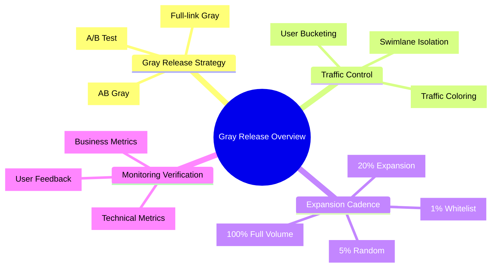
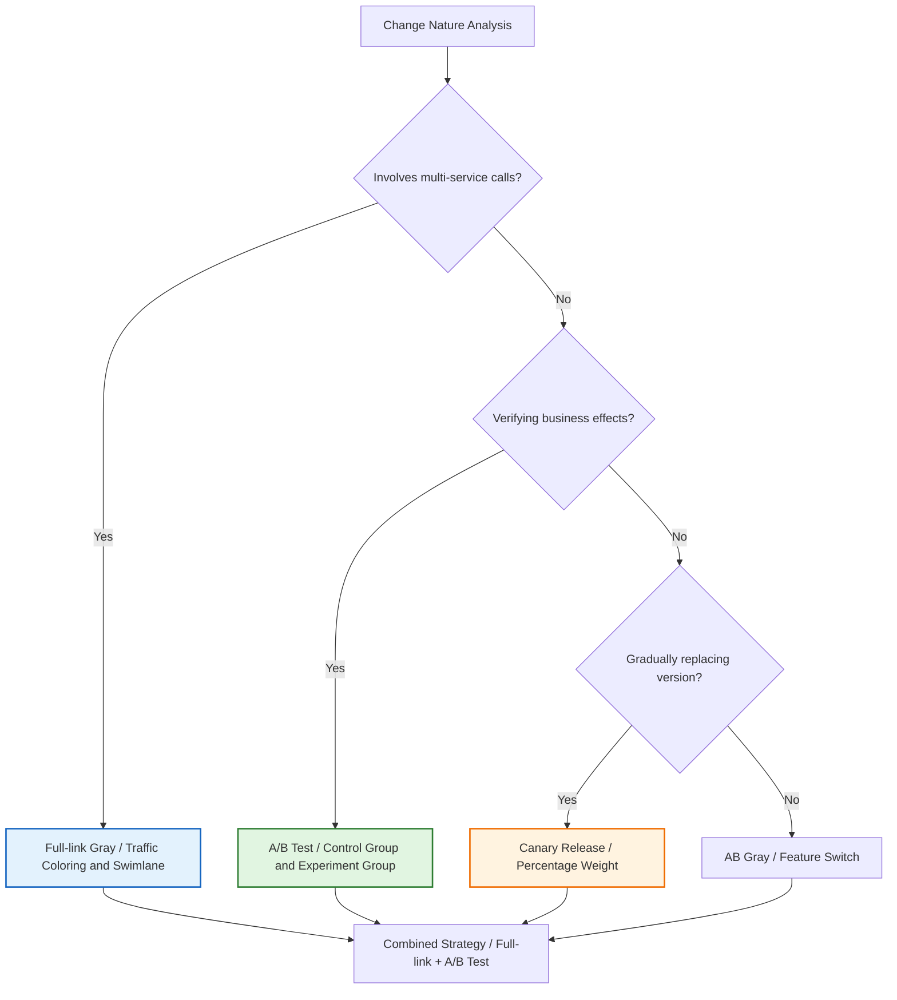
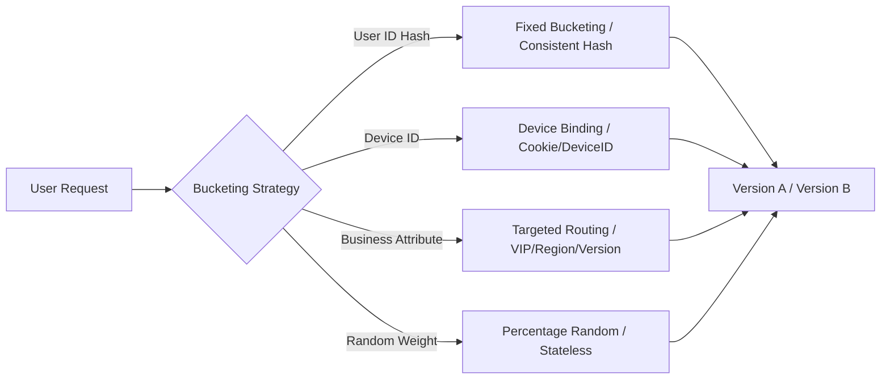
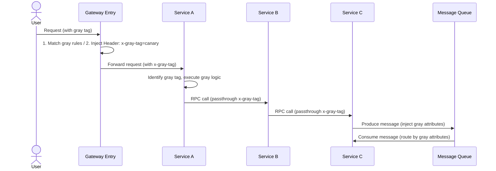
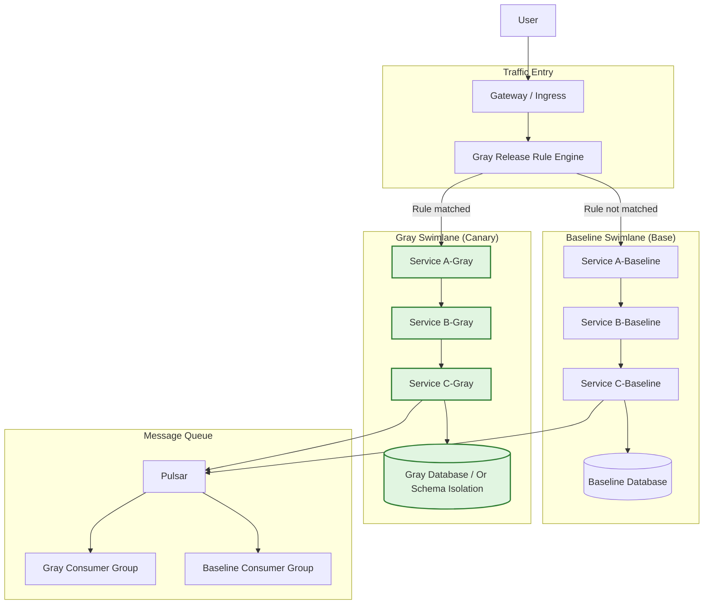
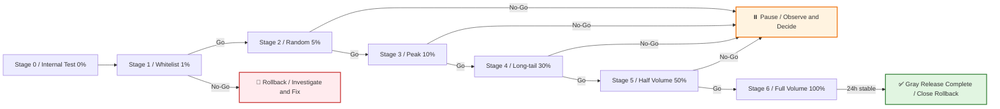
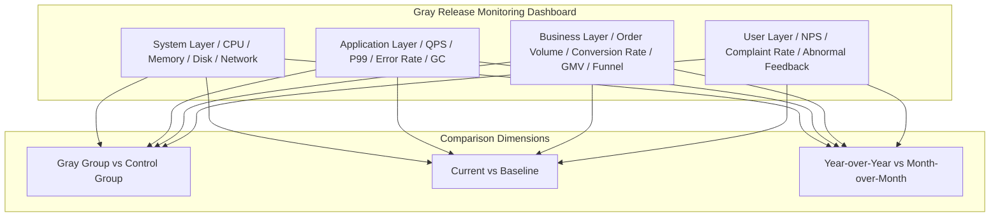
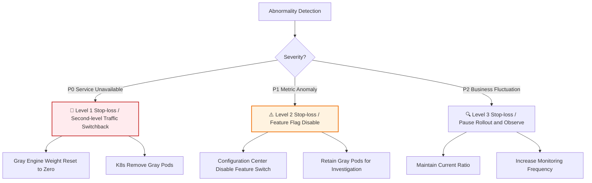
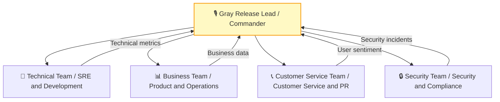

# [Product/System Name (English)] - Gray Release Plan Document

> **Document Status:** 🟡 Under Review / 🟢 Approved / 🔴 Cancelled
>
> **Confidentiality Level:** Confidential / Internal Public / Public
>
> **Version:** v0.3.2
>
> **Date:** YYYY-MM-DD
>
> **Author:** [Name] (Gray Release Lead)
>
> **Reviewer:** [Name/Role]
>
> **Audience:** [Role List]
>
> **Gray Release Number:** GRAY-2026-XXX
>
> **Related Release Plan:** [Release Plan Number]
>
> **Related Change Request:** [CR Number]
>
> **Technical Lead:** [Name]
>
> **Product Lead:** [Name]

---

## 0. Document Guide

### 0.1 Document Purpose and Scope

[Explain the purpose, applicable scenarios, and non-applicable scenarios of this document]

### 0.2 Related Documents

| Document Type | Filename | Related Sections |
| -------- | ------------------- | ---------- |
| [Type] | [Filename] [Line Range] | [Section Description] |

> **Reference Format Note**: Related documents use the `filename line range` format (e.g., `【Template】Technical Requirements Document(TRD).md 3-17`). Line numbers may change as documents are updated; please refer to actual content.

### 0.3 Change Log

| Version | Date | Reviser | Change Content | Reviewer |
| :--- | :--- | :--- | :--- | :--- |
| v0.1 | YYYY-MM-DD | [Name] | Initial draft | |
| v0.2 | YYYY-MM-DD | [Name] | Added full-link swimlane design | |
| v0.3 | YYYY-MM-DD | [Name] | Review passed | [Gray Release Lead] |
| v0.3.1 | 2026-06-09 | Xie Dong | Fixed Gantt chart to table for Feishu rendering compatibility | — |
| v0.3.2 | 2026-06-20 | Xie Dong | Message middleware example Kafka/RocketMQ→Pulsar (unified event bus specification) | — |

---

## 1. Executive Summary

> **Decision Layer 30-second guide:** What's being released in this gray release, to whom, how to release, how to stop if something goes wrong.

| Element | Content |
| :--- | :--- |
| **Gray Release Objective** | [One sentence, e.g., Verify new payment routing stability and conversion rate under real traffic] |
| **Gray Release Type** | [AB Gray / Full-link Gray / Canary / A/B Test / Sandbox Gray] |
| **Gray Release Scope** | [e.g., 1% random users + internal whitelist, covering transaction core link] |
| **Gray Release Cycle** | [e.g., 72h, divided into 5 Stages with gradual expansion] |
| **Core Risk** | [e.g., Payment success rate fluctuation, inventory deduction inconsistency] |
| **Stop-loss Method** | [e.g., Second-level traffic switchback, Feature Flag disable, Database rollback] |



---

## 2. Gray Release Strategy Selection

> Select the most suitable gray release mode based on the nature of changes. Different modes can be used in combination.

### 2.1 Gray Release Mode Comparison

| Mode | Applicable Scenario | Traffic Control Granularity | Code Invasiveness | Infrastructure Dependency | Rollback Speed |
| :--- | :--- | :--- | :---: | :--- | :---: |
| **AB Gray** | Feature switch control, traffic splitting by user/parameter | User ID, Header, Cookie | Medium | Configuration center | Second-level |
| **Full-link Gray** | Microservice architecture, need to ensure request link upstream/downstream consistency | Traffic coloring + Swimlane isolation | Low (Agent) | Service mesh/Registry | Second-level |
| **Canary Release** | New version gradual replacement, observe system metrics | Percentage weight | Low | Load balancer/Gateway | Minute-level |
| **A/B Test** | Verify business effects (conversion rate, retention, etc.) | Random bucketing + Control group | Low | Experiment platform | Hour-level |
| **Sandbox Gray** | High-risk changes, completely isolated verification | Independent environment, manual traffic routing | None | Independent sandbox environment | Minute-level |

### 2.2 This Gray Release Mode Decision



**This Release Adopted:** [e.g., Full-link Gray + A/B Test combined mode]

---

## 3. Traffic Bucketing and Routing Strategy

### 3.1 User Bucketing Algorithm

> Ensure same user always enters same version, avoiding experience jumps.



**Bucketing Code Example (Pseudocode):**

```python
import hashlib

def assign_bucket(user_id: str, experiment_name: str = "gray_2026") -> str:
    """Assign experiment group based on user ID hash, ensuring same user always enters same group"""
    key = f"{user_id}_{experiment_name}"
    hash_val = int(hashlib.md5(key.encode()).hexdigest(), 16)
    bucket = hash_val % 100

    if bucket < 45:
        return "control"      # Control group: 45%, existing version
    elif bucket < 90:
        return "treatment"    # Experiment group: 45%, new version
    else:
        return "holdout"      # Holdout group: 10%, long-term monitoring

# During gray release expansion, gradually increase treatment group from 0% to 45%
```

### 3.2 Multi-dimensional Routing Rules

| Dimension | Rule Example | Applicable Scenario |
| :--- | :--- | :--- |
| **User Attribute** | `user_id in [10086, 10010]` | Whitelist verification |
| **Device Type** | `User-Agent contains "Android"` | Client differentiation |
| **Region** | `region = "East China"` | Regional gradual rollout |
| **Version Number** | `app_version >= "5.3.0"` | Client compatibility |
| **Random Ratio** | `random() < 0.05` | Indiscriminate expansion |
| **Business Tag** | `merchant_level = "KA"` | Merchant tiering |

### 3.3 Traffic Coloring and Passthrough

> Core of full-link gray: Tag requests at the entry gateway, tags pass through the entire call chain.



**Coloring Header Specification:**

| Header Key | Example Value | Description |
| :--- | :--- | :--- |
| `x-gray-tag` | `canary` / `base` | Gray identifier |
| `x-gray-bucket` | `treatment` / `control` | Experiment bucket |
| `x-request-id` | `uuid` | Link tracing |
| `x-gray-version` | `v2.1.0` | Version identifier |

---

## 4. Full-link Swimlane Design

> Swimlane is a logically isolated environment, gray traffic closed-loops within the swimlane, not polluting the baseline environment.

### 4.1 Swimlane Architecture Diagram

> **Reference Note**: System's overall deployment architecture, multi-active/disaster recovery strategy, infrastructure details please refer to **【Template】Architecture Design Document(ADD).md §5. Deployment Architecture**. This document only describes gray release related swimlane isolation design.

**Gray Release Swimlane Architecture Summary:**



> **Complete Architecture**: System deployment topology, multi-availability zone deployment, disaster recovery strategy details please refer to **【Template】Architecture Design Document(ADD).md §5.1-5.2**.

### 4.2 Swimlane Fallback Strategy

> When gray swimlane downstream service is missing, automatically degrade to baseline, avoiding traffic interruption.

| Scenario | Fallback Behavior | Configuration |
| :--- | :--- | :--- |
| Gray service C not deployed | Gray traffic → Baseline service C | `fallback_to_base: true` |
| Baseline service B down | Baseline traffic → Gray service B (if compatible) | `fallback_to_canary: false` |
| No gray consumer group for messages | Gray messages → Baseline consumer group (must be idempotent) | `mq_fallback: base_group` |

---

## 5. Rollout Schedule Design

> Rollout must pass through "self-testing" and "online peak period" verification, cadence cannot skip stages.

### 5.1 Standard Rollout Cadence

> **Note**: Gantt chart is not compatible with Feishu, converted to table description.

| Phase | Task | Start Time | End Time | Duration | Status |
| :--- | :--- | :--- | :--- | :--- | :--- |
| Warm-up | Whitelist verification | 2026-05-25 02:00 | 2026-05-25 04:00 | 2h | — |
| Small Traffic | 1% random rollout | 2026-05-25 04:00 | 2026-05-25 10:00 | 6h | — |
| Small Traffic | 5% random rollout | 2026-05-25 10:00 | 2026-05-25 18:00 | 8h | — |
| Medium Traffic | 10% rollout | 2026-05-25 18:00 | 2026-05-26 06:00 | 12h | — |
| Medium Traffic | 30% rollout | 2026-05-26 06:00 | 2026-05-27 00:00 | 18h | — |
| Full Volume | 50% rollout | 2026-05-27 00:00 | 2026-05-27 12:00 | 12h | — |
| Full Volume | 100% full volume | 2026-05-27 12:00 | 2026-05-28 00:00 | 12h | — |
| Observation | 24h stable observation | 2026-05-28 00:00 | 2026-05-29 00:00 | 24h | — |

### 5.2 Stage Definitions and Go/No-Go Criteria

| Stage | Traffic Ratio | User Scope | Observation Duration | Core Verification Metrics | Go Criteria | No-Go Handling |
| :--- | :---: | :--- | :---: | :--- | :--- | :--- |
| **S0** | 0% | Internal test environment | — | Feature completeness | Test cases 100% pass | Fix and re-test |
| **S1** | 1% | Whitelist (internal employees + seed customers) | 2h | Error rate, P99, core API success rate | P0=0, error rate<<0.1% | Immediate rollback, investigate |
| **S2** | 5% | Random users, Cookie Sticky | 4h | + Business funnel conversion rate | Conversion fluctuation<<5% | Pause rollout, observe |
| **S3** | 10% | Random users, covering peak period | 8h | + Order volume, GMV, ARPU | Business metrics normal | Pause rollout, observe |
| **S4** | 30% | Expanded coverage, long-tail scenarios | 12h | + Customer service complaints, NPS | Complaint volume<<baseline | Pause rollout, observe |
| **S5** | 50% | Half volume, full scenario coverage | 12h | + Financial reconciliation consistency | Reconciliation difference=0 | Pause rollout, observe |
| **S6** | 100% | Full volume, retain rollback capability | 24h | Full volume metrics monitoring | No P0 in 24h | Close rollback window |



---

## 6. Monitoring and Validation System

### 6.1 Four-layer Monitoring Dashboard



### 6.2 Core Monitoring Metrics

| Layer | Metric | Baseline | Alert Threshold | Circuit Breaker Threshold | Collection Frequency |
| :--- | :--- | :--- | :--- | :--- | :---: |
| **System** | CPU Usage | 45% | > 70% | > 85% | 1min |
| **System** | Memory Usage | 60% | > 80% | > 90% | 1min |
| **Application** | QPS | 5000 | Fluctuation > ±20% | — | 1min |
| **Application** | P99 Latency | 120ms | > 200ms | > 500ms | 1min |
| **Application** | Error Rate | 0.05% | > 0.5% | > 1% | 1min |
| **Business** | Order Creation Success Rate | 99.9% | < 99.5% | < 99% | 5min |
| **Business** | Payment Success Rate | 99.5% | < 99% | < 98% | 5min |
| **Business** | Core Funnel Conversion Rate | 12% | Drop > 10% | Drop > 20% | 15min |
| **User** | Customer Service Complaint Volume | 5/hour | > 20/hour | > 50/hour | Real-time |

### 6.3 A/B Test Experiment Metrics (if applicable)

| Metric Type | Metric Name | Definition | Target |
| :--- | :--- | :--- | :--- |
| **Core Metric** | Conversion Rate | Order UV / Visit UV | Increase ≥ 2% |
| **Guardrail Metric** | Refund Rate | Refund orders / Total orders | Increase << 1pp |
| **Auxiliary Metric** | ARPU | Total GMV / Order UV | Increase ≥ 5% |
| **Auxiliary Metric** | Page Dwell Time | Average dwell time | Change << ±10% |

---

## 7. Rollback and Kill Switch Mechanism

### 7.1 Multi-level Stop-loss Strategy



### 7.2 Rollback Trigger Conditions

| Trigger Source | Condition | Response Time | Decision Method |
| :--- | :--- | :---: | :--- |
| **Auto Circuit Breaker** | Error rate > 1% sustained 2min / P99 > 500ms sustained 3min | < 1min | System auto |
| **Monitoring Alert** | P0 level alert | < 3min | OnCall decision |
| **Business Feedback** | Conversion drop > 20% / Complaint volume > 50/hour | < 5min | Product + Technical joint |
| **Security Incident** | Data leak / Unauthorized access / Fund risk | < 1min | Immediate execution |

### 7.3 Feature Flag Emergency Disable

```python
# Feature switch pseudocode
def is_feature_enabled(feature_key: str, user: User) -> bool:
    flag = flag_service.get(feature_key)  # Real-time from configuration center

    if not flag.enabled:
        return False  # Global disable

    if flag.emergency_off:
        return False  # Emergency disable (second-level effective)

    if user.id in flag.gray_list:
        return True  # Whitelist

    bucket = hash(f"{user.id}_{feature_key}") % 100
    return bucket < flag.gray_percentage  # Allow by ratio
```

---

## 8. Gray Release Environment Management

### 8.1 Swimlane Environment Configuration

| Environment | Purpose | Relationship with Production | Data Strategy |
| :--- | :--- | :--- | :--- |
| **Baseline Swimlane** | Stable production environment | Handles 100% traffic (reduced during gray) | Production real data |
| **Gray Swimlane** | New version verification | Isolated operation, only gray traffic enters | Production real data (Schema compatible) |
| **Sandbox Environment** | Pre-production verification | Completely isolated, manual traffic routing | Desensitized test data |

### 8.2 Database Gray Release Strategy

| Strategy | Applicable Scenario | Implementation Method | Rollback Difficulty |
| :--- | :--- | :--- | :---: |
| **Schema Compatible** | Add field (nullable) | Baseline/Gray share same database | 🟢 Low |
| **Shadow Table** | Core table structure change | Gray reads/writes shadow table, dual-write sync | 🟡 Medium |
| **Database Isolation** | Large-scale refactoring | Gray independent database, merge later | 🔴 High |

---

## 9. Communication and OnCall Mechanism

### 9.1 Gray Release Communication Architecture



### 9.2 On-duty Arrangement

| Role | Name | Responsibilities | Contact | Standby Period |
| :--- | :--- | :--- | :--- | :--- |
| **Gray Release Lead** | [Name] | Commander, rollout/rollback decision | Mobile/DingTalk | Full duration |
| **Technical Lead** | [Name] | Technical problem investigation | Mobile/DingTalk | Full duration |
| **SRE Operations** | [Name] | Traffic control, monitoring, scaling | Mobile/DingTalk | Full duration |
| **Product Lead** | [Name] | Business metrics monitoring, user feedback | Mobile/DingTalk | S1-S6 |
| **Customer Service Lead** | [Name] | Sentiment monitoring, user appeasement | Mobile/DingTalk | S2-S6 |

---

## 10. Gray Release Review Template

| Item | Content |
| :--- | :--- |
| **Gray Release Result** | ✅ Successful full volume / ❌ Rollback / ⚠️ Launched with issues |
| **Actual Cycle** | Planned 72h, actual [X]h |
| **Stage Duration** | S1: [X]h, S2: [X]h, S3: [X]h... |
| **Abnormal Events** | [Describe problem, root cause, handling] |
| **Metrics Comparison** | Gray group vs control group core metrics difference |
| **Decision Review** | Was rollout cadence reasonable? Was rollback timely? |
| **Improvement Items** | [At least 3 Actions] |

---

## 11. Appendix

### 11.1 Glossary

| Term | Definition |
| :--- | :--- |
| **AB Gray** | Traffic splitting new/old versions by user dimension through feature switches |
| **Full-link Gray** | Traffic coloring then passthrough the entire microservice call chain |
| **Swimlane** | Logically isolated gray release environment, traffic closed-loops within swimlane |
| **Traffic Coloring** | Tagging at request entry, marking the request as gray traffic |
| **Sticky Session** | Same user always routes to same version across multiple requests |
| **Feature Flag** | Feature switch, supports runtime dynamic enable/disable |
| **Holdout** | Holdout group, doesn't participate in experiment, used for long-term trend comparison |

### 11.2 Related Documents

| Document | Number | Link |
| :--- | :--- | :--- |
| Release Plan | RP-2026-XXX | [Link] |
| Architecture Design | ADD-2026-XXX | [Link] |
| Monitoring Dashboard | DASH-2026-XXX | [Link] |
| Emergency Plan | EMG-2026-XXX | [Link] |

## 12. Gray Release Review Sign-off

| Role | Name | Signature | Date | Comments |
| :--- | :--- | :---: | :---: | :--- |
| **Gray Release Lead** | | | | [Approve/Reject] |
| **Technical Lead** | | | | [Technical solution confirmed] |
| **SRE Lead** | | | | [Traffic/Monitoring solution confirmed] |
| **Product Lead** | | | | [Business impact confirmed] |
| **Security Lead** | | | | [Security compliance confirmed] |