# [Product/System Name (English)] - Product Requirements Document (PRD)

> **Document Status:** 🟡 Under Review / 🟢 Approved / 🔴 Rejected
>
> **Confidentiality Level:** Confidential / Internal Public / Public
>
> **Version:** v0.5
>
> **Date:** YYYY-MM-DD
>
> **Author:** [Name/Role]
>
> **Reviewer:** [Name/Role]
>
> **Audience:** [Role List]

---

## 0. Document Guide

### 0.1 Document Purpose and Scope

[Explain the purpose, applicable scenarios, and non-applicable scenarios of this document]

### 0.2 Related Documents

| Document Type | Filename | Related Sections |
|---------|--------|---------|
| [Type] | [Filename] [Line Range] | [Section Description] |

> **Reference Format Note**: Related documents use the `filename line range` format (e.g., `【Template】Technical Requirements Document(TRD).md 3-17`). Line numbers may change as documents are updated; please refer to actual content.

### 0.3 Change Log

| Version | Date | Reviser | Change Content | Reviewer |
| :--- | :--- | :--- | :--- | :--- |
| v0.1 | YYYY-MM-DD | Zhang San | Initial draft: Completed background research and core process definition | Li Si |
| v0.2 | YYYY-MM-DD | Zhang San | Added exception flows and event tracking plan | Li Si |
| v0.3 | YYYY-MM-DD | Zhang San | Review passed, entering development phase | Wang Wu |
| v0.4 | YYYY-MM-DD | Zhang San | Added sharing feature (requirement change #REQ-2024-008) | Wang Wu |
| v0.5 | 2026-06-09 | Xie Dong | Fixed Gantt chart to table format for Feishu compatibility | — |

---

## 1. Document Overview

### 1.1 Background
> **Alibaba Practice:** Must answer "why build this", including market opportunity, data support, strategic alignment.

**One-sentence description:** `[Describe in no more than 30 characters what problem this requirement solves]`

**Background details:**
- **Market/Business background:** `[Describe current business pain points or market opportunities]`
- **Data support:** `[Cite relevant data, such as X% decrease in conversion rate, Y user feedback items, etc.]`
- **Strategic alignment:** `[Align with OKR or annual strategy, such as "Support Q3 GMV growth target"]`

### 1.2 Objectives
> **Tencent Practice:** Objectives must be measurable (SMART principle), distinguishing business goals from user experience goals.

| Objective Type | Objective Description | Measurement Metric | Target Value | Priority |
|:---|:---|:---|:---:|:---:|
| Business Goal | Increase paid conversion rate | Paid conversion rate | +15% | P0 |
| User Goal | Reduce operation threshold | Task completion time | -30% | P0 |
| Efficiency Goal | Reduce customer service inquiries | Related ticket volume | -20% | P1 |

## 2. Product Definition

### 2.1 Product Summary

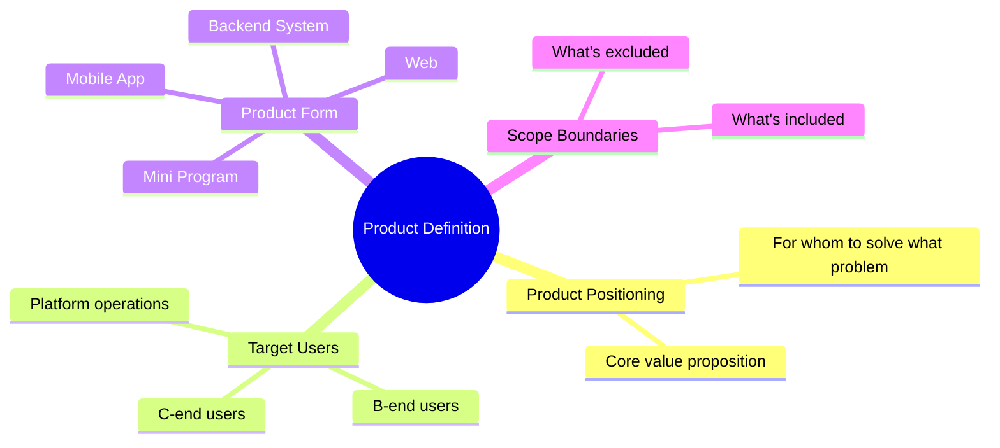

**Product Positioning:** `[One-sentence positioning: XX is a XX tool/platform for XX users, solving XX problem through XX method, achieving XX value]`

**Current iteration scope:**
- ✅ **Included (In Scope):** `[List feature modules that must be implemented in this iteration]`
- ❌ **Excluded (Out of Scope):** `[Explicitly exclude features to prevent scope creep]`
- ⏳ **Future Versions:** `[Planned but not implemented features]`

### 2.2 User Personas

> **Tencent Practice:** Must concretize users, avoid generic "users".

**Core Users:**
- **User Name:** `[e.g., New employee Xiao Ming]`
- **Age/Occupation:** `[25 years old/Internet operations]`
- **Core Need:** `[Quickly complete weekly reports, reduce repetitive work]`
- **Pain Point Scenario:** `[Spends 2 hours every Friday organizing data, prone to errors and inconsistent formatting]`
- **Technical Proficiency:** `[Medium, familiar with Office but doesn't understand SQL]`

### 2.3 User Journey Map

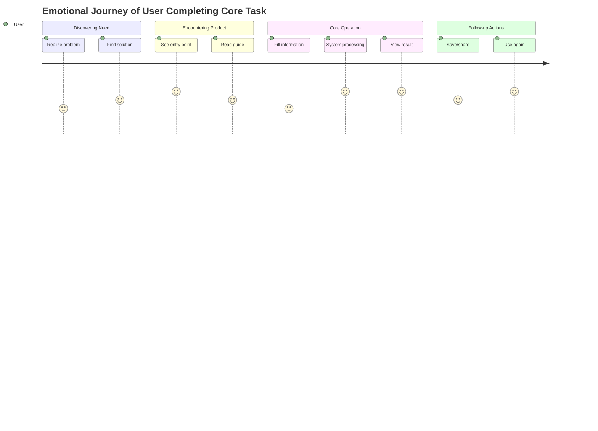

---

## 3. Requirement Landscape

### 3.1 Feature List
> **ByteDance Practice:** Use MoSCoW method to clarify priorities. Development resources always prioritize Must-have first.

| Module | Feature | Description | Priority | Owner | Dependencies | Status |
|:---|:---|:---|:---:|:---:|:---|:---:|
| User Module | Phone Number Login | Support phone number + verification code login | P0 | Backend A | SMS Service Provider | 🟡 |
| User Module | WeChat Authorization Login | Support WeChat one-click authorization | P1 | Backend A | WeChat Open Platform | ⚪ |
| Core Feature | Smart Recommendation | Personalized recommendation based on user behavior | P0 | Algorithm B | User Behavior Data | 🟡 |
| Core Feature | Batch Export | Support Excel/PDF batch export | P1 | Frontend C | Export Service | ⚪ |
| Value-added Feature | Data Dashboard | Visual data display | P2 | Frontend C | Chart Component Library | ⚪ |

**Priority Definition:**
- **P0 (Must-have):** Blocking requirement - product cannot be released without it
- **P1 (Should-have):** Important but non-blocking, can be degraded or implemented in phases
- **P2 (Could-have):** Nice-to-have, implement when resources are available
- **P3 (Won't-have):** Explicitly not implementing this time, document to prevent misunderstanding

### 3.2 Product Architecture

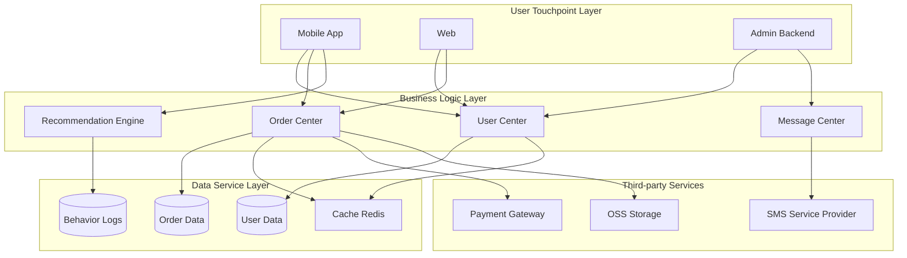

---

## 4. Functional Requirements
> **Core Section:** This is the most important part of the PRD. Must achieve "developers can develop without looking at prototypes, testers can write test cases without looking at interactions".

---

### 4.1 Feature Module One: [Module Name, e.g., "User Login Module"]

#### 4.1.1 Feature Definition

| Attribute | Description |
|:---|:---|
| **Feature Name** | `[Feature Name]` |
| **Feature ID** | `[Unique identifier, e.g., FUNC-001]` |
| **Module** | `[Module Name]` |
| **Priority** | `P0/P1/P2` |
| **Requirement Source** | `[User feedback/Data insights/Business side/Competitive analysis]` |
| **Related Requirements** | `[Related feature IDs]` |

**Feature Description:** `[Describe in 2-3 sentences what this feature does and what problem it solves]`

#### 4.1.2 Business Flow

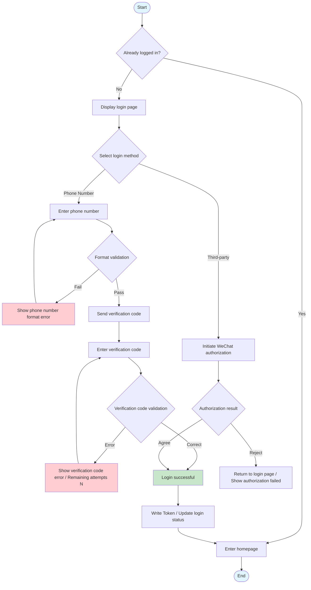

#### 4.1.3 Page Flow

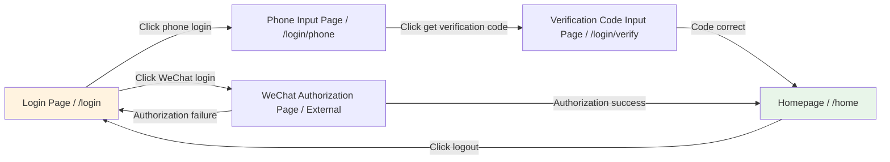

#### 4.1.4 Input & Output Definition

> **Alibaba/ByteDance Practice:** Every feature must clearly define IO, which is the foundation for frontend-backend coordination.

**Interface/Interaction Input:**

| Input Item | Type | Required | Source | Validation Rule | Example Value |
|:---|:---:|:---:|:---|:---|:---|
| phone | string | Yes | User input | Mainland China phone regex: `^1[3-9]\d{9}$` | 13800138000 |
| verifyCode | string | Yes | User input | 4-6 digit pure numbers | 123456 |
| source | string | No | System carried | Enum: app/web/mp | app |

**Interface/Interaction Output:**

| Output Item | Type | Description | Example Value |
|:---|:---:|:---|:---|
| accessToken | string | JWT access token, valid for 2 hours | eyJhbGciOiJIUzI1NiIs... |
| refreshToken | string | Refresh token, valid for 7 days | eyJhbGciOiJIUzI1NiIs... |
| userId | string | User unique identifier | U202405250001 |
| expireAt | number | Token expiration timestamp (milliseconds) | 1716633600000 |

#### 4.1.5 Business Rules

> **Rule ID Format:** `BR-[Module]-[Sequence Number]`

| Rule ID | Rule Description | Trigger Condition | Execution Action | Priority |
|:---|:---|:---|:---|:---:|
| BR-LOGIN-001 | Verification code send frequency limit | Same phone number repeated request within 60 seconds | Reject request, return "Please retry after 60 seconds" | P0 |
| BR-LOGIN-002 | Verification code error lockout | Same phone number 5 consecutive errors | Lock for 2 hours, require manual unlock or contact customer service | P0 |
| BR-LOGIN-003 | Token refresh mechanism | accessToken expired and refreshToken valid | Automatically refresh accessToken, silent renewal | P0 |
| BR-LOGIN-004 | Multi-device login limit | Same account logged in on Device B while Device A is online | Device A receives offline notification, keep last 3 devices | P1 |

#### 4.1.6 State Machine

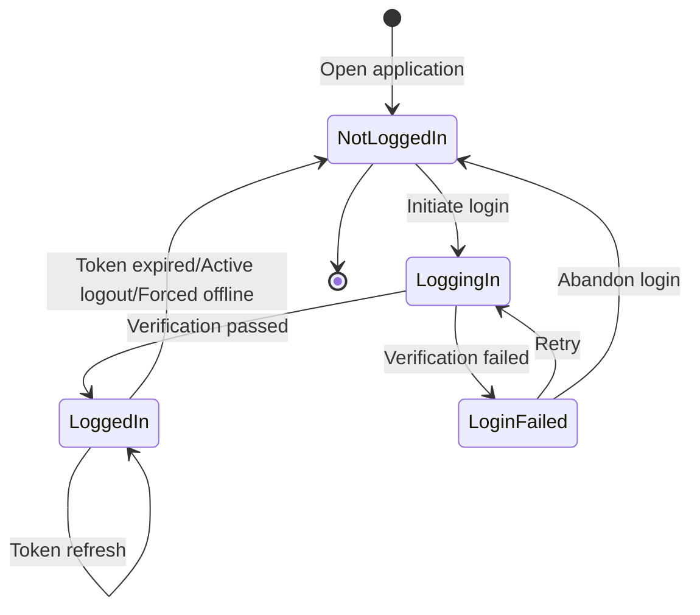

#### 4.1.7 Exception Handling

> **Big Company Iron Rule:** Exception flows must be covered, cannot only write Happy Path.

| Exception Scenario | Exception Type | Frontend Behavior | Backend Handling | Compensation Mechanism |
|:---|:---|:---|:---|:---|
| Network interruption | Network error | Display network error page, provide "Retry" button | Request timeout, log record | Auto-retry 3 times, still fails then prompt user |
| Verification code service failure | Dependency failure | Show "Service busy, please try again later" | Circuit breaker degradation, switch to backup channel | Trigger alert, auto-recover within 1 minute |
| Phone number already registered | Business exception | Show "This phone number already exists, login directly?" | Return specific error code: PHONE_EXISTS | Provide one-click jump to login entry |
| High-frequency requests | Rate limit exception | Button disabled + countdown | Rate limit interception, return 429 | Frontend debounce + backend token bucket |

#### 4.1.8 Sequence Diagram

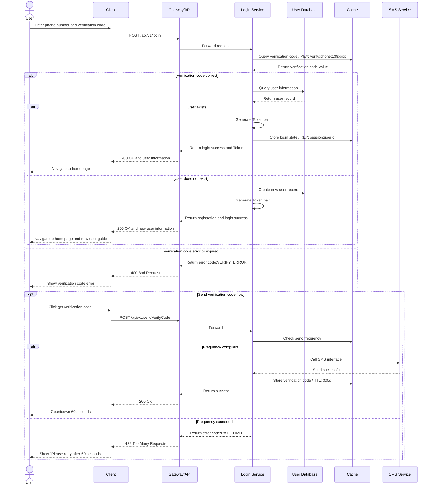

#### 4.1.9 Acceptance Criteria

> **Best Practice:** Acceptance criteria must be testable and verifiable, using Given-When-Then format.

| AC ID | Acceptance Criteria (Given-When-Then) | Test Method | Pass Criteria |
|:---|:---|:---|:---:|
| AC-001 | **Given** User is not logged in **When** Opens application **Then** Displays login page, phone number input box auto-focuses | Manual testing | 100% pass |
| AC-002 | **Given** User enters correct phone number **When** Clicks get verification code **Then** Button disabled for 60 seconds, user receives 6-digit verification code | Manual + Automated | 100% pass |
| AC-003 | **Given** User enters wrong verification code 5 consecutive times **When** Submits 5th attempt **Then** Shows account locked for 2 hours, records security log | Automated testing | 100% pass |
| AC-004 | **Given** User is logged in with valid Token **When** Accesses authenticated interface **Then** Returns data normally, no need to re-login | Automated testing | 100% pass |
| AC-005 | **Given** User's Token expired but refreshToken valid **When** Initiates request **Then** Server silently refreshes Token, client unaware | Automated testing | 100% pass |

---

### 4.2 Feature Module Two: [Module Name, e.g., "Order Payment Module"]

#### 4.2.1 Feature Definition

#### 4.2.2 Business Flow

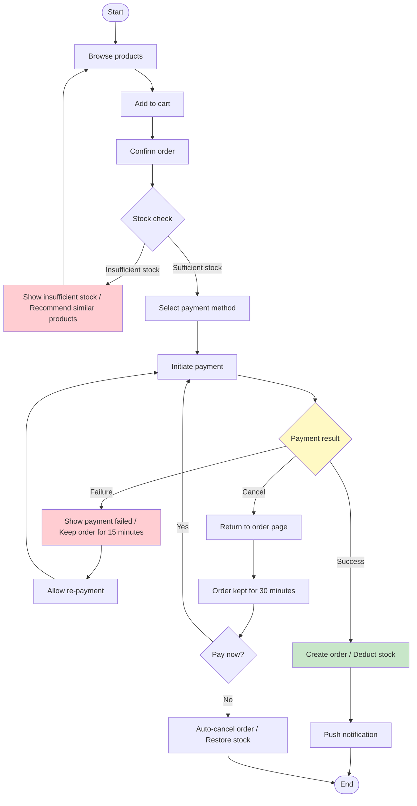

#### 4.2.3 Input & Output Definition

**Payment Interface Input:**

| Input Item | Type | Required | Validation Rule | Description |
|:---|:---:|:---:|:---|:---|
| orderId | string | Yes | Format: ORD+YYYYMMDD+6-digit serial | Order unique identifier |
| payChannel | enum | Yes | Enum: WECHAT/ALIPAY/UNION | Payment channel |
| amount | decimal | Yes | >0, precise to cent | Payment amount (Yuan) |
| currency | string | No | Default CNY | Currency |

**Payment Interface Output:**

| Output Item | Type | Description |
|:---|:---:|:---|
| payOrderId | string | Payment platform transaction number |
| payUrl | string | Redirect to payment page URL (H5) |
| prepayId | string | WeChat prepay ID (Mini Program/App) |
| expireTime | number | Payment timeout timestamp |

#### 4.2.4 State Machine

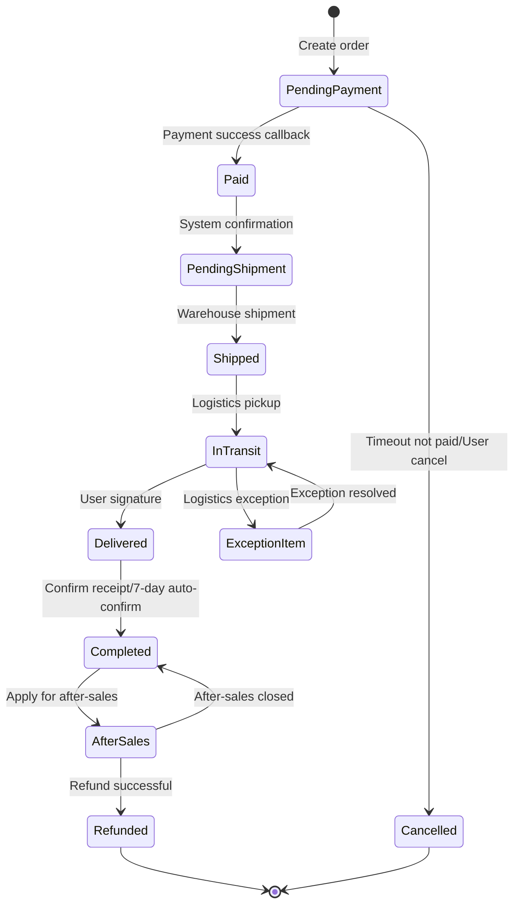

#### 4.2.5 Exception Handling

| Exception Scenario | Frontend Behavior | Backend Handling | Data Consistency Guarantee |
|:---|:---|:---|:---|
| Payment callback delay | Show "Payment processing", polling query | Async message queue processing, max retry 5 times | Idempotency check, prevent duplicate charges |
| Duplicate payment | Intercept second payment request | Refund to original path, record exception transaction | Unique index + state machine check |
| Stock overselling | Real-time check at order placement | Optimistic lock/Distributed lock deduction | Stock rollback mechanism |

---

## 5. Non-Functional Requirements

### 5.1 Performance Requirements

| Metric | Target | Test Scenario | Priority |
|:---|:---:|:---|:---:|
| Page first screen load | ≤ 1.5s | 4G network, cold start | P0 |
| API response time (P99) | ≤ 500ms | Daily peak concurrency | P0 |
| Concurrent users | ≥ 10,000 QPS | Promotion scenario | P0 |
| Database query | ≤ 100ms | Single table with millions of rows | P1 |

### 5.2 Security Requirements

| Requirement | Specific Requirement | Implementation Method |
|:---|:---|:---|
| Data transmission encryption | Full site HTTPS, TLS 1.3 | Gateway layer unified configuration |
| Sensitive data masking | Phone number, ID number display masking | Frontend display layer + backend return masking |
| Anti-replay attack | Request timestamp + random number signature | Middleware validation |
| SQL injection protection | Zero SQL injection vulnerabilities | Parameterized queries + ORM |
| XSS protection | Zero stored XSS vulnerabilities | Input filtering + Output encoding + CSP policy |

### 5.3 Availability Requirements

| Requirement | Target | Description |
|:---|:---:|:---|
| System availability | 99.95% | Annual downtime < 4.38 hours |
| Fault recovery time (RTO) | ≤ 30 minutes | Core link failure |
| Data recovery point (RPO) | ≤ 5 minutes | Data loss window |
| Degradation strategy | Core functions available | Non-core functions can be degraded and closed |

### 5.4 Compatibility Requirements

| Platform | Support Range | Priority |
|:---|:---|:---:|
| iOS | iOS 14+ | P0 |
| Android | Android 8.0+ | P0 |
| Web | Chrome 90+, Safari 14+, Edge 90+ | P0 |
| Mini Program | WeChat 8.0+, Alipay 10.2+ | P1 |

---

## 6. Data Tracking Plan

> **ByteDance/Alibaba Practice:** Event tracking is not optional, it's part of the feature. Must be clearly defined in PRD, otherwise development won't reserve tracking positions.

### 6.1 Tracking Overview

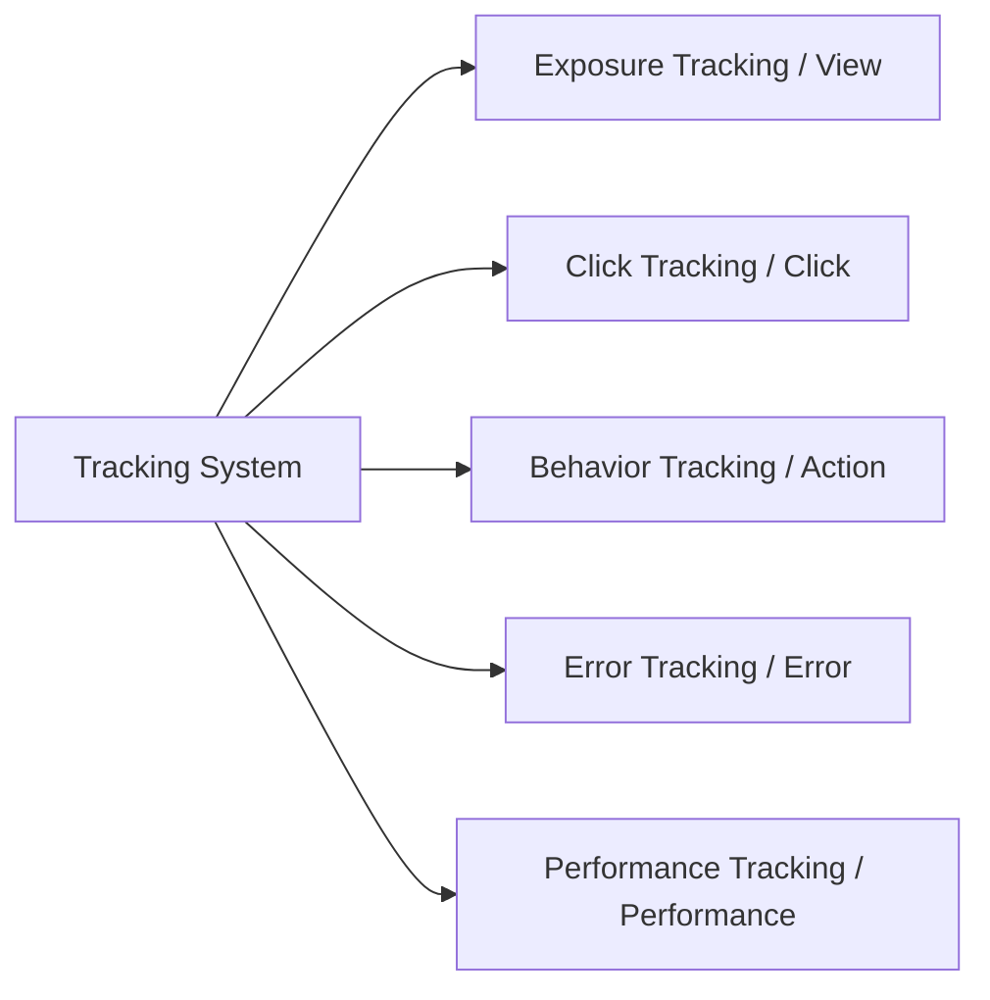

### 6.2 Tracking List

| Tracking ID | Tracking Name | Trigger Timing | Event Type | Key Attributes | Purpose |
|:---|:---|:---|:---:|:---|:---|
| TRACK-001 | Login page exposure | Enter login page | Exposure | page_source, entry_time | Funnel analysis entry traffic |
| TRACK-002 | Get verification code click | Click "Get verification code" button | Click | phone, result, error_code | Analyze conversion funnel |
| TRACK-003 | Login success | Login verification passed | Behavior | login_type, duration, is_new | Calculate login success rate |
| TRACK-004 | Login failed | Login verification failed | Behavior | login_type, fail_reason, fail_step | Locate churn causes |
| TRACK-005 | Payment initiated | Click confirm payment | Click | order_id, amount, pay_channel | Payment conversion analysis |
| TRACK-006 | Payment success | Receive payment success callback | Behavior | order_id, pay_time, pay_channel | GMV attribution |
| TRACK-007 | Payment failed | Payment failed or cancelled | Behavior | order_id, fail_reason, fail_step | Optimize payment experience |

### 6.3 Tracking Attribute Specification

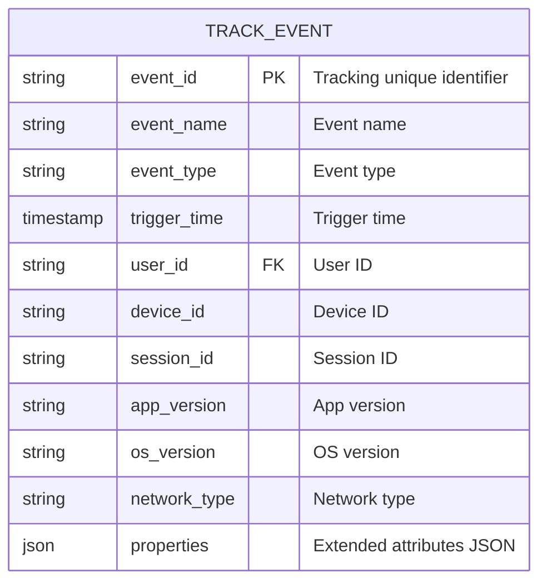

---

## 7. Release Plan

### 7.1 Milestones

> **Note**: Gantt chart is not compatible with Feishu, converted to table description.

| Phase | Task | Start Date | Duration | Status |
|:---|:---|:---|:---:|:---:|
| Requirement Phase | PRD writing and review | YYYY-MM-DD | 5d | ✅ done |
| Requirement Phase | Requirement review meeting | After PRD completion | 2d | ✅ done |
| Design Phase | Interaction design | After review completion | 5d | 🔵 active |
| Design Phase | Visual design | After interaction design | 5d | ⚪ |
| Development Phase | Backend API development | After visual design | 7d | ⚪ |
| Development Phase | Frontend page development | After visual design | 8d | ⚪ |
| Development Phase | Integration testing | After backend development | 3d | ⚪ |
| Testing Phase | Functional testing | After integration testing | 5d | ⚪ |
| Testing Phase | Regression testing | After functional testing | 2d | ⚪ |
| Release Phase | Canary release (5%) | After regression testing | 2d | ⚪ |
| Release Phase | Full release | After canary release | 1d | ⚪ |

### 7.2 Canary Release Strategy

| Phase | Release Time | User Scope | Observation Metrics | Rollback Condition |
|:---|:---:|:---|:---|:---|
| Internal testing | D-Day | Internal employees + core seed users (100 people) | Crash rate <<0.1%, core flow pass rate 100% | Blocking bug |
| Canary 1 | D+2 | 5% random users | Error rate <<0.5%, performance metrics meet standards | Error rate >1% or customer complaints surge |
| Canary 2 | D+5 | 30% random users | Conversion rate fluctuation <<±5%, retention stable | Core metrics drop >10% |
| Full release | D+7 | 100% users | Monitor dashboard normal | None |

### 7.3 Rollback Plan

| Trigger Condition | Rollback Action | Owner | Estimated Time | Impact Scope |
|:---|:---|:---|:---:|:---|
| Core link failure | Switch traffic to previous version | SRE | 5 minutes | All users |
| Data anomaly | Pause writing, switch to read-only mode | DBA | 10 minutes | New data writing |
| Critical security vulnerability | Emergency shutdown for fix | Security team | 30 minutes | All functions |

---

## 8. Risks & Dependencies

### 8.1 Risk Register

| Risk ID | Risk Description | Likelihood | Impact | Risk Level | Response Strategy | Owner |
|:---|:---|:---:|:---:|:---:|:---|:---:|
| R-001 | Third-party login API changes | Medium | High | 🔴 High | Connect documentation in advance, reserve 2-day buffer | Backend A |
| R-002 | Payment channel fee increase | Low | Medium | 🟡 Medium | Lock price with business in advance, backup channels | Business B |
| R-003 | Core developer changes | Low | High | 🟡 Medium | Code review system, documentation accumulation | Project Manager |
| R-004 | Promotion traffic exceeds expectations | Medium | High | 🔴 High | Load test to 2x expected traffic, elastic scaling | SRE |

### 8.2 External Dependencies

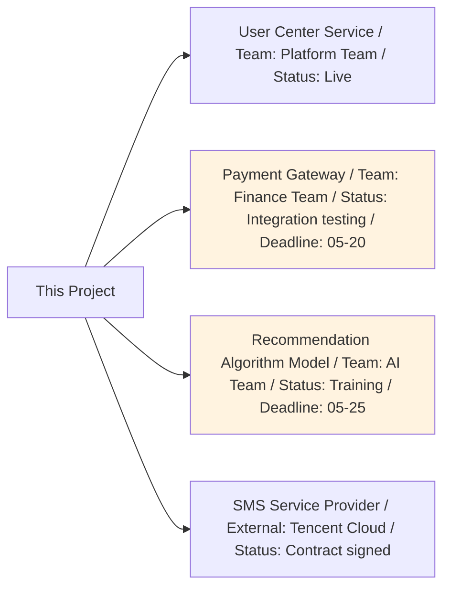

---

## 9. Appendix

### 9.1 Competitive Analysis Summary

| Competitor | Core Advantage | Reference Points | Differentiation Strategy |
|:---|:---|:---|:---|
| Competitor A | Login process extremely simple, completed in 1 step | Reduce user input steps | We add biometrics for more security |
| Competitor B | Social login accounts for 80% | Strengthen third-party login guidance | We keep phone number as fallback |

### 9.2 Reference Documents

- [Product prototype link (Figma/Axure)]
- [API documentation (Swagger/YApi)]
- [Design drafts (MasterGo/Figma)]
- [Data dashboard (Metabase/QuickBI)]
- [Technical specification document]

### 9.3 Requirement Review Record

| Review Date | Participants | Main Conclusions | Action Items |
|:---|:---|:---|:---|
| YYYY-MM-DD | PM, Development, Testing, Design | Approved, added 3 exception scenarios | Add network exception handling logic |

---

## PRD Writing Checklist (Self-check)

> **Big Company PM Essential:** Self-check item by item before submitting for review to ensure PRD quality.

- [ ] **Completeness:** Does it cover all feature modules? Are there any missing edge scenarios?
- [ ] **Executability:** Can developers develop directly without looking at prototypes? Can testers write test cases directly?
- [ ] **Consistency:** Are terms unified? Is the logic self-consistent?
- [ ] **Verifiability:** Does each feature have clear acceptance criteria? Are they quantifiable?
- [ ] **Exception Coverage:** Did you only write Happy Path? Are exception and degradation scenarios complete?
- [ ] **Clear Dependencies:** Are external dependencies clear? Are there response plans for risks?
- [ ] **Data Closed Loop:** Is event tracking complete? Can it support subsequent data analysis?
- [ ] **Version Control:** Is the change log updated? Are change contents marked?

---

**Document End**

> **Usage Suggestions:**
> 1. Save this template as the standard template for team Wiki
> 2. Each requirement must be trimmed based on this template, core sections (4-7) cannot be deleted
> 3. Complex features must include sequence diagrams and state machines, simple features can be simplified
> 4. Check against the checklist item by item during review to ensure delivery quality