# [Product/System Name (English Name)] - Product Requirements Document (PRD)

> **Document Status:** 🟡 In Review / 🟢 Approved / 🔴 Rejected
>
> **Confidentiality Level:** Confidential / Internal / Public
>
> **Version:** v0.5
>
> **Date:** YYYY-MM-DD
>
> **Author:** [Name/Role]
>
> **Reviewer:** [Name/Role]
>
> **Audience:** [Role List]

---

## 0. Document Guide

### 0.1 Document Purpose and Scope

[Describe the purpose of this document, applicable scenarios, and non-applicable scenarios]

### 0.2 Related Documents

| Document Type | Filename | Related Sections |
|---------|--------|---------|
| [Type] | [Filename] [Line Range] | [Section Description] |

> **Reference Format:** Related documents use the `Filename Line Range` format (e.g., `【模板】技术需求文档(TRD).md 3-17`). Line numbers may change as documents are updated; please refer to actual content.

### 0.3 Change Log

| Version | Date | Reviser | Changes | Reviewer |
| :--- | :--- | :--- | :--- | :--- |
| v0.1 | YYYY-MM-DD | Zhang San | Initial draft: completed background research and core flow definition | Li Si |
| v0.2 | YYYY-MM-DD | Zhang San | Added exception flows and tracking plan | Li Si |
| v0.3 | YYYY-MM-DD | Zhang San | Review approved, entered development phase | Wang Wu |
| v0.4 | YYYY-MM-DD | Zhang San | Added sharing feature (requirement change #REQ-2024-008) | Wang Wu |
| v0.5 | 2026-06-09 | Xie Dong | Converted gantt chart to table for Feishu compatibility | — |

---

## 1. Document Overview

### 1.1 Background
> **Alibaba Practice:** Must answer "why we are doing this," including market opportunity, data support, and strategic alignment.

**One-liner:** `[Describe in no more than 30 characters what problem this requirement solves]`

**Detailed Background:**
- **Market/Business Background:** `[Describe current business pain points or market opportunities]`
- **Data Support:** `[Cite relevant data, such as conversion rate dropped by X%, Y user feedback submissions, etc.]`
- **Strategic Alignment:** `[Align with OKR or annual strategy, e.g., "Support Q3 GMV growth target"]`

### 1.2 Objectives
> **Tencent Practice:** Objectives must be measurable (SMART principle), distinguishing business goals from user experience goals.

| Objective Type | Objective Description | Metric | Target Value | Priority |
|:---|:---|:---|:---:|:---:|
| Business Goal | Increase paid conversion rate | Paid Conversion Rate | +15% | P0 |
| User Goal | Lower operational barrier | Task Completion Duration | -30% | P0 |
| Efficiency Goal | Reduce customer service volume | Related Ticket Volume | -20% | P1 |

## 2. Product Definition

### 2.1 Product Summary

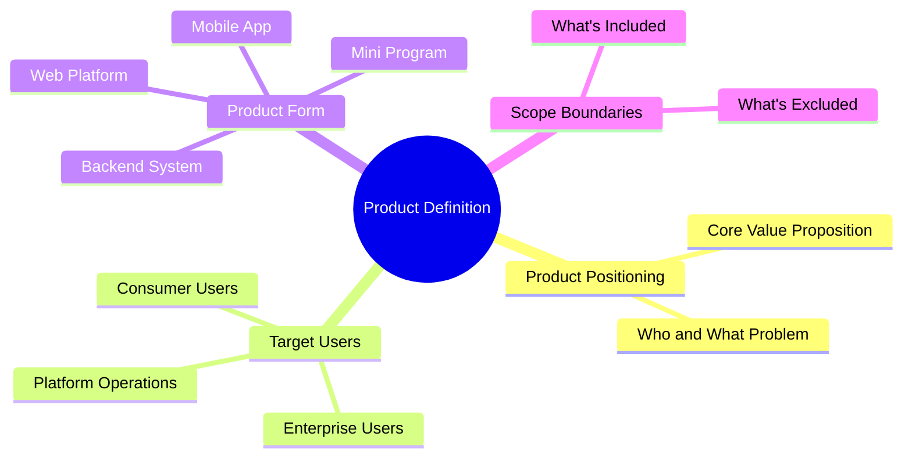

**Product Positioning:** `[One-liner: XX is a XX tool/platform for XX users, solving XX problem through XX method to achieve XX value]`

**Scope of This Iteration:**
- ✅ **In Scope:** `[List the feature modules that must be implemented this time]`
- ❌ **Out of Scope:** `[Clearly excluded features to prevent scope creep]`
- ⏳ **Future:** `[Planned but not implemented features]`

### 2.2 User Personas

> **Tencent Practice:** Must concretize users, avoid generic "user" references.

**Core User:**
- **User Name:** `[e.g., New employee Xiao Ming]`
- **Age/Occupation:** `[25/Internet Operations]`
- **Core Need:** `[Quickly complete weekly reports, reduce repetitive work]`
- **Pain Point Scenario:** `[Spends 2 hours every Friday organizing data, prone to errors and inconsistent formatting]`
- **Technical Proficiency:** `[Medium, familiar with Office but not SQL]`

### 2.3 User Journey Map

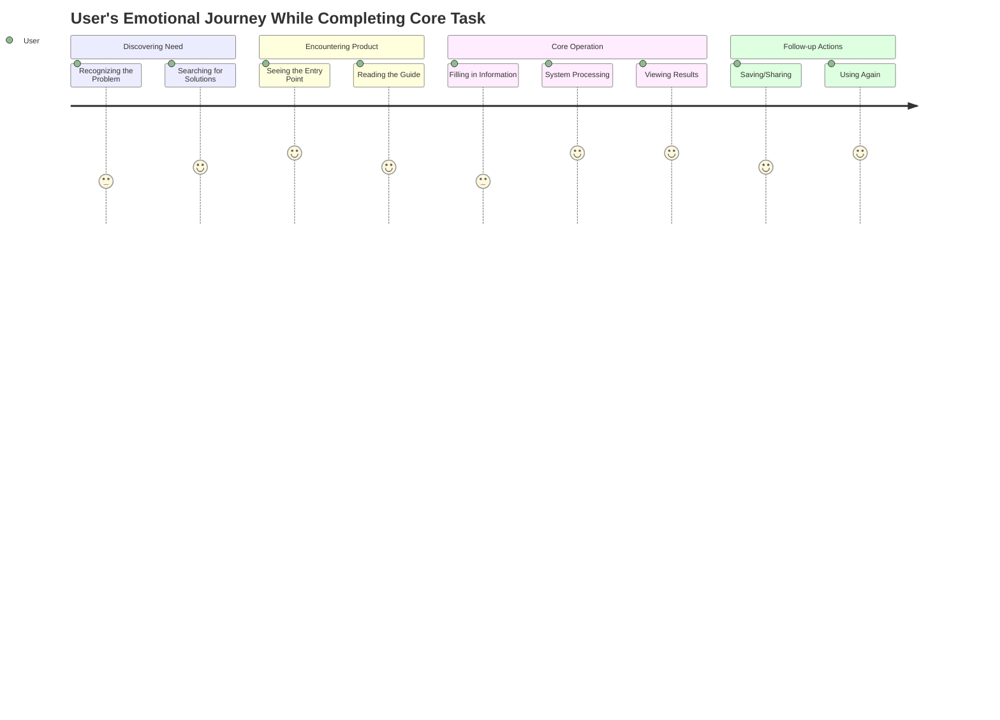

---

## 3. Requirement Landscape

### 3.1 Feature List
> **ByteDance Practice:** Use MoSCoW method to clarify priorities. R&D resources always prioritize Must-have items first.

| Module | Feature | Description | Priority | Owner | Dependencies | Status |
|:---|:---|:---|:---:|:---:|:---|:---:|
| User Module | Phone Number Login | Support phone number + verification code login | P0 | Backend A | SMS Provider | 🟡 |
| User Module | WeChat Authorization Login | Support WeChat one-click authorization | P1 | Backend A | WeChat Open Platform | ⚪ |
| Core Feature | Smart Recommendation | Personalized recommendation based on user behavior | P0 | Algorithm B | User Behavior Data | 🟡 |
| Core Feature | Batch Export | Support Excel/PDF batch export | P1 | Frontend C | Export Service | ⚪ |
| Value-added Feature | Data Dashboard | Visualized data display | P2 | Frontend C | Chart Component Library | ⚪ |

**Priority Definitions:**
- **P0 (Must-have):** Blocker — product cannot ship without it
- **P1 (Should-have):** Important but non-blocking; can be deferred or phased
- **P2 (Could-have):** Nice-to-have; implement when resources are available
- **P3 (Won't-have):** Explicitly not doing this time; documented to prevent misunderstanding

### 3.2 Product Architecture

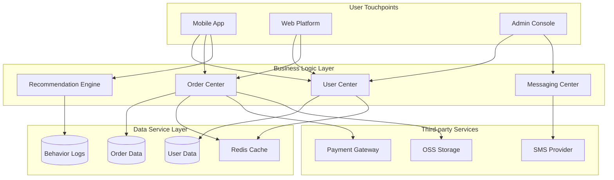

---

## 4. Functional Requirements
> **Core Chapter:** This is the most important part of the PRD. It must be thorough enough that "developers can build without prototypes, and testers can write test cases without interaction designs."

---

### 4.1 Feature Module One: [Module Name, e.g., "User Login Module"]

#### 4.1.1 Feature Definition

| Attribute | Description |
|:---|:---|
| **Feature Name** | `[Feature Name]` |
| **Feature ID** | `[Unique identifier, e.g., FUNC-001]` |
| **Parent Module** | `[Module Name]` |
| **Priority** | `P0/P1/P2` |
| **Requirement Source** | `[User Feedback / Data Insight / Business Side / Competitive Analysis]` |
| **Related Requirements** | `[Related feature IDs]` |

**Feature Description:** `[Describe in 2-3 sentences what this feature does and what problem it solves]`

#### 4.1.2 Business Flow

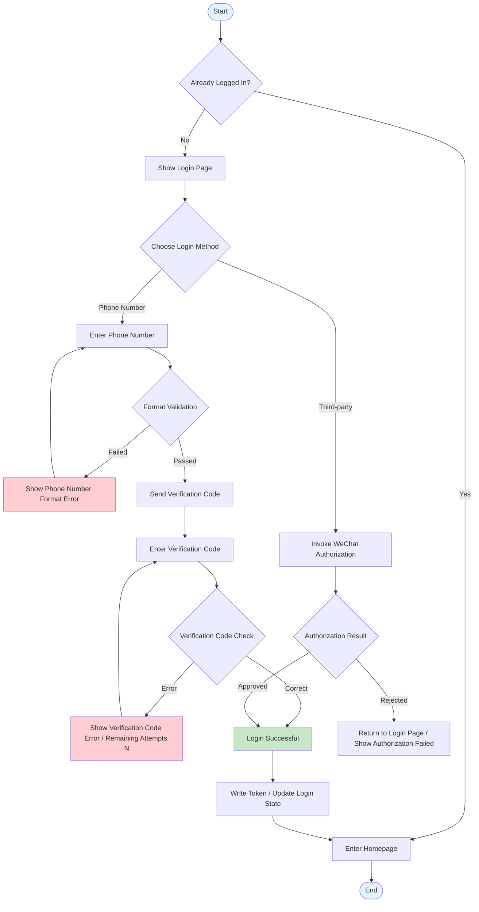

#### 4.1.3 Page Flow

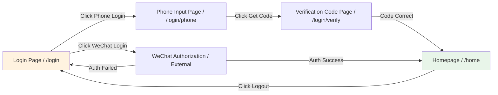

#### 4.1.4 Input & Output Definition

> **Alibaba/ByteDance Practice:** Every feature must clearly define IO — this is the foundation for frontend-backend integration.

**API/Input:**

| Input | Type | Required | Source | Validation Rule | Example Value |
|:---|:---:|:---:|:---|:---|:---|
| phone | string | Yes | User Input | Mainland China phone regex: `^1[3-9]\d{9}$` | 13800138000 |
| verifyCode | string | Yes | User Input | 4-6 digit numeric | 123456 |
| source | string | No | System-carried | Enum: app/web/mp | app |

**API/Output:**

| Output | Type | Description | Example Value |
|:---|:---:|:---|:---|
| accessToken | string | JWT access token, valid for 2 hours | eyJhbGciOiJIUzI1NiIs... |
| refreshToken | string | Refresh token, valid for 7 days | eyJhbGciOiJIUzI1NiIs... |
| userId | string | User unique identifier | U202405250001 |
| expireAt | number | Token expiration timestamp (milliseconds) | 1716633600000 |

#### 4.1.5 Business Rules

> **Rule Number Format:** `BR-[Module]-[Sequence]`

| Rule ID | Rule Description | Trigger Condition | Action | Priority |
|:---|:---|:---|:---|:---:|
| BR-LOGIN-001 | Verification code send rate limit | Duplicate request within 60 seconds from same phone number | Reject request, return "Please try again in 60 seconds" | P0 |
| BR-LOGIN-002 | Verification code error lockout | 5 consecutive incorrect attempts from same phone number | Lock for 2 hours, requires manual unlock or customer service contact | P0 |
| BR-LOGIN-003 | Token refresh mechanism | accessToken expired and refreshToken valid | Auto-refresh accessToken, silent renewal | P0 |
| BR-LOGIN-004 | Multi-device login restriction | Same account logs in on Device B while Device A is online | Device A receives offline notification, keep latest 3 devices | P1 |

#### 4.1.6 State Machine

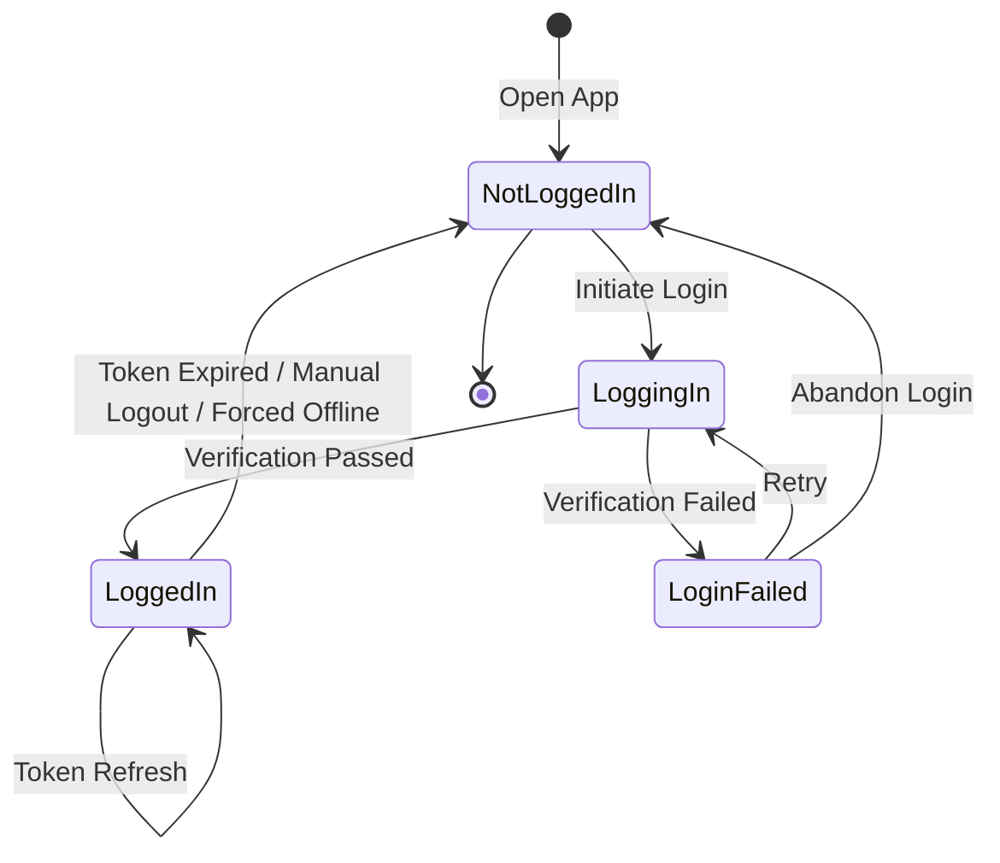

#### 4.1.7 Exception Handling

> **Industry Rule:** Exception flows must be covered — cannot only write the Happy Path.

| Exception Scenario | Exception Type | Frontend Behavior | Backend Handling | Compensation Mechanism |
|:---|:---|:---|:---|:---|
| Network Interruption | Network Error | Show network error page with "Retry" button | Request timeout, log error | Auto-retry 3 times, then prompt user |
| Verification Code Service Failure | Dependency Failure | Show "Service busy, please try again later" | Circuit breaker degradation, switch to backup channel | Trigger alert, auto-recover within 1 minute |
| Phone Number Already Registered | Business Exception | Show "This phone number is already registered. Login directly?" | Return specific error code: PHONE_EXISTS | Provide one-click login redirect |
| High-frequency Requests | Rate Limit Exception | Button disabled with countdown | Rate limit interception, return 429 | Frontend debounce + backend token bucket |

#### 4.1.8 Sequence Diagram

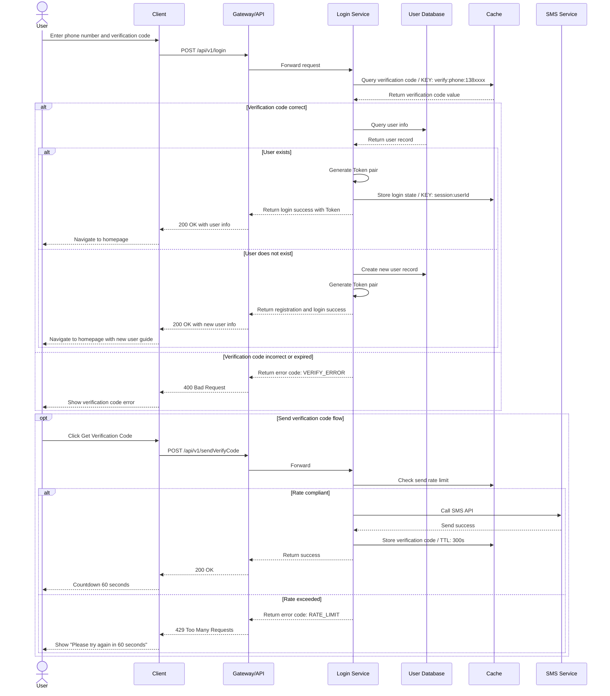

#### 4.1.9 Acceptance Criteria

> **Best Practice:** Acceptance criteria must be testable and verifiable, using the Given-When-Then format.

| AC ID | Acceptance Criteria (Given-When-Then) | Verification Method | Pass Criteria |
|:---|:---|:---|:---:|
| AC-001 | **Given** User is not logged in **When** Opens the app **Then** Login page is shown, phone input auto-focuses | Manual Testing | 100% pass |
| AC-002 | **Given** User enters a valid phone number **When** Clicks Get Verification Code **Then** Button is disabled for 60 seconds, user receives 6-digit code | Manual + Automated | 100% pass |
| AC-003 | **Given** User enters incorrect verification code 5 times consecutively **When** Submits the 5th attempt **Then** Shows account locked for 2 hours, security log recorded | Automated Testing | 100% pass |
| AC-004 | **Given** User is logged in with a valid Token **When** Accesses an authenticated API **Then** Returns data normally, no re-login required | Automated Testing | 100% pass |
| AC-005 | **Given** User's accessToken is expired but refreshToken is valid **When** Initiates a request **Then** Server silently refreshes Token, client is unaware | Automated Testing | 100% pass |

---

### 4.2 Feature Module Two: [Module Name, e.g., "Order Payment Module"]

#### 4.2.1 Feature Definition

#### 4.2.2 Business Flow

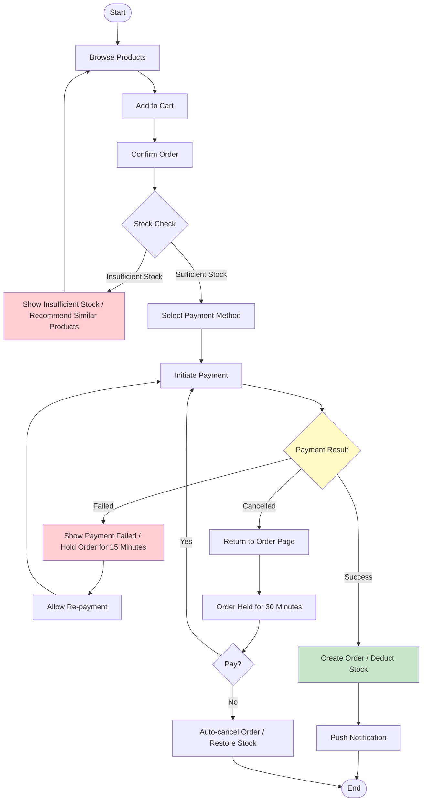

#### 4.2.3 Input & Output Definition

**Payment API Input:**

| Input | Type | Required | Validation Rule | Description |
|:---|:---:|:---:|:---|:---|
| orderId | string | Yes | Format: ORD + YYYYMMDD + 6-digit serial | Order unique identifier |
| payChannel | enum | Yes | Enum: WECHAT/ALIPAY/UNION | Payment channel |
| amount | decimal | Yes | >0, precision to cent | Payment amount (CNY) |
| currency | string | No | Default CNY | Currency |

**Payment API Output:**

| Output | Type | Description |
|:---|:---:|:---|
| payOrderId | string | Payment platform transaction number |
| payUrl | string | Redirect to payment page URL (H5) |
| prepayId | string | WeChat prepay ID (Mini Program/App) |
| expireTime | number | Payment timeout timestamp |

#### 4.2.4 State Machine

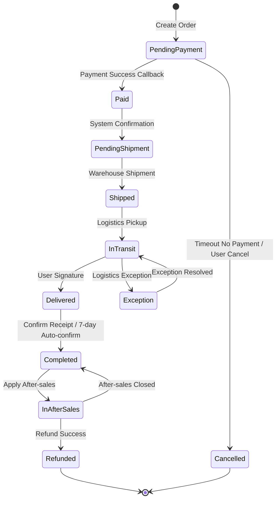

#### 4.2.5 Exception Handling

| Exception Scenario | Frontend Behavior | Backend Handling | Data Consistency Guarantee |
|:---|:---|:---|:---|
| Payment Callback Delay | Show "Payment Processing", polling query | Async message queue processing, max 5 retries | Idempotency check, prevent duplicate charges |
| Duplicate Payment | Block second payment request | Refund via original channel, log exception transaction | Unique index + state machine validation |
| Stock Oversell | Real-time validation at order placement | Optimistic lock / distributed lock deduction | Stock rollback mechanism |

---

## 5. Non-Functional Requirements

### 5.1 Performance

| Metric | Target | Test Scenario | Priority |
|:---|:---:|:---|:---:|
| First Contentful Paint | ≤ 1.5s | 4G network, cold start | P0 |
| API Response Time (P99) | ≤ 500ms | Normal peak concurrency | P0 |
| Concurrent Users | ≥ 10,000 QPS | Major promotion scenario | P0 |
| Database Query | ≤ 100ms | Single table with millions of records | P1 |

### 5.2 Security

| Requirement | Specifics | Implementation |
|:---|:---|:---|
| Data Transmission Encryption | Full-site HTTPS, TLS 1.3 | Gateway-level unified configuration |
| Sensitive Data Masking | Phone number, ID number display masking | Frontend display + backend response masking |
| Replay Attack Prevention | Request timestamp + random number signature | Middleware validation |
| SQL Injection Prevention | Zero SQL injection vulnerabilities | Parameterized queries + ORM |
| XSS Prevention | Zero stored XSS vulnerabilities | Input filtering + output encoding + CSP policy |

### 5.3 Availability

| Requirement | Target | Description |
|:---|:---:|:---|
| System Availability | 99.95% | Annual downtime < 4.38 hours |
| Recovery Time Objective (RTO) | ≤ 30 minutes | Core path failure |
| Recovery Point Objective (RPO) | ≤ 5 minutes | Data loss window |
| Degradation Strategy | Core features available | Non-core features can be degraded/off |

### 5.4 Compatibility

| Platform | Supported Range | Priority |
|:---|:---|:---:|
| iOS | iOS 14+ | P0 |
| Android | Android 8.0+ | P0 |
| Web | Chrome 90+, Safari 14+, Edge 90+ | P0 |
| Mini Program | WeChat 8.0+, Alipay 10.2+ | P1 |

---

## 6. Data Tracking

> **ByteDance/Alibaba Practice:** Tracking is not optional — it is part of the feature. It must be clearly defined in the PRD, otherwise developers will not allocate tracking placeholders.

### 6.1 Tracking Overview

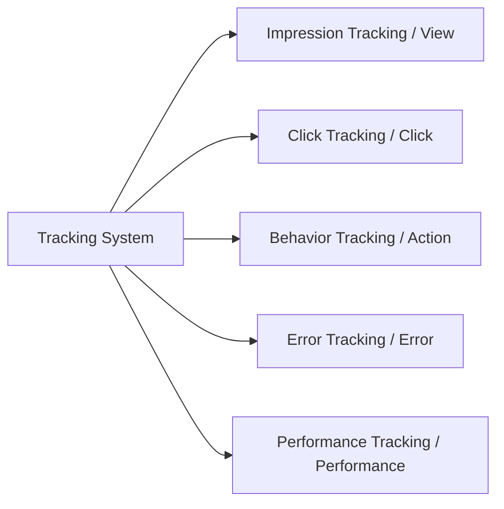

### 6.2 Tracking List

| Tracking ID | Tracking Name | Trigger Event | Event Type | Key Attributes | Purpose |
|:---|:---|:---|:---:|:---|:---|
| TRACK-001 | Login Page Impression | Enter login page | Impression | page_source, entry_time | Funnel analysis entry traffic |
| TRACK-002 | Get Code Click | Click "Get Verification Code" button | Click | phone, result, error_code | Analyze conversion funnel |
| TRACK-003 | Login Success | Login verification passed | Behavior | login_type, duration, is_new | Calculate login success rate |
| TRACK-004 | Login Failure | Login verification failed | Behavior | login_type, fail_reason, fail_step | Identify churn causes |
| TRACK-005 | Payment Initiated | Click confirm payment | Click | order_id, amount, pay_channel | Payment conversion analysis |
| TRACK-006 | Payment Success | Receive payment success callback | Behavior | order_id, pay_time, pay_channel | GMV attribution |
| TRACK-007 | Payment Failed | Payment failed or cancelled | Behavior | order_id, fail_reason, fail_step | Optimize payment experience |

### 6.3 Tracking Attribute Schema

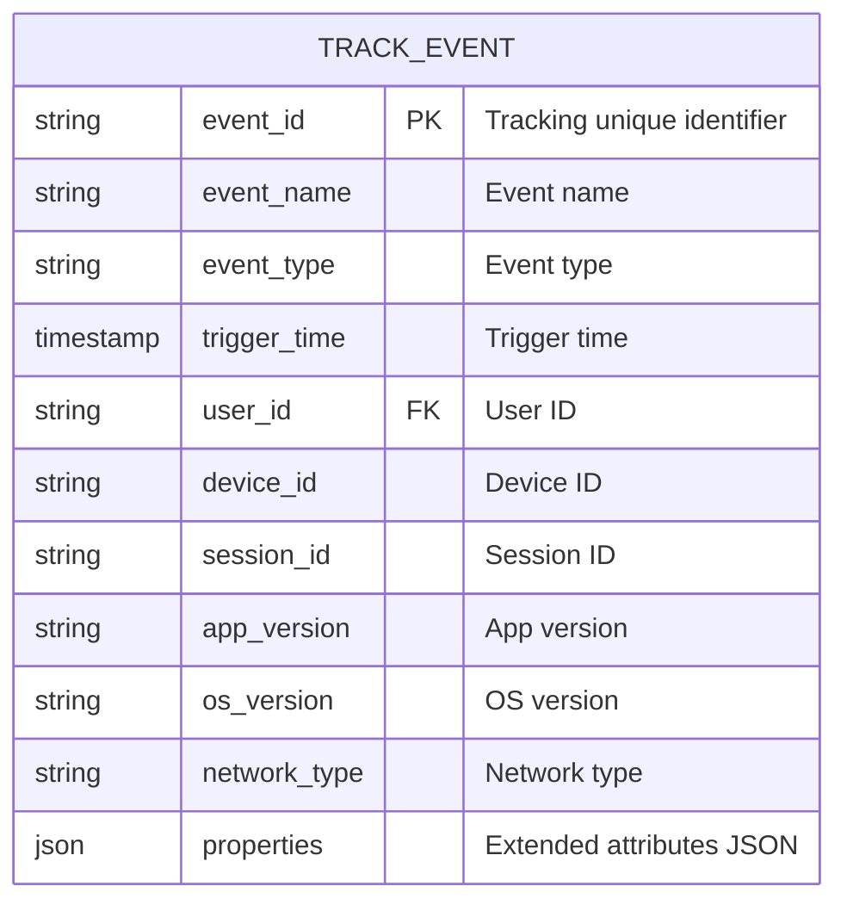

---

## 7. Release Plan

### 7.1 Milestones

> **Note:** Gantt charts are not compatible with Feishu; converted to table format.

| Phase | Task | Start Date | Duration | Status |
|:---|:---|:---|:---:|:---:|
| Requirements Phase | PRD writing and review | YYYY-MM-DD | 5d | ✅ done |
| Requirements Phase | Requirements review meeting | After PRD complete | 2d | ✅ done |
| Design Phase | Interaction design | After review complete | 5d | 🔵 active |
| Design Phase | Visual design | After interaction design complete | 5d | ⚪ |
| Development Phase | Backend API development | After visual design complete | 7d | ⚪ |
| Development Phase | Frontend page development | After visual design complete | 8d | ⚪ |
| Development Phase | Integration testing | After backend development complete | 3d | ⚪ |
| Testing Phase | Functional testing | After integration testing complete | 5d | ⚪ |
| Testing Phase | Regression testing | After functional testing complete | 2d | ⚪ |
| Release Phase | Canary release (5%) | After regression testing complete | 2d | ⚪ |
| Release Phase | Full release | After canary release complete | 1d | ⚪ |

### 7.2 Canary Release Strategy

| Phase | Release Time | User Scope | Observation Metrics | Rollback Criteria |
|:---|:---:|:---|:---|:---|
| Internal Test | D-Day | Internal employees + core seed users (100 people) | Crash rate << 0.1%, core flow pass rate 100% | Blocking Bug |
| Canary 1 | D+2 | 5% random users | Error rate << 0.5%, performance metrics met | Error rate > 1% or surge in complaints |
| Canary 2 | D+5 | 30% random users | Conversion rate fluctuation << ±5%, retention stable | Core metric drop > 10% |
| Full Release | D+7 | 100% users | Monitoring dashboard normal | None |

### 7.3 Rollback Plan

| Trigger Condition | Rollback Action | Owner | Estimated Duration | Impact Scope |
|:---|:---|:---|:---:|:---|
| Core path failure | Switch traffic to previous version | SRE | 5 minutes | All users |
| Data anomaly | Pause writes, switch to read-only mode | DBA | 10 minutes | New data writes |
| Critical security vulnerability | Emergency shutdown and fix | Security Team | 30 minutes | All features |

---

## 8. Risks & Dependencies

### 8.1 Risk Register

| Risk ID | Risk Description | Likelihood | Impact | Risk Level | Mitigation Strategy | Owner |
|:---|:---|:---:|:---:|:---:|:---|:---:|
| R-001 | Third-party login API changes | Medium | High | 🔴 High | Early documentation review, 2-day buffer | Backend A |
| R-002 | Payment channel fee increase | Low | Medium | 🟡 Medium | Lock pricing early via business negotiation, backup channels | Business B |
| R-003 | Core developer turnover | Low | High | 🟡 Medium | Code review process, documentation knowledge base | Project Manager |
| R-004 | Promotion traffic exceeds expectations | Medium | High | 🔴 High | Load test to 2x expected traffic, elastic scaling | SRE |

### 8.2 Dependencies

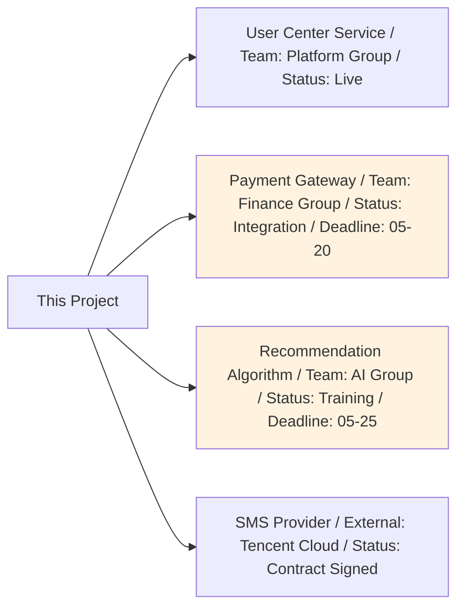

---

## 9. Appendix

### 9.1 Competitive Analysis Summary

| Competitor | Core Strength | Lessons Learned | Differentiation Strategy |
|:---|:---|:---|:---|
| Competitor A | Minimal login flow, 1-step completion | Reduce user input steps | We add biometric authentication for better security |
| Competitor B | 80% social login adoption | Strengthen third-party login guidance | We keep phone number as fallback |

### 9.2 Reference Documents

- [Product Prototype Link (Figma/Axure)]
- [API Documentation (Swagger/YApi)]
- [Design Mockups (MasterGo/Figma)]
- [Data Dashboard (Metabase/QuickBI)]
- [Technical Specification Document]

### 9.3 Requirements Review Record

| Review Date | Participants | Key Conclusions | Action Items |
|:---|:---|:---|:---|
| YYYY-MM-DD | PM, R&D, QA, Design | Approved, added 3 exception scenarios | Supplement network exception handling logic |

---

## 📌 PRD Writing Checklist

> **Essential for PMs:** Self-check each item before submitting for review to ensure PRD quality.

- [ ] **Completeness:** Are all feature modules covered? Are there any missing edge cases?
- [ ] **Executability:** Can developers build without looking at prototypes? Can testers write test cases directly?
- [ ] **Consistency:** Is terminology consistent? Is the logic coherent throughout?
- [ ] **Verifiability:** Does every feature have clear acceptance criteria? Are they quantifiable?
- [ ] **Exception Coverage:** Is only the Happy Path written? Are exception and degradation scenarios complete?
- [ ] **Dependency Clarity:** Are external dependencies clearly defined? Do risks have mitigation plans?
- [ ] **Data Closed Loop:** Are tracking points complete? Can they support downstream data analysis?
- [ ] **Version Control:** Is the change log updated? Are changes annotated?

---

**End of Document**

> **Usage Suggestions:**
> 1. Save this template as the standard template for the team Wiki
> 2. Each requirement must be based on this template with trimming; core chapters (4-7) cannot be removed
> 3. Complex features must include sequence diagrams and state machines; simple features may be simplified
> 4. During review, verify each item against the Checklist to ensure delivery quality
