# [Product/System Name (English)] - Functional Requirements Document (FRD)

> **Document Status:** 🟡 Under Review / 🟢 Approved / 🔴 Rejected
>
> **Confidentiality Level:** Confidential / Internal Public / Public
>
> **Version:** v1.0.2
>
> **Date:** YYYY-MM-DD
>
> **Author:** [Name/Role]
>
> **Reviewer:** [Name/Role]
>
> **Audience:** [Role List]
>
> **Document Hierarchy:** MRD → PRD → **FRD** (this document)
>
> **Related MRD:** [MRD Number] · [MRD Version]
>
> **Related PRD:** [PRD Number] · [PRD Version]

---

## 0. Document Guide

### 0.1 Document System Position

FRD inherits the product solution from PRD, answering **"how to implement this feature"**, and serves as the **single source of technical truth** for development, testing, and operations.

```mermaid
graph LR
    A[MRD / 'Market Opportunity and Users'] -->|Business Review Passed| B[PRD / 'Product Solution and Interaction']
    B -->|Requirement Review Passed| C[FRD / 'Technical Implementation and API']
    C -->|Technical Review Passed| D[Development & Testing]
    D -->|Acceptance Passed| E[Canary Release]

    style C fill:#e3f2fd,stroke:#1565c0,stroke-width:4px
    style B fill:#fff3e0,stroke:#e65100
    style A fill:#f3e5f5,stroke:#7b1fa2
```

### 0.2 Related Documents

| Document Type | Filename | Related Sections |
| -------- | ------------------- | ---------- |
| [Type] | [Filename] [Line Range] | [Section Description] |

> **Reference Format Note**: Related documents use the `filename line range` format (e.g., `【Template】Technical Requirements Document(TRD).md 3-17`). Line numbers may change as documents are updated; please refer to actual content.

### 0.3 Change Log

| Version | Date | Reviser | Change Content | Reviewer |
| :--- | :--- | :--- | :--- | :--- |
| v0.1 | YYYY-MM-DD | [Name] | Initial draft completed | [Architect] |
| v0.2 | YYYY-MM-DD | [Name] | Added exception flows and circuit breaker strategy | [Architect] |
| v1.0 | YYYY-MM-DD | [Name] | Technical review passed, baseline archived | [CTO] |
| v1.0.1 | 2026-06-09 | Xie Dong | Fixed xychart-beta chart to table for Feishu rendering compatibility | — |
| v1.0.2 | 2026-06-20 | Xie Dong | Message middleware example RocketMQ→Pulsar (unified event bus specification) | — |

---

## 1. Functional Overview

### 1.1 Feature Definition

| Attribute | Description |
| :--- | :--- |
| **Feature Name** | [Module name, e.g., Smart Order Fulfillment Engine] |
| **Feature ID** | FUNC-XXX |
| **Related PRD** | [PRD number-section, e.g., PRD-2026-001 §3.2] |
| **Feature Goal** | [One sentence: core capability the system needs to implement, e.g., Achieve precise inventory deduction and order state consistency under high concurrency scenarios] |
| **Business Value** | [Quantified value: e.g., Support 100K TPS order placement during promotions, inventory overselling rate <<0.001%] |

### 1.2 Feature Panorama (Use Case)

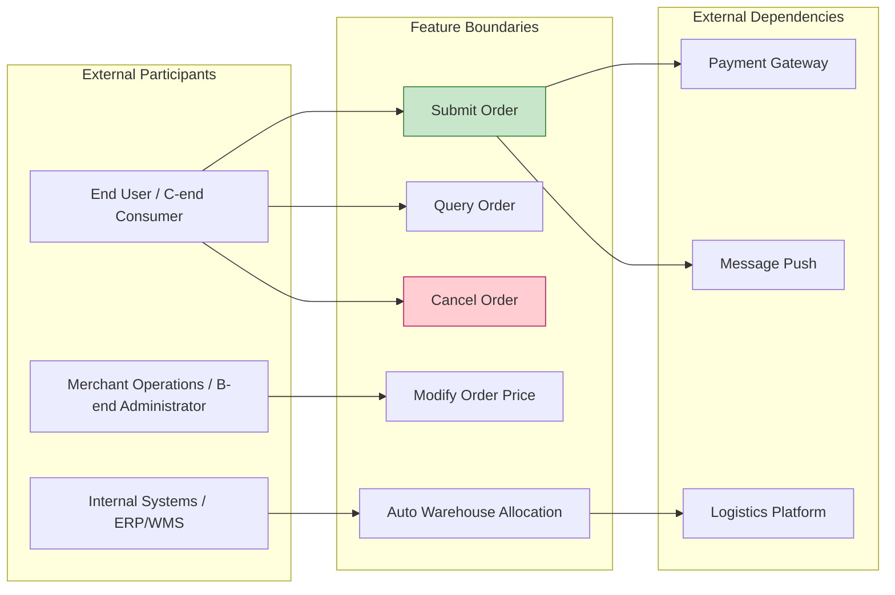

### 1.3 System Architecture

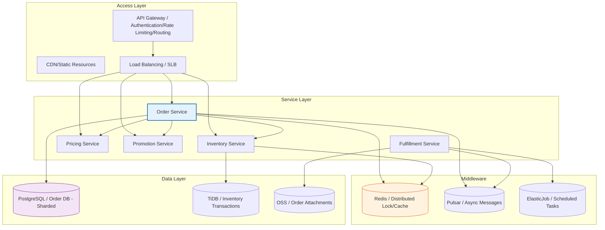

---

## 2. Domain Model

### 2.1 Entity Relationship Diagram (ER)

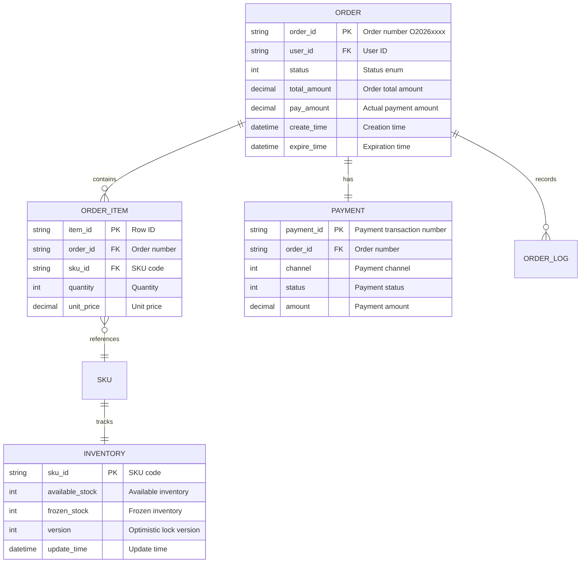

### 2.2 Domain Events

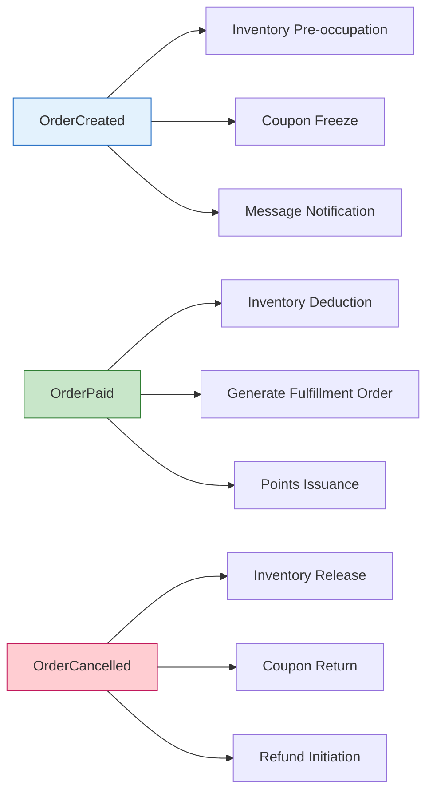

---

## 3. Business Process

### 3.1 Core Process (Happy Path)

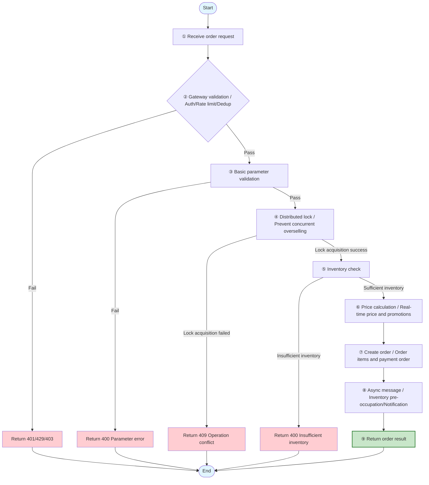

### 3.2 Exception and Degradation Process

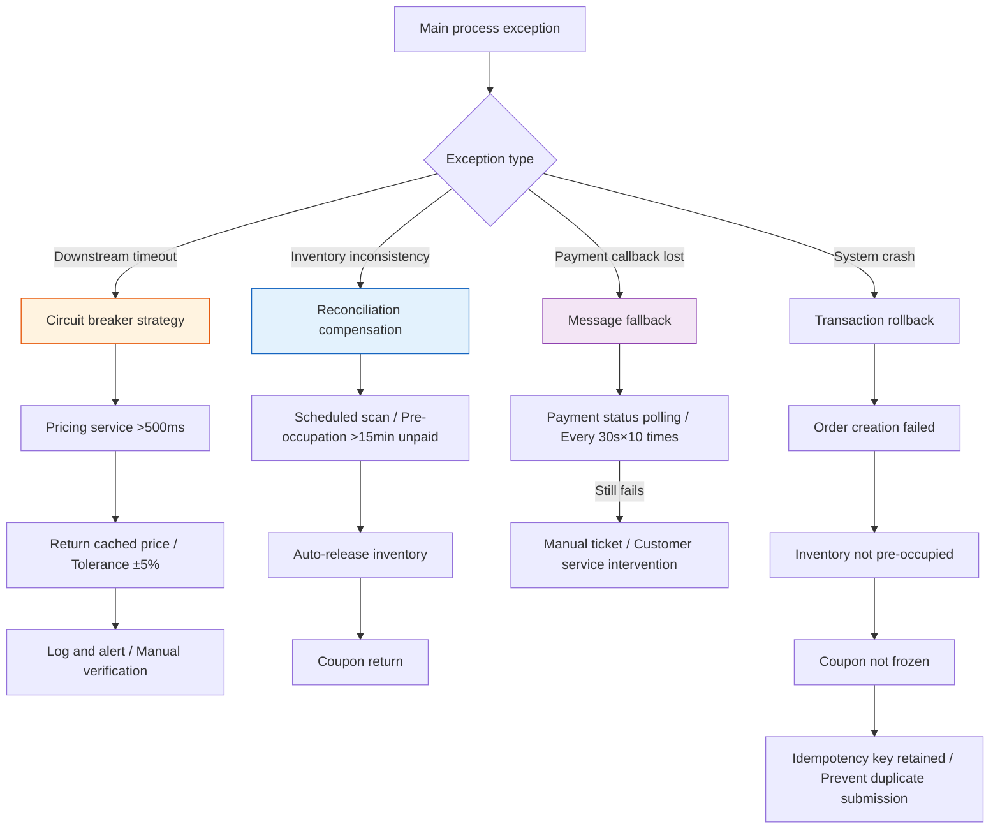

### 3.3 Exception Scenario Matrix

| Exception ID | Scenario | Trigger Condition | System Behavior | Error Code | User Prompt | Monitoring Alert |
| :--- | :--- | :--- | :--- | :---: | :--- | :---: |
| TPL-ERR-001 | Missing parameter | Required field empty | Reject request, log | 400001 | "Please complete required information" | No |
| TPL-ERR-002 | Duplicate submission | Idempotency key already exists | Return previous result | 200001 | "Operation successful" | No |
| TPL-ERR-003 | Concurrent conflict | Optimistic lock version inconsistent | Prompt data has changed | 409001 | "Data has been updated, please refresh and retry" | Yes |
| TPL-ERR-004 | Insufficient inventory | Available inventory << purchase quantity | Reject order | 400002 | "Insufficient product inventory, only X left" | Yes |
| TPL-ERR-005 | Dependency timeout | Downstream service >500ms no response | Circuit breaker, return degraded data | 503001 | "Service busy, please try again later" | Yes |
| TPL-ERR-006 | Price change | Real-time price and cached price difference >5% | Prompt price updated | 400003 | "Product price has been updated, please confirm" | No |

---

## 4. State Machine

### 4.1 Order State Transition

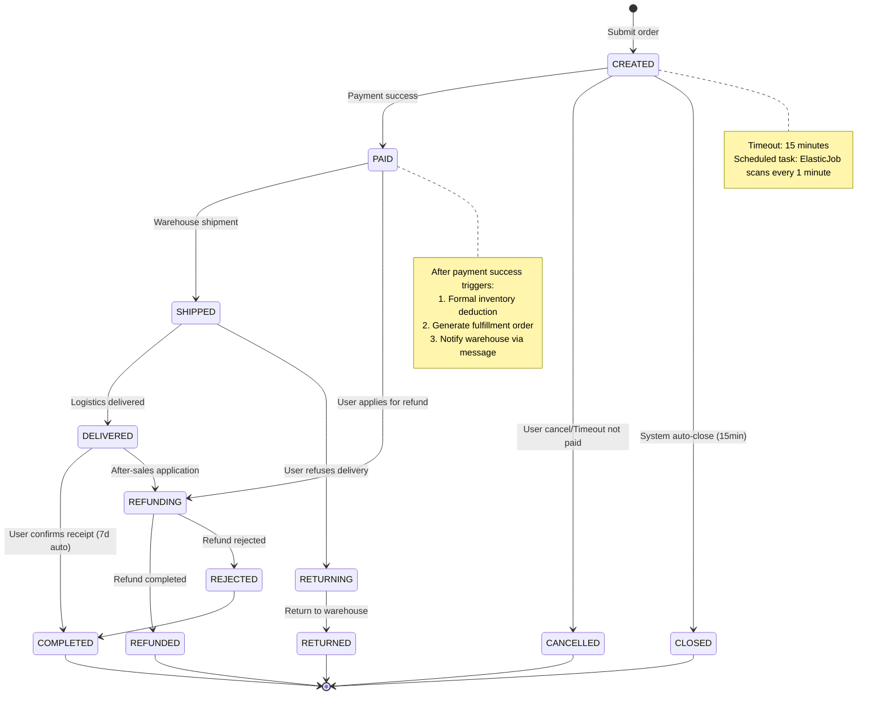

### 4.2 State Transition Rules

| Current State | Target State | Trigger Event | Pre-condition | Post Action | Permission |
| :--- | :--- | :--- | :--- | :--- | :--- |
| CREATED | PAID | Payment callback success | Amount matches | Deduct inventory, notify warehouse | System |
| CREATED | CANCELLED | User clicks cancel | Not paid | Release inventory, return coupons | Buyer |
| CREATED | CLOSED | Timeout auto-close | Created >15min | Release inventory, return coupons | System |
| PAID | SHIPPED | Warehouse scan shipment | Inventory deducted | Update logistics tracking number | Merchant |
| DELIVERED | COMPLETED | Auto-confirm receipt | Delivered >7d | Settle merchant, issue points | System |

---

## 5. Interface Definition

### 5.1 Interface List

| Interface ID | Interface Name | Method | Path | Caller | Concurrency Expected | Priority |
| :--- | :--- | :---: | :--- | :---: | :--- | :---: |
| API-001 | Create Order | POST | `/api/v1/orders` | App/Web/Mini Program | 5000 TPS | P0 |
| API-002 | Query Order Details | GET | `/api/v1/orders/{orderId}` | App/Web/Mini Program | 10000 TPS | P0 |
| API-003 | Cancel Order | PUT | `/api/v1/orders/{orderId}/cancel` | App/Web | 1000 TPS | P0 |
| API-004 | Order List | GET | `/api/v1/orders` | App/Web | 5000 TPS | P1 |
| API-005 | Payment Callback | POST | `/callback/payment` | Payment Gateway | 3000 TPS | P0 |

### 5.2 Detailed Interface: API-001 Create Order

#### 5.2.1 Interface Overview

| Item | Description |
| :--- | :--- |
| **Interface Name** | Create Order |
| **Request Path** | `POST /api/v1/orders` |
| **Interface Description** | User submits order, system validates inventory, price, and promotions then creates order, returns pending payment order |
| **Idempotency** | Yes (guaranteed via `idempotency-key`) |
| **Timeout** | 3000ms |
| **Degradation Strategy** | If pricing service timeout, use cached price (tolerance ±5%) |

#### 5.2.2 Request Headers

| Parameter | Type | Required | Example | Description |
| :--- | :---: | :---: | :--- | :--- |
| Authorization | string | Yes | `Bearer eyJhbG...` | Access token |
| X-Request-ID | string | Yes | `req_20260525103000_abc123` | Distributed tracing ID, globally unique |
| X-Idempotency-Key | string | Yes | `idem_user123_1625103000` | Idempotency key, same key returns same result within 30 minutes |
| Content-Type | string | Yes | `application/json` | Fixed value |
| X-Client-Version | string | No | `ios/3.2.1` | Client version, for compatibility handling |

#### 5.2.3 Request Body

```json
{
  "skuList": [
    {
      "skuId": "SKU20260525001",
      "quantity": 2,
      "source": "cart"
    }
  ],
  "addressId": "ADDR123456",
  "couponId": "CPN789012",
  "remark": "Please ship ASAP, urgent use",
  "source": "app_ios",
  "extInfo": {
    "deviceId": "device_abc123",
    "ip": "123.45.67.89"
  }
}
```

| Parameter | Type | Required | Validation Rule | Description |
| :--- | :---: | :---: | :--- | :--- |
| skuList | array | Yes | Non-empty, length 1-50 | Product list |
| └─ skuId | string | Yes | Format: `SKU`+YYYYMMDD+3-digit serial | Product SKU |
| └─ quantity | int | Yes | 1~999 | Purchase quantity |
| └─ source | string | No | Enum: `cart`/`direct`/`activity` | Source: Cart/Direct purchase/Activity |
| addressId | string | Yes | Existing and valid address ID | Shipping address |
| couponId | string | No | Valid coupon ID | Coupon |
| remark | string | No | Length ≤200, filter sensitive words | Order remarks |
| source | string | No | Enum: `app_ios`/`app_android`/`web`/`mp` | Client source |
| extInfo | object | No | — | Extended information, for risk control |

#### 5.2.4 Response Body

**Success Response (200 OK):**

```json
{
  "code": 200,
  "message": "success",
  "traceId": "req_20260525103000_abc123",
  "data": {
    "orderId": "ORD202605250001",
    "status": "CREATED",
    "totalAmount": 299.0,
    "discountAmount": 30.0,
    "payAmount": 269.0,
    "itemCount": 2,
    "createTime": "2026-05-25T10:30:00+08:00",
    "expireTime": "2026-05-25T10:45:00+08:00",
    "paymentUrl": "https://pay.example.com/prepare?token=xxx"
  }
}
```

| Parameter | Type | Description |
| :--- | :---: | :--- |
| orderId | string | Order unique identifier, globally unique |
| status | string | Order status: `CREATED`/`PAID`/`SHIPPED`/`DELIVERED`/`COMPLETED`/`CANCELLED` |
| totalAmount | decimal | Order total amount (Yuan) |
| discountAmount | decimal | Discount amount (Yuan) |
| payAmount | decimal | Actual payment amount (Yuan) |
| itemCount | int | Number of items |
| createTime | string | Creation time (ISO8601) |
| expireTime | string | Payment deadline (15 minutes) |
| paymentUrl | string | Payment redirect link (only returned for CREATED status) |

**Error Response (400 Bad Request):**

```json
{
  "code": 400002,
  "message": "Insufficient inventory",
  "traceId": "req_20260525103000_abc123",
  "data": {
    "skuId": "SKU20260525001",
    "availableStock": 1,
    "requestQuantity": 2
  }
}
```

#### 5.2.5 Error Code Summary

| Error Code | HTTP Status | Description | Client Handling Suggestion |
| :---: | :---: | :--- | :--- |
| 400001 | 400 | Parameter validation failed | Check required fields and format |
| 400002 | 400 | Insufficient inventory | Prompt insufficient inventory, guide to reduce quantity or select other products |
| 400003 | 400 | Coupon unavailable | Prompt coupon expired/not applicable/already used |
| 400004 | 400 | Invalid shipping address | Guide user to re-select address |
| 401001 | 401 | Login session expired | Redirect to login page |
| 429001 | 429 | Request too frequent | Show countdown, limit submission frequency |
| 409001 | 409 | Concurrent operation conflict | Prompt "Data has been updated, please refresh and retry" |
| 500001 | 500 | Internal system error | Show friendly error page, report log |
| 503001 | 503 | Downstream service busy | Prompt "Service busy, please try again later", suggest retry after 3 seconds |

---

## 6. Data Flow and Interaction Sequence

### 6.1 Core Order Placement Sequence

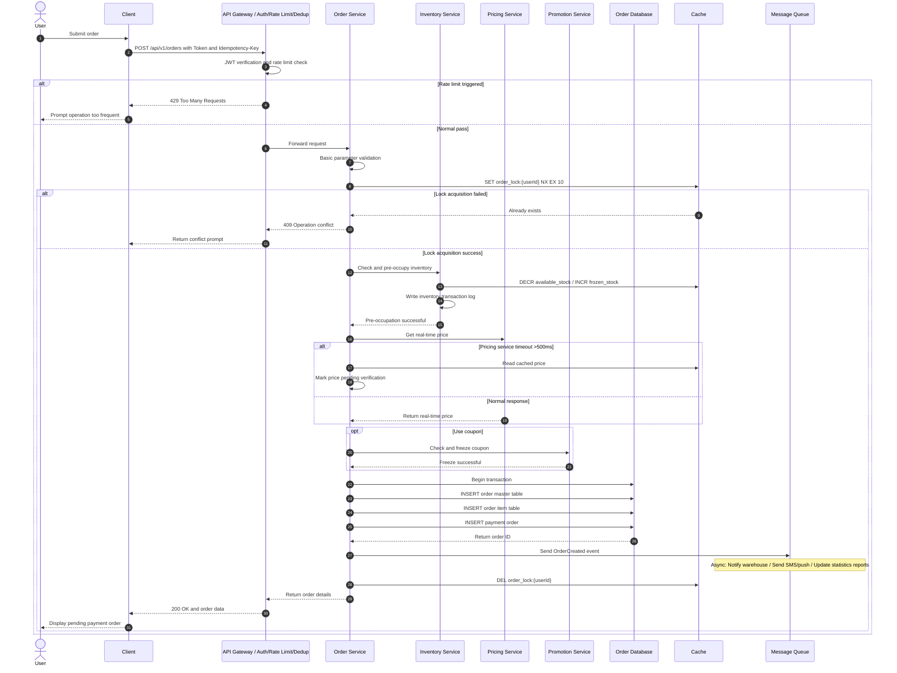

### 6.2 Payment Callback Sequence

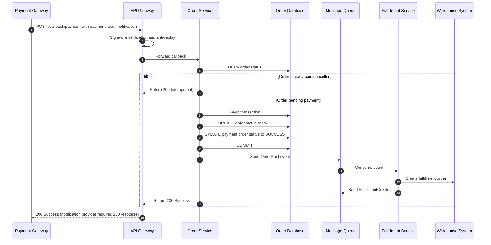

---

## 7. Non-Functional Requirements (NFR / SLA)

### 7.1 Performance Metrics

> **Note**: xychart-beta is not compatible with Feishu, converted to table description (template sample data).

**Interface Performance Targets (P99 Response Time ms)**

| Interface | P99 Response Time(ms) |
| :--- | :---: |
| API-001 Create | 300 |
| API-002 Query | 100 |
| API-003 Cancel | 200 |
| API-004 List | 150 |

| Metric Item | Target | Measurement Method | Responsible Party |
| :--- | :--- | :--- | :--- |
| Core interface P99 latency | ≤ 300ms | APM monitoring (SkyWalking) | Backend |
| Query interface P99 latency | ≤ 100ms | APM monitoring | Backend |
| Concurrency processing capability | ≥ 5000 TPS | Full link load test | Architecture |
| Database QPS | ≥ 10000 | Slow query monitoring | DBA |
| Cache hit rate | ≥ 95% | Redis monitoring | Backend |

### 7.2 Availability and Reliability

| Metric Item | Target | Implementation Method |
| :--- | :--- | :--- |
| System availability | ≥ 99.95% | Multi-active deployment + Automatic failover |
| Data consistency | Strong consistency (Order/Inventory/Payment) | Distributed transaction (Seata AT mode) |
| Data persistence | RPO=0, RTO<<30s | Master-slave sync + Automatic switchover |
| Degradation capability | Core link can degrade | Circuit breaker (Sentinel) + Fallback cache |

### 7.3 Security and Compliance

| Item | Requirement | Verification Method |
| :--- | :--- | :--- |
| Transmission encryption | TLS 1.3 | SSL Labs scan |
| Sensitive data | Phone/ID AES-256 encrypted storage | Security audit |
| Anti-replay attack | Timestamp + random number + signature, valid for 5 minutes | Penetration testing |
| Permission control | RBAC + Data permission isolation | Automated permission scan |
| Audit log | All financial operations traceable, retained for 180 days | Log audit |

---

## 8. Acceptance Criteria

### 8.1 Functional Acceptance (Given-When-Then)

| AC ID | Acceptance Criteria (Gherkin format) | Test Type | Pass Criteria |
| :--- | :--- | :---: | :---: |
| AC-001 | **Given** User is logged in and cart has 2 items<br>**When** User submits order with valid address<br>**Then** System creates order with CREATED status<br>**And** Returns payment link valid within 15 minutes | Integration test | 100% pass |
| AC-002 | **Given** Product inventory only 1 left<br>**When** User tries to purchase 2<br>**Then** System rejects order<br>**And** Returns error code 400002<br>**And** Inventory not pre-occupied | Exception test | 100% pass |
| AC-003 | **Given** User submitted order but not paid<br>**When** 15 minutes later system auto-close task executes<br>**Then** Order status changes to CLOSED<br>**And** Inventory auto-released<br>**And** Coupons auto-returned | Scheduled task test | 100% pass |
| AC-004 | **Given** 1000 concurrent users purchasing same SKU<br>**When** Inventory is 500 pieces<br>**Then** Successful orders = 500<br>**And** No overselling phenomenon<br>**And** No duplicate charges | Concurrency test | 100% pass |
| AC-005 | **Given** Pricing service response >500ms<br>**When** User submits order<br>**Then** System uses cached price<br>**And** Order creation successful<br>**And** Price difference alert triggered | Degradation test | 100% pass |

### 8.2 Performance Acceptance

| Acceptance Item | Scenario | Target | Test Tool |
| :--- | :--- | :--- | :--- |
| Load test-001 | Create order interface | 5000 TPS, P99<<300ms, error rate<<0.1% | JMeter/Gatling |
| Load test-002 | Mixed scenario (query/create/cancel) | 10000 TPS, system load<<70% | Full link load test platform |
| Load test-003 | Database capacity | Single table 100M rows, query P99<<100ms | Capacity test |

---

## 9. Release and Canary Plan

### 9.1 Canary Strategy

```mermaid
graph LR
    A[Internal testing / 1% employees and seed users] --> B[Whitelist / 10% invited merchants]
    B --> C[Regional canary / 30% South China users]
    C --> D[Full release / 100% users]
    D --> E[Monitor observation / 72 hours]

    A -->|Observe 3 days / No P0 bugs| B
    B -->|Observe 5 days / Core metrics normal| C
    C -->|Observe 7 days / No abnormal alerts| D

    style A fill:#fff3e0,stroke:#e65100
    style D fill:#c8e6c9,stroke:#2e7d32,stroke-width:3px
```

### 9.2 Release Checklist

| Phase | Check Item | Owner | Status |
| :--- | :--- | :--- | :---: |
| Pre-release | Code review passed (≥2 people) | Tech Lead | ⬜ |
| Pre-release | Unit test coverage ≥80% | Development | ⬜ |
| Pre-release | Interface contract test passed | Testing | ⬜ |
| Pre-release | Database change script review passed | DBA | ⬜ |
| Pre-release | Monitor dashboard/alert rules configured | SRE | ⬜ |
| During release | Blue-green deployment, traffic switch 10%→50%→100% | SRE | ⬜ |
| Post-release | Core interface P99 latency monitoring | SRE | ⬜ |
| Post-release | Error rate <<0.1% sustained for 30 minutes | SRE | ⬜ |
| Post-release | Business metrics (order success rate) no decline | Product | ⬜ |

### 9.3 Rollback Strategy

| Trigger Condition | Rollback Action | Rollback Time Target | Owner |
| :--- | :--- | :--- | :--- |
| P0 bug affects >1% users | Immediately switch traffic to old version | ≤ 5 minutes | SRE |
| Performance drops >50% | Degrade non-core links, keep core order placement | ≤ 3 minutes | SRE |
| Database anomaly | Pause writing, switch to read-only mode, manual intervention | ≤ 10 minutes | DBA |

---

## 10. Appendix

- **Appendix A:** Database change scripts (DDL/DML)
- **Appendix B:** Interface contract test case set
- **Appendix C:** Load test report template and historical baseline
- **Appendix D:** Third-party service integration documentation (Payment/Logistics/SMS)
- **Appendix E:** Glossary and data dictionary

> **FRD Writing Principles (Big Company Standard):**
>
> 1. **Testability:** Every feature point must correspond to at least one AC (acceptance criteria).
> 2. **Observability:** Every interface must define traceId, error codes, monitoring tracking.
> 3. **Rollbackability:** Every change must consider rollback plan, data changes must be compatible with old versions.
> 4. **Defensive:** Every external dependency must have timeout, circuit breaker, degradation strategy.
> 5. **Consistency:** State machine must cover entire lifecycle, no "hover states" allowed.