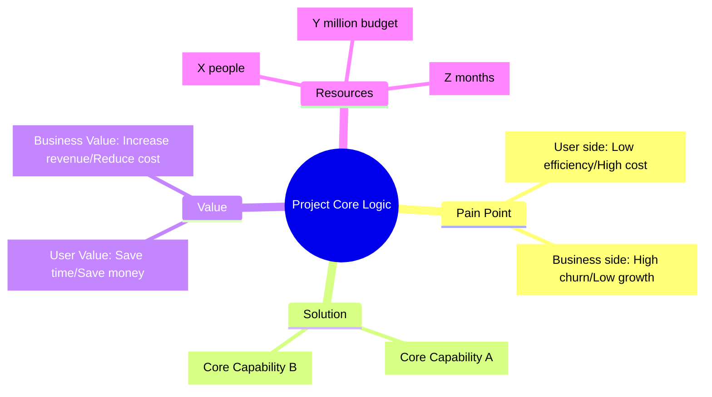
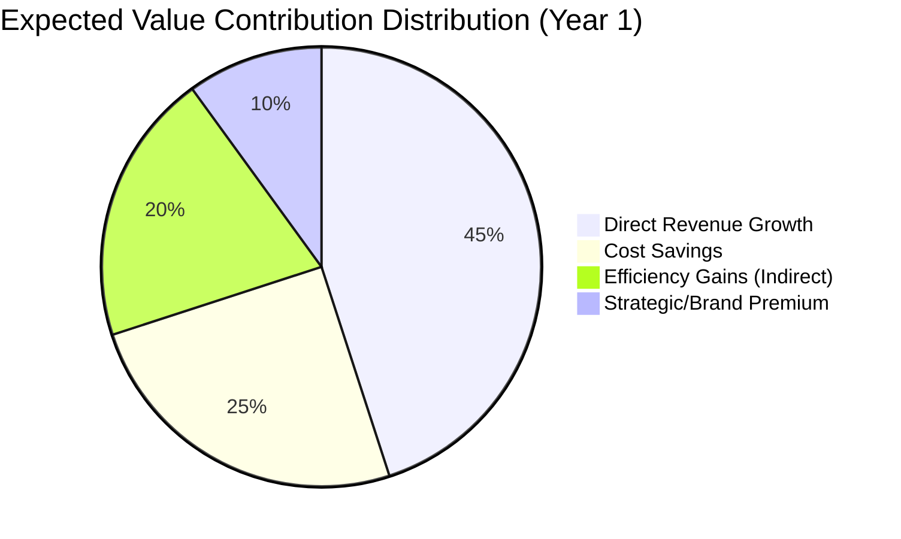
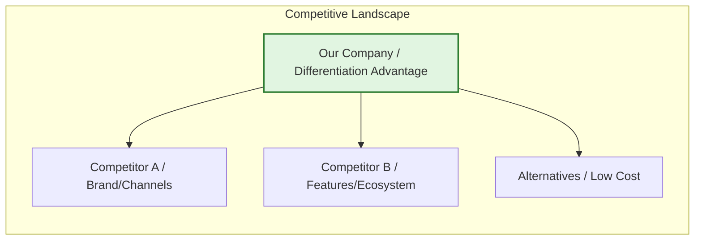
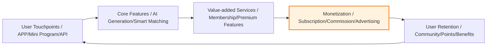
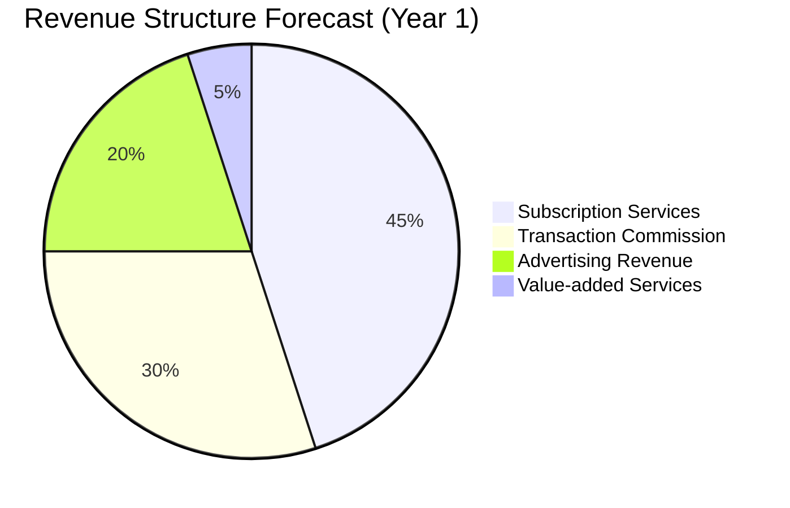
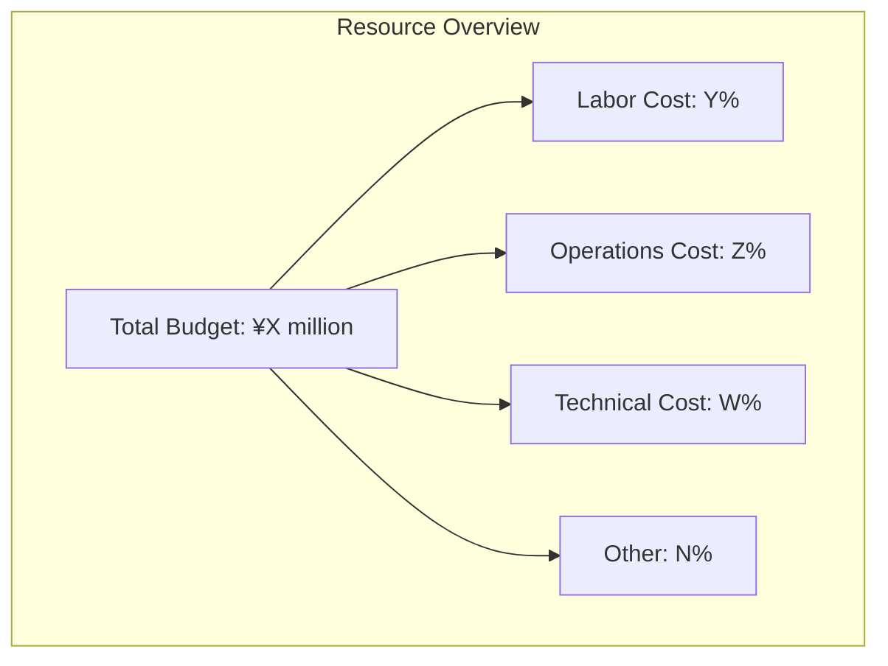
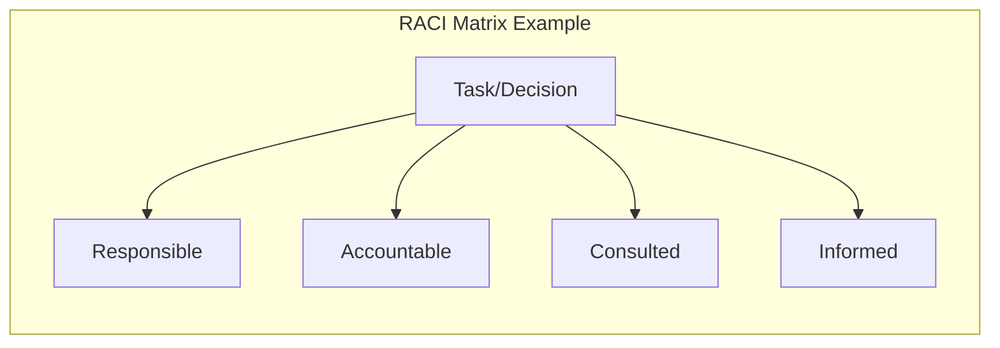
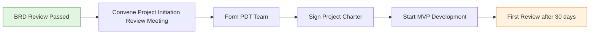
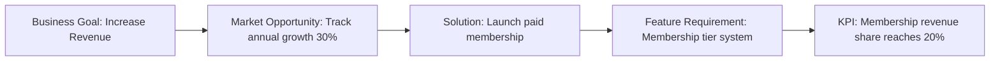

# [Product/System Name (English)] - Business Requirements Document (BRD)

> **Document Status:** 🟡 Under Review / 🟢 Approved / 🔴 Rejected
>
> **Confidentiality Level:** Confidential / Internal Public / Public
>
> **Version:** v0.3.2
>
> **Date:** YYYY-MM-DD
>
> **Author:** [Name/Role]
>
> **Reviewer:** [Name/Role]
>
> **Audience:** [Role List]

---

## 0. Document Guide

### 0.1 Document Purpose and Scope

[Explain the purpose, applicable scenarios, and non-applicable scenarios of this document]

### 0.2 Related Documents

| Document Type | Filename | Related Sections |
|---------|--------|---------|
| [Type] | [Filename] [Line Range] | [Section Description] |

> **Reference Format Note**: Related documents use the `filename line range` format (e.g., `【Template】Technical Requirements Document(TRD).md 3-17`). Line numbers may change as documents are updated; please refer to actual content.

### 0.3 Change Log

| Version | Date | Reviser | Change Content | Reviewer |
| :--- | :--- | :--- | :--- | :--- |
| v0.1 | YYYY-MM-DD | [Name] | Initial draft | [Reviewer] |
| v0.2 | YYYY-MM-DD | [Name] | Added financial model and risk countermeasures | [Reviewer] |
| v0.3 | 2026-06-09 | Xie Dong | Fixed: quadrantChart template changed to table format (Feishu incompatible) | — |
| v0.3.1 | 2026-06-09 | Xie Dong | Fixed xychart-beta chart to table for Feishu rendering compatibility | — |
| v0.3.2 | 2026-06-09 | Xie Dong | Fixed Gantt chart to table for Feishu rendering compatibility | — |

---

## 1. Executive Summary

> **Elevator Pitch:** Clearly explain in 30 seconds what this project is, why it matters, and how much it will earn.

| Element | Content |
| :--- | :--- |
| **Project One-liner** | [Describe product positioning in one sentence, e.g., "AI-driven personalized learning platform for Gen Z"] |
| **Core Opportunity** | [Market pain point + opportunity window, with key data] |
| **Investment Overview** | Total budget ¥[X] million, duration [Y] months, [Z] person core team needed |
| **Return Forecast** | 3-year ROI [X]%, breakeven at month [N], LTV/CAC = [M] |
| **Recommendation** | 🟢 Start immediately / 🟡 Start after additional research / 🔴 Postpone |

---

## 2. Background

### 2.1 Requirement Insights

| Dimension | Core Content | Key Data |
| :--- | :--- | :--- |
| **Market Pain Point** | [One-sentence description of user/customer unmet pain point] | [e.g., Survey shows 73% of users want XX feature] |
| **Opportunity Window** | [Why now is the best time? Policy/Technology/Competition changes] | [e.g., AI technology cost dropped 80%, policy bonus period 12 months] |
| **Strategic Alignment** | [Align with company annual OKR / Strategic direction] | [e.g., Align with "AI First" strategy, support Q3 growth target] |

### 2.2 Data Support

- **User-side Data:** [e.g., NPS only 32, industry benchmark 65; core scenario churn rate 35%, industry average 15%]
- **Business-side Data:** [e.g., Current CAC ¥120, competitor ¥60; ARPU ¥2000, annual repurchase rate 8%]
- **Competitive Data:** [e.g., After competitor launched this feature, DAU increased 20%, paid conversion increased 5pp]

### 2.3 Competitive Advantage Analysis

> **Note**: This quadrant chart template has been converted to table description.

| Quadrant | Area Characteristics | Strategy Suggestions |
| :--- | :--- | :--- |
| Quadrant 1 (Low Difficulty · High Value) | Key investment (High Value/Low Difficulty) | Start project immediately, push forward quickly |
| Quadrant 2 (High Difficulty · High Value) | Differentiation advantage (High Value/High Difficulty) | Phased tackling, build barriers |
| Quadrant 3 (Low Difficulty · Low Value) | Cautious investment (Low Value/Low Difficulty) | Start when resources available, not priority |
| Quadrant 4 (High Difficulty · Low Value) | Quick harvest (Low Value/High Difficulty) | Re-evaluate necessity, avoid resource waste |

| Name | X Value | Y Value | Quadrant |
| :--- | :---: | :---: | :--- |
| Our Solution | 0.3 | 0.85 | Quadrant 1 (Key Investment) |
| Competitor A Solution | 0.6 | 0.55 | Quadrant 2 (Differentiation Advantage) |
| Competitor B Solution | 0.8 | 0.45 | Quadrant 4 (Quick Harvest) |
| Industry Average | 0.5 | 0.5 | Midline Position |

---

## 3. Product Value

### 3.1 User Value

- **Core Users:** [User persona, e.g., 25-35 year old white-collar workers in tier-1 cities, monthly income 15-30K, value efficiency]
- **Solution Scenario:** [Scenario-based description, e.g., When users need to complete weekly reports within 30 minutes, can generate framework with one click and auto-fill data]
- **Value Quantification:** [Save X time / Reduce Y cost / Improve Z experience, e.g., Single task time reduced from 2h to 15min]

### 3.2 Business Value

| Value Type | Specific Description | Quantified Metric | Calculation Basis |
| :--- | :--- | :--- | :--- |
| **Revenue Growth** | [e.g., Open new payment scenarios / Increase ARPU] | GMV +X% / ARPU +¥Y | [Assumptions and formulas] |
| **Cost Reduction** | [e.g., Automation replacing manual / Reduce CAC] | Labor cost -Y% / CAC -Z% | [Assumptions and formulas] |
| **Efficiency Improvement** | [e.g., Shorten delivery cycle / Improve productivity] | Cycle -Z% / Productivity +W% | [Assumptions and formulas] |
| **Strategic Positioning** | [e.g., Layout AI track / Build ecosystem barriers] | Market share +Npp / Ecosystem coverage | [Assumptions and formulas] |

---

## 4. Market Analysis

### 4.1 Market Size (TAM / SAM / SOM)

> **Reference Note**: Detailed market size data, growth trends and forecast models please refer to **【Template】Market Research Report.md §4. Market Size and Trends**. This document only references key conclusions.

| Metric | Value | Data Source | Calculation Logic |
| :--- | :---: | :--- | :--- |
| **TAM (Total Addressable Market)** | ¥[X] billion | Reference Market Research Report §4.1 | [Overall market size and growth rate] |
| **SAM (Serviceable Addressable Market)** | ¥[Y] billion | Reference Market Research Report §4.3 | [Market our capabilities can cover] |
| **SOM (Serviceable Obtainable Market)** | ¥[Z] billion | Reference Market Research Report §4.5 | [Share obtainable with current resources] |

> **Complete Data**: Market size historical data, forecast model (three scenarios), sensitivity analysis details please refer to **【Template】Market Research Report.md §4.4-4.6**.

### 4.2 Competitive Landscape

> **Reference Note**: Detailed competitive analysis, capability comparison, user feedback and strategic insights please refer to **【Template】Competitive Analysis Report.md**. This document only references key conclusions.

**Competitive Landscape Summary:**

| Competitor Type | Representative | Core Advantage | Main Weakness | Our Differentiation | Detailed Analysis |
| :--- | :--- | :--- | :--- | :--- | :--- |
| **Direct Competitor** | [Name] | [Advantage] | [Weakness] | [Differentiation] | Reference Competitive Analysis Report §6.1 |
| **Indirect Competitor** | [Name] | [Advantage] | [Weakness] | [Differentiation] | Reference Competitive Analysis Report §6.2 |
| **Alternative** | [Name] | [Advantage] | [Weakness] | [Differentiation] | Reference Competitive Analysis Report §6.3 |

> **Complete Analysis**: Competitor organizational profiles, $APPEALS analysis, feature matrix, user feedback details please refer to **【Template】Competitive Analysis Report.md §4-8**.

---

## 5. Product Solution Overview

### 5.1 Product Form and Business Closed Loop

### 5.2 Business Model

| Element | Description |
| :--- | :--- |
| **Target Users** | C-end / B-end / Platform / G-end |
| **Participants** | [Users, merchants, platform, service providers, regulators, etc.] |
| **Value Flow** | [Users get efficiency, merchants get orders, platform gets commission] |
| **Profit Distribution** | [Platform takes X%, service providers get Y%, merchants keep Z%] |

### 5.3 Revenue Model

| Revenue Model | Pricing Logic | Expected Share | Notes |
| :--- | :--- | :---: | :--- |
| **Subscription Services** | [e.g., ¥99/month, ¥899/year] | 45% | Core cash flow |
| **Transaction Commission** | [e.g., 3-5% of GMV] | 30% | Scale effect type |
| **Advertising Revenue** | [e.g., CPC/CPM/Brand Zone] | 20% | Traffic monetization |
| **Value-added Services** | [e.g., Customization/Training/Data] | 5% | High margin |

---

## 6. Execution Plan

### 6.1 Phase Milestones (Roadmap)

> **Note**: Gantt chart is not compatible with Feishu, converted to table description.

| Phase | Task | Start Date | Duration | Status |
| :--- | :--- | :--- | :---: | :---: |
| Validation | Requirement validation and MVP development | YYYY-MM | 2M | ⚪ |
| Validation | Seed user testing | After MVP completion | 1M | ⚪ |
| Growth | Feature completion and PMF achievement | After seed testing | 3M | ⚪ |
| Growth | Scaled promotion | After PMF achievement | 3M | ⚪ |
| Maturity | Commercial monetization | After promotion | 3M | ⚪ |
| Maturity | Ecosystem building and second curve | After monetization | 3M | ⚪ |

### 6.2 Key Milestones and Deliverables

| Phase | Time | Core Objective | Key Deliverables | Go/No-Go Criteria |
| :--- | :--- | :--- | :--- | :--- |
| **Validation** | M1-M3 | Validate requirement authenticity | MVP, Test report | Retention rate > X% |
| **Growth** | M4-M6 | Find product-market fit | Complete product, Operations system | PMF metrics met |
| **Scale** | M7-M9 | Rapid user expansion | Promotion plan, Channel system | CAC < LTV/3 |
| **Monetization** | M10-M12 | Validate business model | Commercial product, Financial model | Monthly breakeven |

### 6.3 Resource Requirements and Budget

| Resource Type | Requirements Detail | Budget (10k yuan) | Notes |
| :--- | :--- | :---: | :--- |
| **Labor Cost** | Product [X] people, Development [Y] people, Design [Z] people, Operations [W] people | [Amount] | Including outsourcing |
| **Operations Cost** | Promotion, Content, Events, Channels | [Amount] | First year priority |
| **Technical Cost** | Servers, Cloud resources, Third-party services, Bandwidth | [Amount] | Estimate by usage |
| **Other** | Office, Travel, Compliance, Legal | [Amount] | Reserve 10% |
| **Total** | | **[Total Amount]** | |

### 6.4 Stakeholders and Responsibilities (RACI Matrix)

| Item | Product Lead | Development Lead | Operations Lead | Finance/Legal | CEO |
| :--- | :---: | :---: | :---: | :---: | :---: |
| BRD Approval | C | I | I | C | **A** |
| Budget Allocation | C | C | C | **R** | **A** |
| Product Solution | **R** | C | C | I | A |
| Technical Architecture | C | **R** | I | I | A |
| Launch Decision | C | C | **R** | I | **A** |

---

## 7. Financial Forecast

### 7.1 Investment-Return Model (3 Years)

| Year | Investment (10k) | Revenue (10k) | Profit (10k) | Cumulative Profit | ROI | Notes |
| :---: | :---: | :---: | :---: | :---: | :---: | :--- |
| **Year 1** | 500 | 200 | -300 | -300 | -60% | Investment period |
| **Year 2** | 800 | 1,500 | 700 | 400 | 88% | Growth period |
| **Year 3** | 1,000 | 3,000 | 2,000 | 2,400 | 200% | Profit period |

### 7.2 Key Financial Assumptions

| Metric | Assumed Value | Basis / Risk |
| :--- | :--- | :--- |
| **Customer Acquisition Cost (CAC)** | ≤ ¥50 | [Channel test data / Strategy adjustment if overspent] |
| **Lifetime Value (LTV)** | ≥ ¥300 | [Payment rate × ARPU × Lifecycle] |
| **LTV / CAC** | ≥ 6 | [Healthy SaaS standard > 3] |
| **Monthly Churn Rate** | < 5% | [Industry benchmark / Product stickiness assumption] |
| **Breakeven Period** | Month [N] | [Based on current cash flow model] |

### 7.3 Sensitivity Analysis

| Scenario | Key Variable Change | Year 3 Profit | Strategy Adjustment |
| :--- | :--- | :---: | :--- |
| **Optimistic** | CAC -30%, Payment rate +50% | +4,000 | Increase investment, rapid expansion |
| **Baseline** | Execute per assumptions | +2,000 | Proceed as planned |
| **Pessimistic** | CAC +50%, Payment rate -30% | +800 | Control scale, focus on core users |

---

## 8. Risks and Mitigation

### 8.1 Risk Register

> **Reference Note**: Complete risk register (with trigger conditions and exit conditions) please refer to **【Template】Project Charter.md §11.1**. This document only lists core business-level risks.

| Risk ID | Risk Description | Likelihood | Impact | Risk Level | Response Strategy | Owner | Exit Condition |
| :--- | :--- | :---: | :---: | :---: | :--- | :--- | :--- |
| **R-001** | Policy regulation changes | Medium | High | 🔴 High | Proactive compliance communication, reserve policy buffer; Multi-region filing | Legal | Regulatory halt then pause |
| **R-002** | Core personnel turnover | Medium | High | 🔴 High | Knowledge documentation, AB role mechanism, equity incentives | HR | Key position vacancy >2 weeks then reduce scope |
| **R-003** | Market acceptance below expectations | Medium | High | 🔴 High | MVP rapid validation, pivot if data doesn't meet standards | Product Lead | MVP retention rate <<20% then terminate |
| **R-004** | Competitor rapid follow-up | High | Medium | 🟡 Medium | Build tech/data barriers, accelerate iteration | Strategy Lead | Market share <<5% then adjust targets |

### 8.2 Risk Heat Map

> **Note**: This quadrant chart template has been converted to table description.

| Quadrant | Area Characteristics | Strategy Suggestions |
| :--- | :--- | :--- |
| Quadrant 1 (High Probability · High Impact) | Key Focus (High/High) | Develop emergency plans, regular drills |
| Quadrant 2 (Low Probability · High Impact) | Close Monitoring (Low/High) | Set alert thresholds, continuous tracking |
| Quadrant 3 (Low Probability · Low Impact) | General Attention (Low/Low) | Regular management, no excessive attention needed |
| Quadrant 4 (High Probability · Low Impact) | Periodic Review (High/Low) | Establish process management |

| Name | X Value | Y Value | Quadrant |
| :--- | :---: | :---: | :--- |
| R-001 Policy | 0.5 | 0.9 | Quadrant 2 (Close Monitoring) |
| R-002 Personnel | 0.5 | 0.9 | Quadrant 2 (Close Monitoring) |
| R-003 Technology | 0.8 | 0.6 | Quadrant 1 (Key Focus) |
| R-004 Market | 0.5 | 0.9 | Quadrant 2 (Close Monitoring) |
| R-005 Competitors | 0.8 | 0.6 | Quadrant 1 (Key Focus) |

---

## 9. Recommendation

> **Recommended Decision:** 🟢 Start immediately / 🟡 Start after additional research / 🔴 Postpone

### 9.1 Key Reasons (3-sentence Summary)

1. **[Market Opportunity]** [One sentence explaining market is large enough and timing is right]
2. **[Resource Match]** [One sentence explaining required resources are within承受范围]
3. **[Return Expectation]** [One sentence explaining expected return aligns with company strategy and financial requirements]

### 9.2 Next Steps

| No. | Next Action | Owner | Deadline | Deliverable |
| :---: | :--- | :--- | :--- | :--- |
| 1 | Convene BRD Project Initiation Review Meeting | [Name] | [Date] | Meeting minutes + Decision conclusion |
| 2 | Determine PDT core members | [Name] | [Date] | Team roster |
| 3 | Sign Project Charter | [Name] | [Date] | Signed Charter |
| 4 | Start requirement refinement and MVP design | [Name] | [Date] | PRD initial draft |

---

## 10. Appendix

### 10.1 Glossary

| Term | Definition |
| :--- | :--- |
| **LTV** | Life Time Value |
| **CAC** | Customer Acquisition Cost |
| **PMF** | Product Market Fit |
| **PDT** | Product Development Team |
| **MVP** | Minimum Viable Product |

### 10.2 References

- [Industry report name and link]
- [Competitive analysis document link]
- [User research report link]
- [Financial calculation spreadsheet link]

### 10.3 Requirement Traceability Matrix (Optional)

---

> **Document Approval Sign-off**
>
> | Role | Signature | Date | Comments |
> | :--- | :--- | :--- | :--- |
> | Product Lead | | | |
> | Technical Lead | | | |
> | Operations Lead | | | |
> | Finance Lead | | | |
> | CEO / Decision Maker | | | |