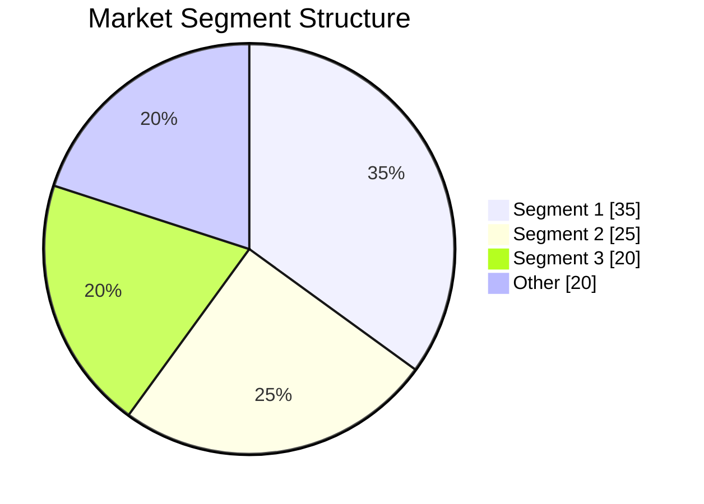
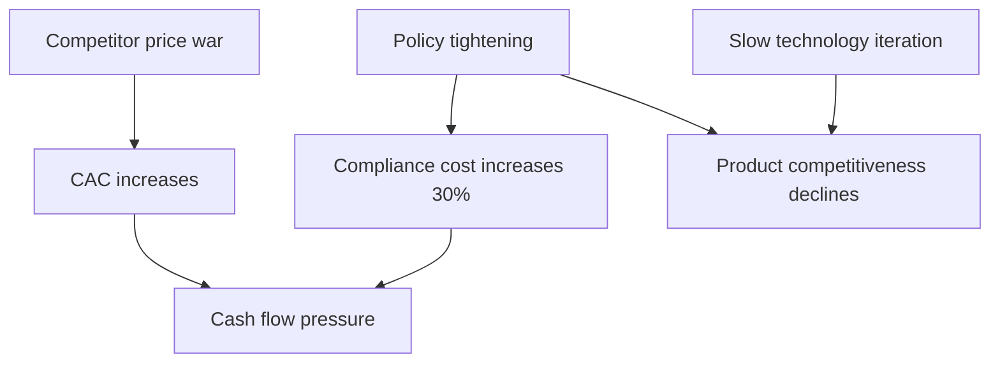

# [Product/System Name (English)] - Market Research Report

> **Document Status:** 🟡 Under Review / 🟢 Approved / 🔴 Rejected
>
> **Confidentiality Level:** Confidential / Internal Public / Public
>
> **Version:** v0.3.1
>
> **Date:** YYYY-MM-DD
>
> **Author:** [Name/Role]
>
> **Reviewer:** [Name/Role]
>
> **Audience:** [Role List]

---

## 0. Document Guide

### 0.1 Document Purpose and Scope

[Explain the purpose, applicable scenarios, and non-applicable scenarios of this document]

### 0.2 Related Documents

| Document Type | Filename | Related Sections |
|---------|--------|---------|
| [Type] | [Filename] [Line Range] | [Section Description] |

> **Reference Format Note**: Related documents use the `filename line range` format (e.g., `【Template】Technical Requirements Document(TRD).md 3-17`). Line numbers may change as documents are updated; please refer to actual content.

### 0.3 Change Log

| Version | Date | Reviser | Change Content | Reviewer |
| :--- | :--- | :--- | :--- | :--- |
| v0.1 | YYYY-MM-DD | [Name] | Initial draft | [Reviewer] |
| v0.2 | YYYY-MM-DD | [Name] | Added market size forecast and competitive landscape analysis | [Reviewer] |
| v0.3 | 2026-06-09 | Xie Dong | Fixed quadrantChart template to table format (Feishu incompatible) | — |
| v0.3.1 | 2026-06-09 | Xie Dong | Fixed xychart-beta chart to table for Feishu rendering compatibility | — |

---

## 1. Executive Summary

> **Executive Summary:** {Answer three questions in 3-5 sentences: ① Why conduct this market research? ② What are the 1-3 most core findings? ③ What actions are recommended? Unreaders should understand the report's value within 30 seconds after reading this section.}
>
> Example: This research aims to evaluate the market entry feasibility for AI travel planning. Core findings: Market size expected to reach ¥12 billion by 2026 (CAGR 35%), but user payment willingness only 12%; Top players Ctrip/Tongcheng occupy 60% share, but AI-native tools penetration rate among Gen Z has reached 28%. Recommendation: Enter with "free AI planning + transaction commission" model, first year focus on 25-30 year old tier-1 city users, avoid direct competition with OTAs.

---

## 2. Research Objectives and Scope

> **Goal of this chapter:** Clarify what decision questions this research aims to answer, select appropriate research design, avoid scope creep.

### 2.1 Research Purpose and Decision Scenarios

| Research Type | Purpose of This Research | Key Questions to Answer | Decision Impact | Target Readers |
|---------|---------|---------|---------|---------|
| {Market Entry/Product Positioning/Pricing Strategy/User Insights/Competitive Strategy/Technology Trends/Other} | {Specific description} | {1-2 core questions} | {Yes/No/Invest/Don't Invest/Adjust Direction} | {Executive/Product/Sales/Development} |

> **Goal-oriented Principle:** Different research purposes correspond to different research designs, sample strategies, and analysis frameworks. See Appendix 12.6 "Research Design Trimming Guide" for details.

### 2.2 Research Design Framework (Mixed Methods Design)

<!-- Select appropriate mixed research design based on research objectives -->

**Research design adopted for this research:** {Convergent Parallel Design / Explanatory Sequential Design / Exploratory Sequential Design / Embedded Mixed Design / Multi-phase Evaluation Design}

| Design Type | Quantitative Phase | Qualitative Phase | Integration Method | Applicable Scenario | Application in This Report |
|---------|---------|---------|---------|---------|-----------|
| **Convergent Parallel** | Collect simultaneously | Collect simultaneously | Parallel comparison/Data transformation | Need multi-angle verification of same issue | {Applied section} |
| **Explanatory Sequential** | Quantitative first | Qualitative after | Qualitative explains quantitative results | Need to understand "why" | {Applied section} |
| **Exploratory Sequential** | Qualitative first | Quantitative after | Qualitative develops quantitative tools | New field exploration, tool development | {Applied section} |
| **Embedded Mixed** | Embedded in dominant method | Auxiliary method | Auxiliary verification/Deepening | Main research needs supplementary evidence | {Applied section} |
| **Multi-phase Evaluation** | Multiple independent studies | Multiple independent studies | Diachronic evaluation | Long-term project evaluation | {Applied section} |

> **Design Selection Rationale:** {Explain why this design was chosen, e.g., "This field is a new market, first explore user pain points through qualitative interviews, then design questionnaires for large-scale verification"}.

### 2.3 Data Source System and Credibility Rating

| Layer | Source Type | Credibility | Typical Sources | Usage Standards | Application in This Report |
|------|---------|--------|---------|---------|-----------|
| **L1 Authoritative** | Government agencies/International organizations | ★★★★★ | {NBS/Ministry of Culture and Tourism/World Bank} | Direct citation, as baseline data | {Section} |
| **L2 Professional** | Industry associations/Top consulting firms | ★★★★ | {iResearch/Analysys/Frost & Sullivan} | Cite after cross-validation | {Section} |
| **L3 Academic** | Journal papers/Preprints/Dissertations | ★★★★ | {CNKI/ArXiv/Wanfang} | Note research sample and method limitations | {Section} |
| **L4 Media** | Mainstream financial/Industry media | ★★★ | {36Kr/Huxiu/TMTPost} | Need to trace original source before citing | {Section} |
| **L5 Enterprise** | Financial reports/Announcements/Official websites | ★★★ | {Listed company annual reports/Official statements} | Distinguish facts from forward-looking statements | {Section} |
| **L6 Primary** | Surveys/Interviews/Field observations | ★★★★ | {Own research data} | Note sample size, sampling method, time | {Section} |
| **L7 Other** | Social media/Forums/Reviews | ★★ | {Zhihu/Xiaohongshu/Weibo} | Only for trend perception, not as quantitative basis | {Section} |

> **Triangulation Principle:** Key decision data (L1 level) must be cross-validated by ≥2 independent sources; Supporting data (L2 level) requires at least 1 authoritative + 1 professional source.

### 2.4 Research Execution Plan and Quality Control

| Phase | Task | Method | Time | Key Outputs | Quality Checkpoint |
|------|------|------|------|---------|-----------|
| **Preparation** | Determine framework, Literature review | Desktop research | {X days} | Research outline, Literature map | Framework review passed |
| **Exploration** | Qualitative exploration, Hypothesis generation | {Interview/Focus group/Field observation} | {X days} | User pain point list, Preliminary hypotheses | Information saturation check |
| **Validation** | Quantitative validation, Scale estimation | {Survey/Secondary data analysis/Modeling} | {X days} | Validated data, Trend model | Reliability and validity test |
| **Deepening** | Qualitative deepening, Mechanism explanation | {In-depth interview/Case study} | {X days} | Behavioral motivation insight, Causal mechanism | Theoretical saturation check |
| **Integration** | Cross-validation, Report writing | Mixed analysis | {X days} | Report draft, Decision recommendations | Internal review |
| **Review** | Peer review, Revision and finalization | Expert validation | {X days} | Final report | Review comments closed-loop |

> **Quality Control Mechanisms:**
> 1. **Information Saturation:** Qualitative interviews continue until no new themes emerge (typically 15-30 people)
> 2. **Reliability and Validity Test:** Survey data must pass Cronbach's α (≥0.7) and factor analysis validation
> 3. **Reflexivity Recording:** Record researcher's role influence in interviews, avoid respondent迎合bias

### 2.5 Data Anomaly Handling Rules

| Anomaly Type | Identification Method | Handling Rule | Recording Location |
|---------|---------|---------|---------|
| **Source Conflict** | Multi-source data deviation >20% | Take confidence interval, mark as estimate; if deviation >50% then exclude | Appendix 12.1 |
| **Time Gap** | Inconsistent data cutoff dates | Uniformly mark data time point, cross-period data requires time standardization | Appendix 12.1 |
| **Caliber Difference** | Different statistical caliber/definitions | Clarify each source's statistical caliber, don't force merge | Appendix 12.1 |
| **Sample Bias** | Primary data sample structure imbalance | Weighted adjustment or note limitations, don't overstate representativeness | Appendix 12.1 |

**💡 So what:** {Implications of this chapter's findings for research design, e.g., "Due to this being a new market lacking L1-level official data, this report increases weight of L2-level industry reports and L6-level primary research data, adjusting conclusion confidence accordingly"}

---

## 3. Macro Environment Analysis (PESTLE + Industry Lifecycle)

> **Goal of this chapter:** Assess the industry's macro environment and lifecycle stage, determine market entry timing.

### 3.1 PESTLE Macro Environment Scan

<!-- Select dimensions based on industry characteristics, not all required -->

| Dimension | Current Status (Fact) | Trend (Next 6-12 months) | Impact on Industry | Impact Direction | Information Source |
|------|-----------|-------------------|-----------|---------|---------|
| **P Political** | {Status} | {Trend} | {Impact} | Favorable/Neutral/Unfavorable | {L1-L7} |
| **E Economic** | {Status} | {Trend} | {Impact} | Favorable/Neutral/Unfavorable | {L1-L7} |
| **S Social** | {Status} | {Trend} | {Impact} | Favorable/Neutral/Unfavorable | {L1-L7} |
| **T Technology** | {Status} | {Trend} | {Impact} | Favorable/Neutral/Unfavorable | {L1-L7} |
| **L Legal** | {Status} | {Trend} | {Impact} | Favorable/Neutral/Unfavorable | {L1-L7} |
| **E Environmental** | {Status} | {Trend} | {Impact} | Favorable/Neutral/Unfavorable | {L1-L7} |
| **D Demographic** | {Status} | {Trend} | {Impact} | Favorable/Neutral/Unfavorable | {L1-L7} |

> **DEPEST Extension:** Adds Demography and Ecology to PESTLE, select based on industry characteristics.

### 3.2 Industry Lifecycle Judgment

| Judgment Indicator | Current Status | Evidence | Stage Determination |
|---------|---------|------|---------|
| Market growth rate | {X%} | {Source} | {Introduction/Growth/Maturity/Decline} |
| Number of competitors | {Number} | {Source} | — |
| User education cost | {High/Medium/Low} | {Source} | — |
| Technology standardization level | {High/Medium/Low} | {Source} | — |
| Business model clarity | {High/Medium/Low} | {Source} | — |

**Lifecycle Curve Positioning:**

> **Note**: xychart-beta is not compatible with Feishu, converted to table description (template sample data).

**Industry Lifecycle Curve (Illustrative)**

| Phase | Market Size |
| :--- | :---: |
| Introduction | 10 |
| Growth | 40 |
| Maturity | 80 |
| Decline | 60 |

### 3.3 Industry Chain Structure Analysis

| Link | Representative Enterprise/Institution | Value Share | Bargaining Power | Technology Barrier | Concentration |
|------|-------------|---------|---------|---------|--------|
| Upstream-{Link 1} | {Enterprise} | {X%} | {High/Medium/Low} | {High/Medium/Low} | {CR3} |
| Midstream-{Link 1} | {Enterprise} | {X%} | {High/Medium/Low} | {High/Medium/Low} | {CR3} |
| Downstream-{Link 1} | {Enterprise} | {X%} | {High/Medium/Low} | {High/Medium/Low} | {CR3} |

> **Analysis Key Points:** Identify "chokepoint" links and high-profit links in the industry chain, determine our entry position.

**💡 So what:** {Macro environment insights, e.g., "Industry is in early growth stage, technology standardization is low but policy is favorable (L1 data), suitable for entry with technology differentiation; Upstream map API supplier concentration is high (CR3>80%), need to establish multi-supplier strategy to reduce dependency risk"}

---

## 4. Market Size and Trends

> **Goal of this chapter:** Quantify the market's current size and growth potential, establish forecast models and note uncertainties.

### 4.1 Overall Market Size

| Metric | Data | YoY Change | Data Source | Credibility | Data Time Point |
|------|------|---------|---------|--------|---------|
| {Current year} Market Size | {Amount/Quantity} | {±X%} | {Source} | {L1-L7} | {Date} |
| {Current year} Growth Rate | {X%} | — | {Source} | {L1-L7} | {Date} |
| Global/National Share | {X%} | — | {Source} | {L1-L7} | {Date} |
| Per Capita Consumption/Penetration Rate | {Data} | {±X%} | {Source} | {L1-L7} | {Date} |

**Core Judgment:** {One sentence summarizing the market's stage and core characteristics}

### 4.2 Historical Data and Growth Trends

| Year | Scale {Unit} | YoY Growth | Key Events/Drivers | Data Source |
|------|-----------|---------|------------------|---------|
| {Y-3} | {Data} | — | {Event} | {Source} |
| {Y-2} | {Data} | {±X%} | {Event} | {Source} |
| {Y-1} | {Data} | {±X%} | {Event} | {Source} |
| {Y} | {Data} | {±X%} | {Event} | {Source} |

> **Note**: xychart-beta is not compatible with Feishu, converted to table description (template sample data).

**Market Size Trend**

| Year | Unit: 100 million yuan |
| :--- | :---: |
| 2022 | 30 |
| 2023 | 45 |
| 2024 | 65 |
| 2025 | 85 |

**Cross-validation Record:** {Key data points}, {Source A} and {Source B} data consistent/deviation {X%}; {Another data point} cited from {Source C} {authoritative institution}, mutually corroborated with {Source D}. See Appendix 12.1 for details.

### 4.3 Market Segment Structure

| Segment | Market Size {Unit} | Share | Growth | Drivers | Data Source |
|---------|--------------|------|------|---------|---------|
| {Segment 1} | {Data} | {X%} | {X%} | {Factor} | {Source} |
| {Segment 2} | {Data} | {X%} | {X%} | {Factor} | {Source} |
| {Segment 3} | {Data} | {X%} | {X%} | {Factor} | {Source} |

### 4.4 Regional/Geographic Distribution

| Region | Scale {Unit} | Share | Growth | Penetration | Characteristics | Data Source |
|------|-----------|------|------|--------|------|---------|
| {Region 1} | {Data} | {X%} | {X%} | {X%} | {Characteristic} | {Source} |
| {Region 2} | {Data} | {X%} | {X%} | {X%} | {Characteristic} | {Source} |

### 4.5 Scale Forecast Model (Three Scenarios)

**Forecast Methodology:** {Clearly explain the forecast method used, e.g., "Based on CAGR extrapolation + Delphi expert method correction" or "Regression model (R²=0.92) + Scenario analysis"}

**Forecast Assumptions:**
- **Conservative Scenario:** {Assumption conditions, e.g., "Macroeconomic growth slows to 4%, industry regulation tightens"}
- **Baseline Scenario:** {Assumption conditions, e.g., "Macroeconomic growth maintains 5%, industry policy neutral"}
- **Optimistic Scenario:** {Assumption conditions, e.g., "AI technology breakthrough brings efficiency improvement, strong policy support"}

| Year | Conservative Forecast {Unit} | Baseline Forecast {Unit} | Optimistic Forecast {Unit} | CAGR (Baseline) | Key Assumption Changes |
|------|---------------|---------------|---------------|-------------|-------------|
| {Y+1} | {Data} | {Data} | {Data} | — | {Change} |
| {Y+3} | {Data} | {Data} | {Data} | {X%} | {Change} |
| {Y+5} | {Data} | {Data} | {Data} | {X%} | {Change} |

> **Note**: xychart-beta is not compatible with Feishu, converted to table description (template sample data).

**Market Size Forecast**

| Year | Unit: 100 million yuan (Baseline Forecast) |
| :--- | :---: |
| 2025 | 85 |
| 2026 | 95 |
| 2027 | 105 |
| 2028 | 115 |
| 2029 | 125 |
| 2030 | 135 |

### 4.6 Sensitivity Analysis

| Assumption Variable | Baseline Value | Change Range | Impact on {Y+3} Scale | Sensitivity |
|---------|--------|---------|----------------|--------|
| {Variable 1, e.g., GDP growth} | {X%} | {±X%} | {±Y billion yuan} | High/Medium/Low |
| {Variable 2, e.g., User payment rate} | {X%} | {±X%} | {±Y billion yuan} | High/Medium/Low |
| {Variable 3, e.g., CAC} | {¥X} | {±X%} | {±Y billion yuan} | High/Medium/Low |

**💡 So what:** {Market size insights, e.g., "Under baseline scenario, 2028 market size reaches ¥8 billion (CAGR 30%), but sensitivity analysis shows user payment rate is key variable (sensitivity: High), if payment rate below 8% market size may shrink 40%. Recommend first year focus on free model to build user base, second year explore paid conversion"}

---

## 5. Deep User Needs Insight

> **Goal of this chapter:** Go beyond surface personas, understand user behavioral motivations, decision logic and unmet needs.

### 5.1 Target User Segmentation (Based on Behavior, Not Demographics)

<!-- Modern user research emphasizes behavioral segmentation over demographic segmentation -->

| User Segment | Core Behavioral Characteristics | Share | Usage Frequency | Payment Willingness | Key Pain Points | Decision Path |
|-------------|-------------|------|---------|---------|---------|---------|
| {Segment A: e.g., "Planner User"} | {Behavior} | {X%} | {Frequency} | {High/Medium/Low} | {Pain Point} | {Path} |
| {Segment B: e.g., "Impulse User"} | {Behavior} | {X%} | {Frequency} | {High/Medium/Low} | {Pain Point} | {Path} |
| {Segment C: e.g., "Price Sensitive"} | {Behavior} | {X%} | {Frequency} | {High/Medium/Low} | {Pain Point} | {Path} |

> **Segmentation Method:** Based on usage scenarios, behavioral frequency, payment willingness and other behavioral variables, not just age/gender.

### 5.2 JTBD (Jobs-to-be-Done) Analysis

<!-- Users don't buy products, they "hire" them to do "jobs" -->

| User Segment | Core Job (Job to be Done) | Current Solution | Pain Points/Friction | Ideal Outcome | Our Opportunity |
|-------------|----------------------|------------|----------|---------|---------|
| {Segment A} | {e.g., "Plan a trip without pitfalls"} | {e.g., "Xiaohongshu + Excel"} | {e.g., "Scattered information, takes 3 days"} | {e.g., "Generate reliable itinerary in 30 minutes"} | {Large/Medium/Small} |
| {Segment B} | {Job} | {Solution} | {Pain Point} | {Ideal Outcome} | {Opportunity} |

> **JTBD Principle:** Users don't "buy travel apps", they "complete the job of travel planning". Understanding the Job reveals true substitutes and opportunities.

### 5.3 User Journey and Touchpoint Analysis

| Phase | User Behavior | Key Touchpoints | Emotion Curve | Pain Point | Opportunity Point | Data Source |
|------|---------|--------|---------|------|--------|---------|
| Awareness | {Behavior} | {Touchpoint} | {High/Medium/Low} | {Pain Point} | {Opportunity} | {L6 Interview/Survey} |
| Consideration | {Behavior} | {Touchpoint} | {High/Medium/Low} | {Pain Point} | {Opportunity} | {L6 Interview/Survey} |
| Decision | {Behavior} | {Touchpoint} | {High/Medium/Low} | {Pain Point} | {Opportunity} | {L6 Interview/Survey} |
| Usage | {Behavior} | {Touchpoint} | {High/Medium/Low} | {Pain Point} | {Opportunity} | {L6 Interview/Survey} |
| Referral/Repurchase | {Behavior} | {Touchpoint} | {High/Medium/Low} | {Pain Point} | {Opportunity} | {L6 Interview/Survey} |

### 5.4 Need Layering (KANO Model)

| Need | KANO Type | User Mention Frequency | Competitor Satisfaction | Our Satisfaction | Priority | Implementation Difficulty |
|------|---------|------------|-----------|-----------|--------|---------|
| {Need 1: e.g., "Basic map function"} | {Basic} | {X%} | {High} | {High} | {P1} | {Low} |
| {Need 2: e.g., "AI smart planning"} | {Expected} | {X%} | {Medium} | {Medium} | {P0} | {Medium} |
| {Need 3: e.g., "Offline maps"} | {Attractive} | {X%} | {Low} | {None} | {P0} | {Medium} |
| {Need 4: e.g., "AR navigation"} | {Attractive} | {X%} | {None} | {None} | {P2} | {High} |

> **Note**: This quadrant chart template has been converted to table description.

| Quadrant | Area Characteristics | Strategy Suggestions |
| :--- | :--- | :--- |
| Quadrant 1 (High Value · Low Difficulty) | Strategic Investment | Prioritize resource investment, Rapid implementation |
| Quadrant 2 (High Value · High Difficulty) | Quick Wins | Rapid validation, Strive for early results |
| Quadrant 3 (Low Value · High Difficulty) | Fill-ins | Mainly fill gaps, Avoid over-investment |
| Quadrant 4 (Low Value · Low Difficulty) | Avoid | No investment for now, Observe changes |

| Name | X Value | Y Value | Quadrant |
| :--- | :---: | :---: | :--- |
| Need 1 | 0.7 | 0.8 | Quadrant 1 (Strategic Investment) |
| Need 2 | 0.3 | 0.2 | Quadrant 4 (Avoid) |
| Need 3 | 0.5 | 0.6 | Quadrant 1 (Strategic Investment) |

### 5.5 Consumer Behavior Data

| Behavioral Metric | Data | YoY Change | User Segment Difference | Data Source |
|---------|------|---------|----------------|---------|
| {Metric 1, e.g., Per capita spending} | {Data} | {±X%} | {A:¥X, B:¥Y} | {Source} |
| {Metric 2, e.g., Decision cycle} | {Data} | {±X%} | {A:X days, B:Y days} | {Source} |
| {Metric 3, e.g., Repurchase rate} | {Data} | {±X%} | {A:X%, B:Y%} | {Source} |
| {Metric 4, e.g., Referral willingness NPS} | {Data} | {±X%} | {A:X, B:Y} | {Source} |

### 5.6 Pain Points and Unmet Needs (Layered Review Method)

<!-- If primary user feedback data available, use layered analysis method -->

| Pain Point Layer | Specific Description | Affected Segment | Frequency/Intensity | Current Solution Gap | Our Product Opportunity | Evidence Source |
|---------|---------|--------------|----------|----------------|-------------|---------|
| **Deal-breaker** (Reason for abandonment) | {e.g., "AI planned route unreasonable, poor travel experience"} | {Segment} | {X%} | {Gap} | {Large/Medium/Small} | {L6 Interview/L7 Review} |
| **Frustration** (Usage friction) | {e.g., "Need to re-enter preferences every time re-planning"} | {Segment} | {X%} | {Gap} | {Large/Medium/Small} | {L6/L7} |
| **Unmet Need** (Latent demand) | {e.g., "Want to see friends/influencers' real itineraries"} | {Segment} | {X%} | {Gap} | {Large/Medium/Small} | {L6/L7} |

> **Layering Principle:** Deal-breakers cause user churn, must be resolved; Frustrations affect experience, prioritize optimization; Unmet Needs are differentiation opportunities.

**💡 So what:** {User insight conclusions, e.g., "JTBD analysis shows users' core Job is 'avoid pitfalls' not 'planning', current substitutes are Xiaohongshu + Excel combination, indicating we should strengthen UGC real reviews + AI planning combination; KANO model shows 'offline maps' is attractive need with medium implementation difficulty, recommend as differentiation highlight for priority launch"}

---

## 6. Deep Competitive Landscape Analysis

> **Goal of this chapter:** Quantify competitive intensity, identify strategic groups, assess entry barriers.

### 6.1 Market Concentration and Competitive Intensity

| Metric | Data | Description | Source |
|------|------|------|------|
| CR3 | {X%} | {Concentrated/Dispersed} | {Source} |
| CR5 | {X%} | — | {Source} |
| HHI Index | {Value} | {>2500 High concentration/1500-2500 Medium/<1500 Dispersed} | {Calculation} |
| Total Market Participants | {Number} | — | {Source} |
| New Entrants (Last 12 months) | {Number} | — | {Source} |
| Exits (Last 12 months) | {Number} | — | {Source} |

**Competitive Landscape Judgment:** {Based on CR3/HHI determine whether it's perfect competition/oligopoly/monopolistic competition/monopoly, and explain impact on entrants}

### 6.2 Strategic Group Analysis

<!-- Group competitors by strategic similarity, not simple ranking -->

| Strategic Group | Representative Enterprise | Core Strategy | Target Users | Key Resources | Advantage | Weakness | Threat Level |
|---------|---------|---------|---------|---------|------|------|---------|
| {Group A: e.g., "OTA Platforms"} | {Ctrip/Tongcheng} | {Transaction commission} | {Mass market} | {Supply chain/Traffic} | {Scale} | {Slow innovation} | {High} |
| {Group B: e.g., "AI-native Tools"} | {Competitor A/Competitor B} | {Subscription model} | {Young users} | {AI technology} | {Fast innovation} | {Limited funding} | {Medium} |
| {Group C: e.g., "Strategy Communities"} | {Xiaohongshu/Mafengwo} | {Advertising+Transaction} | {Content consumers} | {UGC content} | {Rich content} | {Weak tools} | {Medium} |

> **Strategic Group Significance:** Competition is most intense within the same group, cooperation or substitution may exist between different groups.

### 6.3 Core Competitor Profiles

| Enterprise/Brand | Market Share | Core Advantage | Main Products/Services | Competitive Strategy | Recent Dynamics | Source |
|----------|---------|---------|-------------|---------|---------|------|
| {Enterprise 1} | {X%} | {Advantage} | {Product} | {Strategy} | {Dynamics} | {Source} |
| {Enterprise 2} | {X%} | {Advantage} | {Product} | {Strategy} | {Dynamics} | {Source} |

### 6.4 Porter's Five Forces Model

| Competitive Force | Intensity | Key Observation | Trend (6 months) | Impact on Us |
|---------|------|---------|-------------|-----------|
| Existing Rivalry | {High/Medium/Low} | {Observation} | {Strengthen/Weaken/Flat} | {Impact} |
| Threat of New Entrants | {High/Medium/Low} | {Observation} | {Trend} | {Impact} |
| Threat of Substitutes | {High/Medium/Low} | {Observation} | {Trend} | {Impact} |
| Supplier Bargaining Power | {High/Medium/Low} | {Observation} | {Trend} | {Impact} |
| Buyer Bargaining Power | {High/Medium/Low} | {Observation} | {Trend} | {Impact} |

### 6.5 Competitive Positioning Matrix

> **Note**: This quadrant chart template has been converted to table description.

| Quadrant | Area Characteristics | Strategy Suggestions |
| :--- | :--- | :--- |
| Quadrant 1 (High Influence · High Growth) | Leader | Consolidate position, Continue innovation |
| Quadrant 2 (Low Influence · High Growth) | Challenger | Find breakthrough point, Differentiated competition |
| Quadrant 3 (Low Influence · Low Growth) | Follower | Follow mainly, Control costs |
| Quadrant 4 (High Influence · Low Growth) | Niche Player | Deep dive vertical field, Focus on profits |

| Name | X Value | Y Value | Quadrant |
| :--- | :---: | :---: | :--- |
| Enterprise 1 | 0.8 | 0.7 | Quadrant 1 (Leader) |
| Enterprise 2 | 0.4 | 0.8 | Quadrant 2 (Challenger) |
| Us | 0.3 | 0.5 | Quadrant 2 (Challenger) |

### 6.6 Competitive Response Simulation (New)

<!-- Predict competitors' possible reactions after our entry -->

| Our Action | Most Likely Responding Competitor | Predicted Reaction | Reaction Intensity | Our Response Plan |
|---------|----------------|---------|---------|------------|
| {Action 1: e.g., "Launch free AI planning"} | {Competitor A} | {e.g., "Launch similar feature within 1 month"} | {High/Medium/Low} | {Plan} |
| {Action 2: e.g., "Price at ¥19/month"} | {Competitor B} | {e.g., "Drop price to ¥15 or launch free version"} | {High/Medium/Low} | {Plan} |

> **Game Theory Perspective:** Infer most likely reactions based on competitors' historical behavior patterns (e.g., "Competitor A historically reacts quickly to price wars").

**💡 So what:** {Competitive landscape insights, e.g., "Market is monopolistic competition (HHI=1800), CR3=60% but user switching cost is low; Strategic group analysis shows OTA group (Ctrip/Tongcheng) and AI-native tool group have low target user overlap, we should avoid OTA core user group and focus on 25-30 year old AI-native users; Competitive response simulation shows if we price below ¥20, Competitor B may follow price war, recommend 'free + value-added' model to avoid direct price competition"}

---

## 7. Policy and Compliance Environment

> **Goal of this chapter:** Identify policy constraints and opportunities, assess compliance costs.

### 7.1 Current Policy Review

| Policy/Regulation | Issuing Authority | Issuance Time | Core Content | Compliance Requirements | Impact on Industry | Source |
|----------|---------|---------|---------|---------|-----------|------|
| {Policy 1} | {Authority} | {Date} | {Content} | {Requirements} | {Impact} | {L1} |
| {Policy 2} | {Authority} | {Date} | {Content} | {Requirements} | {Impact} | {L1} |

### 7.2 Policy Trends and Expectations

| Trend Direction | Expected Timeline | Impact Scope | Impact Level | Our Response |
|---------|-----------|---------|---------|---------|
| {Direction 1} | {Time} | {Scope} | {High/Medium/Low} | {Response} |
| {Direction 2} | {Time} | {Scope} | {High/Medium/Low} | {Response} |

### 7.3 International Comparison (If Applicable)

| Country/Region | Policy Measures | Implementation Effect | Lessons for China | Source |
|----------|---------|---------|-----------|------|
| {Country 1} | {Measures} | {Effect} | {Lessons} | {Source} |
| {Country 2} | {Measures} | {Effect} | {Lessons} | {Source} |

### 7.4 Compliance Cost Assessment

| Compliance Dimension | Current Cost | Expected Change | Cost Share | Source |
|---------|---------|---------|---------|------|
| {e.g., Data compliance} | {¥X/year} | {±X%} | {X%} | {Source} |
| {e.g., Content review} | {¥X/year} | {±X%} | {X%} | {Source} |

**💡 So what:** {Policy insights, e.g., "'Interim Measures for Generative AI Services Management' requires AI-generated content to be labeled, expected to increase 5-8% compliance costs; but policy also explicitly supports AI+tourism integration applications, favorable for long-term development. Recommend reserving ¥X million/year compliance budget, prioritize applying for relevant qualifications"}

---

## 8. Development Trends and Technology Drivers

> **Goal of this chapter:** Identify short-to-medium term trends and technology variables, assess impact on our product.

### 8.1 Short-term Trends (1-2 Years)

| Trend | Drivers | Impact Level | Data Support | Our Opportunity/Threat | Source |
|------|---------|---------|---------|-------------|------|
| {Trend 1} | {Factor} | {High/Medium/Low} | {Data} | {Opportunity/Threat} | {Source} |
| {Trend 2} | {Factor} | {High/Medium/Low} | {Data} | {Opportunity/Threat} | {Source} |

### 8.2 Medium-term Trends (3-5 Years)

| Trend | Drivers | Forecast Basis | Confidence | Our Preparation | Source |
|------|---------|---------|--------|---------|------|
| {Trend 1} | {Factor} | {Basis} | {High/Medium/Low} | {Preparation} | {Source} |
| {Trend 2} | {Factor} | {Basis} | {High/Medium/Low} | {Preparation} | {Source} |

### 8.3 Technology Maturity Curve (Hype Cycle)

<!-- Assess key technologies' maturity and adoption timeline -->

| Technology | Current Stage | Time to Maturity | Impact on Us | Investment Recommendation |
|------|---------|--------------|-----------|---------|
| {e.g., Large model itinerary planning} | {Inflated Expectations} | {2-3 years} | {High} | {Pilot investment} |
| {e.g., AR real-scene navigation} | {Innovation Trigger} | {5-10 years} | {Medium} | {Track and observe} |
| {e.g., Multimodal AI} | {Slope of Enlightenment} | {1-2 years} | {High} | {Key investment} |

> **Note**: xychart-beta is not compatible with Feishu, converted to table description (template sample data).

**Technology Maturity Curve (Illustrative)**

| Phase | Technology Attention |
| :--- | :---: |
| Innovation Trigger | 10 |
| Peak of Inflated Expectations | 90 |
| Trough of Disillusionment | 20 |
| Slope of Enlightenment | 50 |
| Plateau of Productivity | 80 |

**💡 So what:** {Trend insights, e.g., "Large model itinerary planning is in inflated expectations phase, will undergo reshuffling within 2 years, currently is the window to build technology barriers; AR navigation is still in innovation trigger phase, not recommended for early investment"}

---

## 9. Market Opportunity Assessment

> **Goal of this chapter:** Based on preceding analysis, identify and quantify actionable market opportunities.

### 9.1 Opportunity List

| Opportunity Area | Target Segment | Product/Service Direction | TAM{Unit} | SAM{Unit} | SOM{Unit} | Entry Barrier | Window Period | Source |
|---------|------------|--------------|----------|----------|----------|---------|--------|------|
| {Area 1} | {Segment} | {Direction} | {Data} | {Data} | {Data} | {High/Medium/Low} | {X months} | {Source} |
| {Area 2} | {Segment} | {Direction} | {Data} | {Data} | {Data} | {High/Medium/Low} | {X months} | {Source} |

> **TAM/SAM/SOM:** Total Addressable Market / Serviceable Addressable Market / Serviceable Obtainable Market.

### 9.2 Opportunity Priority Matrix

> **Note**: This quadrant chart template has been converted to table description.

| Quadrant | Area Characteristics | Strategy Suggestions |
| :--- | :--- | :--- |
| Quadrant 1 (High Attractiveness · High Competitiveness) | Star Opportunity | Priority investment, Seize first-mover advantage |
| Quadrant 2 (Low Attractiveness · High Competitiveness) | Question Opportunity | Assess conversion possibility, Selective investment |
| Quadrant 3 (Low Attractiveness · Low Competitiveness) | Marginal Opportunity | Abandon or low-resource maintenance |
| Quadrant 4 (High Attractiveness · Low Competitiveness) | Cash Cow Opportunity | Quick monetization, Supplement cash flow |

| Name | X Value | Y Value | Quadrant |
| :--- | :---: | :---: | :--- |
| Opportunity 1 | 0.8 | 0.7 | Quadrant 1 (Star Opportunity) |
| Opportunity 2 | 0.4 | 0.3 | Quadrant 3 (Marginal Opportunity) |
| Opportunity 3 | 0.6 | 0.5 | Quadrant 1 (Star Opportunity) |

### 9.3 Typical Case Studies

**Case 1: {Enterprise/Project Name}**

| Dimension | Content |
|------|------|
| Background | {Description} |
| Strategy | {Description} |
| Results | {Key Data} |
| Key Success Factors | {Factor} |
| Replicability | {High/Medium/Low} |
| Implications for Us | {Implications} |
| Source | {Source} |

**Case 2: {Enterprise/Project Name}**

| Dimension | Content |
|------|------|
| Background | {Description} |
| Strategy | {Description} |
| Results | {Key Data} |
| Key Success Factors | {Factor} |
| Replicability | {High/Medium/Low} |
| Implications for Us | {Implications} |
| Source | {Source} |

**💡 So what:** {Opportunity assessment conclusions, e.g., "Opportunity 1 (AI planning + transaction commission) is in cash cow quadrant, market attractiveness is high and our technical competitiveness is strong, recommend as first year main attack direction; Opportunity 2 (Enterprise SaaS) although TAM is large but entry barrier is high, recommend evaluating again in second year"}

---

## 10. Risk Analysis and Stress Testing

> **Goal of this chapter:** Identify key risks, assess probability and impact, develop response plans.

### 10.1 Risk List and Assessment

| Risk Category | Specific Description | Probability | Impact | Risk Level | Warning Signal | Response Strategy | Owner |
|---------|---------|---------|---------|---------|---------|---------|--------|
| {Policy Risk} | {Description} | {High/Medium/Low} | {High/Medium/Low} | **{Level}** | {Signal} | {Strategy} | {Name} |
| {Market Risk} | {Description} | {High/Medium/Low} | {High/Medium/Low} | **{Level}** | {Signal} | {Strategy} | {Name} |
| {Technology Risk} | {Description} | {High/Medium/Low} | {High/Medium/Low} | **{Level}** | {Signal} | {Strategy} | {Name} |
| {Competitive Risk} | {Description} | {High/Medium/Low} | {High/Medium/Low} | **{Level}** | {Signal} | {Strategy} | {Name} |
| {Operations Risk} | {Description} | {High/Medium/Low} | {High/Medium/Low} | **{Level}** | {Signal} | {Strategy} | {Name} |

> **Risk Level** = Probability × Impact: High (must develop plan), Medium (needs monitoring), Low (record and track)

### 10.2 Risk Correlation and Transmission Analysis

### 10.3 Stress Test Scenarios

| Stress Scenario | Trigger Condition | Impact on Core Metrics | Our Tolerance Threshold | Trigger Action |
|---------|---------|--------------|------------|---------|
| {Scenario 1: e.g., "Competitor free strategy"} | {Condition} | {User growth -50%} | {Can tolerate 3 months} | {Activate subsidy plan} |
| {Scenario 2: e.g., "Regulator halts AI generation"} | {Condition} | {Revenue zero} | {Cannot tolerate} | {Immediately switch to manual mode} |

### 10.4 Black Swan Event Warning

| Event | Trigger Condition | Potential Impact | Warning Signal | Our Readiness |
|------|---------|---------|---------|-----------|
| {Event 1} | {Condition} | {Impact} | {Signal} | {High/Medium/Low} |
| {Event 2} | {Condition} | {Impact} | {Signal} | {High/Medium/Low} |

**💡 So what:** {Risk insights, e.g., "Biggest risk is competitor price war (probability: Medium, impact: High), our tolerance threshold is 3 months, recommend reserving 6 months operating capital; Slow technology iteration is secondary risk, can reduce dependency through open-source models + self-developed fine-tuning"}

---

## 11. Conclusions and Action Recommendations

> **Goal of this chapter:** Integrate all analysis, form actionable strategic decisions.

### 11.1 Core Conclusions (Numbered List, For Unreaders)

1. **{Conclusion 1}**: {Concise description, with key data}. {Reference section}
2. **{Conclusion 2}**: {Concise description, with key data}. {Reference section}
3. **{Conclusion 3}**: {Concise description, with key data}. {Reference section}

### 11.2 Strategic Recommendations and Priorities

| Priority | Recommendation | Expected Effect | Implementation Cycle | Resource Investment | Key Assumptions | Risk |
|--------|------|---------|---------|---------|---------|------|
| **P0** | {Recommendation 1} | {Effect} | {Cycle} | {Investment} | {Assumptions} | {Risk} |
| **P0** | {Recommendation 2} | {Effect} | {Cycle} | {Investment} | {Assumptions} | {Risk} |
| **P1** | {Recommendation 3} | {Effect} | {Cycle} | {Investment} | {Assumptions} | {Risk} |
| **P2** | {Recommendation 4} | {Effect} | {Cycle} | {Investment} | {Assumptions} | {Risk} |

### 11.3 Decision Commitment

> **Based on this report, the team decides to complete the following by {YYYY-MM-DD}:**
> 1. {Decision 1, e.g., "Determine first year main attack Segment A, product MVP focuses on AI planning + UGC reviews"}
> 2. {Decision 2, e.g., "Launch ¥X million budget 6-month market validation project, target acquiring 10,000 seed users"}
> 3. {Decision 3, e.g., "Establish competitive monitoring mechanism, update competitive landscape monthly"}
>
> **If the above decisions are not executed, the next market research will review reasons and re-evaluate assumptions.**

### 11.4 Report Limitations Statement

- **Data Limitations:** {Describe limitations in data coverage scope, time boundaries}
- **Method Limitations:** {Describe limitations of the analysis method itself, e.g., "Qualitative interview sample concentrated in tier-1 cities, tier-2/3 city user behavior may differ"}
- **Forecast Limitations:** {Describe sources of forecast uncertainty, e.g., "Baseline scenario assumes AI technology develops at current pace, if technology breakthrough occurs forecast may become invalid"}

### 11.5 Follow-up Research Directions

- {Direction 1}: {Explain why further research is needed, e.g., "Tier-2/3 city user travel planning behavior needs specialized research"}
- {Direction 2}: {Explain why further research is needed, e.g., "Quantitative verification needed for churn reasons at each stage of paid conversion funnel"}

---

## 12. Appendix

### 12.1 Data Cross-validation Records

<!-- All L1 and L2 data verification processes must be recorded here -->

| Data Point | Primary Source | Verification Source | Verification Result | Deviation Handling | Notes |
|--------|---------|---------|---------|---------|------|
| {Data Point 1} | {Source A} | {Source B} | Consistent/Deviation {X%} | {Handling} | {Description} |
| {Data Point 2} | {Source A} | {Source B} | Consistent/Deviation {X%} | {Handling} | {Description} |

### 12.2 Glossary

| Term | Definition | First Appearance Section |
|------|------|------------|
| TAM/SAM/SOM | Total/Serviceable Addressable/Obtainable Market | Chapter 9 |
| JTBD | Jobs-to-be-Done, Jobs users need to complete | Chapter 5 |
| HHI | Herfindahl-Hirschman Index, Market concentration index | Chapter 6 |
| CAGR | Compound Annual Growth Rate | Chapter 4 |
| {Term 1} | {Definition} | {Section} |

### 12.3 Research Method Detailed Explanation

#### 12.3.1 Quantitative Research

- **Sample Design:** {Target sample size, sampling method (random/stratified/convenience), sample structure}
- **Data Collection:** {Survey platform, distribution channels, collection time}
- **Analysis Methods:** {Descriptive statistics, Cross-tabulation, Regression analysis, etc.}
- **Reliability and Validity:** {Cronbach's α value, Factor analysis results, KMO value}

#### 12.3.2 Qualitative Research

- **Interview Design:** {Semi-structured/structured/unstructured, Interview outline core questions}
- **Sample Selection:** {Purposive sampling/Theoretical sampling, Sample size, Selection criteria}
- **Analysis Methods:** {Thematic analysis/Grounded theory/Content analysis, Coding strategy, Software tools}
- **Reflexivity Recording:** {Researcher role, Potential biases, Impact on data}

#### 12.3.3 Mixed Methods Integration

- **Integration Strategy:** {Convergent/Explanatory/Exploratory/Embedded/Multi-phase}
- **Integration Points:** {At which phase data integration and result comparison occurs}
- **Meta-inference:** {Comprehensive conclusions from quantitative and qualitative results}

### 12.4 Interview Record Summary (If Applicable)

| No. | Interviewee Role | Date | Core Viewpoints | Used in Section | Key Quotes |
|------|-----------|------|---------|---------|---------|
| I-01 | {Role} | {Date} | {Viewpoint} | {Section} | {Quote} |
| I-02 | {Role} | {Date} | {Viewpoint} | {Section} | {Quote} |

### 12.5 Continuous Intelligence Update Plan

> Market research is not a one-time document, but part of a continuous intelligence cycle.

| Module | Monitoring Metric | Frequency | Owner | Next Update | Information Source |
|------|---------|------|--------|---------|--------|
| Market Size | {Scale/Growth} | {Quarterly} | {Name} | {Date} | {L1/L2 Source} |
| Competitive Landscape | {CR3/New Entrants} | {Monthly} | {Name} | {Date} | {L2/L5 Source} |
| User Feedback | {NPS/Pain point changes} | {Monthly} | {Name} | {Date} | {L6/L7 Source} |
| Policy Dynamics | {New regulations/Draft for comments} | {Weekly} | {Name} | {Date} | {L1 Source} |
| Technology Trends | {New technology/Patents} | {Quarterly} | {Name} | {Date} | {L3/L4 Source} |

**Events triggering immediate update:**
- Market size growth deviates >20% from forecast
- Top competitor announces major strategic adjustment
- Key policy issued or draft for comments released
- Technology breakthrough (e.g., large model capability leap)
- Black swan event occurs

### 12.6 Research Design Trimming Guide

| Research Type | Required Sections | Optional Sections | Can Delete/Simplify | Recommended Duration | Core Output |
|---------|---------|---------|-----------|---------|---------|
| **Market Entry Decision** | Summary, 1, 2, 3, 5, 8, 9, 10 | 4, 6, 7 | — | ≤5 days | Entry strategy/No entry |
| **Product Positioning** | Summary, 1, 4, 5, 8, 10 | 2, 3, 6, 7 | 9 (simplified) | ≤3 days | Positioning plan |
| **Pricing Strategy** | Summary, 1, 3 (3.5+3.6), 4 (4.5), 8, 10 | 2, 5, 6 | 7 | ≤2 days | Pricing plan |
| **User Insights** | Summary, 1, 4, 5 (5.1+5.2), 10 | 2, 3 | 6, 7, 8, 9 | ≤3 days | User persona/Requirement list |
| **Competitive Strategy** | Summary, 1, 5, 8, 9, 10 | 2, 3, 4 | 6, 7 | ≤3 days | Competitive strategy |
| **Technology Trends** | Summary, 1, 2, 7, 8, 10 | 3, 4 | 5, 6, 9 | ≤2 days | Technology roadmap |
| **Comprehensive Research** | All sections | — | — | ≤10 days | Complete strategic report |

### 12.7 Quality Checklist (Pre-publish Self-check)

- [ ] Executive summary allows unreaders to understand core conclusions within 30 seconds
- [ ] Each chapter ends with "So what" answering "what does this mean for us"
- [ ] Research design clearly selects mixed methods type and explains rationale
- [ ] Data sources rated L1-L7, key data has cross-validation records
- [ ] Market size forecast clearly notes methodology, assumptions and three scenarios
- [ ] User segmentation based on behavior, not just demographics
- [ ] JTBD analysis identifies true substitutes (not just direct competitors)
- [ ] KANO model distinguishes basic/expected/attractive needs
- [ ] Competitive analysis includes strategic groups and competitive response simulation
- [ ] Risk list includes warning signals and owners
- [ ] Stress test defines trigger conditions and tolerance thresholds
- [ ] Report ends with "Decision Commitment", clearly stating what to do differently
- [ ] Continuous intelligence update plan established, including trigger events
- [ ] Limitations statement honestly discloses data and method shortcomings
- [ ] All subjective judgments (e.g., "market is large") have data support or are clearly marked as assumptions

---

> **Document Approval Sign-off**
>
> | Role | Signature | Date | Comments |
> | :--- | :--- | :--- | :--- |
> | Product Lead | | | |
> | Technical Lead | | | |
> | Operations Lead | | | |
> | Finance Lead | | | |
> | CEO / Decision Maker | | | |