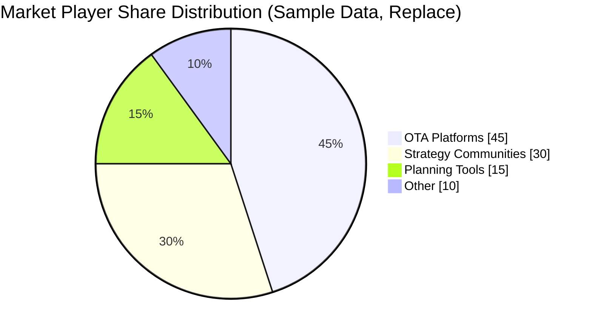

# [Product/System Name (English)] - Competitive Analysis Report

> **Document Status:** 🟡 Under Review / 🟢 Approved / 🔴 Rejected
>
> **Confidentiality Level:** Confidential / Internal Public / Public
>
> **Version:** v0.3
>
> **Date:** YYYY-MM-DD
>
> **Author:** [Name/Role]
>
> **Reviewer:** [Name/Role]
>
> **Audience:** [Role List]

---

## 0. Document Guide

### 0.1 Document Purpose and Scope

[Explain the purpose, applicable scenarios, and non-applicable scenarios of this document]

### 0.2 Related Documents

| Document Type | Filename | Related Sections |
|---------|--------|---------|
| [Type] | [Filename] [Line Range] | [Section Description] |

> **Reference Format Note**: Related documents use the `filename line range` format (e.g., `【Template】Technical Requirements Document(TRD).md 3-17`). Line numbers may change as documents are updated; please refer to actual content.

### 0.3 Change Log

| Version | Date | Reviser | Change Content | Reviewer |
| :--- | :--- | :--- | :--- | :--- |
| v0.1 | YYYY-MM-DD | [Name] | Initial draft | [Reviewer] |
| v0.2 | YYYY-MM-DD | [Name] | Added $APPEALS analysis and strategic canvas | [Reviewer] |
| v0.3 | 2026-06-09 | Xie Dong | Fixed quadrantChart template to table format (Feishu incompatible) | — |

---

## 1. Executive Summary

> {Answer three questions in 3-5 sentences: ① Why conduct this competitive analysis? ② What are the 1-3 most core findings? ③ What actions are recommended? Unreaders should understand the report's value within 30 seconds after reading this section.}
>
> Example: This analysis aims to provide basis for Q3 product pricing strategy. Core findings: Competitor A uses subscription model (¥29/month) but user churn rate is as high as 40%, Competitor B uses transaction commission model (3%) with higher user acceptance; Our current feature coverage has reached 80% of competitors, with room for price increase. Recommendation: Adopt "Basic free + Value-added subscription" model, set subscription price at ¥19/month, complete AB testing before launch.

---

## 2. Analysis Objectives and Scope

> **Goal of this chapter:** Clarify what decision questions this analysis aims to answer, avoid analysis scope creep. Analysis objectives determine the selection and depth of subsequent chapters.

### 2.1 Analysis Purpose and Decision Scenarios

| Analysis Type | Purpose of This Analysis | Key Questions to Answer | Impact Department |
| --- | --- | --- | --- |
| {Project Initiation/Feature Iteration/Pricing Strategy/Market Capture/Sales Enablement/Technology Selection/Other} | {Specific description} | {1-2 core questions, e.g., "Are users willing to pay for AI planning?"} | {Product/Sales/Development/Executive} |

> **Goal-oriented Principle:** Different purposes correspond to different chapter depth and framework combinations. See Appendix 10.7 "Template Trimming Guide" for details.

### 2.2 Competitor Identification and Classification

<!-- Competitor identification is not just product comparison, also includes alternatives and future potential entrants -->

| Type | Product Name | Company | Selection Reason | Analysis Priority | Information Credibility | Monitoring Frequency |
| -------------- | -------- | -------- | ---------------------- | ---------- | ---------- | ----------- |
| **Direct Competitor** | {Name} | {Company} | {Highly similar functional positioning} | P0 | {High/Medium/Low} | {Weekly/Monthly} |
| **Direct Competitor** | {Name} | {Company} | {Reason} | P0 | {High/Medium/Low} | {Frequency} |
| **Indirect Competitor** | {Name} | {Company} | {Different product, same need} | P1 | {High/Medium/Low} | {Frequency} |
| **Alternative** | {Name} | {Company} | {e.g., Excel/Manual solution alternative} | P1 | {High/Medium/Low} | {Frequency} |
| **Potential Entrant** | {Name} | {Company} | {May enter this track} | P2 | {High/Medium/Low} | {Quarterly} |

> **Identification Methods:** ① App store category ranking ② Sales team feedback "who else are customers comparing" ③ User interview "if not choosing us, who would you choose" ④ Tianyancha/IT Juzi to check similar funded companies

### 2.3 Analysis Dimensions and Framework Selection

| Dimension | Analyze? | Framework Adopted | Data Source | Acquisition Time | Credibility |
| -------- | -------- | ------------------- | ------------------------ | -------- | ---------- |
| Macro Environment | {Yes/No} | PEST / Porter's Five Forces | {Industry reports/Policy documents} | {Date} | {High/Medium/Low} |
| Organizational Profile | {Yes/No} | Company dimension indicators | {Tianyancha/Job sites/Official website} | {Date} | {High/Medium/Low} |
| Positioning Strategy | {Yes/No} | Perceptual Mapping / Strategic Canvas | {Official website/App store/Promotional materials} | {Date} | {High/Medium/Low} |
| Core Capabilities | {Yes/No} | $APPEALS / Feature Matrix | {Actual experience/App store} | {Date} | {High/Medium/Low} |
| Business Model | {Yes/No} | Business Model Canvas | {Official pricing page/In-app} | {Date} | {Medium/Low} |
| User Feedback | {Yes/No} | Layered Review Method / Kano | {App Store/G2/Survey} | {Date} | {High} |

> **Framework Selection Principle:** Don't need to use all methods, select based on analysis objectives.

**💡 So what:** {Implications of this chapter's findings for analysis scope, e.g., "Due to Competitor C's low information credibility, its data is only for reference; This analysis focuses on direct competitors A and B, alternative D as risk warning"}

---

## 3. Macro Environment and Industry Landscape

> **Goal of this chapter:** Understand the macro context in which competitors operate, identify industry competitive intensity and future trends.

### 3.1 PEST Macro Environment Analysis (Optional)

<!-- Retain when analysis objective is "project initiation" or "market capture", can delete for feature iteration analysis -->

| Dimension | Key Factors | Impact Level | Opportunity/Threat | Information Source |
| --------------- | --------------------------------------- | ----------- | ----------- | -------- |
| **P Political/Policy** | {e.g., AI-generated content regulation, Data privacy laws} | {High/Medium/Low} | {Opportunity/Threat} | {Source} |
| **E Economic** | {e.g., Consumption downgrade trend, Tourism market recovery} | {High/Medium/Low} | {Opportunity/Threat} | {Source} |
| **S Social** | {e.g., Gen Z travel habit changes, Silver economy travel growth} | {High/Medium/Low} | {Opportunity/Threat} | {Source} |
| **T Technology** | {e.g., Large model API cost reduction, Multimodal AI applications} | {High/Medium/Low} | {Opportunity/Threat} | {Source} |
| **L Legal** | {e.g., Intellectual property litigation risk, Compliance requirements} | {High/Medium/Low} | {Opportunity/Threat} | {Source} |
| **E Environmental** | {e.g., Carbon neutrality requirements impact on tourism industry} | {High/Medium/Low} | {Opportunity/Threat} | {Source} |

> **PESTLE/DEPEST:** Adds Legal and Environmental, or Demography and Ecology to PEST, select based on product characteristics.

### 3.2 Porter's Five Forces Model (Optional)

<!-- Assess industry competitive intensity and profit potential -->

| Competitive Force | Intensity | Key Observation | Impact on Us |
| ---------------------- | ----------- | -------------------------------- | ---------- |
| **Existing Rivalry** | {High/Medium/Low} | {e.g., OTA platform price wars intense} | {Impact} |
| **Threat of New Entrants** | {High/Medium/Low} | {e.g., AI tools lower entrepreneurship barrier} | {Impact} |
| **Threat of Substitutes** | {High/Medium/Low} | {e.g., Xiaohongshu guides replace professional planning tools} | {Impact} |
| **Buyer Bargaining Power** | {High/Medium/Low} | {e.g., Low user switching cost} | {Impact} |
| **Supplier Bargaining Power** | {High/Medium/Low} | {e.g., Map API provider high concentration} | {Impact} |

> **Analysis Key Points:** Five Forces model helps determine whether the industry is worth entering and the size of profit margins.

### 3.3 Market Size and Player Landscape

| Player Type | Representative Product | Market Share/User Volume | Core Model | Threat Level | Recent Dynamics |
| -------- | --------------- | -------- | ---------- | ---------- | ---------------------------- |
| {Type} | {Product} | {Data} | {Model} | {High/Medium/Low} | {e.g., Just received B-round funding/Launched new feature} |

**💡 So what:** {Macro environment implications for our strategy, e.g., "Policy tightening raises compliance threshold, favorable for well-funded us; High substitute threat indicates need to strengthen differentiation barriers"}

---

## 4. Competitor Organizational Profiles

> **Goal of this chapter:** Understand competitors' resource endowments, strategic intent and evolution speed from company dimension.

> **Importance:** Product competition is essentially organizational capability competition. Understanding the company behind competitors allows judging their willingness to sustain investment and strategic depth.

### 4.1 Company Development Overview

| Dimension | Competitor A | Competitor B | Competitor C |
| -------------- | ----------------------------------- | ---------------- | ---------------- |
| **Establishment Date** | {Date} | {Date} | {Date} |
| **Funding History** | {Round/Amount/Time} | {Round/Amount/Time} | {Round/Amount/Time} |
| **Valuation/Market Cap** | {Amount} | {Amount} | {Amount} |
| **Core Goal** | {e.g., IPO/Acquisition/Independent development} | {Goal} | {Goal} |
| **Market Share** | {X%} | {Y%} | {Z%} |
| **Key Milestones** | {e.g., 2025 received A-round, 2026 launched AI features} | {Milestone} | {Milestone} |

> **Data Source:** Tianyancha/IT Juzi/Qichacha for funding; Official website for development history; Industry reports for market share.

### 4.2 Team and Talent Signals

| Dimension | Competitor A | Competitor B | Inference Basis |
| ---------------- | ---------------------------------- | ----------------------------- | ------------------------ |
| **Team Size** | {Approx. X people} | {Approx. Y people} | {Job sites/Official website/Media reports} |
| **Core Position Hiring** | {e.g., Urgently hiring 5 AI algorithm engineers} | {e.g., Hiring sales director} | {Boss Zhipin/Lagou/LinkedIn} |
| **Tech Stack Signals** | {e.g.,大量hiring Flutter developers→cross-platform strategy} | {e.g., Hiring recommendation algorithm→enhancing personalization} | {Job description keyword analysis} |
| **Office Location** | {City} | {City} | {Infer cost structure} |

> **Analysis Method:** Job description analysis is a low-cost, high-credibility method to infer competitors' technology direction and strategic focus.

### 4.3 Resources and Strategic Intent Inference

| Dimension | Competitor A | Competitor B | Impact on Us |
| ---------------- | ------------------------------ | -------------------------- | ----------------------------- |
| **Funding Strength** | {Abundant/Tight/Unknown} | {Abundant/Tight/Unknown} | {e.g., Abundant funding may initiate price war} |
| **Technology Barrier** | {e.g., Self-developed large model/X patents} | {e.g., Depends on third-party API} | {e.g., Technology gap catchable/uncatchable} |
| **Ecosystem Resources** | {e.g., Backed by Tencent traffic} | {e.g., Independent product no ecosystem} | {e.g., Ecosystem resources hard to replicate} |
| **Short-term Strategy Inference** | {e.g., Burning money for users, preparing for next funding round} | {e.g., Focus on commercialization, control costs} | {e.g., Window period still 6 months} |

**💡 So what:** {Organizational profile insights, e.g., "Competitor A just received large funding and is aggressively hiring AI talent, expected to launch major AI features within 3 months, we need to accelerate layout; Competitor B has tight funding, may be our poaching window"}

---

## 5. Positioning and Target Users

> **Goal of this chapter:** Identify competitors' positioning strategies, discover unmet user need white spaces.

### 5.1 Positioning Taglines and Value Propositions

| Competitor | Positioning Tagline (Verbatim) | Core Value Proposition | Differentiation Keywords | Tagline Clarity |
| -------- | -------------------- | ------------ | ------------------------ | ---------- |
| {Competitor A} | {Verbatim, no interpretation} | {Distill} | {e.g., "AI-powered" "Second-level planning"} | {High/Medium/Low} |
| {Competitor B} | {Verbatim} | {Distill} | {e.g., "Community sharing" "Real experience"} | {High/Medium/Low} |
| **Us** | {Current tagline} | {Distill} | {Keywords} | {High/Medium/Low} |

> **Analysis Method:** Capture keywords from official website titles, app store descriptions and promotional materials. If all competitors use "AI-powered" and "seamless", these words have no differentiation value.

### 5.2 Target User Persona Comparison

| Dimension | Competitor A | Competitor B | Our Target | White Space Identification |
| -------- | ------ | ------ | -------- | ----------------------------- |
| Age Range | {Range} | {Range} | {Range} | {e.g., "25-30 year old light users not covered"} |
| Spending Power | {Range} | {Range} | {Range} | {White space} |
| Travel Frequency | {Frequency} | {Frequency} | {Frequency} | {White space} |
| Core Pain Point | {Pain Point} | {Pain Point} | {Pain Point} | {White space} |
| Usage Scenario | {Scenario} | {Scenario} | {Scenario} | {White space} |

### 5.3 Perceptual Mapping and Positioning Matrix

<!-- Perceptual Mapping: Show brand positions in customer perception -->

> **Note**: This quadrant chart template has been converted to table description.

| Quadrant | Area Characteristics | Strategy Suggestions |
| :--- | :--- | :--- |
| Quadrant 1 (Content · Mass) | Content-Mass | Content-driven, Cover broad user base |
| Quadrant 2 (Content · Niche) | Content-Niche | Content deep cultivation, Serve vertical groups |
| Quadrant 3 (Tool · Mass) | Tool-Mass | Tool attributes satisfy mass needs |
| Quadrant 4 (Tool · Niche) | Tool-Niche | Focus on tool capabilities, Serve professional groups |

| Name | X Value | Y Value | Quadrant |
| :--- | :---: | :---: | :--- |
| CompetitorA | 0.8 | 0.3 | Quadrant 1 (Content-Mass) |
| CompetitorB | 0.3 | 0.7 | Quadrant 4 (Tool-Niche) |
| OurProduct | 0.5 | 0.5 | Midline Position |

**💡 So what:** {Positioning insights, e.g., "Tool focus + Niche market quadrant currently has no strong competitors, is our differentiable direction; Competitor A and B have high overlap in perceptual mapping, indicating they are competing in red ocean"}

---

## 6. Core Capability Comparison

> **Goal of this chapter:** Based on user-perspective competitive factors, systematically compare product capabilities, identify gaps and opportunities.

### 6.1 $APPEALS Competitive Factor Analysis

<!-- $APPEALS: 8 dimensions evaluated from user purchase decision perspective -->

| Competitive Factor | Weight | Competitor A | Competitor B | Us | Gap | Priority |
| ------------------------------------- | ---- | --------- | ------ | ------ | ---------- | ---------- |
| **$ Price** | {X%} | {Score 1-5} | {Score} | {Score} | {Large/Medium/Small} | {P0/P1/P2} |
| **A Availability** | {X%} | {Score} | {Score} | {Score} | {Gap} | {Priority} |
| **P Packaging** | {X%} | {Score} | {Score} | {Score} | {Gap} | {Priority} |
| **P Performance** | {X%} | {Score} | {Score} | {Score} | {Gap} | {Priority} |
| **E Easy to Use** | {X%} | {Score} | {Score} | {Score} | {Gap} | {Priority} |
| **A Assurance** | {X%} | {Score} | {Score} | {Score} | {Gap} | {Priority} |
| **L Life Cycle Cost** | {X%} | {Score} | {Score} | {Score} | {Gap} | {Priority} |
| **S Social Acceptance** | {X%} | {Score} | {Score} | {Score} | {Gap} | {Priority} |

> **$APPEALS Note:** 8 dimensions evaluated from user purchase decision perspective. Weights determined based on target user research, different user groups have different weights.

### 6.2 Feature Matrix (Purchase Decision Related Features Only)

| Feature Module | Us | Competitor A | Competitor B | Competitor C | Gap Priority |
| --------------------- | ---------- | ---------- | ---------- | ---------- | ---------- |
| {Feature 1: e.g., AI Smart Planning} | {✅/❌/⚠️} | {✅/❌/⚠️} | {✅/❌/⚠️} | {✅/❌/⚠️} | {P0/P1/P2} |
| {Feature 2} | {✅/❌/⚠️} | {✅/❌/⚠️} | {✅/❌/⚠️} | {✅/❌/⚠️} | {P0/P1/P2} |

> **Principle:** Only list features affecting purchase decisions, use simple symbols. Feature Comparison Tables can simultaneously serve as Sales Battlecards.

### 6.3 Key Experience Testing

| Test Scenario | Competitor A Experience | Competitor B Experience | Our Experience | Gap | Screen Recording Archive |
| -------------------------- | ---------------- | ---------------- | -------- | ---------- | -------- |
| {Scenario 1: First registration → Generate itinerary} | {Time/Steps/Stuck points} | {Time/Steps/Stuck points} | {Data} | {Large/Medium/Small} | {Link} |
| {Scenario 2: Itinerary editing and sharing} | {Experience} | {Experience} | {Data} | {Gap} | {Link} |
| {Scenario 3: Payment flow} | {Experience} | {Experience} | {Data} | {Gap} | {Link} |

### 6.4 Technical Capability Assessment (Based on testing, not architecture inference)

| Capability Dimension | Competitor A | Competitor B | Assessment Method | Our Gap | Catch-up Difficulty |
| ---------- | ------- | ------- | ---------------- | ---------- | ---------- |
| Planning rationality | {1-5 score} | {1-5 score} | {Same conditions test 5 times} | {Large/Medium/Small} | {High/Medium/Low} |
| Response speed | {X seconds} | {Y seconds} | {Cold start timing} | {Large/Medium/Small} | {High/Medium/Low} |
| Personalization level | {1-5 score} | {1-5 score} | {Same preference input comparison} | {Large/Medium/Small} | {High/Medium/Low} |
| POI accuracy | {1-5 score} | {1-5 score} | {Sample check 10 locations} | {Large/Medium/Small} | {High/Medium/Low} |

<svg xmlns="http://www.w3.org/2000/svg" viewBox="0 0 600 580" width="100%" style="max-width:600px">
  <rect width="600" height="580" fill="#fafafa" rx="8"/>
  <text x="300" y="30" text-anchor="middle" font-size="18" font-weight="bold" fill="#333">Core Capability Radar Chart (Sample Data, Replace)</text>
  <polygon points="340.0,280.0 312.4,242.0 267.6,256.5 267.6,303.5 312.4,318.0" fill="none" stroke="#ddd" stroke-width="1"/>
  <text x="308.0" y="244.0" font-size="11" fill="#999">1</text>
  <polygon points="380.0,280.0 324.7,203.9 235.3,233.0 235.3,327.0 324.7,356.1" fill="none" stroke="#ddd" stroke-width="1"/>
  <text x="308.0" y="204.0" font-size="11" fill="#999">2</text>
  <polygon points="420.0,280.0 337.1,165.9 202.9,209.5 202.9,350.5 337.1,394.1" fill="none" stroke="#ddd" stroke-width="1"/>
  <text x="308.0" y="164.0" font-size="11" fill="#999">3</text>
  <polygon points="460.0,280.0 349.4,127.8 170.6,186.0 170.6,374.0 349.4,432.2" fill="none" stroke="#ddd" stroke-width="1"/>
  <text x="308.0" y="124.0" font-size="11" fill="#999">4</text>
  <polygon points="500.0,280.0 361.8,89.8 138.2,162.4 138.2,397.6 361.8,470.2" fill="none" stroke="#ddd" stroke-width="1"/>
  <text x="308.0" y="84.0" font-size="11" fill="#999">5</text>
  <line x1="300" y1="280" x2="500.0" y2="280.0" stroke="#ddd" stroke-width="1"/>
  <text x="528.0" y="284.0" text-anchor="start" font-size="13" fill="#333">Planning</text>
  <line x1="300" y1="280" x2="361.8" y2="89.8" stroke="#ddd" stroke-width="1"/>
  <text x="370.5" y="67.2" text-anchor="start" font-size="13" fill="#333">Personalization</text>
  <line x1="300" y1="280" x2="138.2" y2="162.4" stroke="#ddd" stroke-width="1"/>
  <text x="115.5" y="150.0" text-anchor="middle" font-size="13" fill="#333">Speed</text>
  <line x1="300" y1="280" x2="138.2" y2="397.6" stroke="#ddd" stroke-width="1"/>
  <text x="115.5" y="418.0" text-anchor="middle" font-size="13" fill="#333">DataQuality</text>
  <line x1="300" y1="280" x2="361.8" y2="470.2" stroke="#ddd" stroke-width="1"/>
  <text x="370.5" y="500.8" text-anchor="middle" font-size="13" fill="#333">UX</text>
  <!-- CompetitorA: [4.5, 4.2, 3.8, 4.0, 4.0] -->
  <polygon points="480.0,280.0 351.9,120.2 177.0,190.7 170.6,374.0 349.4,432.2" fill="#e74c3c" fill-opacity="0.1" stroke="#e74c3c" stroke-width="2.5"/>
  <circle cx="480.0" cy="280.0" r="4.5" fill="#e74c3c" stroke="#fff" stroke-width="1.5"/>
  <text x="496.0" y="284.0" text-anchor="middle" font-size="10" fill="#e74c3c" font-weight="bold">4.5</text>
  <circle cx="351.9" cy="120.2" r="4.5" fill="#e74c3c" stroke="#fff" stroke-width="1.5"/>
  <text x="356.9" y="109.0" text-anchor="middle" font-size="10" fill="#e74c3c" font-weight="bold">4.2</text>
  <circle cx="177.0" cy="190.7" r="4.5" fill="#e74c3c" stroke="#fff" stroke-width="1.5"/>
  <text x="164.1" y="185.3" text-anchor="middle" font-size="10" fill="#e74c3c" font-weight="bold">3.8</text>
  <circle cx="170.6" cy="374.0" r="4.5" fill="#e74c3c" stroke="#fff" stroke-width="1.5"/>
  <text x="157.6" y="387.5" text-anchor="middle" font-size="10" fill="#e74c3c" font-weight="bold">4</text>
  <circle cx="349.4" cy="432.2" r="4.5" fill="#e74c3c" stroke="#fff" stroke-width="1.5"/>
  <text x="354.4" y="451.4" text-anchor="middle" font-size="10" fill="#e74c3c" font-weight="bold">4</text>
  <!-- CompetitorB: [4.2, 3.8, 4.0, 3.5, 3.5] -->
  <polygon points="468.0,280.0 347.0,135.4 170.6,186.0 186.7,362.3 343.3,413.1" fill="#3498db" fill-opacity="0.1" stroke="#3498db" stroke-width="2.5"/>
  <circle cx="468.0" cy="280.0" r="4.5" fill="#3498db" stroke="#fff" stroke-width="1.5"/>
  <text x="484.0" y="284.0" text-anchor="middle" font-size="10" fill="#3498db" font-weight="bold">4.2</text>
  <circle cx="347.0" cy="135.4" r="4.5" fill="#3498db" stroke="#fff" stroke-width="1.5"/>
  <text x="351.9" y="124.2" text-anchor="middle" font-size="10" fill="#3498db" font-weight="bold">3.8</text>
  <circle cx="170.6" cy="186.0" r="4.5" fill="#3498db" stroke="#fff" stroke-width="1.5"/>
  <text x="157.6" y="180.5" text-anchor="middle" font-size="10" fill="#3498db" font-weight="bold">4</text>
  <circle cx="186.7" cy="362.3" r="4.5" fill="#3498db" stroke="#fff" stroke-width="1.5"/>
  <text x="173.8" y="375.7" text-anchor="middle" font-size="10" fill="#3498db" font-weight="bold">3.5</text>
  <circle cx="343.3" cy="413.1" r="4.5" fill="#3498db" stroke="#fff" stroke-width="1.5"/>
  <text x="348.2" y="432.4" text-anchor="middle" font-size="10" fill="#3498db" font-weight="bold">3.5</text>
  <!-- OurProduct: [3.5, 3.0, 4.5, 4.8, 4.2] -->
  <polygon points="440.0,280.0 337.1,165.9 154.4,174.2 144.7,392.9 351.9,439.8" fill="#2ecc71" fill-opacity="0.1" stroke="#2ecc71" stroke-width="2.5"/>
  <circle cx="440.0" cy="280.0" r="4.5" fill="#2ecc71" stroke="#fff" stroke-width="1.5"/>
  <text x="456.0" y="284.0" text-anchor="middle" font-size="10" fill="#2ecc71" font-weight="bold">3.5</text>
  <circle cx="337.1" cy="165.9" r="4.5" fill="#2ecc71" stroke="#fff" stroke-width="1.5"/>
  <text x="342.0" y="154.7" text-anchor="middle" font-size="10" fill="#2ecc71" font-weight="bold">3</text>
  <circle cx="154.4" cy="174.2" r="4.5" fill="#2ecc71" stroke="#fff" stroke-width="1.5"/>
  <text x="141.4" y="168.8" text-anchor="middle" font-size="10" fill="#2ecc71" font-weight="bold">4.5</text>
  <circle cx="144.7" cy="392.9" r="4.5" fill="#2ecc71" stroke="#fff" stroke-width="1.5"/>
  <text x="131.7" y="406.3" text-anchor="middle" font-size="10" fill="#2ecc71" font-weight="bold">4.8</text>
  <circle cx="351.9" cy="439.8" r="4.5" fill="#2ecc71" stroke="#fff" stroke-width="1.5"/>
  <text x="356.9" y="459.0" text-anchor="middle" font-size="10" fill="#2ecc71" font-weight="bold">4.2</text>
  <rect x="110" y="537" width="14" height="14" rx="2" fill="#e74c3c"/>
  <text x="130" y="549" font-size="13" fill="#333">CompetitorA</text>
  <rect x="253" y="537" width="14" height="14" rx="2" fill="#3498db"/>
  <text x="273" y="549" font-size="13" fill="#333">CompetitorB</text>
  <rect x="396" y="537" width="14" height="14" rx="2" fill="#2ecc71"/>
  <text x="416" y="549" font-size="13" fill="#333">OurProduct</text>
</svg>

**💡 So what:** {Core capability conclusions, e.g., "We lead in response speed and POI accuracy, but lag behind Competitor A by 1.5 points in planning rationality; $APPEALS shows users care most about ease of use (weight 30%) and performance (25%), we only rank third in ease of use, need priority optimization"}

---

## 7. Business Model and Pricing

> **Goal of this chapter:** Understand how competitors monetize, identify pricing opportunities and conversion path optimization space.

### 7.1 Pricing Architecture Comparison

| Competitor | Free Version | Basic Version | Pro Version | Enterprise Version | Pricing Transparency | Discount Strategy |
| ------- | ---------- | ------- | ------- | -------- | ------------------ | ------------- |
| {Competitor A} | {Feature limits} | {¥X/month} | {¥Y/month} | {Quote required} | {Public/Semi-public/Hidden} | {e.g., New user 30% off} |
| {Competitor B} | {Feature limits} | {¥X/month} | {¥Y/month} | {Quote required} | {Public/Semi-public/Hidden} | {Strategy} |

> **Note**: If competitor requires sales call to get pricing, mark as "Pricing hidden" — pricing opacity itself is a competitive signal.

### 7.2 Revenue Source Breakdown

| Revenue Type | Competitor A Share | Competitor B Share | Implementation Method | User Acceptance | Sustainability |
| -------- | --------- | --------- | -------- | ---------- | ---------- |
| Subscription revenue | {X%} | {Y%} | {Method} | {High/Medium/Low} | {High/Medium/Low} |
| Transaction commission | {X%} | {Y%} | {Method} | {High/Medium/Low} | {High/Medium/Low} |
| Advertising revenue | {X%} | {Y%} | {Method} | {High/Medium/Low} | {High/Medium/Low} |
| Data services | {X%} | {Y%} | {Method} | {High/Medium/Low} | {High/Medium/Low} |

### 7.3 Paid Conversion Path Analysis

| Competitor | Free→Paid Trigger Point | Conversion Path Steps | Friction Points | Conversion Duration |
| ------- | ------------------------- | ------------ | ---------------- | -------- |
| {Competitor A} | {e.g., "Popup when generating 3rd itinerary"} | {Step count} | {e.g., "Need to bind credit card"} | {X days} |
| {Competitor B} | {Trigger point} | {Step count} | {Friction point} | {Y days} |

**💡 So what:** {Pricing insights, e.g., "Competitor A subscription users have high churn (40%), suggesting we should adopt 'free + value-added' rather than pure subscription; Competitor B's ¥19 price point has highest acceptance, our pricing can reference this range"}

---

## 8. User Feedback and Needs Insight

> **Goal of this chapter:** Extract pain points, needs and unmet opportunities from user reviews.

### 8.1 Rating and Word-of-mouth Overview

| Channel | Competitor A | Competitor B | Data Time | Recent 3-Month Trend | Review Velocity |
| ------------- | ----------------- | ----------------- | -------- | ---------- | --------------- |
| iOS App Store | {Rating} ({Review count}) | {Rating} ({Review count}) | {Date} | {Up/Down/Flat} | {X reviews/month} |
| Huawei/Xiaomi | {Rating} | {Rating} | {Date} | {Trend} | {Y reviews/month} |
| G2/Capterra | {Rating} | {Rating} | {Date} | {Trend} | {Z reviews/month} |

> **Review Velocity:** Reflects market momentum. Sudden decline may indicate competitor bottleneck or negative event.

### 8.2 Layered Review Analysis Method

<!-- Layered analysis: 1-2 stars find deal-breakers, 3 stars find improvement points, 5 stars find highlights -->

| Star Rating Layer | Competitor A Share | Competitor B Share | Core Themes | Typical Review Excerpts | Do We Have This |
| -------------------------- | --------- | --------- | --------------------- | ------------ | ------------ |
| **1-2 Stars (Deal-breakers)** | {X%} | {Y%} | {e.g., "AI planning unreasonable"} | {User original words} | {Yes/No/Partial} |
| **3 Stars (Improvement points)** | {X%} | {Y%} | {e.g., "Useful but many bugs"} | {User original words} | {Yes/No/Partial} |
| **5 Stars (Highlights)** | {X%} | {Y%} | {e.g., "Fast customer service response"} | {User original words} | {Yes/No/Partial} |

> **Analysis Method:** 1-2 star reviews reveal root causes of user abandonment (deal-breakers); 3 star reviews reveal "basically satisfied but not impressive enough" improvement space; 5 star reviews reveal competitors' core competitiveness.

### 8.3 Q&A and Unmet Needs

<!-- App Store Q&A section reveals pain points not covered by product description -->

| Competitor | Q&A High-frequency Questions | Revealed Unmet Needs | Our Opportunity |
| ------- | ------------------------ | ---------------- | ---------- |
| {Competitor A} | {e.g., "Does it support offline maps?"} | {Need} | {Large/Medium/Small} |
| {Competitor B} | {Question} | {Need} | {Opportunity} |

> **Q&A Analysis:** Questions users repeatedly ask but product doesn't clearly answer are often competitor product description gaps, and also differentiation points we can emphasize.

### 8.4 Needs Insight (KANO Model Simplified)

| Need | KANO Type | Competitor A Satisfaction | Competitor B Satisfaction | Our Opportunity | Implementation Difficulty |
| --------------------- | ---------------------- | ----------- | ----------- | ---------- | ---------- |
| {Need 1: e.g., "Multi-person collaboration"} | {Attractive/Expected/Basic} | {High/Medium/Low} | {High/Medium/Low} | {Large/Medium/Small} | {High/Medium/Low} |
| {Need 2} | {Type} | {Satisfaction} | {Satisfaction} | {Opportunity} | {Difficulty} |

> **Note**: This quadrant chart template has been converted to table description.

| Quadrant | Area Characteristics | Strategy Suggestions |
| :--- | :--- | :--- |
| Quadrant 1 (High Value · High Difficulty) | Strategic Investment (High Value-High Difficulty) | Develop long-term plan, Phased tackling |
| Quadrant 2 (High Value · Low Difficulty) | Quick Wins (High Value-Low Difficulty) | Priority scheduling, Rapid delivery |
| Quadrant 3 (Low Value · Low Difficulty) | Fill-ins (Low Value-Low Difficulty) | Fill gaps, No priority investment needed |
| Quadrant 4 (Low Value · High Difficulty) | Avoid (Low Value-High Difficulty) | Don't schedule or re-evaluate value |

| Name | X Value | Y Value | Quadrant |
| :--- | :---: | :---: | :--- |
| FeatureA | 0.9 | 0.3 | Quadrant 1 (Strategic Investment) |
| FeatureB | 0.8 | 0.7 | Quadrant 2 (Quick Wins) |
| FeatureC | 0.5 | 0.5 | Midline Position |
| FeatureD | 0.3 | 0.8 | Quadrant 3 (Fill-ins) |

**💡 So what:** {User feedback insights, e.g., "Top 2 pain points are both AI planning issues, which competitors haven't well solved, this is our differentiation breakthrough point; KANO shows 'multi-person collaboration' is attractive need with low implementation difficulty, recommend priority launch; Q&A shows many users asking about offline features, competitors don't support, this is our blue ocean opportunity"}

---

## 9. Strategic Insights and Action Recommendations

> **Goal of this chapter:** Integrate preceding analysis, form actionable strategic decisions. This chapter is the report's core output.

### 9.1 Strategic Canvas and Differentiation Direction

<!-- Strategic Canvas: Graphically show our and competitors' relative strengths across competitive factors, apply "Add/Subtract/Multiply/Divide" four actions to create new value curve -->

**Current Industry Value Curve:**

<svg xmlns="http://www.w3.org/2000/svg" viewBox="0 0 650 420" style="max-width:650px;height:auto">
<rect width="650" height="420" fill="#fafafa" rx="8"/>
<text x="325.0" y="26" text-anchor="middle" font-size="16" font-weight="bold" fill="#333">Strategic Canvas: Competitive Factor Value Curve Comparison</text>
<line x1="55" y1="330.0" x2="620" y2="330.0" stroke="#eee" stroke-width="1"/>
<text x="47" y="334.0" text-anchor="end" font-size="11" fill="#999">0</text>
<line x1="55" y1="273.0" x2="620" y2="273.0" stroke="#eee" stroke-width="1"/>
<text x="47" y="277.0" text-anchor="end" font-size="11" fill="#999">2</text>
<line x1="55" y1="216.0" x2="620" y2="216.0" stroke="#eee" stroke-width="1"/>
<text x="47" y="220.0" text-anchor="end" font-size="11" fill="#999">4</text>
<line x1="55" y1="159.0" x2="620" y2="159.0" stroke="#eee" stroke-width="1"/>
<text x="47" y="163.0" text-anchor="end" font-size="11" fill="#999">6</text>
<line x1="55" y1="102.0" x2="620" y2="102.0" stroke="#eee" stroke-width="1"/>
<text x="47" y="106.0" text-anchor="end" font-size="11" fill="#999">8</text>
<line x1="55" y1="45.0" x2="620" y2="45.0" stroke="#eee" stroke-width="1"/>
<text x="47" y="49.0" text-anchor="end" font-size="11" fill="#999">10</text>
<text x="16" y="187.5" text-anchor="middle" font-size="12" fill="#666" transform="rotate(-90,16,187.5)">Provision Level</text>
<text x="55.0" y="348" text-anchor="middle" font-size="11" fill="#333">Price</text>
<text x="149.2" y="348" text-anchor="middle" font-size="11" fill="#333">AI Capability</text>
<text x="243.3" y="348" text-anchor="middle" font-size="11" fill="#333">Ease of Use</text>
<text x="337.5" y="348" text-anchor="middle" font-size="11" fill="#333">Social Features</text>
<text x="431.7" y="348" text-anchor="middle" font-size="11" fill="#333">Content Richness</text>
<text x="525.8" y="348" text-anchor="middle" font-size="11" fill="#333">Response Speed</text>
<text x="620.0" y="348" text-anchor="middle" font-size="11" fill="#333">Customer Service</text>
<polyline points="55.0,102.0 149.2,130.5 243.3,159.0 337.5,73.5 431.7,102.0 525.8,187.5 620.0,130.5" fill="none" stroke="#5470c6" stroke-width="2.5" stroke-linejoin="round"/>
<circle cx="55.0" cy="102.0" r="4" fill="#5470c6" stroke="#fff" stroke-width="1.5"/>
<text x="55.0" y="93.0" text-anchor="middle" font-size="9" fill="#5470c6" font-weight="bold">8</text>
<circle cx="149.2" cy="130.5" r="4" fill="#5470c6" stroke="#fff" stroke-width="1.5"/>
<text x="149.2" y="121.5" text-anchor="middle" font-size="9" fill="#5470c6" font-weight="bold">7</text>
<circle cx="243.3" cy="159.0" r="4" fill="#5470c6" stroke="#fff" stroke-width="1.5"/>
<text x="243.3" y="150.0" text-anchor="middle" font-size="9" fill="#5470c6" font-weight="bold">6</text>
<circle cx="337.5" cy="73.5" r="4" fill="#5470c6" stroke="#fff" stroke-width="1.5"/>
<text x="337.5" y="64.5" text-anchor="middle" font-size="9" fill="#5470c6" font-weight="bold">9</text>
<circle cx="431.7" cy="102.0" r="4" fill="#5470c6" stroke="#fff" stroke-width="1.5"/>
<text x="431.7" y="93.0" text-anchor="middle" font-size="9" fill="#5470c6" font-weight="bold">8</text>
<circle cx="525.8" cy="187.5" r="4" fill="#5470c6" stroke="#fff" stroke-width="1.5"/>
<text x="525.8" y="178.5" text-anchor="middle" font-size="9" fill="#5470c6" font-weight="bold">5</text>
<circle cx="620.0" cy="130.5" r="4" fill="#5470c6" stroke="#fff" stroke-width="1.5"/>
<text x="620.0" y="121.5" text-anchor="middle" font-size="9" fill="#5470c6" font-weight="bold">7</text>
<polyline points="55.0,130.5 149.2,102.0 243.3,187.5 337.5,159.0 431.7,130.5 525.8,102.0 620.0,159.0" fill="none" stroke="#91cc75" stroke-width="2.5" stroke-linejoin="round"/>
<circle cx="55.0" cy="130.5" r="4" fill="#91cc75" stroke="#fff" stroke-width="1.5"/>
<text x="55.0" y="121.5" text-anchor="middle" font-size="9" fill="#91cc75" font-weight="bold">7</text>
<circle cx="149.2" cy="102.0" r="4" fill="#91cc75" stroke="#fff" stroke-width="1.5"/>
<text x="149.2" y="93.0" text-anchor="middle" font-size="9" fill="#91cc75" font-weight="bold">8</text>
<circle cx="243.3" cy="187.5" r="4" fill="#91cc75" stroke="#fff" stroke-width="1.5"/>
<text x="243.3" y="178.5" text-anchor="middle" font-size="9" fill="#91cc75" font-weight="bold">5</text>
<circle cx="337.5" cy="159.0" r="4" fill="#91cc75" stroke="#fff" stroke-width="1.5"/>
<text x="337.5" y="150.0" text-anchor="middle" font-size="9" fill="#91cc75" font-weight="bold">6</text>
<circle cx="431.7" cy="130.5" r="4" fill="#91cc75" stroke="#fff" stroke-width="1.5"/>
<text x="431.7" y="121.5" text-anchor="middle" font-size="9" fill="#91cc75" font-weight="bold">7</text>
<circle cx="525.8" cy="102.0" r="4" fill="#91cc75" stroke="#fff" stroke-width="1.5"/>
<text x="525.8" y="93.0" text-anchor="middle" font-size="9" fill="#91cc75" font-weight="bold">8</text>
<circle cx="620.0" cy="159.0" r="4" fill="#91cc75" stroke="#fff" stroke-width="1.5"/>
<text x="620.0" y="150.0" text-anchor="middle" font-size="9" fill="#91cc75" font-weight="bold">6</text>
<polyline points="55.0,187.5 149.2,159.0 243.3,102.0 337.5,216.0 431.7,187.5 525.8,73.5 620.0,102.0" fill="none" stroke="#fc8452" stroke-width="2.5" stroke-linejoin="round"/>
<circle cx="55.0" cy="187.5" r="4" fill="#fc8452" stroke="#fff" stroke-width="1.5"/>
<text x="55.0" y="178.5" text-anchor="middle" font-size="9" fill="#fc8452" font-weight="bold">5</text>
<circle cx="149.2" cy="159.0" r="4" fill="#fc8452" stroke="#fff" stroke-width="1.5"/>
<text x="149.2" y="150.0" text-anchor="middle" font-size="9" fill="#fc8452" font-weight="bold">6</text>
<circle cx="243.3" cy="102.0" r="4" fill="#fc8452" stroke="#fff" stroke-width="1.5"/>
<text x="243.3" y="93.0" text-anchor="middle" font-size="9" fill="#fc8452" font-weight="bold">8</text>
<circle cx="337.5" cy="216.0" r="4" fill="#fc8452" stroke="#fff" stroke-width="1.5"/>
<text x="337.5" y="207.0" text-anchor="middle" font-size="9" fill="#fc8452" font-weight="bold">4</text>
<circle cx="431.7" cy="187.5" r="4" fill="#fc8452" stroke="#fff" stroke-width="1.5"/>
<text x="431.7" y="178.5" text-anchor="middle" font-size="9" fill="#fc8452" font-weight="bold">5</text>
<circle cx="525.8" cy="73.5" r="4" fill="#fc8452" stroke="#fff" stroke-width="1.5"/>
<text x="525.8" y="64.5" text-anchor="middle" font-size="9" fill="#fc8452" font-weight="bold">9</text>
<circle cx="620.0" cy="102.0" r="4" fill="#fc8452" stroke="#fff" stroke-width="1.5"/>
<text x="620.0" y="93.0" text-anchor="middle" font-size="9" fill="#fc8452" font-weight="bold">8</text>
<rect x="135.0" y="375" width="14" height="14" rx="2" fill="#5470c6"/>
<text x="155.0" y="386" font-size="13" fill="#333">CompetitorA</text>
<rect x="275.0" y="375" width="14" height="14" rx="2" fill="#91cc75"/>
<text x="295.0" y="386" font-size="13" fill="#333">CompetitorB</text>
<rect x="415.0" y="375" width="14" height="14" rx="2" fill="#fc8452"/>
<text x="435.0" y="386" font-size="13" fill="#333">Us</text>
</svg>

**"Add/Subtract/Multiply/Divide" Four Actions Analysis:**

| Action | Competitive Factor | Our Strategy | Rationale |
| ----------- | -------------------- | -------------------- | --------------------------- |
| **➕ Increase** | {e.g., AI planning rationality} | {Increase from 3.5 to 4.5} | {User feedback top pain point} |
| **➖ Reduce** | {e.g., Social feature complexity} | {Simplify to basic sharing only} | {User feedback social feature usage <5%} |
| **✖️ Create** | {e.g., Offline map mode} | {Industry first} | {Q&A high-frequency ask, competitors don't support} |
| **➗ Eliminate** | {e.g., Mandatory registration steps} | {Guest mode direct experience} | {Experience testing shows 40% registration churn} |

> **Principle:** Rather than being better, be different. Strategic canvas helps discover factors the industry takes for granted but users no longer value (eliminate), and factors the industry never provides but users desire (create).

### 9.2 Dynamic SWOT Analysis (D-SWOT)

<!-- D-SWOT: Dynamic SWOT based on multi-source data, emphasizes trend prediction and factor priority, not static snapshot -->

| Dimension | Current Status | Trend Prediction (Within 6 months) | Priority Index | Response Strategy |
| ---------- | --------------------- | --------------------- | ---------- | --------------------- |
| **S Strength** | {e.g., POI accuracy leading} | {Expected to maintain lead} | {High} | {Consolidate barriers} |
| **W Weakness** | {e.g., AI planning lags by 1.5 points} | {Competitor A will widen to 2 points} | {Very High} | {Launch special catch-up} |
| **O Opportunity** | {e.g., Offline feature white space} | {Competitors may follow within 6 months} | {High} | {Launch within 3 months to capture mindshare} |
| **T Threat** | {e.g., Competitor A receives large funding} | {Expected to initiate price war} | {Medium} | {Prepare differentiated response messaging} |

> **D-SWOT:** Traditional SWOT is a static snapshot, Dynamic SWOT (D-SWOT) introduces trend prediction and priority index to guide resource allocation.

### 9.3 Competitor Tracking Matrix (Optional)

<!-- Track competitor historical versions, infer next action plan -->

| Time | Competitor A Version/Dynamics | Competitor B Version/Dynamics | Pattern Discovery | Next Prediction |
| --------- | -------------- | -------------- | ------------------ | ---------------- |
| {2026-Q1} | {Launch AI planning} | {Optimize search} | {One major feature per quarter} | {Q3 may launch social} |
| {2026-Q2} | {Add multi-person collaboration} | {Adjust pricing} | {Pricing adjusts with features} | {Q3 may increase price} |

> **Competitor Tracking Matrix:** Infer competitors' next moves through historical version patterns, prepare in advance.

### 9.4 Action List

| Priority | Action Item | Owner | Deadline | Acceptance Criteria | Related Section | Resource Requirements |
| ------ | -------------------- | ------ | ------------ | -------------- | --------------- | ------------------- |
| **P0** | {Specific, executable task} | {Name} | {YYYY-MM-DD} | {How to judge completion} | {e.g., "Section 6.2"} | {e.g., 2 algorithm engineers} |
| **P0** | {Task} | {Name} | {Date} | {Acceptance criteria} | {Section} | {Resources} |
| **P1** | {Task} | {Name} | {Date} | {Acceptance criteria} | {Section} | {Resources} |
| **P2** | {Task} | {Name} | {Date} | {Acceptance criteria} | {Section} | {Resources} |

### 9.5 Decision Commitment

> **Based on this report, the team decides to complete the following by {YYYY-MM-DD}:**
>
> 1. {Decision 1, e.g., "Determine Q3 pricing strategy as free + value-added subscription, subscription price ¥19/month"}
> 2. {Decision 2, e.g., "Launch AI planning algorithm optimization project, target narrowing gap with Competitor A to within 0.5 points within 6 weeks"}
> 3. {Decision 3, e.g., "Launch offline map feature within 3 months, capture differentiation mindshare"}
>
> **If the above decisions are not executed, the next competitive analysis will review reasons and re-evaluate priorities.**

> **Principle:** The value of competitive analysis lies not in information collection, but in changing actions. If you can't say what to do differently, the analysis isn't complete.

---

## 10. Appendix

### 10.1 Data Sources and Credibility

| Data Type | Source Channel | Acquisition Time | Credibility | Limitations |
| -------- | ------------------ | -------- | ------ | -------------------------------------- |
| User ratings | Qimai Data/App Store | {Date} | High | Only covers public channel users |
| Experience testing | Actual screen recording | {Date} | High | Affected by test device/network environment |
| Pricing information | Official website/In-app | {Date} | Medium | Enterprise pricing often requires quote |
| Market share | QuestMobile/iResearch | {Date} | Medium | Third-party estimation, not official data |
| Funding information | Tianyancha/IT Juzi | {Date} | High | Non-listed company information may be delayed |
| Hiring signals | Boss Zhipin/Lagou | {Date} | Medium | Only reflects public positions, core team may not be publicly hiring |
| Patent data | National Intellectual Property Administration | {Date} | High | Review cycle causes delay |

### 10.2 Experience Testing Records

| Competitor | Test Date | Device/OS | Test Scenario | Screen Recording/Screenshot Archive |
| ------- | -------- | ------------------ | ----------- | ------------- |
| {Competitor A} | {Date} | {iPhone 15/iOS 17} | {Scenario 1/2/3} | {Link/Path} |
| {Competitor B} | {Date} | {Device} | {Scenario} | {Link/Path} |

> **Testing Requirement**: Each competitor must complete experience testing of at least 3 core scenarios with screen recording archived.

### 10.3 Continuous Intelligence Update Plan

> Competitive analysis is not a one-time document, but part of a continuous intelligence cycle.

| Competitor | Monitoring Frequency | Monitoring Content | Owner | Next Update Date | Information Source |
| ------- | -------- | ------------------------ | ------ | ------------ | -------------------- |
| {Competitor A} | {Weekly} | {Version updates/Pricing/User ratings} | {Name} | {YYYY-MM-DD} | {Qimai/Official website/App store} |
| {Competitor B} | {Monthly} | {Feature updates/Funding dynamics} | {Name} | {Date} | {IT Juzi/Official website} |

**Events triggering immediate update:**

- Competitor releases major version update or new feature
- Competitor adjusts pricing strategy or business model
- Competitor receives large funding, acquisition or is acquired
- Competitor core executive leaves or joins
- Our product enters new phase (e.g., preparing for launch/pricing adjustment)
- Industry sees new alternatives or potential entrants

### 10.4 Sales Battlecard Template

<!-- Convert Feature Comparison into sales tool, help sales team handle customer comparisons -->

#### 10.4.1 Competitor A Sales Battlecard

| Scenario | Customer Says... | Our Response Script | Evidence/Data |
| -------- | ------------------- | -------------------------------------------- | --------------- |
| Feature Comparison | "Competitor A's AI planning is better" | "Our POI accuracy is 20% higher than Competitor A, planning more realistic" | {Section 6.4 data} |
| Price Comparison | "Competitor A is cheaper" | "Competitor A basic version limits 3 itineraries, our free version unlimited" | {Section 7.1 data} |
| Brand Comparison | "Competitor A is a big company product" | "We focus on travel scenarios, feature depth is 2x Competitor A" | {Section 6.2 data} |

> **Usage Instructions**: Sales battlecards generated from competitive analysis report, need quarterly updates.

### 10.5 $APPEALS Quick Reference

| Dimension | English | Core Question | Example Evaluation Metrics |
| ---- | -------------------------- | -------------------------- | -------------------------------- |
| $ | Price | What cost do users pay to purchase and use the product? | Subscription fees, transaction commissions, time costs |
| A | Availability | How convenient is it for users to obtain the product? | App store ranking, download speed, registration process |
| P | Packaging | What is the product's external image and packaging? | UI design, brand tone, promotional material quality |
| P | Performance | How does the product's core functionality perform? | Response speed, accuracy, stability |
| E | Easy to Use | How difficult is it to learn and use the product? | Onboarding step count, help documentation quality |
| A | Assurance | What guarantees and trust does the product provide? | Privacy policy, customer service response, refund policy |
| L | Life Cycle Cost | What is the product's total lifecycle cost? | Upgrade fees, maintenance costs, learning costs |
| S | Social Acceptance | What is the product's social acceptance and reputation? | App store ratings, social media discussion volume |

> **Source**: $APPEALS is a customer needs analysis framework developed by IBM, used for systematic evaluation of product competitiveness.

### 10.6 Strategic Canvas Drawing Guide

**Four Actions Framework Operation Steps:**

1. **List competitive factors**: List industry-recognized key competitive factors on horizontal axis (reference $APPEALS)
2. **Draw competitor curves**: Based on research data, draw each competitor's value curve across factors
3. **Apply four actions**:
   - **Eliminate**: Which factors does the industry take for granted but users no longer value?
   - **Reduce**: Which factors can be reduced below industry standards to lower costs?
   - **Increase**: Which factors can be raised far above industry standards to create differentiation?
   - **Create**: Which factors has the industry never provided that can create new demand?
4. **Draw new value curve**: Based on four actions, draw our differentiated value curve
5. **Verify three characteristics**:
   - **Focus**: Is strategy concentrated on few key factors?
   - **Differentiation**: Does the curve clearly differ from all competitors?
   - **Clear Tagline**: Can the new value proposition be conveyed in one sentence?

### 10.7 Template Trimming Guide (By Analysis Objective)

| Analysis Objective | Required Sections | Optional Sections | Can Delete/Simplify | Recommended Duration | Core Output |
| ------------ | -------------------------------------------------------------- | -------------------- | ------------------------ | -------- | -------------- |
| **Product Initiation** | Summary, 2, 3, 4, 5, 6(6.1+6.2+6.4), 7, 9(9.1+9.2+9.4+9.5) | 6(6.3), 8, 9(9.3) | — | ≤3 days | Market entry strategy |
| **Feature Iteration** | Summary, 2, 6(6.1+6.2+6.3), 8, 9(9.1+9.4+9.5) | 4, 7 | 3(PEST), 9(9.3) | ≤1 day | Feature priority list |
| **Pricing Strategy** | Summary, 2, 7, 8(8.1+8.2), 9(9.2+9.4+9.5) | 3, 4, 5 | 6(6.3+6.4), 8(8.3+8.4) | ≤2 days | Pricing plan |
| **Sales Enablement** | Summary, 2, 4, 6(6.1+6.2), 7, Appendix 10.4 | 5, 8 | 3, 9(9.3) | ≤1 day | Sales battlecard |
| **Market Capture** | Summary, 2, 3, 4, 5, 7, 9 | 6(6.3), 8 | 6(6.4) | ≤2 days | Competitive strategy |
| **Comprehensive Analysis** | All sections | — | — | ≤5 days | Complete strategic report |

### 10.8 Quality Checklist (Pre-publish Self-check)

- [ ] Executive summary allows unreaders to understand core conclusions within 30 seconds
- [ ] Each chapter ends with "So what" answering "what does this mean for us"
- [ ] Competitor count ≤5, avoid information overload
- [ ] Feature matrix only includes purchase decision related features, no redundancy
- [ ] $APPEALS weights based on user research, not subjective setting
- [ ] All data points annotated with source, acquisition time and credibility
- [ ] Technical capability assessment based on testing, not architecture inference
- [ ] User reviews use layered analysis method (1-2 stars/3 stars/5 stars)
- [ ] SWOT is dynamic, includes trend prediction and priority index
- [ ] Strategic canvas applies "Add/Subtract/Multiply/Divide" four actions
- [ ] Action list has clear owner, deadline, acceptance criteria and resource requirements
- [ ] Report ends with "Decision Commitment", clearly stating what to do differently
- [ ] Continuous intelligence update plan established, including trigger events
- [ ] Sales battlecard generated (if analysis objective includes sales enablement)
- [ ] All subjective evaluations removed (e.g., "Competitor design is terrible"), factual descriptions retained

---

> **Document Approval Sign-off**
>
> | Role | Signature | Date | Comments |
> | :--- | :--- | :--- | :--- |
> | Product Lead | | | |
> | Technical Lead | | | |
> | Operations Lead | | | |
> | Finance Lead | | | |
> | CEO / Decision Maker | | | |