# [Product/System Name (English Name)] - Project Charter

> **Document Status:** 🟡 Under Review / 🟢 Approved / 🔴 Rejected
>
> **Confidentiality Level:** Confidential / Internal Public / Public
>
> **Version:** v0.4.2
>
> **Date:** YYYY-MM-DD
>
> **Author:** [Name/Role]
>
> **Reviewer:** [Name/Role]
>
> **Target Audience:** [Role List]
>
> **Project ID:** PROJ-2026-XXX
>
> **Issued By:** [IPMT Chair / CEO / Decision Committee Head]
>
> **Related Documents:** [BRD ID] / [MRD ID] / [Strategic Directive ID]

---

## 0. Document Guide

### 0.1 Document Purpose & Scope

[Describe the purpose, applicable scenarios, and non-applicable scenarios of this document]

### 0.2 Related Documents

| Document Type | Filename | Related Sections |
| :--- | :--- | :--- |
| [Type] | [Filename] [Line Range] | [Section Description] |

> **Citation Format**: Related documents use the `filename line range` format (e.g., `【Template】Technical Requirements Document (TRD).md 3-17`). Line numbers may change with document updates; refer to actual content.

### 0.3 Change Log

| Version | Date | Author | Changes | Reviewer |
| :--- | :--- | :--- | :--- | :--- |
| v0.1 | YYYY-MM-DD | [Name] | Initial draft completed | [Reviewer] |
| v0.2 | YYYY-MM-DD | [Name] | Added financial model and risk mitigation | [Reviewer] |
| v0.3 | YYYY-MM-DD | [Name] | IPMT review passed, officially released | [IPMT Chair] |
| v0.4 | 2026-06-09 | Xie Dong | Fix: quadrantChart template changed to table format (Feishu incompatible) | — |
| v0.4.1 | 2026-06-09 | Xie Dong | Fix: xychart-beta diagram changed to table for Feishu rendering compatibility | — |
| v0.4.2 | 2026-06-09 | Xie Dong | Fix: gantt chart changed to table for Feishu rendering compatibility | — |

---

## 1. Executive Summary

> **Decision-Maker Guide:** This page is the Charter essence, answering "is it worth doing, how to do it, who does it, and when to deliver."

| Element | Content |
| :--- | :--- |
| **Project One-Liner** | [Describe product/project positioning in one sentence, e.g., "AI-powered intelligent customer service platform for SMBs"] |
| **Justification** | [Aligned with company strategy / market opportunity / technology evolution, with key data] |
| **Core Objectives** | [Business goals + product goals + capability goals, quantified] |
| **Key Milestones** | Concept Review [Date] → Plan Review [Date] → Launch [Date] |
| **Resource Overview** | Core team [N] people, total budget ¥[X]K, duration [Y] months |
| **Financial Forecast** | 3-year ROI [X]%, breakeven in [N] months |
| **Decision Recommendation** | 🟢 Approve and start immediately / 🟡 Start after supplementary research / 🔴 Reject |

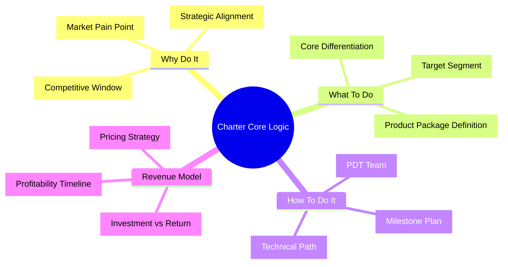

---

## 2. Project Background & Justification

### 2.1 Source & Strategic Alignment

| Dimension | Content |
| :--- | :--- |
| **Source** | [BRD ID] / [MRD ID] / [Strategic Directive] / [Customer Custom Requirement] |
| **Business Objective** | [One sentence, e.g., Open second growth curve, ¥30M annual new revenue] |
| **Strategic Fit** | [Aligned with company Q3 OKR / Annual strategic theme / Technology roadmap platform strategy] |

### 2.2 Market Opportunity Validation

- **Market Pain Point:** [e.g., Survey shows 73% of SMBs have customer service response time > 5 minutes, churn rate 35%]
- **Opportunity Window:** [e.g., AI model costs dropped 80%, competitors haven't built moats, 12-month window]
- **Data Support:** [e.g., Seed user test NPS=65, willingness to pay 28%, estimated unit price ¥5,000/year]

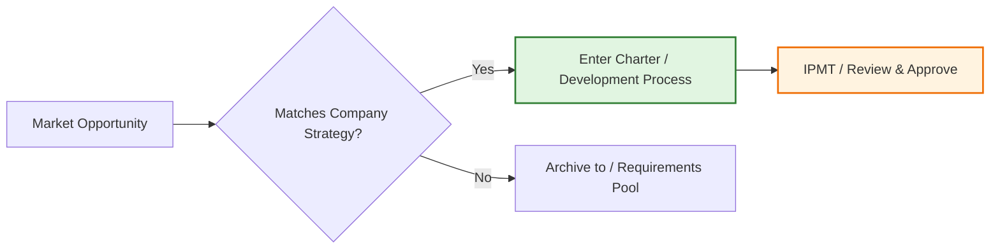

---

## 3. Project Objectives (SMART + Balanced Scorecard)

> Goals must be Specific, Measurable, Achievable, Relevant, and Time-bound.

| Goal Type | Goal Description | KPI | Deadline | Owner |
| :--- | :--- | :--- | :--- | :--- |
| **Business Goal** | [e.g., Achieve ¥X revenue / Acquire X users] | [e.g., GMV ¥10M / DAU 500K] | Q4 | [Name] |
| **Product Goal** | [e.g., Launch X feature / Achieve PMF] | [e.g., Feature coverage 100% / Retention > 40%] | Q3 | [Name] |
| **Capability Goal** | [e.g., Build X platform / Capture X technology] | [e.g., Serve 3 business lines / Reuse rate > 60%] | Q4 | [Name] |
| **Quality Goal** | [e.g., Achieve X quality level] | [e.g., Production P0 incidents = 0 / Availability 99.95%] | Ongoing | [Name] |

> **Note**: xychart-beta is a Feishu-incompatible Mermaid type; replaced with table description (template sample data).

**Goal Achievement Path (Example)**

| Month | Completion % |
| :--- | :---: |
| M1 | 20 |
| M2 | 40 |
| M3 | 60 |
| M4 | 75 |
| M5 | 90 |
| M6 | 100 |

---

## 4. Product/Solution Definition

> Answering "what exactly are we building" — this is the Charter's core, determining all subsequent resource investment direction.

### 4.1 Product Package Description

| Element | Definition |
| :--- | :--- |
| **Product Name** | [Official name and internal codename] |
| **Target Segment** | [e.g., Tier 1-2 city white-collar workers aged 25-40 / Cross-border e-commerce SaaS clients] |
| **Core Value Proposition** | [e.g., Reduce customer service response from hours to seconds, cut labor costs by 70%] |
| **Product Form** | [Web / APP / Mini Program / API / Solution / Hardware+Software] |
| **Technical Path** | [e.g., Based on proprietary LLM + cloud-native microservice architecture] |
| **Quality Grade** | [e.g., Grade A (enterprise core product) / Grade B (internal tool) / Grade C (experimental)] |

### 4.2 Competitive Advantage & Differentiation

> **Note**: This quadrant chart template has been converted to table format.

<!--
Original quadrantChart structure reference:
- title: Competitive Advantage Matrix (Tech Maturity vs Market Differentiation)
- x-axis: Low Differentiation --> High Differentiation
- y-axis: Low Tech Maturity --> High Tech Maturity
- quadrant-1: Star Product (High/High)
- quadrant-2: Potential Product (Low/High)
- quadrant-3: Question Product (Low/Low)
- quadrant-4: Cash Cow (High/Low)
- Data points: "This Product": [0.8, 0.85]; "Competitor A": [0.6, 0.5]; "Competitor B": [0.4, 0.6]; "Industry Average": [0.5, 0.5]
-->

| Quadrant | Region Characteristics | Strategy Recommendation |
| :--- | :--- | :--- |
| Quadrant 1 (High Differentiation · High Maturity) | Star Product (High/High) | Increase investment, expand market advantage |
| Quadrant 2 (Low Differentiation · High Maturity) | Potential Product (Low/High) | Improve differentiation, find breakthrough |
| Quadrant 3 (Low Differentiation · Low Maturity) | Question Product (Low/Low) | Evaluate direction, assess whether to continue investment |
| Quadrant 4 (High Differentiation · Low Maturity) | Cash Cow (High/Low) | Accelerate tech iteration, strengthen tech moat |

| Name | X Value | Y Value | Quadrant |
| :--- | :---: | :---: | :--- |
| This Product | 0.8 | 0.85 | Quadrant 1 (Star Product) |
| Competitor A | 0.6 | 0.5 | Quadrant 1 (Star Product) |
| Competitor B | 0.4 | 0.6 | Quadrant 2 (Potential Product) |
| Industry Average | 0.5 | 0.5 | Midline Position |

### 4.3 Position in Product Roadmap

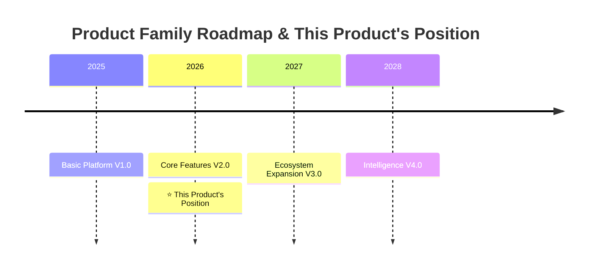

---

## 5. Market Analysis & Customer Insights

### 5.1 Target Market

| Metric | Value | Source |
| :--- | :---: | :--- |
| **TAM (Total Addressable Market)** | ¥[X]B | [Industry Report] |
| **SAM (Serviceable Available Market)** | ¥[Y]B | [Segment Market Calculation] |
| **SOM (Serviceable Obtainable Market)** | ¥[Z]B | [3-Year Target] |
| **Target Market Share** | [N]% | [This product's weight in overall portfolio] |

### 5.2 Customer Persona & Scenarios

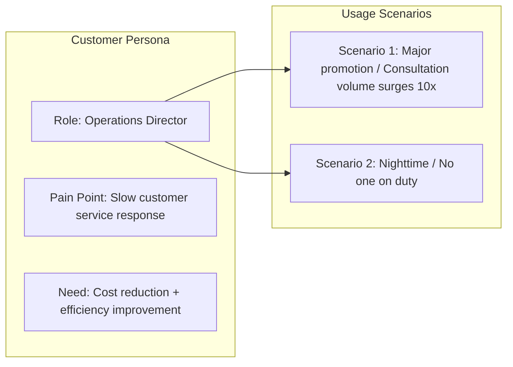

### 5.3 Competitive Analysis

| Competitor | Core Strength | Main Weakness | Our Differentiation Strategy |
| :--- | :--- | :--- | :--- |
| **Competitor A** | [Brand/Channel] | [High price/Slow iteration] | [AI-native/Cost advantage] |
| **Competitor B** | [Feature-rich/Large ecosystem] | [Heavy experience/High barrier] | [Minimalist experience/Vertical focus] |
| **Substitute** | [Excel/Manual] | [Low efficiency/Error-prone] | [Automation/Intelligence] |

---

## 6. Execution Strategy & Milestones

### 6.1 IPD Full Lifecycle & Decision Check Points (DCP)

> After Charter approval, the project enters IPD process; each stage requires DCP decision review.

```mermaid
flowchart LR
    A[Charter / Initiation Review] --> B[Concept Stage / CDCP]
    B --> C[Plan Stage / PDCP]
    C --> D[Development Stage / ADCP]
    D --> E[Validation Stage / LDCP]
    E --> F[Launch Stage / RDCP]
    F --> G[Lifecycle / EDCP]

    style A fill:#e1f5e1,stroke:#2e7d32,stroke-width:2px
    style B fill:#fff3e0,stroke:#ef6c00
    style C fill:#fff3e0,stroke:#ef6c00
    style D fill:#fff3e0,stroke:#ef6c00
    style E fill:#fff3e0,stroke:#ef6c00
    style F fill:#fff3e0,stroke:#ef6c00
```

### 6.2 Technical Review Points (TR) & Milestones

> **Note**: Gantt chart is a Feishu-incompatible type; replaced with table description.

| Phase | Task/Milestone | Start Date | Duration | Status |
| :--- | :--- | :--- | :---: | :---: |
| Concept Stage | Requirements Analysis & TR1 | YYYY-MM-DD | 10d | ⚪ |
| Concept Stage | Concept Decision Review (CDCP) | YYYY-MM-DD | 0d | ⚪ milestone |
| Plan Stage | Preliminary Design & TR2 | YYYY-MM-DD | 10d | ⚪ |
| Plan Stage | Detailed Design & TR3 | After preliminary design | 10d | ⚪ |
| Plan Stage | Plan Decision Review (PDCP) | YYYY-MM-DD | 0d | ⚪ milestone |
| Development Stage | Module Development & TR4 | YYYY-MM-DD | 30d | ⚪ |
| Development Stage | Integration Testing & TR4A | After module dev | 15d | ⚪ |
| Development Stage | System Verification & TR5 | After integration test | 15d | ⚪ |
| Validation & Launch | Beta Testing & TR6 | YYYY-MM-DD | 15d | ⚪ |
| Validation & Launch | Release Decision Review (RDCP) | YYYY-MM-DD | 0d | ⚪ milestone |
| Validation & Launch | GA Official Release | YYYY-MM-DD | 0d | ⚪ milestone |

| DCP/TR | Review Content | Pass Criteria | Estimated Time |
| :--- | :--- | :--- | :---: |
| **CDCP** | Business viability, market demand, product concept | Clear business objectives, feasible tech path | T+2 weeks |
| **TR1** | Product requirements, product concept | Requirements baselined, no major omissions | T+3 weeks |
| **PDCP** | Product plan, technical plan, resource plan | PRD/TRD pass review, budget locked | T+6 weeks |
| **TR4** | Module development complete, BBFV test results | Code review passed, unit test coverage > 80% | T+12 weeks |
| **TR5** | SDV/SIT test results | System functional/performance meets standards, no P0/P1 remaining | T+16 weeks |
| **RDCP** | Release readiness, operations readiness | Canary passed, monitoring ready, documentation complete | T+20 weeks |

### 6.3 Go-to-Market Strategy (GTM)

| Strategy Dimension | Specific Plan |
| :--- | :--- |
| **Pricing Strategy** | [e.g., Free basic + Professional ¥299/month + Enterprise custom] |
| **Channel Strategy** | [e.g., Direct sales + resellers + app marketplace] |
| **Promotion Strategy** | [e.g., Launch event + KOL seeding + SEM investment] |
| **Service Strategy** | [e.g., 7×24 online + dedicated customer success manager] |

---

## 7. Project Scope

### 7.1 Scope Boundaries

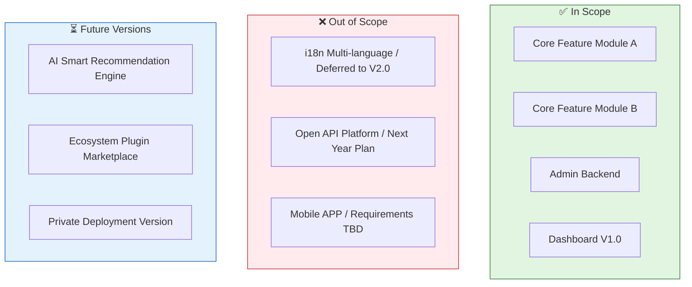

### 7.2 Key Deliverables Checklist

| Deliverable | Owner | Delivery Time | Acceptance Criteria | Linked TR/DCP |
| :--- | :--- | :--- | :--- | :--- |
| Charter | PDT Manager | T+0 | IPMT approval | Charter Review |
| PRD Document | Product Manager | T+2 weeks | Pass requirements review | TR1 |
| Technical Plan/TRD | Architect | T+3 weeks | Pass technical review | TR2 |
| Test Plan | Test Lead | T+4 weeks | Case coverage ≥ 90% | TR3 |
| Test Report | Test Lead | T+16 weeks | No P0 bugs, performance meets standards | TR5 |
| Release Package | PDT Manager | T+20 weeks | Canary passed, monitoring ready | RDCP |

---

## 8. PDT Team & Governance

### 8.1 Core Team Structure

> PDT (Product Development Team) is a cross-functional heavyweight team with end-to-end project responsibility.

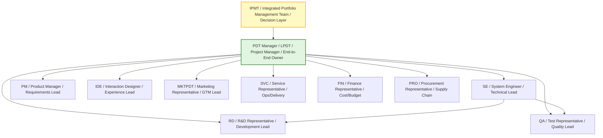

### 8.2 Extended Team

| Role | Responsibilities | Engagement |
| :--- | :--- | :--- |
| Legal & Compliance | IP, data compliance review | Phase-based |
| Security Engineer | Security architecture, penetration testing | Part-time |
| Data Analyst | Event tracking design, effectiveness evaluation | Part-time |
| Customer Success | Seed customer onboarding, feedback collection | Phase-based |

### 8.3 Responsibility Matrix (RACI)

| Key Activity | PDT Manager | Product Manager | R&D | QA | Design | Marketing | Finance |
| :--- | :---: | :---: | :---: | :---: | :---: | :---: | :---: |
| Requirements Definition | **A** | **R** | C | C | C | I | I |
| Technical Solution | **A** | C | **R** | C | I | I | I |
| Development | I | C | **R** | C | I | I | I |
| Testing & Acceptance | **A** | C | C | **R** | I | I | I |
| Release & Launch | **A** | C | **R** | C | I | **R** | I |
| Operations & Promotion | I | C | I | I | C | **R** | I |
| Budget Management | **A** | I | C | I | I | C | **R** |

> **R=Responsible, A=Accountable, C=Consulted, I=Informed**

---

## 9. Resources & Budget

### 9.1 Human Resources

| Role | Headcount | Allocation | Availability | Notes |
| :--- | :---: | :---: | :---: | :--- |
| PDT Manager | 1 | 100% | Immediate | Full-time |
| Product Manager | 2 | 100% | Immediate | Including 1 requirements analyst |
| System Engineer/Architect | 1 | 100% | Immediate | Technical decisions |
| Backend Developer | 4 | 100% | Immediate | Including 1 tech leader |
| Frontend Developer | 2 | 100% | T+1 week | Including mini program |
| Test Engineer | 2 | 100% | T+2 weeks | Including automation |
| Designer | 1 | 50% | Immediate | Shared with another project |
| Marketing/Operations | 2 | 50% | T+8 weeks | Pre-launch involvement |

### 9.2 Budget Breakdown

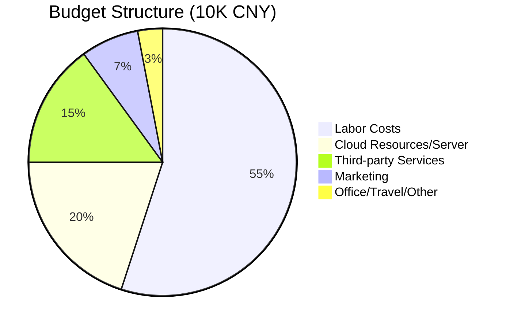

| Resource Type | Detail | Budget (10K CNY) | Availability |
| :--- | :--- | :---: | :---: |
| **Labor Costs** | Core team salary, outsourcing | 200 | Monthly |
| **Technology Costs** | Cloud servers, CDN, bandwidth, storage | 80 | T+2 weeks |
| **Third-party Services** | SMS, payment, AI APIs, licenses | 50 | T+2 weeks |
| **Operations Costs** | Promotion, content, events, channels | 40 | T+8 weeks |
| **Other** | Office, travel, training, compliance | 30 | As needed |
| **Total** | | **400** | |

---

## 10. Financial Analysis

> The Charter must answer "is it financially viable" — this is the core basis for IPMT decision-making.

### 10.1 Investment-Return Model (3 Years)

| Year | Investment (10K) | Revenue (10K) | Profit (10K) | Cumulative Profit | ROI | Phase |
| :---: | :---: | :---: | :---: | :---: | :---: | :--- |
| **Year 1** | 400 | 150 | -250 | -250 | -63% | Investment |
| **Year 2** | 600 | 1,200 | 600 | 350 | 100% | Growth |
| **Year 3** | 800 | 2,500 | 1,700 | 2,050 | 256% | Profit |

<svg xmlns="http://www.w3.org/2000/svg" viewBox="0 0 600 420" style="max-width:600px;height:auto">
<rect width="600" height="420" fill="#fafafa" rx="8"/>
<text x="300" y="28" text-anchor="middle" font-size="16" font-weight="bold" fill="#333">3-Year Financial Trends (10K CNY)</text>
<line x1="60" y1="370.0" x2="580" y2="370.0" stroke="#eee" stroke-width="1"/>
<text x="55" y="374.0" text-anchor="end" font-size="11" fill="#999">-500</text>
<line x1="60" y1="304.0" x2="580" y2="304.0" stroke="#eee" stroke-width="1"/>
<text x="55" y="308.0" text-anchor="end" font-size="11" fill="#999">200</text>
<line x1="60" y1="238.0" x2="580" y2="238.0" stroke="#eee" stroke-width="1"/>
<text x="55" y="242.0" text-anchor="end" font-size="11" fill="#999">900</text>
<line x1="60" y1="172.0" x2="580" y2="172.0" stroke="#eee" stroke-width="1"/>
<text x="55" y="176.0" text-anchor="end" font-size="11" fill="#999">1600</text>
<line x1="60" y1="106.0" x2="580" y2="106.0" stroke="#eee" stroke-width="1"/>
<text x="55" y="110.0" text-anchor="end" font-size="11" fill="#999">2300</text>
<line x1="60" y1="40.0" x2="580" y2="40.0" stroke="#eee" stroke-width="1"/>
<text x="55" y="44.0" text-anchor="end" font-size="11" fill="#999">3000</text>
<text x="16" y="205" text-anchor="middle" font-size="12" fill="#666" transform="rotate(-90, 16, 205)">Amount</text>
<line x1="60" y1="370" x2="580" y2="370" stroke="#ccc" stroke-width="1"/>
<polyline points="146.7,285.1 320.0,266.3 493.3,247.4" fill="none" stroke="#5470c6" stroke-width="2.5" stroke-linejoin="round" stroke-linecap="round"/>
<circle cx="146.7" cy="285.1" r="4" fill="#5470c6" stroke="#fff" stroke-width="1.5"/>
<text x="146.7" y="275.1" text-anchor="middle" font-size="10" fill="#5470c6" font-weight="bold">400</text>
<circle cx="320.0" cy="266.3" r="4" fill="#5470c6" stroke="#fff" stroke-width="1.5"/>
<text x="320.0" y="256.3" text-anchor="middle" font-size="10" fill="#5470c6" font-weight="bold">600</text>
<circle cx="493.3" cy="247.4" r="4" fill="#5470c6" stroke="#fff" stroke-width="1.5"/>
<text x="493.3" y="237.4" text-anchor="middle" font-size="10" fill="#5470c6" font-weight="bold">800</text>
<polyline points="146.7,308.7 320.0,209.7 493.3,87.1" fill="none" stroke="#91cc75" stroke-width="2.5" stroke-linejoin="round" stroke-linecap="round"/>
<circle cx="146.7" cy="308.7" r="4" fill="#91cc75" stroke="#fff" stroke-width="1.5"/>
<text x="146.7" y="298.7" text-anchor="middle" font-size="10" fill="#91cc75" font-weight="bold">150</text>
<circle cx="320.0" cy="209.7" r="4" fill="#91cc75" stroke="#fff" stroke-width="1.5"/>
<text x="320.0" y="199.7" text-anchor="middle" font-size="10" fill="#91cc75" font-weight="bold">1200</text>
<circle cx="493.3" cy="87.1" r="4" fill="#91cc75" stroke="#fff" stroke-width="1.5"/>
<text x="493.3" y="77.1" text-anchor="middle" font-size="10" fill="#91cc75" font-weight="bold">2500</text>
<polyline points="146.7,346.4 320.0,266.3 493.3,162.6" fill="none" stroke="#fc8452" stroke-width="2.5" stroke-linejoin="round" stroke-linecap="round"/>
<circle cx="146.7" cy="346.4" r="4" fill="#fc8452" stroke="#fff" stroke-width="1.5"/>
<text x="146.7" y="336.4" text-anchor="middle" font-size="10" fill="#fc8452" font-weight="bold">-250</text>
<circle cx="320.0" cy="266.3" r="4" fill="#fc8452" stroke="#fff" stroke-width="1.5"/>
<text x="320.0" y="256.3" text-anchor="middle" font-size="10" fill="#fc8452" font-weight="bold">600</text>
<circle cx="493.3" cy="162.6" r="4" fill="#fc8452" stroke="#fff" stroke-width="1.5"/>
<text x="493.3" y="152.6" text-anchor="middle" font-size="10" fill="#fc8452" font-weight="bold">1700</text>
<text x="146.7" y="390" text-anchor="middle" font-size="12" fill="#333">Year 1</text>
<text x="320.0" y="390" text-anchor="middle" font-size="12" fill="#333">Year 2</text>
<text x="493.3" y="390" text-anchor="middle" font-size="12" fill="#333">Year 3</text>
<line x1="165.0" y1="414" x2="177.0" y2="414" stroke="#5470c6" stroke-width="2.5"/>
<circle cx="171.0" cy="414" r="3" fill="#5470c6" stroke="#fff" stroke-width="1"/>
<text x="181.0" y="418" font-size="12" fill="#333">Investment</text>
<line x1="255.0" y1="414" x2="267.0" y2="414" stroke="#91cc75" stroke-width="2.5"/>
<circle cx="261.0" cy="414" r="3" fill="#91cc75" stroke="#fff" stroke-width="1"/>
<text x="271.0" y="418" font-size="12" fill="#333">Revenue</text>
<line x1="345.0" y1="414" x2="357.0" y2="414" stroke="#fc8452" stroke-width="2.5"/>
<circle cx="351.0" cy="414" r="3" fill="#fc8452" stroke="#fff" stroke-width="1"/>
<text x="361.0" y="418" font-size="12" fill="#333">Profit</text>
</svg>

### 10.2 Key Financial Assumptions

| Metric | Assumed Value | Basis / Risk |
| :--- | :--- | :--- |
| **Pricing** | Free basic / Professional ¥299/month / Enterprise ¥5,000/month | Competitor pricing research |
| **Target Sales (Year 1)** | 500 paying customers | Based on SAM and conversion rate calculation |
| **CAC (Customer Acquisition Cost)** | ≤ ¥800 | Channel test data |
| **LTV (Lifetime Value)** | ≥ ¥3,600 | ARPU × lifecycle |
| **LTV/CAC** | ≥ 4.5 | Healthy SaaS benchmark > 3 |
| **Breakeven** | Month [14] | Based on current cash flow model |

### 10.3 Pricing & Profitability Strategy

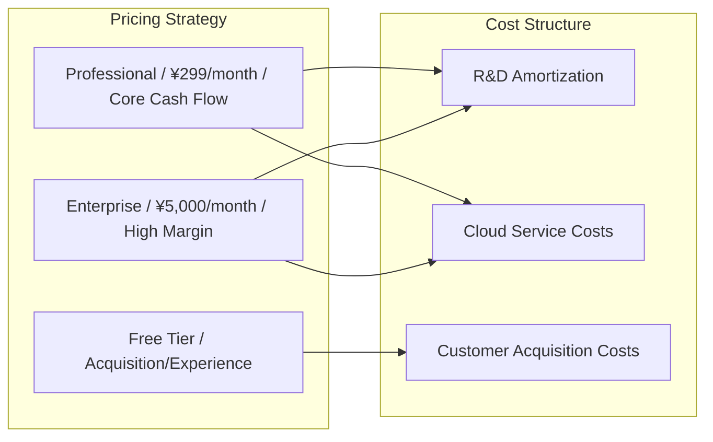

---

## 11. Risks & Exit Strategy

### 11.1 Risk Register

| Risk ID | Risk Description | Probability | Impact | Risk Level | Trigger Condition | Mitigation | Exit Condition |
| :--- | :--- | :---: | :---: | :---: | :--- | :--- | :--- |
| **R-001** | Technical solution infeasible | Medium | High | 🔴 High | Tech pre-research fails | Bring in external experts / Adjust architecture / Switch stack | Pause if delayed > 2 months |
| **R-002** | Core personnel turnover | Medium | High | 🔴 High | Key position vacant > 2 weeks | Activate Backup / External hiring / Knowledge documentation | Reduce scope if unfilled |
| **R-003** | Major requirements change | High | Medium | 🟡 Medium | Change > 30% workload | Change control process / CCB review / Freeze baseline | Re-initiate if change > 50% |
| **R-004** | Market acceptance below expectations | Medium | High | 🔴 High | MVP retention << 20% | Fast Pivot / Focus on core scenario / Adjust pricing | Terminate if 2 consecutive months miss target |
| **R-005** | Competitor fast follow-up | High | Medium | 🟡 Medium | Competitor launches similar feature | Accelerate iteration / Build data moat / Patent protection | Adjust target if market share << 5% |

### 11.2 Risk Decision Tree

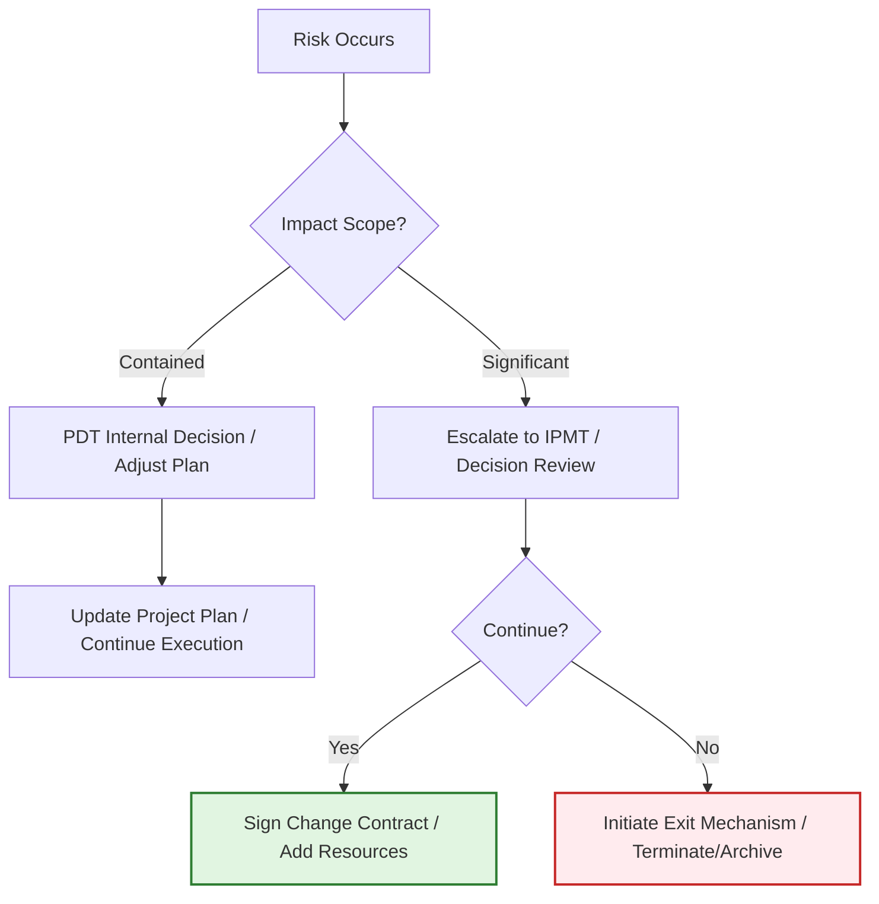

### 11.3 Exit & Stop-Loss Mechanism

| Exit Scenario | Trigger Condition | Asset Disposition | Experience Capture |
| :--- | :--- | :--- | :--- |
| **Project Termination** | 2 consecutive DCP failures / Market disappears | Code archive / Team restructure | Retrospective / Knowledge base update |
| **Scope Reduction** | Resource cut > 30% | Retain core modules | Modular design documentation |
| **Direction Pivot** | Original hypothesis disproven | Retain reusable components | User research report / New direction Charter |

---

## 12. Sign-off & Authorization

> After Charter is approved by IPMT, PDT is officially authorized to form, and the project enters IPD concept stage.

### 12.1 Approval Process

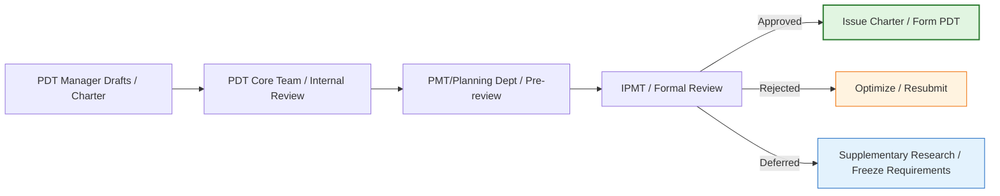

### 12.2 Sign-off Sheet

| Role | Name | Signature | Date | Approval Comments |
| :--- | :--- | :---: | :---: | :--- |
| **IPMT Chair / CEO** | | | | [Approve/Reject/Defer with rationale] |
| **Product Director** | | | | |
| **R&D Director** | | | | |
| **Finance BP** | | | | |
| **PDT Manager** | | | | [Commit to executing per plan] |

---

## 13. Appendix

### 13.1 Glossary

| Term | Definition |
| :--- | :--- |
| **IPMT** | Integrated Portfolio Management Team |
| **PDT** | Product Development Team |
| **LPDT** | PDT Manager, project end-to-end owner |
| **SE** | System Engineer |
| **DCP** | Decision Check Point |
| **TR** | Technical Review |
| **CDP** | Charter Development Process |
| **GA** | General Availability |
| **PMF** | Product Market Fit |

### 13.2 Related Document Checklist

| Document | Document ID | Status | Link |
| :--- | :--- | :--- | :--- |
| Business Requirements Document (BRD) | BRD-2026-XXX | Approved | [Link] |
| Market Requirements Document (MRD) | MRD-2026-XXX | Approved | [Link] |
| Product Requirements Document (PRD) | PRD-2026-XXX | In Progress | [Link] |
| Technical Requirements Document (TRD) | TRD-2026-XXX | Pending | [Link] |
| Financial Calculation Spreadsheet | FIN-2026-XXX | Approved | [Link] |
