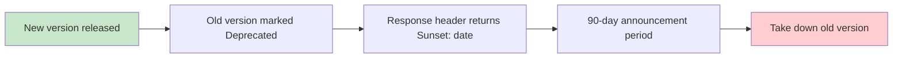

# [Product/System Name (English)] - API Documentation

> **Document Status:** 🟡 Under Review / 🟢 Approved / 🔴 Rejected
>
> **Confidentiality Level:** Confidential / Internal Public / Public
>
> **Version:** v1.0.0
>
> **Date:** YYYY-MM-DD
>
> **Author:** [Backend Lead / API Owner]
>
> **Reviewer:** [Frontend Lead / Architect]
>
> **Audience:** Frontend engineers, Backend engineers, Test engineers, Third-party integrators, SDK maintainers
>
> **Related TRD:** [TRD Number/Filename]
>
> **Related Architecture Document:** [ADD Number/Filename]
>
> **OpenAPI Spec:** [openapi.yaml path or URL]

---

## 0. Document Guide

### 0.1 Document Purpose and Scope

**API Documentation answers**: "What endpoints look like, how to call them, what they return, what to do when errors occur" — the contract layer between frontend/backend, third parties, and SDK maintainers.

**Applicable Scenarios:**

- ✅ Externally exposed REST / GraphQL / gRPC API contracts
- ✅ Frontend-backend separation architecture API integration basis
- ✅ Third-party integration, SDK auto-generation (based on OpenAPI 3.x)
- ✅ Single source of truth for API gateway, Mock services, contract testing
- ❌ Internal function signatures (use code comments / TSDoc / rustdoc)
- ❌ Database table structures (use DB design documentation)

### 0.2 Related Documents

| Document Type | Filename | Related Sections |
| :--- | :--- | :--- |
| [Type] | [Filename] [Line Range] | [Section Description] |

> **Reference Format Note**: Related documents use the `filename line range` format (e.g., `【Template】Technical Requirements Document(TRD).md 3-17`). Line numbers may change as documents are updated; please refer to actual content.

### 0.3 Change Log

| Version | Date | Reviser | Change Content | Reviewer |
| :--- | :--- | :--- | :--- | :--- |
| v0.1 | YYYY-MM-DD | [Name] | Initial draft: Core endpoint list + Authentication methods | [Name] |
| v0.2 | YYYY-MM-DD | [Name] | Added error code dictionary + Rate limiting strategy | [Name] |
| v1.0 | YYYY-MM-DD | [Name] | Official release, aligned with OpenAPI 3.1 | [Architect] |
| v1.0.1 | YYYY-MM-DD | [Name] | Fixed `/v1/users/{id}` response field `deleted_at` nullable annotation | — |

---

## 1. Overview

> **5-second explanation:** What kind of API is this, who is it for, what problem does it solve.

| Element | Content |
| :--- | :--- |
| **API Name** | [e.g., User Center OpenAPI] |
| **API Positioning** | [e.g., Unified user asset query and modification interface for mobile/Web/third-party ISVs] |
| **Protocol** | HTTPS / RESTful / GraphQL / gRPC |
| **Base URL** | `https://{env}.example.com/api/v{version}` |
| **Environment** | Production: `api.example.com` / Pre-production: `api-pre.example.com` / Sandbox: `sandbox.example.com` |
| **Current Version** | v1 |
| **OpenAPI Version** | OpenAPI 3.1.0 |
| **MIME Type** | `application/json; charset=utf-8` |
| **Character Set** | UTF-8 |
| **Time Zone** | All timestamps use ISO 8601 UTC (e.g., `2026-07-05T08:00:00Z`) |

---

## 2. Authentication & Authorization

### 2.1 Authentication Methods

| Method | Applicable Scenario | Credential Location | Credential Validity |
| :--- | :--- | :--- | :--- |
| **Bearer Token** | User-state API | `Authorization: Bearer {access_token}` | 2 hours, refreshable |
| **API Key** | Server-to-server | `X-API-Key: {api_key}` | Long-term, revocable |
| **OAuth 2.1** | Third-party integration | `Authorization: Bearer {oauth_token}` | Determined by authorization flow |
| **mTLS** | Financial-grade / Internal sensitive links | Client certificate | Determined by certificate lifecycle |

### 2.2 Obtain Token

```http
POST /v1/auth/token HTTP/1.1
Host: api.example.com
Content-Type: application/json

{
  "grant_type": "client_credentials",
  "client_id": "{client_id}",
  "client_secret": "{client_secret}"
}
```

```http
HTTP/1.1 200 OK
Content-Type: application/json

{
  "access_token": "{token}",
  "token_type": "Bearer",
  "expires_in": 7200,
  "refresh_token": "{refresh_token}"
}
```

### 2.3 Permission Model (Scope)

| Scope | Description | Applicable Endpoints |
| :--- | :--- | :--- |
| `user:read` | Read basic user information | `GET /v1/users/*` |
| `user:write` | Modify user information | `POST/PUT/PATCH /v1/users/*` |
| `order:read` | Read orders | `GET /v1/orders/*` |
| `order:write` | Create/Cancel orders | `POST /v1/orders` |
| `admin:*` | Full admin backend access | Internal admin only |

### 2.4 Authentication Failure Responses

| HTTP Status Code | error_code | Description |
| :---: | :--- | :--- |
| 401 | `UNAUTHENTICATED` | Missing credentials / Token expired |
| 403 | `PERMISSION_DENIED` | Insufficient Scope |
| 403 | `TOKEN_REVOKED` | Token has been revoked |

---

## 3. Common Conventions

### 3.1 Request Format

- **Content-Type**: `application/json; charset=utf-8` (except file upload using `multipart/form-data`)
- **Accept**: `application/json`
- **Required Request Headers:**

| Header | Description | Example |
| :--- | :--- | :--- |
| `Authorization` | Bearer Token / API Key | `Bearer eyJhbGciOi...` |
| `X-Request-Id` | Request tracing ID (generated by gateway if missing) | `req_8f14e45f-ceea-...` |
| `X-Timestamp` | Client timestamp (anti-replay) | `1752835200` |
| `X-Signature` | Request signature (required for sensitive endpoints) | `HMAC-SHA256` output |
| `User-Agent` | Client identifier | `MyApp/1.0 (iOS 17)` |

### 3.2 Response Format (Unified Envelope)

**Success Response:**

```json
{
  "code": 0,
  "message": "ok",
  "data": { },
  "request_id": "req_8f14e45f-ceea-467f-a830-...",
  "timestamp": "2026-07-05T08:00:00Z"
}
```

**Error Response:**

```json
{
  "code": 40001,
  "message": "Parameter validation failed",
  "errors": [
    { "field": "email", "issue": "Invalid format" }
  ],
  "request_id": "req_8f14e45f-ceea-467f-a830-...",
  "timestamp": "2026-07-05T08:00:00Z"
}
```

| Field | Type | Description |
| :--- | :--- | :--- |
| `code` | integer | 0 indicates success, non-0 indicates business error code |
| `message` | string | Human-readable brief description |
| `data` | object | Business data, omitted on error |
| `errors` | array | Field-level error details, returned only on validation failure |
| `request_id` | string | Full link tracing ID, must be provided for troubleshooting |
| `timestamp` | string | Server response time, ISO 8601 UTC |

### 3.3 Pagination Conventions

- **Method**: Cursor pagination (recommended) / Offset pagination (compatible)
- **Request Parameters:**

| Parameter | Type | Default | Description |
| :--- | :--- | :--- | :--- |
| `page_size` | integer | 20 | Items per page, maximum 100 |
| `cursor` | string | — | Cursor, not passed on first request, retrieved from subsequent responses |
| `page` | integer | 1 | Used for offset pagination, mutually exclusive with cursor |

- **Response Fields:**

```json
{
  "data": {
    "items": [ ],
    "page_info": {
      "has_next": true,
      "next_cursor": "eyJpZCI6MTIzNDV9",
      "total": 1024
    }
  }
}
```

### 3.4 Naming and Type Conventions

| Dimension | Convention | Example |
| :--- | :--- | :--- |
| Field naming | `snake_case` | `user_id` / `created_at` |
| Time format | ISO 8601 UTC string | `2026-07-05T08:00:00Z` |
| Amount | Integer + String (smallest currency unit, avoid floating point errors) | `"199"` represents ¥1.99 |
| Boolean | `true` / `false` | Don't use 0/1 as substitute |
| Enum | Lowercase snake_case | `order_status: "paid"` |
| ID type | String (avoid JSON number precision loss) | `"id": "1234567890123456789"` |
| Null value | `null` not field omission | Keep field nullability explicit |
| Amount symbol | `$` needs escaping to `\$` in Feishu/Markdown | `\$0.05` |

### 3.5 HTTP Method Semantics

| Method | Semantics | Idempotent | Safe | Example |
| :--- | :--- | :---: | :---: | :--- |
| `GET` | Query | ✅ | ✅ | `GET /v1/users/123` |
| `POST` | Create / Action | ❌ | ❌ | `POST /v1/users` |
| `PUT` | Full replacement | ✅ | ❌ | `PUT /v1/users/123` |
| `PATCH` | Partial update | ❌ | ❌ | `PATCH /v1/users/123` |
| `DELETE` | Delete | ✅ | ❌ | `DELETE /v1/users/123` |

### 3.6 Idempotency

- **Write operation idempotency**: Client passes UUID in `Idempotency-Key` header, server returns first result for same key within 24 hours
- **Applicable scope**: All `POST` / `PUT` / `PATCH` / `DELETE`
- **Example**: `Idempotency-Key: 8f14e45f-ceea-467f-a830-a0d4e8d6c5b1`

---

## 4. Endpoint Index

> **Description**: All endpoint details see §5; this table is for quick reference.

| # | Method | Path | Name | Scope | Notes |
| :-: | :--- | :--- | :--- | :--- | :--- |
| 1 | `POST` | `/v1/auth/token` | Obtain Token | — | Public endpoint |
| 2 | `POST` | `/v1/auth/token:refresh` | Refresh Token | — | Requires refresh_token |
| 3 | `GET` | `/v1/users/{user_id}` | Query User | `user:read` | |
| 4 | `POST` | `/v1/users` | Create User | `user:write` | |
| 5 | `PATCH` | `/v1/users/{user_id}` | Update User | `user:write` | Partial update |
| 6 | `DELETE` | `/v1/users/{user_id}` | Delete User | `user:write` | Soft delete |
| 7 | `GET` | `/v1/users` | User List | `user:read` | Paginated |
| 8 | `GET` | `/v1/orders/{order_id}` | Query Order | `order:read` | |
| 9 | `POST` | `/v1/orders` | Create Order | `order:write` | Idempotency required |
| 10 | `POST` | `/v1/orders/{order_id}:cancel` | Cancel Order | `order:write` | |

---

## 5. Endpoint Reference

### 5.1 Obtain Token

`POST /v1/auth/token`

**Description**: Exchange client credentials for access token.

**Request Parameters**

| Location | Field | Type | Required | Description |
| :--- | :--- | :--- | :---: | :--- |
| body | `grant_type` | string | ✅ | `client_credentials` / `refresh_token` |
| body | `client_id` | string | ✅ | Client ID |
| body | `client_secret` | string | ✅ | Client secret |
| body | `refresh_token` | string | — | Required when grant_type=refresh_token |

**Request Example**

```bash
curl -X POST https://api.example.com/v1/auth/token \
  -H "Content-Type: application/json" \
  -d '{
    "grant_type": "client_credentials",
    "client_id": "{client_id}",
    "client_secret": "{client_secret}"
  }'
```

**Success Response** `200 OK`

```json
{
  "code": 0,
  "message": "ok",
  "data": {
    "access_token": "eyJhbGciOiJIUzI1NiIsInR5cCI6IkpXVCJ9...",
    "token_type": "Bearer",
    "expires_in": 7200,
    "refresh_token": "rft_8f14e45fceea467f..."
  },
  "request_id": "req_8f14e45f-ceea-467f-a830-a0d4e8d6c5b1",
  "timestamp": "2026-07-05T08:00:00Z"
}
```

**Error Response**

| HTTP | code | message |
| ---: | :--- | :--- |
| 400 | 40001 | Parameter validation failed |
| 401 | 40101 | client_id does not exist |
| 401 | 40102 | client_secret incorrect |

---

### 5.2 Query User

`GET /v1/users/{user_id}`

**Description**: Query user details by user ID.

**Path Parameters**

| Field | Type | Required | Description |
| :--- | :--- | :---: | :--- |
| `user_id` | string | ✅ | User unique identifier |

**Query Parameters**

| Field | Type | Required | Description |
| :--- | :--- | :---: | :--- |
| `fields` | string | — | Return field filter, comma-separated |

**Request Example**

```bash
curl -X GET https://api.example.com/v1/users/123 \
  -H "Authorization: Bearer {access_token}"
```

**Success Response** `200 OK`

```json
{
  "code": 0,
  "message": "ok",
  "data": {
    "user_id": "123",
    "nickname": "Zhang San",
    "email": "zhangsan@example.com",
    "phone": "138****0000",
    "avatar_url": "https://cdn.example.com/avatar/123.png",
    "status": "active",
    "created_at": "2026-01-01T00:00:00Z",
    "updated_at": "2026-07-05T08:00:00Z"
  },
  "request_id": "req_8f14e45f-ceea-467f-a830-a0d4e8d6c5b1",
  "timestamp": "2026-07-05T08:00:00Z"
}
```

**Error Response**

| HTTP | code | message |
| ---: | :--- | :--- |
| 401 | 40100 | Unauthenticated |
| 403 | 40300 | Insufficient Scope |
| 404 | 40400 | User does not exist |

---

### 5.3 Create User

`POST /v1/users`

**Description**: Create a new user.

**Request Body**

| Field | Type | Required | Validation Rule | Description |
| :--- | :--- | :---: | :--- | :--- |
| `nickname` | string | ✅ | 1-32 characters, no sensitive words | Nickname |
| `email` | string | ✅ | RFC 5322 email format | Email |
| `phone` | string | — | E.164 format `+8613800000000` | Phone number |
| `password` | string | ✅ | ≥ 8 characters, containing uppercase/lowercase + numbers | Password (plain text input, server-side bcrypt) |

**Request Example**

```bash
curl -X POST https://api.example.com/v1/users \
  -H "Authorization: Bearer {access_token}" \
  -H "Idempotency-Key: 8f14e45f-ceea-467f-a830-a0d4e8d6c5b1" \
  -H "Content-Type: application/json" \
  -d '{
    "nickname": "Zhang San",
    "email": "zhangsan@example.com",
    "password": "********"
  }'
```

**Success Response** `201 Created`

```json
{
  "code": 0,
  "message": "ok",
  "data": {
    "user_id": "124",
    "nickname": "Zhang San",
    "email": "zhangsan@example.com",
    "status": "active",
    "created_at": "2026-07-05T08:00:00Z"
  },
  "request_id": "req_8f14e45f-ceea-467f-a830-a0d4e8d6c5b1",
  "timestamp": "2026-07-05T08:00:00Z"
}
```

**Error Response**

| HTTP | code | message |
| ---: | :--- | :--- |
| 400 | 40001 | Parameter validation failed |
| 409 | 40901 | Email already registered |

---

> **Endpoint continuation note**: Subsequent endpoints (5.4 ~ 5.10) follow the above structure: Path parameters / Query parameters / Request body / Request example / Success response / Error response. Structure remains completely consistent, avoiding style drift.

---

## 6. Data Models (Schemas)

> **Description**: This section defines all data models shared by endpoints, corresponding one-to-one with OpenAPI `components.schemas`.

### 6.1 User

| Field | Type | Required | Nullable | Description |
| :--- | :--- | :---: | :---: | :--- |
| `user_id` | string | ✅ | — | User unique ID |
| `nickname` | string | ✅ | — | Nickname |
| `email` | string | ✅ | — | Email |
| `phone` | string | — | ✅ | Phone number (E.164) |
| `avatar_url` | string | — | ✅ | Avatar URL |
| `status` | enum | ✅ | — | `active` / `inactive` / `banned` |
| `created_at` | datetime | ✅ | — | Creation time (ISO 8601 UTC) |
| `updated_at` | datetime | ✅ | — | Update time (ISO 8601 UTC) |
| `deleted_at` | datetime | — | ✅ | Soft delete time, null if not deleted |

### 6.2 Order

| Field | Type | Required | Nullable | Description |
| :--- | :--- | :---: | :---: | :--- |
| `order_id` | string | ✅ | — | Order ID |
| `user_id` | string | ✅ | — | Order placer user ID |
| `amount` | string | ✅ | — | Amount (smallest currency unit, string) |
| `currency` | string | ✅ | — | ISO 4217 currency code (e.g., `CNY`) |
| `order_status` | enum | ✅ | — | `pending` / `paid` / `shipped` / `cancelled` / `refunded` |
| `items` | array | ✅ | — | Product list |
| `created_at` | datetime | ✅ | — | Order placement time |
| `paid_at` | datetime | — | ✅ | Payment time |

### 6.3 Pagination

| Field | Type | Required | Description |
| :--- | :--- | :---: | :--- |
| `items` | array | ✅ | Current page data |
| `page_info` | object | ✅ | Pagination information |
| `page_info.has_next` | boolean | ✅ | Whether there is a next page |
| `page_info.next_cursor` | string | — | Next page cursor |
| `page_info.total` | integer | — | Total count (returned for offset pagination) |

---

## 7. Error Code Dictionary

### 7.1 Error Code Structure

Error codes are 5-digit integers, segmented as follows:

| Segment | Meaning | Example |
| :--- | :--- | :--- |
| 1st digit | HTTP status code abbreviation | `4` = 4xx, `5` = 5xx |
| 2nd-3rd digits | Module number | `00` = General, `01` = Authentication, `02` = User |
| 4th-5th digits | Error sequence within module | `01` = First error |

### 7.2 General Error Codes

| HTTP | code | message | Description |
| ---: | :--- | :--- | :--- |
| 400 | 40000 | Request format error | JSON parsing failed / Missing required header |
| 400 | 40001 | Parameter validation failed | Field-level errors see `errors` |
| 401 | 40100 | Unauthenticated | Missing / Invalid Token |
| 403 | 40300 | Insufficient permission | Scope mismatch |
| 404 | 40400 | Resource not found | |
| 409 | 40900 | Resource conflict | Uniqueness conflict |
| 422 | 42200 | Business validation failed | Business rules not permitted |
| 429 | 42900 | Too many requests | Rate limit triggered |
| 500 | 50000 | Internal server error | Contact operations, provide request_id |
| 502 | 50200 | Gateway error | Upstream unreachable |
| 503 | 50300 | Service unavailable | Under maintenance / Overloaded |
| 504 | 50400 | Gateway timeout | |

### 7.3 Business Error Codes

| HTTP | code | message | Module |
| ---: | :--- | :--- | :--- |
| 401 | 40101 | client_id does not exist | Authentication |
| 401 | 40102 | client_secret incorrect | Authentication |
| 409 | 40901 | Email already registered | User |
| 409 | 40902 | Phone number already bound | User |
| 422 | 42201 | Order cannot be cancelled | Order |
| 422 | 42202 | Insufficient inventory | Order |

---

## 8. Versioning

### 8.1 Version Strategy

- **Version location**: URL path prefix (`/v1/`, `/v2/`)
- **Compatibility commitment**:
  - Within same major version: New fields / New endpoints / Relaxed validation → Backward compatible, don't break clients
  - Deleted fields / Changed field types / Tightened validation / Deleted endpoints → Must bump major version
- **Support period**: Old major versions maintained ≥ 12 months after new version release, deprecated notice 90 days before expiry

### 8.2 Deprecation Process



- **Response header annotation**: `Deprecation: true` + `Sunset: Wed, 5 Oct 2026 00:00:00 GMT`
- **Announcement channels**: Developer email + API documentation homepage + Response header triple notification

### 8.3 Change Classification

| Change Type | Compatible | Version Bump Required | Example |
| :--- | :---: | :---: | :--- |
| New optional request field | ✅ | ❌ | Added `fields` query parameter |
| New response field | ✅ | ❌ | User added `avatar_url` |
| Deleted field | ❌ | ✅ | Removed `phone` |
| Changed field type | ❌ | ✅ | `amount` from number to string |
| Tightened validation rules | ❌ | ✅ | `password` minimum length 6 → 8 |
| Changed error code semantics | ❌ | ✅ | 40101 changed from "client_id error" to "Token expired" |

---

## 9. Security & Rate Limiting

### 9.1 Rate Limiting Strategy

| Dimension | Limit | Behavior After Trigger | Header Hint |
| :--- | :--- | :--- | :--- |
| Per Token | 600 requests / minute | 429 + `Retry-After` | `X-RateLimit-Remaining` |
| Per IP | 1200 requests / minute | 429 | `X-RateLimit-Limit` |
| Per Application | 1 million requests / day | 429 + Alert | `X-RateLimit-Reset` |
| Write operations | 60 requests / minute | 429 | — |

**429 Response Example:**

```http
HTTP/1.1 429 Too Many Requests
Content-Type: application/json
Retry-After: 30
X-RateLimit-Limit: 600
X-RateLimit-Remaining: 0
X-RateLimit-Reset: 1752835230

{
  "code": 42900,
  "message": "Too many requests, please try again later",
  "request_id": "req_8f14e45f-ceea-467f-a830-a0d4e8d6c5b1",
  "timestamp": "2026-07-05T08:00:00Z"
}
```

### 9.2 Quota Management

| Quota Item | Default Value | Upgrade Path |
| :--- | :--- | :--- |
| Daily invocation count | 1 million | Apply for enterprise quota |
| Concurrent connections | 100 | Contact sales |
| Historical data query | 30 days | Upgrade data retention plan |

### 9.3 Security Best Practices

- **Transmission encryption**: Force TLS 1.3, disable old versions
- **Request signing**: Sensitive endpoints (payment, refund, delete) force `X-Signature`
- **Anti-replay**: Reject `X-Timestamp` deviation >±5 minutes; nonce cannot repeat within 5 minutes
- **Key storage**: Client keys must not be hardcoded, use KMS / environment variables
- **Audit logs**: All write operations, sensitive read operations logged ≥ 1 year
- **PII desensitization**: Phone numbers, ID numbers, emails desensitized by default in responses, request `pii:read` scope for plaintext

---

## 10. Appendix

### 10.1 SDK and Tools

| Language | Repository | Auto-generation Method |
| :--- | :--- | :--- |
| Java | `github.com/example/sdk-java` | OpenAPI Generator |
| Python | `github.com/example/sdk-python` | openapi-python-client |
| Node.js | `github.com/example/sdk-node` | openapi-typescript |
| Go | `github.com/example/sdk-go` | oapi-codegen |

### 10.2 Mock and Contract Testing

- **Mock service**: Auto-generated from OpenAPI, URL `https://mock.example.com`
- **Contract testing**: Pact / Dredd, validates implementation vs documentation in CI
- **Postman Collection**: `postman/api-collection.json`

### 10.3 Glossary

| Term | English | Definition |
| :--- | :--- | :--- |
| Scope | Scope | Authorization scope |
| Cursor | Cursor | Cursor pagination locator |
| Idempotency | Idempotency | Idempotency |
| RFC 5322 | RFC 5322 | Email format standard |
| E.164 | E.164 | International phone number format standard |
| ISO 8601 | ISO 8601 | Time representation standard |
| ISO 4217 | ISO 4217 | Currency code standard |

### 10.4 References

1. OpenAPI Initiative. (2021). _OpenAPI Specification 3.1.0_. https://spec.openapis.org/oas/v3.1.0
2. IETF. (2015). _RFC 7807: Problem Details for HTTP APIs_. https://datatracker.ietf.org/doc/html/rfc7807
3. IETF. (2021). _RFC 8941: Structured Field Values for HTTP_. https://datatracker.ietf.org/doc/html/rfc8941

---

## API Documentation Writing Checklist

- [ ] §0 Document Guide: Purpose and scope / Related documents / Change log
- [ ] §1 Overview: Base URL / Protocol / Version / Environment list
- [ ] §2 Authentication: ≥ 1 authentication method + Scope model + Authentication failure responses
- [ ] §3 Common Conventions: Request / Response envelope / Pagination / Naming / HTTP method semantics / Idempotency
- [ ] §4 Endpoint List: ≥ All public endpoints
- [ ] §5 Endpoint Reference: Each endpoint includes path parameters / Request body / Request example / Success response / Error response
- [ ] §6 Data Models: All shared Schemas include field types / Required / Nullable
- [ ] §7 Error Code Dictionary: General + Business error codes, including HTTP status codes and messages
- [ ] §8 Version Management: Compatibility commitment / Deprecation process / Change classification table
- [ ] §9 Security Rate Limiting: Rate limiting strategy / Quotas / Security best practices
- [ ] §10 Appendix: SDK / Mock / Glossary / References
- [ ] Related document links complete (TRD / Architecture documentation / OpenAPI Spec)
- [ ] All examples copy-paste runnable