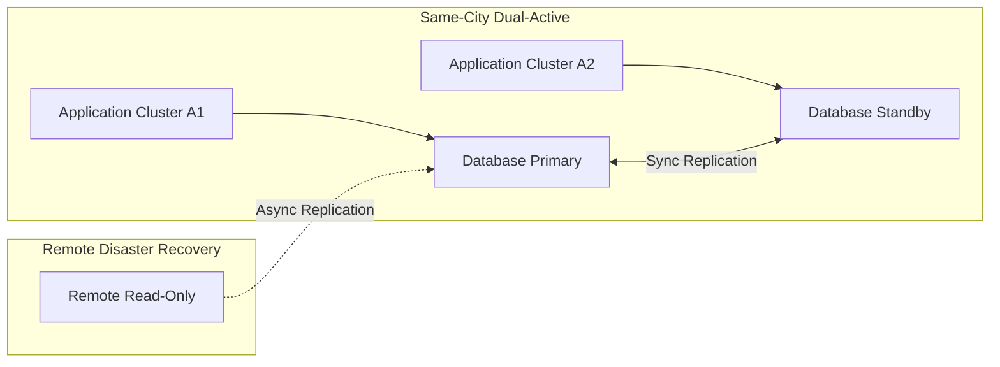
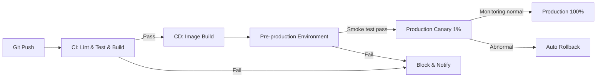

# [Product/System Name (English)] - Technical Requirements Document (TRD)

> **Document Status:** 🟡 Under Review / 🟢 Approved / 🔴 Rejected
>
> **Confidentiality Level:** Confidential / Internal Public / Public
>
> **Version:** v1.0.2
>
> **Date:** YYYY-MM-DD
>
> **Author:** [Architect / Technical Lead]
>
> **Reviewer:** [Name/Role]
>
> **Audience:** Kirky.X, CTO, Product/Development/Testing Leads, Subsystem Architects
>
> **Related Documents:** [Filename Line Range]

---

## 0. Document Guide

### 0.1 Document Purpose and Scope

**TRD answers**: "What technology stack to use, what performance metrics to achieve, what non-functional constraints exist" — cross-subsystem, cross-team technical review layer.
**ADD answers**: "What the system looks like, how modules are divided, how data flows" — single subsystem implementation guidance.

**Applicable Scenarios:**

- ✅ New cross-subsystem technical platform (e.g., Compass POI Center, Recommendation Platform, Dialog Platform)
- ✅ Major technology selection decisions (e.g., introducing vector database, LLM service, graph database)
- ✅ Performance/reliability baseline definition (affects implementation constraints for all subsequent subsystems)
- ❌ Single subsystem internal architecture (use ADD instead)
- ❌ Business requirement analysis (use PRD/FRD)

**Audience:**

| Reading Role | Responsibility Scope |
| :--- | :--- |
| Kirky.X | Technical architecture review and standard compliance audit |
| CTO | Technical strategy alignment and resource decisions |
| Product/Development/Testing Leads | Implementation feasibility and scheduling assessment |
| Subsystem Architects | Technical solution review and interface definition |

### 0.2 Related Documents

| Document Type | Filename | Related Sections |
| -------- | ------------------- | ---------- |
| [Type] | [Filename] [Line Range] | [Section Description] |

> **Reference Format Note**: Related documents use the `filename line range` format (e.g., `【Template】Technical Requirements Document(TRD).md 3-17`). Line numbers may change as documents are updated; please refer to actual content.

### 0.3 Change Log

| Version | Date | Reviser | Change Content | Reviewer |
| :--- | :--- | :--- | :--- | :--- |
| v0.1 | YYYY-MM-DD | [Name] | Initial draft | [Architect] |
| v0.2 | YYYY-MM-DD | [Name] | Review passed | [Reviewer] |
| v1.0 | YYYY-MM-DD | [Name] | Kirky.X review passed | [CTO] |
| v1.0.1 | 2026-06-20 | Xie Dong | Message queue recommended selection Kafka→Pulsar (unified event bus specification), Kafka/RocketMQ marked as deprecated | — |
| v1.0.2 | 2026-06-26 | Xie Dong | $ symbol Feishu escape fix (consistency-remediation-p0 WS11): Amount/SQL parameter reference $ → \$ | — |

---

## 1. Technical Challenges Analysis

> **Architect's Guide:** 5-minute explanation of the core technical challenges we need to solve.

### 1.1 Challenge List

| Challenge ID | Challenge Category | Challenge Description | Quantified Metrics | Priority |
| :--- | :--- | :--- | :--- | :---: |
| TC-001 | Performance | [e.g., Recommendation recall P99 ≤ 200ms] | [e.g., Million-level POI full recall] | P0 |
| TC-002 | Consistency | [e.g., Multi-device synchronization for itinerary planning] | [e.g., Eventually consistent ≤ 5s] | P0 |
| TC-003 | Scalability | [e.g., Support 1M DAU growth to 10M] | [e.g., Horizontal scaling ≤ 1 week] | P1 |
| TC-004 | Availability | [e.g., In-trip assistant 7×24 online] | [e.g., Availability ≥ 99.95%] | P0 |
| TC-005 | Security | [e.g., User location information desensitization] | [e.g., All GPS coordinates precision ≤ 1km] | P0 |
| TC-006 | Cost | [e.g., LLM call cost control] | [e.g., Single conversation ≤ \$0.05] | P1 |

### 1.2 Deep Analysis of Key Technical Challenges

#### TC-001 Performance: [Challenge Name]

**Essence of the Problem**: [One paragraph describing the core contradiction]

**Limitations of Current Solution**: [e.g., Traditional ES search degrades to P99 800ms when POI volume exceeds 500K]

**Innovation of This Solution**: [e.g., Dual-layer recall (vector recall + inverted index recall) combined with RRF fusion, P99 stable within 150ms]

**Technical Risk**: [e.g., Vector recall cold start effect unstable]

---

## 2. Technology Stack Selection Matrix

### 2.1 Selection Decision Matrix

| Technology Dimension | Current Selection | Alternative Options | Selection Rationale | Decision ADR |
| :--- | :--- | :--- | :--- | :---: |
| **Programming Language** | [e.g., Rust 1.78+] | [C++ / Go] | [e.g., Performance + Memory safety + Async ecosystem] | [ADR-001] |
| **Core Framework** | [e.g., Axum 0.7] | [Actix-web / Tokio native] | [e.g., Richest async ecosystem] | [ADR-001] |
| **Relational Storage** | [e.g., PostgreSQL 16] | [MySQL 8 / OceanBase] | [e.g., JSONB / PostGIS / Performance] | [ADR-002] |
| **Vector Database** | [e.g., Milvus 2.4] | [Qdrant / pgvector] | [e.g., Billion-level vector QPS 1000+ verified] | [ADR-003] |
| **Graph Database** | [e.g., Neo4j 5.x] | [Memgraph / TigerGraph] | [e.g., Mature ecosystem + Cypher friendly] | [ADR-004] |
| **Message Queue** | [e.g., Pulsar 3.x] | [Kafka (deprecated) / RocketMQ (deprecated)] | [e.g., Unified event bus + Multi-tenancy + Persistence] | [ADR-005] |
| **Cache** | [e.g., Redis 7.2] | [KeyDB / DragonflyDB] | [e.g., Maturity + Toolchain] | — |
| **Deployment Platform** | [e.g., Kubernetes 1.29] | [Docker Swarm / Bare metal] | [e.g., Elasticity + Ecosystem] | [ADR-006] |
| **Observability** | [e.g., OpenTelemetry + Grafana] | [Datadog / New Relic] | [e.g., Open source + Vendor neutral] | — |

### 2.2 Selection Constraints

- **Dependency Control**: [e.g., GPL license dependencies prohibited; new dependencies require review]
- **Version Strategy**: [e.g., Long-term support LTS versions; quarterly upgrade assessment]
- **Domestic Requirements**: [e.g., Xinchuang environment compatibility, domestic database adaptation path]

### 2.3 Key Technology Decision ADR Index

| ADR Number | Decision Topic | Status | Review Date |
| :--- | :--- | :---: | :--- |
| [ADR-001] | [e.g., Select Rust as core development language] | 🟢 Passed | YYYY-MM-DD |
| [ADR-002] | [e.g., Select PostgreSQL over MySQL] | 🟢 Passed | YYYY-MM-DD |
| [ADR-003] | [e.g., Select Milvus as vector database] | 🟡 Under Review | — |

---

## 3. Performance and Scalability Metrics

### 3.1 Performance Baseline

| Metric | Current Value | Target Value | Measurement Method | Acceptance Scenario |
| :--- | :--- | :--- | :--- | :--- |
| **QPS Peak** | [—] | [e.g., ≥ 10,000 QPS] | Load test | Business peak |
| **P99 Latency (Read)** | [—] | [e.g., ≤ 200ms] | Load test | Recommendation recall |
| **P99 Latency (Write)** | [—] | [e.g., ≤ 500ms] | Load test | Itinerary save |
| **Average Response Time** | [—] | [e.g., ≤ 100ms] | APM | Daily |
| **Concurrent Users** | [—] | [e.g., ≥ 50,000] | Load test | Holidays |
| **Throughput (Write)** | [—] | [e.g., ≥ 5,000 TPS] | Load test | Itinerary creation |

### 3.2 Capacity Planning

| Resource | 10K DAU | 100K DAU | 1M DAU | 10M DAU |
| :--- | :--- | :--- | :--- | :--- |
| **API Instances** | [e.g., 4] | [e.g., 8] | [e.g., 24] | [e.g., 80] |
| **Database Primary** | [e.g., 1 node 4C8G] | [e.g., 1 node 8C16G] | [e.g., 2 nodes 16C32G] | [e.g., 8 nodes 32C64G] |
| **Storage Capacity** | [e.g., 100 GB] | [e.g., 500 GB] | [e.g., 5 TB] | [e.g., 50 TB] |
| **CDN Traffic** | [e.g., 50 GB/day] | [e.g., 500 GB/day] | [e.g., 5 TB/day] | [e.g., 50 TB/day] |

### 3.3 Scalability Strategy

- **Horizontal Scaling Capability**: [e.g., Stateless services ≥ 200 instances; Database sharding 64 shards × 64 tables]
- **Vertical Scaling Capability**: [e.g., Single instance max 32C64G]
- **Elastic Scaling**: [e.g., HPA triggered based on CPU/QPS; Scaling time ≤ 3 minutes]
- **Data Sharding Strategy**: [e.g., Hash by user_id into 16 shards; Partition by time into monthly tables]

---

## 4. Reliability and Disaster Recovery

### 4.1 Reliability Metrics

| Metric | Target | Measurement Method |
| :--- | :--- | :--- |
| **Service Availability (SLO)** | [e.g., ≥ 99.95% (annual downtime ≤ 4.38h)] | Online monitoring |
| **Error Rate** | [e.g., ≤ 0.01%] | Monitoring alerts |
| **RTO (Recovery Time Objective)** | [e.g., ≤ 30 minutes] | Fault drill |
| **RPO (Recovery Point Objective)** | [e.g., ≤ 5 minutes] | Fault drill |

### 4.2 Disaster Recovery Architecture

### 4.3 Degradation and Circuit Breaker Strategy

| Scenario | Degradation Strategy | Trigger Condition | Recovery Strategy |
| :--- | :--- | :--- | :--- |
| Recommendation recall timeout | Return hot fallback | P99 > 500ms | Auto recovery |
| LLM service unavailable | Switch to small model/rules | Error rate > 5% | Probe recovery |
| Third-party API timeout | Retry + degradation cache | 3 consecutive failures | Exponential backoff retry |
| Database primary failure | Switch to standby | Heartbeat timeout | Manual confirmation |

---

## 5. Observability

### 5.1 Logging Specification

- **Log Format**: [e.g., JSON structured logging; trace_id / span_id / user_id required]
- **Log Level**: [e.g., Production INFO; Testing DEBUG]
- **Log Retention**: [e.g., 30 days hot storage + 1 year cold storage]
- **PII Desensitization**: [e.g., Phone numbers, ID numbers, GPS coordinates must be desensitized]

### 5.2 Metrics Specification

- **Business Metrics**: [e.g., DAU, Recommendation CTR, Itinerary completion rate, Subscription conversion rate]
- **Technical Metrics**: [e.g., QPS, P99, Error rate, JVM/System load]
- **RED Metrics**: [Rate / Errors / Duration] Must cover all services
- **USE Metrics**: [Utilization / Saturation / Errors] Must cover all resources

### 5.3 Distributed Tracing

- **Trace Protocol**: [e.g., OpenTelemetry / Jaeger]
- **Sampling Rate**: [e.g., 100% (errors) + 1% (normal)]
- **Key Spans**: [e.g., HTTP → Auth → BizLogic → DB / Cache / RPC]

### 5.4 Alert Strategy

| Alert Level | Trigger Condition | Notification Method | Response Time |
| :--- | :--- | :--- | :--- |
| **P0 Emergency** | [e.g., Service unavailable / Data loss] | Phone + SMS + DingTalk | 5 minutes |
| **P1 High** | [e.g., SLO approaching alert threshold] | DingTalk + SMS | 30 minutes |
| **P2 Medium** | [e.g., Error rate increasing] | DingTalk | 4 hours |
| **P3 Low** | [e.g., Capacity warning] | Email | 1 day |

---

## 6. Security and Compliance

### 6.1 Authentication and Authorization

- **Authentication Method**: [e.g., JWT + Device fingerprint; OAuth 2.1]
- **Authorization Model**: [e.g., RBAC (Role-based) / ABAC (Attribute-based)]
- **Key Management**: [e.g., KMS centralized management; Environment isolation]

### 6.2 Data Security

| Data Classification | Example | Encryption Requirement | Storage Requirement |
| :--- | :--- | :--- | :--- |
| **L4 Top Secret** | Payment password, ID number | AES-256 encryption + Desensitization | Independent storage |
| **L3 Confidential** | Itinerary details, GPS | Field-level encryption | Encrypted storage |
| **L2 Internal** | Behavior logs | Desensitization | Standard storage |
| **L1 Public** | POI information | None | Standard storage |

### 6.3 Network Security

- **Transmission Encryption**: [e.g., TLS 1.3 full link]
- **Internal Communication**: [e.g., mTLS service mesh]
- **DDoS Protection**: [e.g., High-defense IP + Rate limiting]
- **WAF**: [e.g., SQL injection / XSS / CSRF protection]

### 6.4 Compliance Requirements

- [ ] **Data Security Law**: Domestic data stored domestically
- [ ] **Personal Information Protection Law (PIPL)**: User authorization + Minimization principle
- [ ] **GDPR** (if applicable): Data portability / Right to be forgotten
- [ ] **Class 3 Protection**: Log audit ≥ 6 months

### 6.5 Audit Logs

- **Audit Scope**: [e.g., All write operations, sensitive read operations, permission changes]
- **Audit Fields**: [e.g., Operator / Time / IP / Action / Resource]
- **Audit Retention**: [e.g., ≥ 1 year]

---

## 7. Maintainability

### 7.1 Code Organization

- **Repository Structure**: [e.g., monorepo / polyrepo]
- **Service Division**: [e.g., By business domain; Service count ≤ 30]
- **Code Standards**: [e.g., Rust clippy / Go golangci-lint / TypeScript ESLint]
- **Dependency Management**: [e.g., cargo add / npm install; Lock versions]

### 7.2 CI/CD

- **Code Merging**: [e.g., PR requires ≥ 2 reviewers; CI must pass]
- **Automated Testing**: [e.g., Unit ≥ 80% coverage; Integration tests on all critical paths]
- **Release Strategy**: [e.g., Canary release + Auto rollback]
- **Rollback Time**: [e.g., ≤ 5 minutes]

### 7.3 Technical Debt Management

- **Debt Registration**: [e.g., Evaluate and archive at every Sprint Review]
- **Debt Repayment**: [e.g., Repay ≥ 2 P1 debts monthly]
- **Refactoring Principle**: [e.g., Destructive refactoring cannot run parallel with feature iterations]

---

## 8. Technical Risk Assessment

| Risk ID | Risk Description | Probability | Impact | Risk Level | Mitigation Measure | Owner |
| :--- | :--- | :---: | :---: | :---: | :--- | :--- |
| TR-001 | [e.g., Vector database cold start unstable] | 🟡 Medium | 🔴 High | 🟠 Medium-High | [e.g., Fallback recall rules] | [Architect] |
| TR-002 | [e.g., LLM API cost out of control] | 🟡 Medium | 🟡 Medium | 🟡 Medium | [e.g., Cache + Rate limiting + Monitoring] | [Backend TL] |
| TR-003 | [e.g., Third-party POI data failure] | 🔴 High | 🟡 Medium | 🟡 Medium | [e.g., Multi-source switching + Health check] | [Data TL] |
| TR-004 | [e.g., Single data center failure] | 🟢 Low | 🔴 High | 🟡 Medium | [e.g., Same-city dual-active] | [SRE] |

---

## 9. Appendix

### 9.1 Glossary

| Term | English | Definition |
| :--- | :--- | :--- |
| SLO | Service Level Objective | Service level target |
| RTO | Recovery Time Objective | Recovery time target |
| RPO | Recovery Point Objective | Data loss target |
| P99 | Percentile 99 | 99% of requests complete within this time |
| HPA | Horizontal Pod Autoscaler | K8s horizontal Pod auto-scaling |

### 9.2 References

> Citation standards follow APA 7th edition. In-text citations use superscript `[N]` format, reference list uses ordered list.
>
> Format examples:
>
> 1. Author, A. A. (Year). _Title of article_. _Title of Periodical_, _Volume_(Issue), Page–Page. https://doi.org/xxxxx
> 2. Author, A. A. (Year). _Title of work: Subtitle_. Publisher.
> 3. Author, A. A. (Year). _Title of paper_. Conference Name. https://doi.org/xxxxx

---

## TRD Writing Checklist

- [ ] §0 Document Guide: Purpose and scope / Related documents / Change log
- [ ] §1 Technical Challenges: ≥ 3 P0 challenges, with quantified metrics
- [ ] §2 Technology Selection Matrix: ≥ 5 technology dimensions, each with selection rationale
- [ ] §3 Performance Baseline: Includes QPS / P99 / Capacity planning / Scaling strategy
- [ ] §4 Reliability: Includes Availability SLO / RTO / RPO / Degradation strategy
- [ ] §5 Observability: Logging / Metrics / Distributed tracing / Alerts - all four elements present
- [ ] §6 Security Compliance: Authentication / Encryption / Compliance checklist
- [ ] §7 Maintainability: CI/CD / Testing / Debt management
- [ ] §8 Risk Assessment: ≥ 3 risks, with probability, impact and mitigation
- [ ] §9 Appendix: Glossary / References
- [ ] Related document links complete