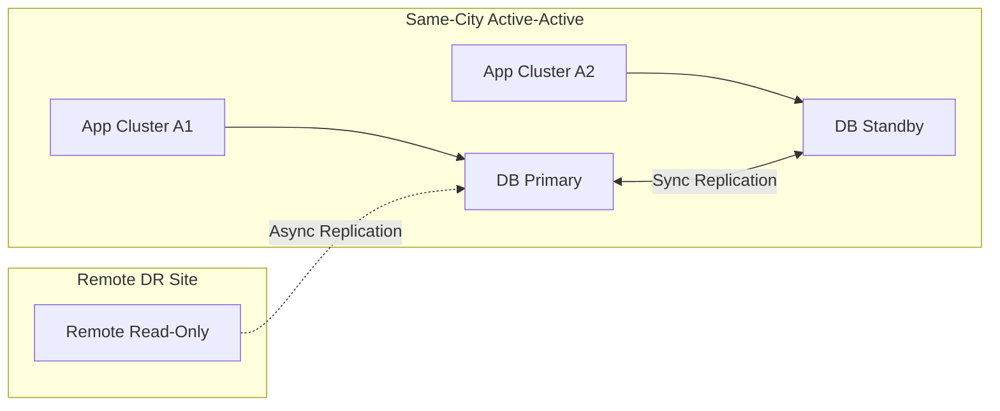
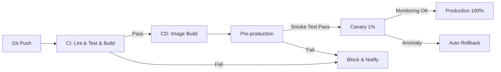

# [Product/System Name (English)] - Technical Requirements Document (TRD)

> **Document Status:** 🟡 Under Review / 🟢 Approved / 🔴 Rejected
>
> **Confidentiality Level:** Confidential / Internal / Public
>
> **Version:** v1.0.2
>
> **Date:** YYYY-MM-DD
>
> **Author:** [Architect / Tech Lead]
>
> **Reviewer:** [Name/Role]
>
> **Audience:** Kirky.X, CTO, Product/R&D/QA Leads, Subsystem Architects
>
> **Related Documents:** [Filename line range]

---

## 0. Document Guide

### 0.1 Purpose and Scope

**TRD answers:** "What tech stack to use, what performance metrics to hit, what non-functional constraints exist" — the cross-subsystem, cross-team technical review layer.
**ADD answers:** "What the system looks like, how modules are split, how data flows" — the implementation guide for a single subsystem.

**Applicable Scenarios:**

- ✅ New cross-subsystem technical platforms (e.g., POI Center, Recommendation Platform, Conversation Platform)
- ✅ Major technology selection decisions (e.g., introducing vector databases, LLM services, graph databases)
- ✅ Performance/reliability baseline definitions (affecting all downstream subsystem implementation constraints)
- ❌ Single subsystem internal architecture (use ADD instead)
- ❌ Business requirement analysis (use PRD/FRD)

**Audience:**

| Role | Responsibilities |
| :----------- | :------------------------- |
| Kirky.X | Technical architecture review and standards compliance audit |
| CTO | Technical strategy alignment and resource decisions |
| Product/R&D/QA Leads | Implementation feasibility and scheduling assessment |
| Subsystem Architects | Technical solution review and interface definition |

### 0.2 Related Documents

| Document Type | Filename | Relevant Section |
| -------- | ------------------- | ---------- |
| [Type] | [Filename] [Line Range] | [Section Description] |

> **Citation Format:** Related documents use `filename line range` format (e.g., `【模板】技术需求文档(TRD).md 3-17`). Line numbers may change as documents update; refer to actual content.

### 0.3 Change Log

| Version | Date | Author | Change Summary | Reviewer |
| :----- | :--------- | :----- | :--------------------------------------------------------------------------- | :------- |
| v0.1 | YYYY-MM-DD | [Name] | Initial draft | [Architect] |
| v0.2 | YYYY-MM-DD | [Name] | Review approved | [Reviewer] |
| v1.0 | YYYY-MM-DD | [Name] | Kirky.X review approved | [CTO] |
| v1.0.1 | 2026-06-20 | Xie Dong | Message queue recommended selection Kafka→Pulsar (unified event bus spec), Kafka/RocketMQ marked as deprecated | — |
| v1.0.2 | 2026-06-26 | Xie Dong | $ symbol Feishu escape fix (consistency-remediation-p0 WS11): amount/SQL parameter references $ → \$ | — |

---

## 1. Technical Challenges Analysis

> **Architect's Guide:** 5-minute overview of the core technical problems we need to solve.

### 1.1 Challenge List

| Challenge ID | Category | Description | Quantified Metric | Priority |
| :------ | :------- | :----------------------------------- | :---------------------------- | :----: |
| TC-001 | Performance | [e.g., Recommendation recall P99 ≤ 200ms] | [e.g., Full recall of millions of POIs] | P0 |
| TC-002 | Consistency | [e.g., Multi-device sync for trip planning] | [e.g., Eventually consistent ≤ 5s] | P0 |
| TC-003 | Scalability | [e.g., Support growth from 1M to 10M DAU] | [e.g., Horizontal scaling ≤ 1 week] | P1 |
| TC-004 | Availability | [e.g., In-trip assistant 7×24 online] | [e.g., Availability ≥ 99.95%] | P0 |
| TC-005 | Security | [e.g., User location data masking] | [e.g., All GPS coordinates accuracy ≤ 1km] | P0 |
| TC-006 | Cost | [e.g., LLM invocation cost control] | [e.g., Per conversation ≤ \$0.05] | P1 |

### 1.2 Key Technical Challenge Deep Dive

#### TC-001 Performance: [Challenge Name]

**Root Cause:** [One-paragraph description of the core conflict]

**Current Solution Limitations:** [e.g., Traditional ES search degrades to P99 of 800ms when POI volume exceeds 500K]

**Our Innovation:** [e.g., Two-tier recall (vector recall + inverted index recall) with RRF fusion, P99 stable within 150ms]

**Technical Risk:** [e.g., Vector recall cold-start performance is unstable]

---

## 2. Technology Stack Selection Matrix

### 2.1 Selection Decision Matrix

| Technology Dimension | Current Selection | Alternatives | Selection Rationale | Decision ADR |
| :------------- | :---------------------------- | :------------------------------------ | :----------------------------------- | :-------: |
| **Programming Language** | [e.g., Rust 1.78+] | [C++ / Go] | [e.g., Performance + memory safety + async ecosystem] | [ADR-001] |
| **Core Framework** | [e.g., Axum 0.7] | [Actix-web / Tokio native] | [e.g., Richest async ecosystem] | [ADR-001] |
| **Relational Storage** | [e.g., PostgreSQL 16] | [MySQL 8 / OceanBase] | [e.g., JSONB / PostGIS / Performance] | [ADR-002] |
| **Vector Database** | [e.g., Milvus 2.4] | [Qdrant / pgvector] | [e.g., Billion-scale vectors, QPS 1000+ validated] | [ADR-003] |
| **Graph Database** | [e.g., Neo4j 5.x] | [Memgraph / TigerGraph] | [e.g., Mature ecosystem + Cypher friendly] | [ADR-004] |
| **Message Queue** | [e.g., Pulsar 3.x] | [Kafka (deprecated) / RocketMQ (deprecated)] | [e.g., Unified event bus + multi-tenancy + persistence] | [ADR-005] |
| **Cache** | [e.g., Redis 7.2] | [KeyDB / DragonflyDB] | [e.g., Maturity + toolchain] | — |
| **Deployment Platform** | [e.g., Kubernetes 1.29] | [Docker Swarm / Bare metal] | [e.g., Elasticity + ecosystem] | [ADR-006] |
| **Observability** | [e.g., OpenTelemetry + Grafana] | [Datadog / New Relic] | [e.g., Open source + vendor neutral] | — |

### 2.2 Selection Constraints

- **Dependency Management:** [e.g., GPL-licensed dependencies prohibited; new dependencies require review]
- **Version Strategy:** [e.g., Long-term support LTS versions; quarterly upgrade assessment]
- **Domestic Requirements:** [e.g., Xinchuang environment compatibility, domestic database adaptation path]

### 2.3 Key Technical Decision ADR Index

| ADR Number | Decision Topic | Status | Review Date |
| :-------- | :----------------------------- | :-------: | :--------- |
| [ADR-001] | [e.g., Select Rust as core development language] | 🟢 Approved | YYYY-MM-DD |
| [ADR-002] | [e.g., Select PostgreSQL over MySQL] | 🟢 Approved | YYYY-MM-DD |
| [ADR-003] | [e.g., Select Milvus as vector database] | 🟡 Under Review | — |

---

## 3. Performance & Scalability

### 3.1 Performance Baseline

| Metric | Current | Target | Measurement Method | Acceptance Scenario |
| :----------------- | :----- | :----------------- | :------- | :------- |
| **QPS Peak** | [—] | [e.g., ≥ 10,000 QPS] | Load test | Business peak |
| **P99 Latency (Read)** | [—] | [e.g., ≤ 200ms] | Load test | Recommendation recall |
| **P99 Latency (Write)** | [—] | [e.g., ≤ 500ms] | Load test | Trip save |
| **Avg Response Time** | [—] | [e.g., ≤ 100ms] | APM | Daily operations |
| **Concurrent Users** | [—] | [e.g., ≥ 50,000] | Load test | Holiday peak |
| **Throughput (Write)** | [—] | [e.g., ≥ 5,000 TPS] | Load test | Trip creation |

### 3.2 Capacity Planning

| Resource | 10K DAU | 100K DAU | 1M DAU | 10M DAU |
| :------------- | :---------------- | :----------------- | :------------------ | :------------------ |
| **API Instances** | [e.g., 4] | [e.g., 8] | [e.g., 24] | [e.g., 80] |
| **Database Primary** | [e.g., 1 node 4C8G] | [e.g., 1 node 8C16G] | [e.g., 2 nodes 16C32G] | [e.g., 8 nodes 32C64G] |
| **Storage Capacity** | [e.g., 100 GB] | [e.g., 500 GB] | [e.g., 5 TB] | [e.g., 50 TB] |
| **CDN Traffic** | [e.g., 50 GB/day] | [e.g., 500 GB/day] | [e.g., 5 TB/day] | [e.g., 50 TB/day] |

### 3.3 Scalability Strategy

- **Horizontal Scaling:** [e.g., Stateless services ≥ 200 instances; database sharding 64 shards × 64 tables]
- **Vertical Scaling:** [e.g., Single instance max 32C64G]
- **Elastic Auto-scaling:** [e.g., HPA triggered by CPU/QPS; scale-out within ≤ 3 minutes]
- **Data Sharding Strategy:** [e.g., Hash by user_id into 16 shards; monthly partitioned tables]

---

## 4. Reliability & Disaster Recovery

### 4.1 Reliability Metrics

| Metric | Target | Measurement Method |
| :---------------------- | :------------------------------- | :------- |
| **Service Availability (SLO)** | [e.g., ≥ 99.95% (annual downtime ≤ 4.38h)] | Online monitoring |
| **Error Rate** | [e.g., ≤ 0.01%] | Monitoring alerts |
| **RTO (Recovery Time Objective)** | [e.g., ≤ 30 minutes] | Fault drills |
| **RPO (Recovery Point Objective)** | [e.g., ≤ 5 minutes] | Fault drills |

### 4.2 Disaster Recovery Architecture

### 4.3 Degradation and Circuit Breaker Strategy

| Scenario | Degradation Strategy | Trigger Condition | Recovery Strategy |
| :-------------- | :-------------- | :------------ | :------- |
| Recommendation recall timeout | Return popular items fallback | P99 > 500ms | Auto recovery |
| LLM service unavailable | Switch to small model / rules | Error rate > 5% | Probe recovery |
| Third-party API timeout | Retry + degraded cache | 3 consecutive failures | Exponential backoff retry |
| Database primary failure | Switch to standby | Heartbeat timeout | Manual confirmation |

---

## 5. Observability

### 5.1 Logging Standards

- **Log Format:** [e.g., JSON structured logs; trace_id / span_id / user_id required]
- **Log Level:** [e.g., Production INFO; Test DEBUG]
- **Log Retention:** [e.g., 30-day hot storage + 1-year cold storage]
- **PII Masking:** [e.g., Phone numbers, ID numbers, GPS coordinates must be masked]

### 5.2 Metrics Standards

- **Business Metrics:** [e.g., DAU, Recommendation CTR, Trip Completion Rate, Subscription Conversion Rate]
- **Technical Metrics:** [e.g., QPS, P99, Error Rate, JVM/System Load]
- **RED Metrics:** [Rate / Errors / Duration] Must cover all services
- **USE Metrics:** [Utilization / Saturation / Errors] Must cover all resources

### 5.3 Distributed Tracing

- **Trace Protocol:** [e.g., OpenTelemetry / Jaeger]
- **Sampling Rate:** [e.g., 100% (errors) + 1% (normal)]
- **Key Spans:** [e.g., HTTP → Auth → BizLogic → DB / Cache / RPC]

### 5.4 Alerting Strategy

| Alert Level | Trigger Condition | Notification Method | Response SLA |
| :---------- | :-------------------------- | :----------------- | :------- |
| **P0 Critical** | [e.g., Service unavailable / Data loss] | Phone + SMS + DingTalk | 5 minutes |
| **P1 High** | [e.g., SLO approaching alert threshold] | DingTalk + SMS | 30 minutes |
| **P2 Medium** | [e.g., Error rate rising] | DingTalk | 4 hours |
| **P3 Low** | [e.g., Capacity warning] | Email | 1 day |

---

## 6. Security & Compliance

### 6.1 Authentication & Authorization

- **Authentication:** [e.g., JWT + device fingerprint; OAuth 2.1]
- **Authorization Model:** [e.g., RBAC (role-based) / ABAC (attribute-based)]
- **Key Management:** [e.g., KMS centralized management; environment isolation]

### 6.2 Data Security

| Data Classification | Example | Encryption Requirement | Storage Requirement |
| :---------- | :--------------- | :------------------ | :------- |
| **L4 Top Secret** | Payment password, ID number | AES-256 encryption + masking | Isolated storage |
| **L3 Confidential** | Trip details, GPS | Field-level encryption | Encrypted storage |
| **L2 Internal** | Behavior logs | Masking | Standard storage |
| **L1 Public** | POI information | None | Standard storage |

### 6.3 Network Security

- **Transport Encryption:** [e.g., TLS 1.3 end-to-end]
- **Internal Communication:** [e.g., mTLS service mesh]
- **DDoS Protection:** [e.g., Anti-DDoS IP + rate limiting]
- **WAF:** [e.g., SQL injection / XSS / CSRF protection]

### 6.4 Compliance Requirements

- [ ] **Data Security Law:** Data stored domestically
- [ ] **Personal Information Protection Law (PIPL):** User consent + minimization principle
- [ ] **GDPR** (if applicable): Data portability / Right to be forgotten
- [ ] **MLPS Level 3:** Log audit ≥ 6 months

### 6.5 Audit Logs

- **Audit Scope:** [e.g., All write operations, sensitive read operations, permission changes]
- **Audit Fields:** [e.g., Operator / Timestamp / IP / Action / Resource]
- **Audit Retention:** [e.g., ≥ 1 year]

---

## 7. Maintainability

### 7.1 Code Organization

- **Repository Structure:** [e.g., monorepo / polyrepo]
- **Service Division:** [e.g., By business domain; service count ≤ 30]
- **Code Standards:** [e.g., Rust clippy / Go golangci-lint / TypeScript ESLint]
- **Dependency Management:** [e.g., cargo add / npm install; version locking]

### 7.2 CI/CD

- **Code Merge:** [e.g., PR requires ≥ 2 reviewers; CI must pass]
- **Automated Testing:** [e.g., Unit ≥ 80% coverage; integration tests for all critical paths]
- **Release Strategy:** [e.g., Canary deployment + auto rollback]
- **Rollback Time:** [e.g., ≤ 5 minutes]

### 7.3 Technical Debt Management

- **Debt Registration:** [e.g., Evaluate and log at each Sprint Review]
- **Debt Repayment:** [e.g., Repay ≥ 2 P1 items per month]
- **Refactoring Principle:** [e.g., Breaking refactoring must not run in parallel with feature iterations]

---

## 8. Technical Risk Assessment

| Risk ID | Description | Probability | Impact | Risk Level | Mitigation | Owner |
| :------ | :--------------------------- | :---: | :---: | :------: | :------------------------ | :-------- |
| TR-001 | [e.g., Vector database cold-start instability] | 🟡 Medium | 🔴 High | 🟠 Med-High | [e.g., Fallback recall rules] | [Architect] |
| TR-002 | [e.g., LLM API cost overrun] | 🟡 Medium | 🟡 Medium | 🟡 Medium | [e.g., Cache + rate limiting + monitoring] | [Backend TL] |
| TR-003 | [e.g., Third-party POI data invalidation] | 🔴 High | 🟡 Medium | 🟡 Medium | [e.g., Multi-source switching + health checks] | [Data TL] |
| TR-004 | [e.g., Single datacenter failure] | 🟢 Low | 🔴 High | 🟡 Medium | [e.g., Same-city active-active] | [SRE] |

---

## 9. Appendix

### 9.1 Glossary

| Term | English | Definition |
| :--- | :------------------------ | :--------------------- |
| SLO | Service Level Objective | Service level target |
| RTO | Recovery Time Objective | Recovery time target |
| RPO | Recovery Point Objective | Data loss target |
| P99 | Percentile 99 | 99% of requests complete within this time |
| HPA | Horizontal Pod Autoscaler | K8s horizontal Pod auto-scaling |

### 9.2 References

> Citation format follows APA 7th edition. In-text citations use superscript `[N]` format; reference list uses numbered list.
>
> Format examples:
>
> 1. Author, A. A. (Year). _Title of article_. _Title of Periodical_, _Volume_(Issue), Page–Page. https://doi.org/xxxxx
> 2. Author, A. A. (Year). _Title of work: Subtitle_. Publisher.
> 3. Author, A. A. (Year). _Title of paper_. Conference Name. https://doi.org/xxxxx

---

## 📌 TRD Writing Checklist

- [ ] §0 Document Guide: Purpose & Scope / Related Documents / Change Log
- [ ] §1 Technical Challenges: ≥ 3 P0 challenges with quantified metrics
- [ ] §2 Technology Stack Selection Matrix: ≥ 5 technology dimensions, each with rationale
- [ ] §3 Performance Baseline: QPS / P99 / Capacity Planning / Scalability Strategy
- [ ] §4 Reliability: Availability SLO / RTO / RPO / Degradation Strategy
- [ ] §5 Observability: Logs / Metrics / Distributed Tracing / Alerting — all four elements present
- [ ] §6 Security & Compliance: Authentication / Encryption / Compliance checklist
- [ ] §7 Maintainability: CI/CD / Testing / Debt Management
- [ ] §8 Risk Assessment: ≥ 3 risks with probability, impact, and mitigation
- [ ] §9 Appendix: Glossary / References
- [ ] Related document links complete
