# [Product/System Name (English)] - Database Design Document (DDD)

> **Document Status:** 🟡 Under Review / 🟢 Approved / 🔴 Rejected
>
> **Confidentiality Level:** Confidential / Internal Public / Public
>
> **Version:** v0.5
>
> **Date:** YYYY-MM-DD
>
> **Author:** [Name/Role]
>
> **Reviewer:** [Name/Role]
>
> **Audience:** [Role List]
>
> **Document Number:** DB-2026-XXX
>
> **Service Name:** [e.g., Order Service]
>
> **Database Name:** [e.g., trade_db]
>
> **Character Set:** UTF8
>
> **Collation:** UTF8
>
> **Storage Engine:** PostgreSQL default storage engine
>
> **Maintenance Team:** [DBA / Data Architecture Team / Backend Team]
>
> **Related Documents:** [Filename Line Range]

---

## 0. Document Guide

### 0.1 Document Purpose and Scope

[Explain the purpose, applicable scenarios, and non-applicable scenarios of this document]

### 0.2 Related Documents

| Document Type | Filename | Related Sections |
| -------- | ------------------- | ---------- |
| [Type] | [Filename] [Line Range] | [Section Description] |

> **Reference Format Note**: Related documents use the `filename line range` format (e.g., `【Template】Database Design Document Specification.md 3-31`). Line numbers may change as documents are updated; please refer to actual content.

### 0.3 Change Log

| Version | Date | Reviser | Change Content | Reviewer |
| :--- | :--- | :--- | :--- | :--- |
| v0.1 | YYYY-MM-DD | [Name] | Initial draft: t_order / t_order_item definition | |
| v0.2 | YYYY-MM-DD | [Name] | Added enum value state machine diagram, sharding strategy | |
| v0.3 | YYYY-MM-DD | [Name] | Added data archiving, security encryption, high availability architecture | |
| v0.4 | YYYY-MM-DD | [Name] | Official release | [DBA Lead] |
| v0.5 | 2026-06-20 | Xie Dong | Root cause fix: Primary key BIGINT UNSIGNED→UUID (application layer UUIDv7), TINYINT→VARCHAR+CHECK, TINYINT(1)→BOOLEAN, JSON→JSONB, ON UPDATE→trigger, DDL examples fully PostgreSQL-ized (removed backticks/COMMENT table syntax/KEY inline indexes) | [DBA Lead] |

---

## 1. Executive Summary

> **Architect/DBA/Developer 5-minute Guide:** What scale is this database designed for, how is it sharded, how is it archived, and what are the core constraints.

| Element | Content |
| :--- | :--- |
| **Data Scale** | Daily increase [N] million rows, existing [M] billion rows, expected to reach [Y] billion rows in [X] years |
| **Core Table Count** | [N] main tables + [M] related tables + [P] log/audit tables |
| **Sharding Strategy** | [e.g., Hash by user_id modulo into 16 databases, 64 tables per database] |
| **Archiving Strategy** | [e.g., Completed orders archived after 1 year, retained for 7 years] |
| **Sensitivity Level** | [e.g., Contains PII (phone/address) / Financial data (amounts)] |
| **High Availability Architecture** | [e.g., One primary two standbys + MGR / MHA automatic switchover] |

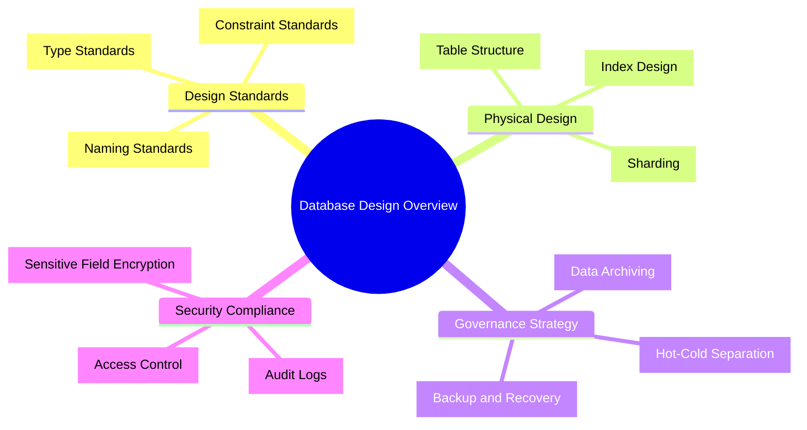

---

## 2. Design Standards

### 2.1 Naming Standards

> Unified naming is the foundation of team collaboration. Pinyin and abbreviations (except common abbreviations) are prohibited.

| Object | Naming Rule | Positive Example | Negative Example |
| :--- | :--- | :--- | :--- |
| **Database** | `business_domain_environment_sequence` | `trade_prod_01` | `order_db` |
| **Table name** | `module_entity_name_suffix`, lowercase underscore | `t_order_info` / `dwd_order_detail` | `OrderInfo` / `orderInfo` |
| **Field name** | Lowercase underscore, clear semantics | `user_id` / `create_time` | `uid` / `ctime` |
| **Primary key** | `pk_tablename` | `pk_t_order_info` | `PRIMARY` |
| **Unique index** | `uk_tablename_fieldname` | `uk_t_order_info_order_id` | `order_id_unique` |
| **Regular index** | `idx_tablename_fieldname` | `idx_t_order_info_user_id` | `index_user_id` |
| **Composite index** | `idx_tablename_field1_field2` | `idx_t_order_info_user_status` | `idx_1` |
| **Partition name** | `p_range_identifier` | `p_202605` / `p_202606` | `partition1` |

### 2.2 Data Type Standards

| Business Scenario | Recommended Type | Description | Prohibited Types |
| :--- | :--- | :--- | :--- |
| Primary key / Foreign key | `UUID` | Application layer generates UUIDv7, database auto-increment prohibited | `INT` (prone to overflow) / `BIGINT UNSIGNED` (violates application layer UUID rules) |
| Business unique identifier | `VARCHAR(32)` | Order numbers, transaction numbers, etc. | `CHAR` (fixed length wastes space) |
| Amount / Exchange rate | `DECIMAL(16,4)` | Precise calculation, retains 4 decimal places | `FLOAT` / `DOUBLE` |
| Short text | `VARCHAR(64/128/512)` | Graded by actual length | `TEXT` (index issues) |
| Long text / JSON | `JSONB` / `TEXT` | PostgreSQL prioritizes JSONB (supports GIN index) | `JSON` (poor performance) / `VARCHAR(9999)` |
| Status / Enum | `VARCHAR + CHECK` | Code layer maps enum dictionary, DB layer CHECK constrains valid values | `TINYINT` (MySQL-specific) / `INT` (unclear semantics) |
| Timestamp | `TIMESTAMPTZ(3)` | With milliseconds, timezone handled by application layer | `TIMESTAMP` (2038 problem) |
| Boolean | `BOOLEAN` | `true/false`, PostgreSQL native type | `TINYINT(1)` (MySQL-specific) / `BIT` / `CHAR(1)` |

### 2.3 Common Fields (Audit Fields)

> All business tables must include the following fields, automatically populated by the framework.

| Field Name | Type | Default Value | Description | Indexed |
| :--- | :--- | :--- | :--- | :---: |
| `id` | `UUID` | Application layer generates UUIDv7 | Physical primary key (application layer generated, database auto-increment prohibited) | PK |
| `create_time` | `TIMESTAMPTZ(3)` | `CURRENT_TIMESTAMP(3)` | Creation time | IDX |
| `update_time` | `TIMESTAMPTZ(3)` | `CURRENT_TIMESTAMP(3)` | Update time (maintained by trigger, `ON UPDATE` prohibited) | - |
| `create_by` | `UUID` | `'00000000-0000-7000-8000-000000000000'` | Creator ID | - |
| `update_by` | `UUID` | `'00000000-0000-7000-8000-000000000000'` | Updater ID | - |
| `is_deleted` | `BOOLEAN` | `false` | Logical deletion flag (false=not deleted, true=deleted) | IDX |
| `tenant_id` | `UUID` | `'00000000-0000-7000-8000-000000000000'` | Multi-tenant identifier (if applicable) | IDX |
| `version` | `INT` | `0` | Optimistic lock version number | - |

---

## 3. Data Architecture and Layering

### 3.1 Data Layered Architecture

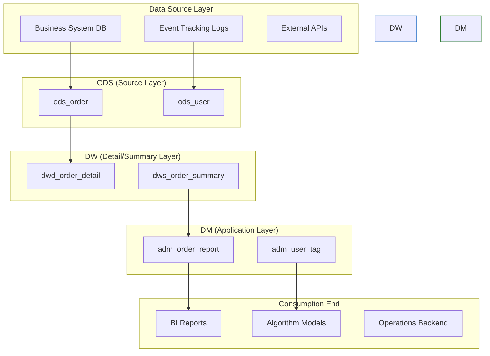

---

## 4. Logical Model Design

### 4.1 Domain Entity Relationship Diagram

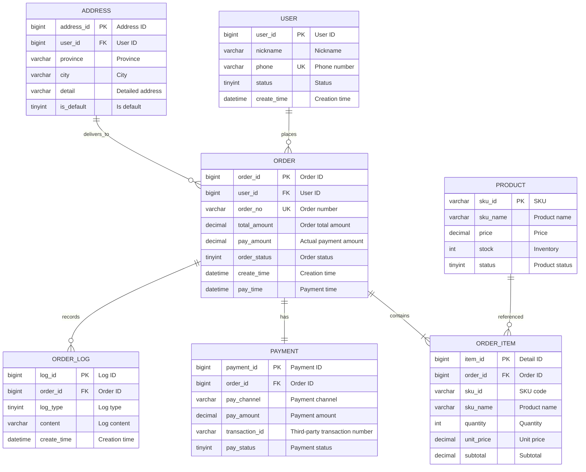

### 4.2 Entity List

| No. | Entity Name | Table Name | Chinese Name | Data Domain | Estimated Rows | Sensitivity Level | Owner |
| :--: | :--- | :--- | :--- | :--- | :--- | :--- | :--- |
| 1 | `USER` | `t_user` | User table | User domain | 100 million | 🔴 PII | [Name] |
| 2 | `ORDER` | `t_order` | Order master table | Transaction domain | 500 million | 🟡 Financial | [Name] |
| 3 | `ORDER_ITEM` | `t_order_item` | Order detail table | Transaction domain | 2 billion | 🟡 Financial | [Name] |
| 4 | `PRODUCT` | `t_product` | Product table | Product domain | 5 million | 🟢 Public | [Name] |
| 5 | `ADDRESS` | `t_address` | Shipping address table | User domain | 30 million | 🔴 PII | [Name] |
| 6 | `PAYMENT` | `t_payment` | Payment transaction table | Transaction domain | 500 million | 🟡 Financial | [Name] |
| 7 | `ORDER_LOG` | `t_order_log` | Order log table | Transaction domain | 5 billion | 🟢 Public | [Name] |

### 4.3 Relationship Definition

| Child Table | Child Table Field | Parent Table | Parent Table Field | Relationship Type | Delete Behavior | Business Description |
| :--- | :--- | :--- | :--- | :--- | :--- | :--- |
| `t_order` | `user_id` | `t_user` | `user_id` | `N:1` | Restrict delete | Cannot delete user when orders exist |
| `t_order` | `address_id` | `t_address` | `address_id` | `N:1` | Set null | Order retains snapshot after address deletion |
| `t_order_item` | `order_id` | `t_order` | `order_id` | `N:1` | Cascade delete | Details deleted when order is deleted |
| `t_order` | `order_id` | `t_payment` | `order_id` | `1:1` | Cascade delete | One-to-one payment record |

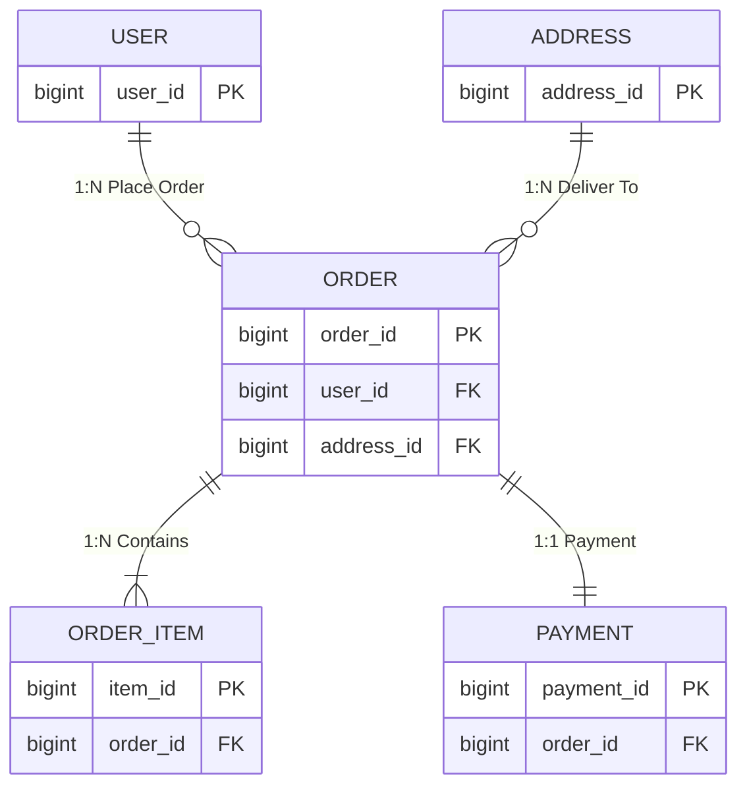

---

## 5. Physical Model Design

### 5.1 Table Definition: t_order (Order Master Table)

| Attribute | Value |
| :--- | :--- |
| **Table Name** | `t_order` |
| **Chinese Name** | Order master table |
| **Business Definition** | Records core information of user order placement, including amounts, status, payment information, etc. |
| **Data Domain** | Transaction domain |
| **Storage Engine** | PostgreSQL default |
| **Character Set** | UTF8 |
| **Collation** | UTF8 |
| **Sharding Strategy** | Sharded by `user_id` into 1024 tables (16 databases × 64 tables) |
| **Archiving Strategy** | Orders migrated to archive database 1 year after completion |
| **Estimated Rows** | 500 million (daily increase 1 million) |
| **Owner** | [Name] |

#### Field List

| No. | Field Name | Data Type | Nullable | Default Value | Constraint | Chinese Name | Business Description | Example Value |
| :--: | :--- | :--- | :---: | :--- | :--- | :--- | :--- | :--- |
| 1 | `order_id` | `UUID` | No | Application layer generates UUIDv7 | `PK` | Order ID | Application layer UUIDv7 globally unique | `0190a3b5-7e2f-7000-8000-000000000001` |
| 2 | `order_no` | `VARCHAR(32)` | No | - | `UK` | Order number | External display number, format `YYYYMMDD+6-digit serial` | `20250525123456` |
| 3 | `user_id` | `UUID` | No | - | `FK→t_user` | User ID | Order placer | `0190a3b5-7e2f-7000-8000-000000000002` |
| 4 | `address_id` | `UUID` | No | - | `FK→t_address` | Address ID | Shipping address snapshot ID | `0190a3b5-7e2f-7000-8000-000000000003` |
| 5 | `order_status` | `VARCHAR(20)` | No | `pending` | `CHECK` | Order status | Enum value, see §7.1 | `paid` (paid) |
| 6 | `total_amount` | `DECIMAL(16,4)` | No | `0.0000` | `CHECK>0` | Order total amount | Product original price sum | `399.9800` |
| 7 | `discount_amount` | `DECIMAL(16,4)` | No | `0.0000` | `CHECK≥0` | Discount amount | Coupon + activity discount | `40.0000` |
| 8 | `pay_amount` | `DECIMAL(16,4)` | No | `0.0000` | `CHECK≥0` | Actual payment amount | `total - discount` | `359.9800` |
| 9 | `pay_time` | `TIMESTAMPTZ(3)` | Yes | `NULL` | - | Payment time | Time user completed payment | `2026-05-25 10:35:22.123` |
| 10 | `pay_channel` | `VARCHAR(20)` | Yes | `NULL` | - | Payment channel | Enum value, see §7.2 | `alipay` |
| 11 | `source` | `VARCHAR(20)` | No | `unknown` | - | Source channel | Order placement source | `app_ios` |
| 12 | `remark` | `VARCHAR(500)` | Yes | `NULL` | - | Order remarks | User message | `Please ship ASAP` |
| 13 | `is_deleted` | `BOOLEAN` | No | `false` | - | Is deleted | Logical deletion flag | `false` |
| 14 | `create_time` | `TIMESTAMPTZ(3)` | No | `CURRENT_TIMESTAMP(3)` | - | Creation time | Order creation time | `2026-05-25 10:30:00.000` |
| 15 | `update_time` | `TIMESTAMPTZ(3)` | No | `CURRENT_TIMESTAMP(3)` | Trigger maintained | Update time | Automatically updated by trigger | `2026-05-25 10:35:22.123` |
| 16 | `create_by` | `UUID` | No | `00000000-0000-7000-8000-000000000000` | - | Creator | System or user ID | `0190a3b5-7e2f-7000-8000-000000000002` |
| 17 | `update_by` | `UUID` | No | `00000000-0000-7000-8000-000000000000` | - | Updater | System or user ID | `0190a3b5-7e2f-7000-8000-000000000002` |
| 18 | `version` | `INT` | No | `0` | - | Version number | Optimistic lock version number | `3` |

#### Index Design

| Index Name | Type | Fields | Description |
| :--- | :--- | :--- | :--- |
| `pk_t_order` | Primary key | `order_id` | Clustered index |
| `uk_t_order_order_no` | Unique | `order_no` | External number uniqueness |
| `idx_t_order_user_status` | Regular | `user_id, order_status, create_time` | User order list query |
| `idx_t_order_create_time` | Regular | `create_time` | Time range query/archiving |
| `idx_t_order_pay_time` | Regular | `pay_time` | Financial reconciliation |

#### Business Rule Constraints

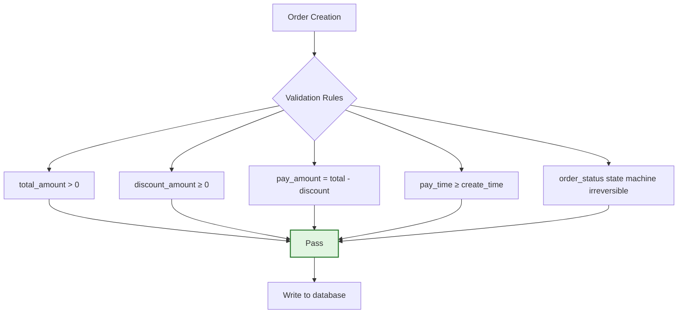

### 5.2 Table Definition: t_order_item (Order Detail Table)

| Attribute | Value |
| :--- | :--- |
| **Table Name** | `t_order_item` |
| **Chinese Name** | Order detail table |
| **Business Definition** | Records purchase information for each SKU in the order |
| **Sharding Strategy** | Same shard as `t_order` (by `user_id`) |

#### Field List

| No. | Field Name | Data Type | Nullable | Default Value | Constraint | Chinese Name | Business Description |
| :--: | :--- | :--- | :---: | :--- | :--- | :--- | :--- |
| 1 | `item_id` | `UUID` | No | Application layer generates UUIDv7 | `PK` | Detail ID | Application layer UUIDv7 |
| 2 | `order_id` | `UUID` | No | - | `FK→t_order` | Order ID | Associated order master table |
| 3 | `user_id` | `UUID` | No | - | - | User ID | Consistent with master table |
| 4 | `sku_id` | `VARCHAR(32)` | No | - | - | SKU code | Product unique identifier |
| 5 | `sku_name` | `VARCHAR(256)` | No | - | - | Product name | Snapshot at order time |
| 6 | `sku_image` | `VARCHAR(512)` | Yes | `NULL` | - | Product image | Snapshot at order time |
| 7 | `quantity` | `INT` | No | `1` | `CHECK>0` | Quantity | Purchase quantity |
| 8 | `unit_price` | `DECIMAL(16,4)` | No | `0.0000` | `CHECK>0` | Unit price | Unit price at order time |
| 9 | `subtotal` | `DECIMAL(16,4)` | No | `0.0000` | `CHECK>0` | Subtotal amount | `quantity × unit_price` |
| 10 | `snapshot_id` | `VARCHAR(32)` | Yes | `NULL` | - | Snapshot ID | Associated product historical snapshot |
| 11 | `create_time` | `TIMESTAMPTZ(3)` | No | `CURRENT_TIMESTAMP(3)` | - | Creation time | - |
| 12 | `update_time` | `TIMESTAMPTZ(3)` | No | `CURRENT_TIMESTAMP(3)` | Trigger maintained | Update time | Automatically updated by trigger |

---

## 6. Sharding Design

### 6.1 Sharding Architecture

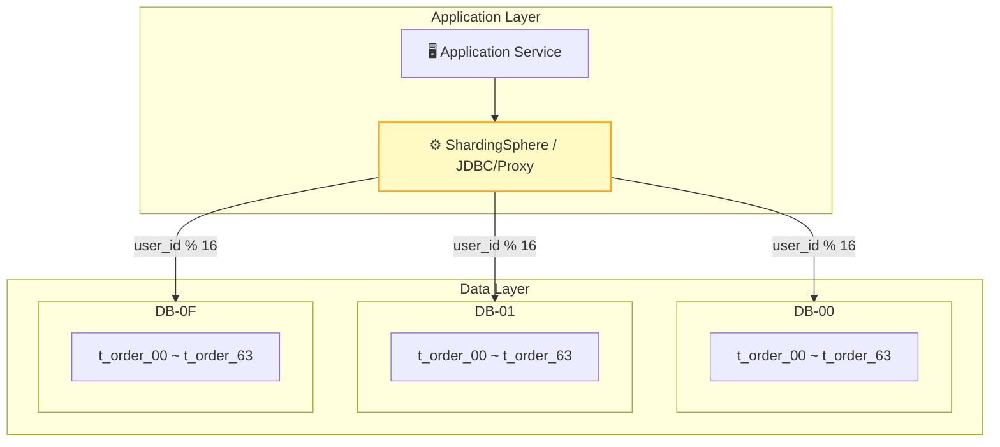

### 6.2 Sharding Strategy

| Dimension | Strategy | Description |
| :--- | :--- | :--- |
| **Sharding Key** | `user_id` | Avoid cross-shard queries, ensure data locality by user dimension |
| **Sharding Algorithm** | `user_id % 16` | 16 database instances |
| **Table Count** | 64 tables per database | Total 1024 tables, single table controlled within 5 million rows |
| **Routing Rules** | Middleware automatic routing | ShardingSphere-JDBC, transparent sharding logic |
| **Expansion Plan** | Consistent Hash | Supports smooth expansion, reduces data migration volume |

### 6.3 Bound Tables and Broadcast Tables

| Type | Table Name | Description |
| :--- | :--- | :--- |
| **Bound Table** | `t_order` + `t_order_item` | Same sharding key, associated queries don't need cross-shard |
| **Bound Table** | `t_order` + `t_payment` | Same sharding key, associated queries don't need cross-shard |
| **Broadcast Table** | `t_region` / `t_config` | Global table, full sync to each database, avoids cross-database JOIN |

---

## 7. Enumeration Dictionary

> All status, type, channel and other enum values are maintained uniformly here. Magic numbers in code are prohibited.

### 7.1 Order Status (order_status)

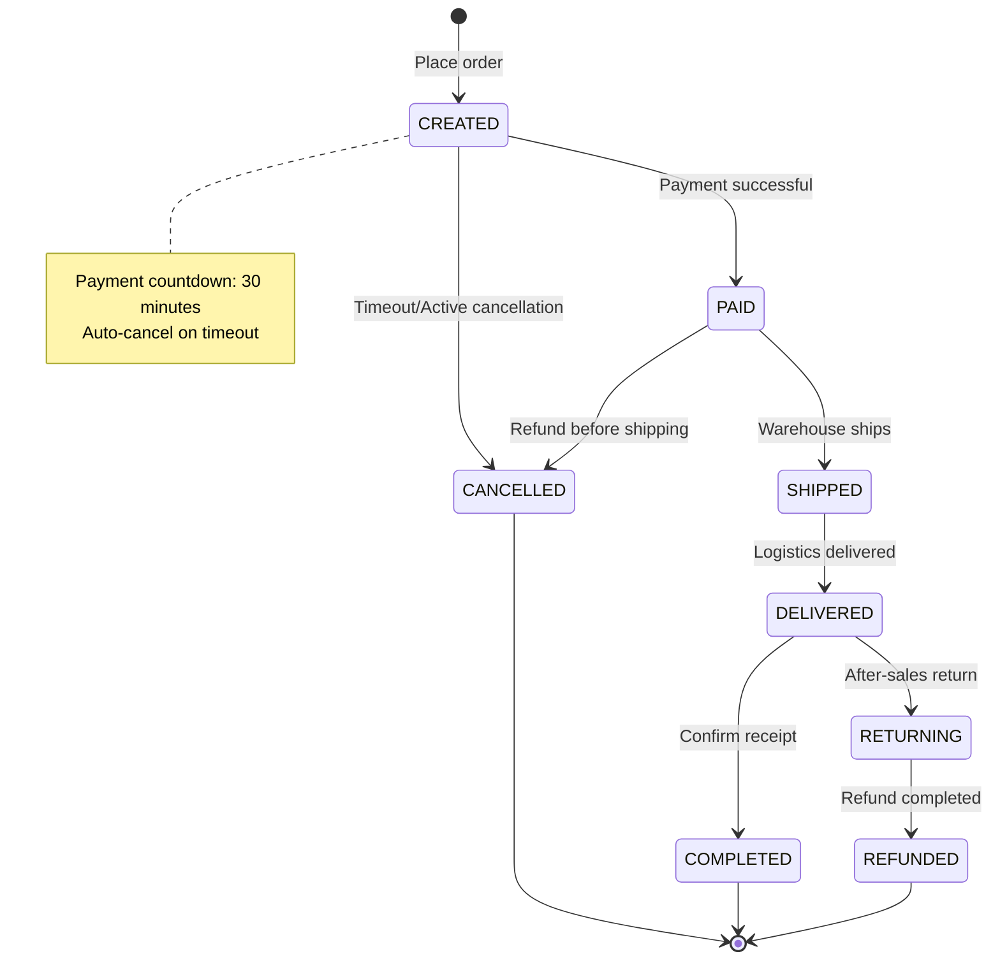

| Code | Name | English Identifier | Business Description | Reversible | Dwell Time |
| :--: | :--- | :--- | :--- | :---: | :--- |
| `10` | Pending payment | `CREATED` | Order created, awaiting payment | ❌ | ≤ 30 minutes |
| `20` | Paid | `PAID` | User completed payment | ❌ | - |
| `30` | Shipped | `SHIPPED` | Warehouse shipped | ❌ | - |
| `40` | Delivered | `DELIVERED` | Logistics delivered | ❌ | - |
| `50` | Completed | `COMPLETED` | User confirmed receipt | ❌ | - |
| `60` | Cancelled | `CANCELLED` | Timeout unpaid or active cancellation | ❌ | - |
| `70` | Returning | `RETURNING` | User initiated return | ✅ | ≤ 7 days |
| `80` | Refunded | `REFUNDED` | Refund process completed | ❌ | - |

### 7.2 Payment Channel (pay_channel)

| Code | Name | Description |
| :--- | :--- | :--- |
| `alipay` | Alipay | Domestic mainstream |
| `wechat` | WeChat Pay | Domestic mainstream |
| `unionpay` | UnionPay QuickPass | Bank card payment |
| `apple_pay` | Apple Pay | iOS |
| `credit_card` | Credit card | Overseas payment |

### 7.3 Source Channel (source)

| Code | Name | Description |
| :--- | :--- | :--- |
| `app_ios` | iOS App | Apple client |
| `app_android` | Android App | Android client |
| `web` | Web | PC browser |
| `mp` | Mini Program | WeChat Mini Program |
| `h5` | H5 Page | Mobile web page |

---

## 8. Data Archiving and Lifecycle

### 8.1 Archiving Strategy

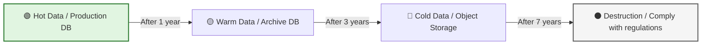

| Data Type | Archiving Condition | Archiving Method | Storage Medium | Retention Period |
| :--- | :--- | :--- | :--- | :---: |
| **Completed orders** | Status=completed, and `create_time` > 1 year | Migrate to archive database | PostgreSQL (low config) | 7 years |
| **Cancelled orders** | Status=cancelled, and `create_time` > 6 months | Migrate to archive database | PostgreSQL (low config) | 3 years |
| **Payment transactions** | `create_time` > 1 year | Migrate to archive database | PostgreSQL (low config) | 7 years |
| **Order logs** | `create_time` > 90 days | Migrate to object storage | OSS / S3 | 1 year |
| **Operation audit** | `create_time` > 1 year | Compressed storage | OSS / S3 | 3 years |

### 8.2 Archiving Execution Process

| Step | Operation | Tool | Verification |
| :--- | :--- | :--- | :--- |
| 1. Data screening | Screen data to be archived by time range | SQL script | Sample verification |
| 2. Data export | Export to CSV / Parquet | pg_dump / Spark | Row count verification |
| 3. Data migration | Write to archive database / Object storage | DataX / Flink | MD5 verification |
| 4. Data cleanup | Delete archived data from production database | Scheduled task | Space release confirmation |
| 5. Index rebuild | Rebuild related indexes in production database | OPTIMIZE TABLE | Query performance verification |

---

## 9. Data Lineage

> Describes the complete chain of core data from generation to consumption, facilitating impact analysis and troubleshooting.

### 9.1 Order Data Lineage

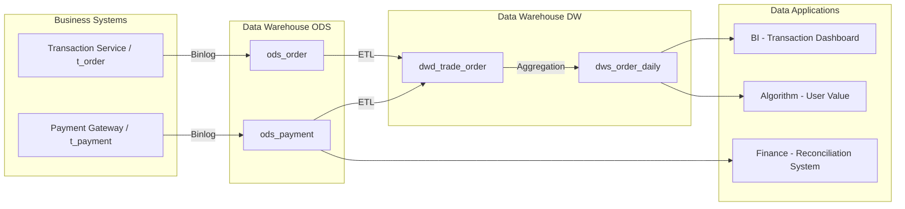

### 9.2 Field-Level Lineage Example

| Field | Upstream Source | Calculation Logic | Downstream Consumer |
| :--- | :--- | :--- | :--- |
| `pay_amount` | `t_order.pay_amount` | Original value | BI Reports / Financial Reconciliation / User Value Model |
| `gmv_daily` | `dwd_trade_order.pay_amount` | `SUM(pay_amount)` | Management Daily Report / Operations Backend |
| `user_ltv` | `dws_order_daily.gmv` | Attribution model calculation | Marketing Investment / Membership System |

---

## 10. High Availability and Disaster Recovery

### 10.1 Deployment Architecture

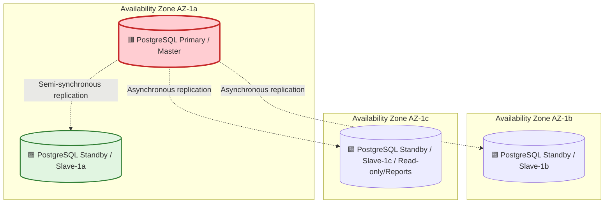

### 10.2 Disaster Recovery Strategy

| Strategy | RTO | RPO | Implementation |
| :--- | :---: | :---: | :--- |
| **Master-slave switchover** | < 30s | 0s (semi-synchronous) | MHA / MGR automatic switchover |
| **Cross-AZ disaster recovery** | < 2min | < 5s | Asynchronous replication, manually promote standby on failure |
| **Remote backup** | < 4h | < 1h | Daily full backup + Binlog incremental |
| **Flashback recovery** | < 10min | - | Binlog flashback tool (accidental operation recovery) |

---

## 11. Security and Compliance

### 11.1 Sensitive Field Encryption

| Field | Sensitivity Level | Encryption Method | Storage Form | Access Control |
| :--- | :--- | :--- | :--- | :--- |
| `phone` | 🔴 High | AES-256-GCM | Ciphertext | Only self/customer service |
| `address_detail` | 🔴 High | AES-256-GCM | Ciphertext | Only self/logistics |
| `id_card` | 🔴 High | AES-256-GCM | Ciphertext | Only real-name authentication system |
| `pay_amount` | 🟡 Medium | Plaintext | Original value | Finance/self |
| `bank_card` | 🔴 High | AES-256-GCM + Masking | Masked display | Only payment system |

### 11.2 Data Desensitization Strategy

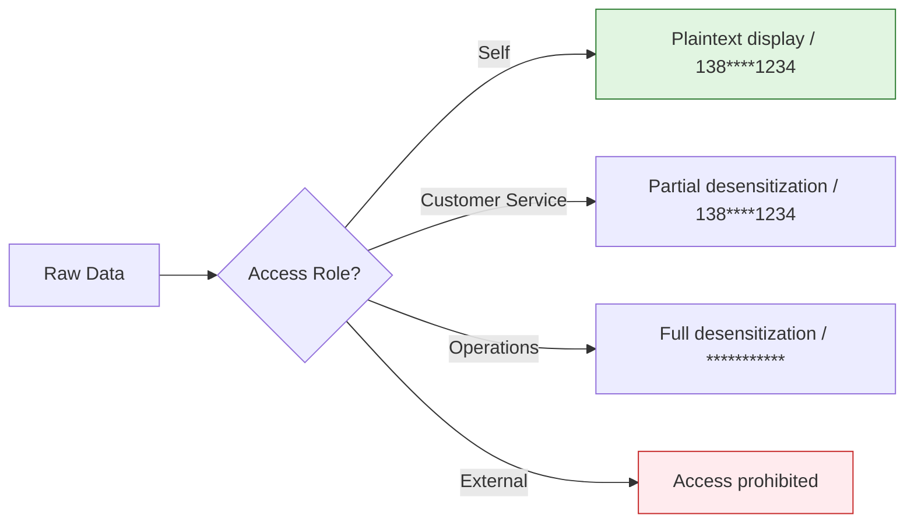

### 11.3 Audit Requirements

| Audit Item | Recorded Content | Retention Period |
| :--- | :--- | :---: |
| **Data changes** | Operator, time, before/after values, SQL | 3 years |
| **Data export** | Exporter, time, row count, purpose | 3 years |
| **Permission changes** | Changer, time, permission item, reason | 5 years |
| **Login access** | IP, time, account, operation result | 1 year |

---

## 12. Physical DDL

### 12.1 Table Creation Statements

```sql
-- Order master table
CREATE TABLE t_order (
  order_id           UUID                NOT NULL DEFAULT gen_random_uuid() COMMENT 'Order ID, application layer generates UUIDv7',
  order_no           VARCHAR(32)         NOT NULL COMMENT 'Order number, external display',
  user_id            UUID                NOT NULL COMMENT 'User ID, application layer UUIDv7',
  address_id         UUID                NOT NULL COMMENT 'Shipping address ID',
  order_status       VARCHAR(20)         NOT NULL DEFAULT 'pending' CHECK (order_status IN ('pending','paid','shipped','received','completed','cancelled','returning','refunded')) COMMENT 'Order status: pending awaiting payment paid paid shipped shipped received received completed completed cancelled cancelled returning returning refunded refunded',
  total_amount       DECIMAL(16,4)       NOT NULL DEFAULT 0.0000 COMMENT 'Order total amount',
  discount_amount    DECIMAL(16,4)       NOT NULL DEFAULT 0.0000 COMMENT 'Discount amount',
  pay_amount         DECIMAL(16,4)       NOT NULL DEFAULT 0.0000 COMMENT 'Actual payment amount',
  pay_time           TIMESTAMPTZ(3)              NULL COMMENT 'Payment time',
  pay_channel        VARCHAR(20)                 NULL COMMENT 'Payment channel: alipay/wechat/unionpay/apple_pay/credit_card',
  source             VARCHAR(20)         NOT NULL DEFAULT 'unknown' COMMENT 'Source channel: app_ios/app_android/web/mp/h5',
  remark             VARCHAR(500)               NULL COMMENT 'Order remarks',
  is_deleted         BOOLEAN             NOT NULL DEFAULT false COMMENT 'Is deleted: false no true yes',
  create_time        TIMESTAMPTZ(3)      NOT NULL DEFAULT CURRENT_TIMESTAMP(3) COMMENT 'Creation time',
  update_time        TIMESTAMPTZ(3)      NOT NULL DEFAULT CURRENT_TIMESTAMP(3) COMMENT 'Update time',
  create_by          UUID                NOT NULL DEFAULT '00000000-0000-7000-8000-000000000000' COMMENT 'Creator',
  update_by          UUID                NOT NULL DEFAULT '00000000-0000-7000-8000-000000000000' COMMENT 'Updater',
  version            INT                 NOT NULL DEFAULT 0 COMMENT 'Optimistic lock version number',
  PRIMARY KEY (order_id),
  CONSTRAINT uk_t_order_order_no UNIQUE (order_no)
);
CREATE INDEX idx_t_order_user_status ON t_order (user_id, order_status, create_time);
CREATE INDEX idx_t_order_create_time ON t_order (create_time);
CREATE INDEX idx_t_order_pay_time ON t_order (pay_time);

CREATE OR REPLACE FUNCTION update_t_order_updated_at()
RETURNS TRIGGER AS $$
BEGIN
    NEW.update_time = CURRENT_TIMESTAMP(3);
    RETURN NEW;
END;
$$ LANGUAGE plpgsql;

CREATE TRIGGER trg_t_order_updated_at
    BEFORE UPDATE ON t_order
    FOR EACH ROW
    EXECUTE FUNCTION update_t_order_updated_at();

-- Order detail table
CREATE TABLE t_order_item (
  item_id            UUID                NOT NULL DEFAULT gen_random_uuid() COMMENT 'Detail ID, application layer generates UUIDv7',
  order_id           UUID                NOT NULL COMMENT 'Order ID',
  user_id            UUID                NOT NULL COMMENT 'User ID, consistent with master table',
  sku_id             VARCHAR(32)         NOT NULL COMMENT 'SKU code',
  sku_name           VARCHAR(256)        NOT NULL COMMENT 'Product name (snapshot)',
  sku_image          VARCHAR(512)               NULL COMMENT 'Product image URL (snapshot)',
  quantity           INT                 NOT NULL DEFAULT 1 CHECK (quantity > 0) COMMENT 'Quantity',
  unit_price         DECIMAL(16,4)       NOT NULL DEFAULT 0.0000 COMMENT 'Unit price',
  subtotal           DECIMAL(16,4)       NOT NULL DEFAULT 0.0000 COMMENT 'Subtotal amount',
  snapshot_id        VARCHAR(32)                NULL COMMENT 'Product snapshot ID',
  create_time        TIMESTAMPTZ(3)      NOT NULL DEFAULT CURRENT_TIMESTAMP(3) COMMENT 'Creation time',
  update_time        TIMESTAMPTZ(3)      NOT NULL DEFAULT CURRENT_TIMESTAMP(3) COMMENT 'Update time',
  PRIMARY KEY (item_id),
  CONSTRAINT fk_t_order_item_order_id FOREIGN KEY (order_id) REFERENCES t_order(order_id)
);
CREATE INDEX idx_t_order_item_order_id ON t_order_item (order_id);
CREATE INDEX idx_t_order_item_user_id ON t_order_item (user_id);

CREATE OR REPLACE FUNCTION update_t_order_item_updated_at()
RETURNS TRIGGER AS $$
BEGIN
    NEW.update_time = CURRENT_TIMESTAMP(3);
    RETURN NEW;
END;
$$ LANGUAGE plpgsql;

CREATE TRIGGER trg_t_order_item_updated_at
    BEFORE UPDATE ON t_order_item
    FOR EACH ROW
    EXECUTE FUNCTION update_t_order_item_updated_at();
```

### 12.2 Partitioning and Storage Strategy

| Table Name | Partitioning Strategy | Sharding Strategy | Storage Cycle | Compression Strategy |
| :--- | :--- | :--- | :--- | :--- |
| `t_order` | Annual partition by `create_time` | 1024 shards by `user_id` | Hot data 1 year | Cold data ZSTD |
| `t_order_item` | Same as master table partition | Same as master table sharding | Hot data 1 year | Cold data ZSTD |
| `t_payment` | Monthly partition by `create_time` | 1024 shards by `user_id` | Hot data 1 year | Cold data ZSTD |
| `t_order_log` | Monthly partition by `create_time` | 1024 shards by `user_id` | Hot data 90 days | Cold data ZSTD |

---

## 13. Data Quality Rules

| Rule ID | Field | Rule Type | Rule Definition | Alert Level | Handling Strategy |
| :--- | :--- | :--- | :--- | :--- | :--- |
| DQ-001 | `total_amount` | Completeness | Not null and > 0 | 🔴 Blocking | Reject write |
| DQ-002 | `pay_amount` | Consistency | `pay_amount = total_amount - discount_amount` | 🔴 Blocking | Reject write |
| DQ-003 | `order_no` | Uniqueness | Globally unique | 🔴 Blocking | Reject write |
| DQ-004 | `pay_time` | Timeliness | `pay_time ≥ create_time` | 🟡 Warning | Log record |
| DQ-005 | `order_status` | Legality | Value within enum range | 🟡 Warning | Log record |

---

## 14. Appendix

### 14.1 Glossary

| Term | Definition |
| :--- | :--- |
| **PII** | Personally Identifiable Information |
| **MGR** | PostgreSQL Group Replication |
| **MHA** | PostgreSQL Master High Availability (Patroni/repmgr) |
| **ZSTD** | Zstandard compression algorithm |
| **Semi-synchronous replication** | Semi-Synchronous Replication, primary waits for at least one standby acknowledgment |
| **Consistent Hashing** | Consistent Hashing, commonly used sharding algorithm in distributed systems |
| **ODS/DWD/DWS/ADM** | Data warehouse layering: Source layer, Detail layer, Summary layer, Application layer |

### 14.2 Related Documents

| Document | Number | Link |
| :--- | :--- | :--- |
| Product Requirements Document (PRD) | PRD-2026-XXX | [Link] |
| Technical Requirements Document (TRD) | TRD-2026-XXX | [Link] |
| API Documentation | API-2026-XXX | [Link] |
| Data Security Specification | SEC-2026-XXX | [Link] |

---

## 15. Design Review Sign-off

| Role | Name | Signature | Date | Review Comments |
| :--- | :--- | :---: | :---: | :--- |
| **DBA Lead** | | | | [Storage/Performance/High Availability Confirmation] |
| **Architect** | | | | [Sharding/Scalability Confirmation] |
| **Backend Lead** | | | | [ORM/Query Confirmation] |
| **Security Lead** | | | | [Encryption/Desensitization/Compliance Confirmation] |
| **Data Lead** | | | | [Archiving/Data Quality Rules Confirmation] |