# [Product/System Name (English)] - Architecture Design Document (ADD)

> **Document Status:** 🟡 Under Review / 🟢 Approved / 🔴 Rejected
>
> **Confidentiality Level:** Confidential / Internal Public / Public
>
> **Version:** v0.4.4
>
> **Date:** YYYY-MM-DD
>
> **Author:** [Architect/Technical Lead]
>
> **Reviewer:** [Kirky.X/TL]
>
> **Audience:** [Role List]
>
> **Related Charter:** [Charter Number]
>
> **Related BRD:** [BRD Number]
>
> **Related PRD:** [PRD Number]

---

## 0. Document Guide

### 0.1 Document Purpose and Scope

[Explain the purpose, applicable scenarios, and non-applicable scenarios of this document]

### 0.2 Related Documents

| Document Type | Filename | Related Sections |
| -------- | ------------------- | ---------- |
| [Type] | [Filename] [Line Range] | [Section Description] |

> **Reference Format Note**: Related documents use the `filename line range` format (e.g., `【Template】Architecture Design Document.md 3-21`). Line numbers may change as documents are updated; please refer to actual content.

### 0.3 Change Log

| Version | Date | Reviser | Change Content | Reviewer |
| :--- | :--- | :--- | :--- | :--- |
| v0.1 | YYYY-MM-DD | [Name] | Initial draft: Context + Container diagram | [Name] |
| v0.2 | YYYY-MM-DD | [Name] | Added Component diagram + Deployment diagram | [Name] |
| v0.3 | YYYY-MM-DD | [Name] | Added ADR + Risk assessment | [Name] |
| v0.4 | YYYY-MM-DD | [Name] | Official release | [Kirky.X] |
| v0.4.1 | 2026-06-09 | Xie Dong | Fixed quadrantChart template to table format (Feishu incompatible) | — |
| v0.4.2 | 2026-06-09 | Xie Dong | Fixed xychart-beta chart to table for Feishu rendering compatibility | — |
| v0.4.3 | 2026-06-09 | Xie Dong | Fixed Gantt chart to table for Feishu rendering compatibility | — |
| v0.4.4 | 2026-06-20 | Xie Dong | Message middleware example Kafka→Pulsar (unified event bus specification) | — |

---

## 1. Executive Summary

> **Technical Decision Layer Guide:** One page clearly explaining "system boundaries, technology selection, core risks, key decisions".

| Element | Content |
| :--- | :--- |
| **System Positioning** | [One sentence, e.g., High-availability trading kernel supporting tens of millions of daily orders] |
| **Core Challenges** | [e.g., High-concurrency flash sales / Distributed transaction consistency / Multi-active disaster recovery] |
| **Technology Selection** | [e.g., Spring Cloud + PostgreSQL + Redis + Pulsar + K8s] |
| **Architecture Style** | [e.g., Microservices / Domain-Driven Design (DDD) / Event-Driven Architecture (EDA)] |
| **Key Metrics** | QPS ≥ [X] / P99 latency ≤ [Y]ms / Availability ≥ [Z]% |
| **Major Decisions** | [e.g., Abandoned distributed transaction 2PC, adopted Saga + local message table] |
| **Risk Level** | 🟢 Low risk / 🟡 Medium risk / 🔴 High risk |

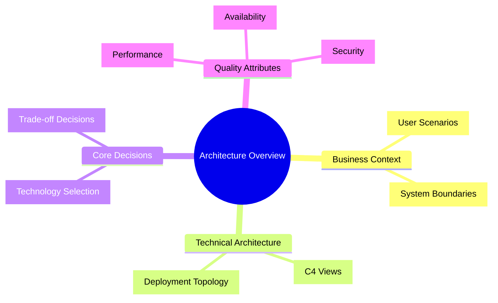

---

## 2. Current State and Requirements Analysis

### 2.1 Current Pain Points

| Dimension | Current State | Pain Points | Quantified Data |
| :--- | :--- | :--- | :--- |
| **Performance** | [e.g., Monolithic architecture] | [e.g., CPU 95% during peak, response timeout] | [e.g., P99=3s, target <<500ms] |
| **Availability** | [e.g., Single data center deployment] | [e.g., Data center failure causes full site downtime] | [e.g., 3 annual failures, each >2h] |
| **Scalability** | [e.g., Vertical scaling] | [e.g., Scaling requires downtime, takes 4h] | [e.g., Peak only supports 10K QPS] |
| **Maintainability** | [e.g., High code coupling] | [e.g., Changing one line affects 5 modules] | [e.g., Regression test cycle 2 weeks] |

### 2.2 Requirements Matrix (Functional + Non-functional)

> **Reference Note**: Detailed technical requirements, performance metrics, reliability requirements, security compliance requirements, please refer to **【Template】Technical Requirements Document(TRD).md**. This document only references key architecture requirements.

| Requirement Type | Requirement Description | Priority | Architecture Impact | Source Document |
| :--- | :--- | :---: | :--- | :--- |
| **Functional** | [e.g., Support 100K QPS flash sale ordering] | P0 | [Architecture design points] | Reference TRD§1.1 |
| **Non-functional** | [e.g., P99 latency ≤200ms] | P0 | [Performance design points] | Reference TRD§3.1 |
| **Non-functional** | [e.g., RTO≤30s, RPO≤5s] | P0 | [Disaster recovery design points] | Reference TRD§4.1 |
| **Non-functional** | [e.g., Support canary release] | P1 | [Deployment design points] | Reference TRD§7.2 |

> **Complete Requirements**: Technical challenge list, performance baseline, capacity planning, degradation strategy details please refer to **【Template】Technical Requirements Document(TRD).md §1-4**.

---

## 3. C4 Architecture Views

> Following Simon Brown's C4 Model, expanding layer by layer from macro to micro.

### 3.1 Level 1: System Context Diagram

> **Audience:** Everyone (Product, Operations, Management, Technical)
>
> **Abstraction Level:** 30,000 feet, describing the system's interaction boundaries with the external world.

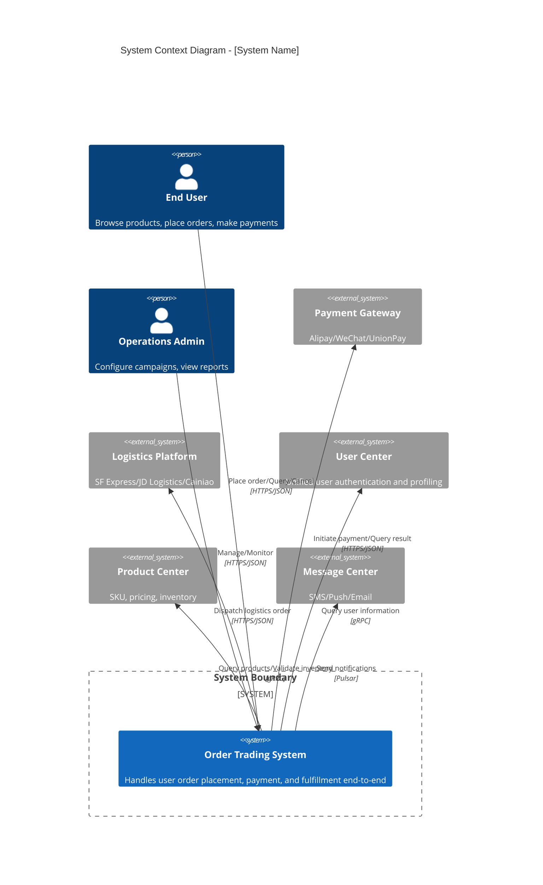

> **If the platform doesn't support C4Context syntax, use the following standard Mermaid alternative:**

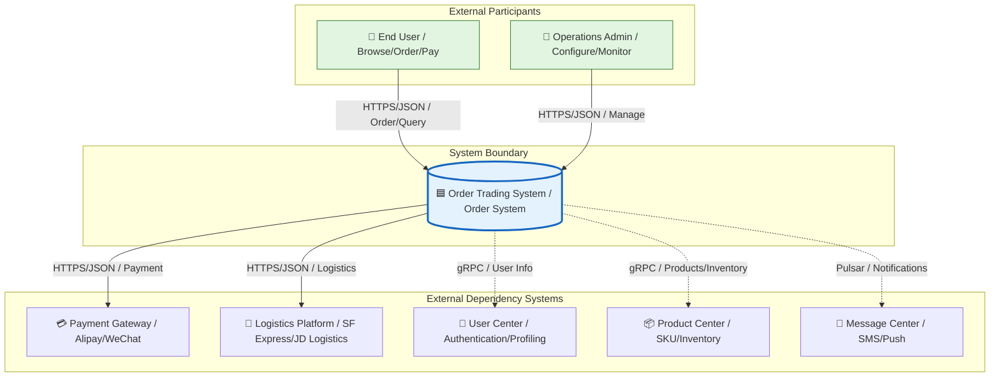

### 3.2 Level 2: Container Diagram

> **Audience:** Technical leads, developers, testers, operations
>
> **Abstraction Level:** 10,000 feet, describing deployable units (processes/services/storage) within the system and their interactions.

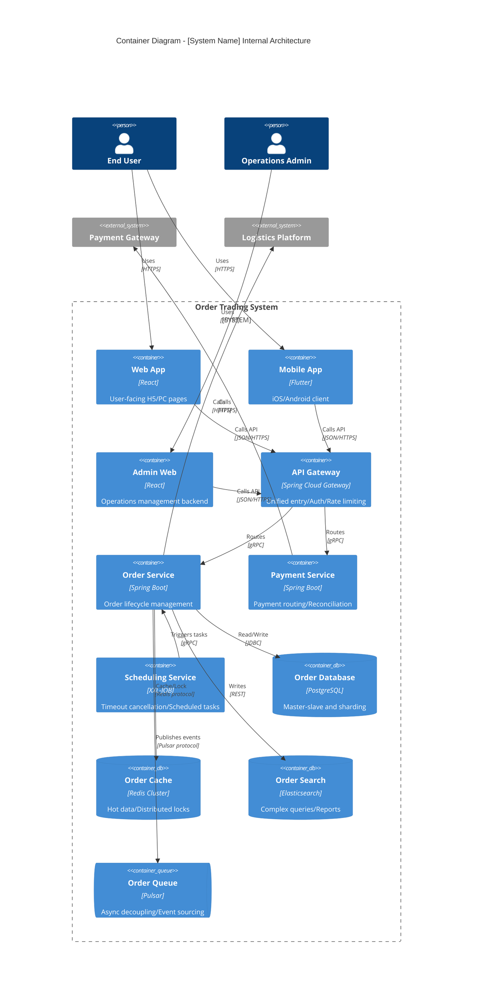

> **Standard Mermaid Alternative:**

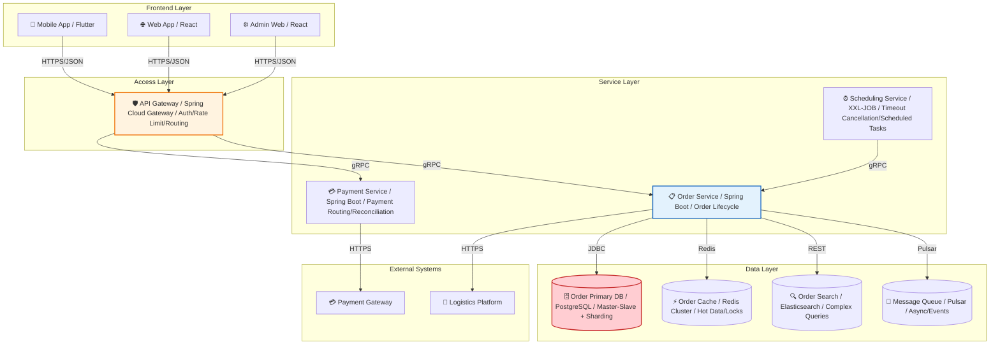

### 3.3 Level 3: Component Diagram

> **Audience:** Development team, architects
>
> **Abstraction Level:** 1,000 feet, describing component structure and interactions within a single container.

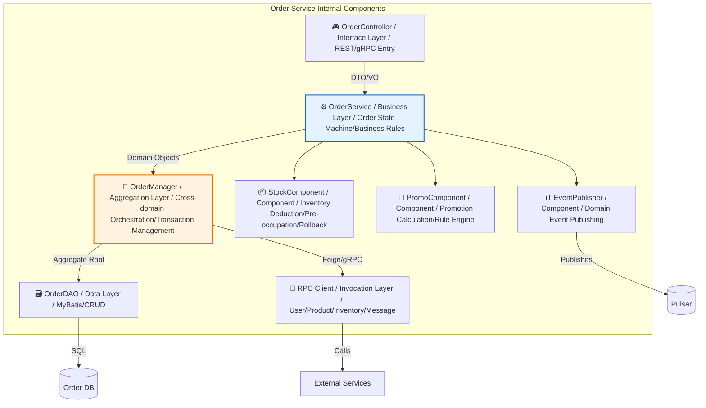

### 3.4 Level 4: Code/Class Diagram [Optional]

> **Audience:** Core developers
>
> **Description:** Only draw for core complex components (e.g., state machines, rule engines). Generally not recommended for full output to avoid over-design.

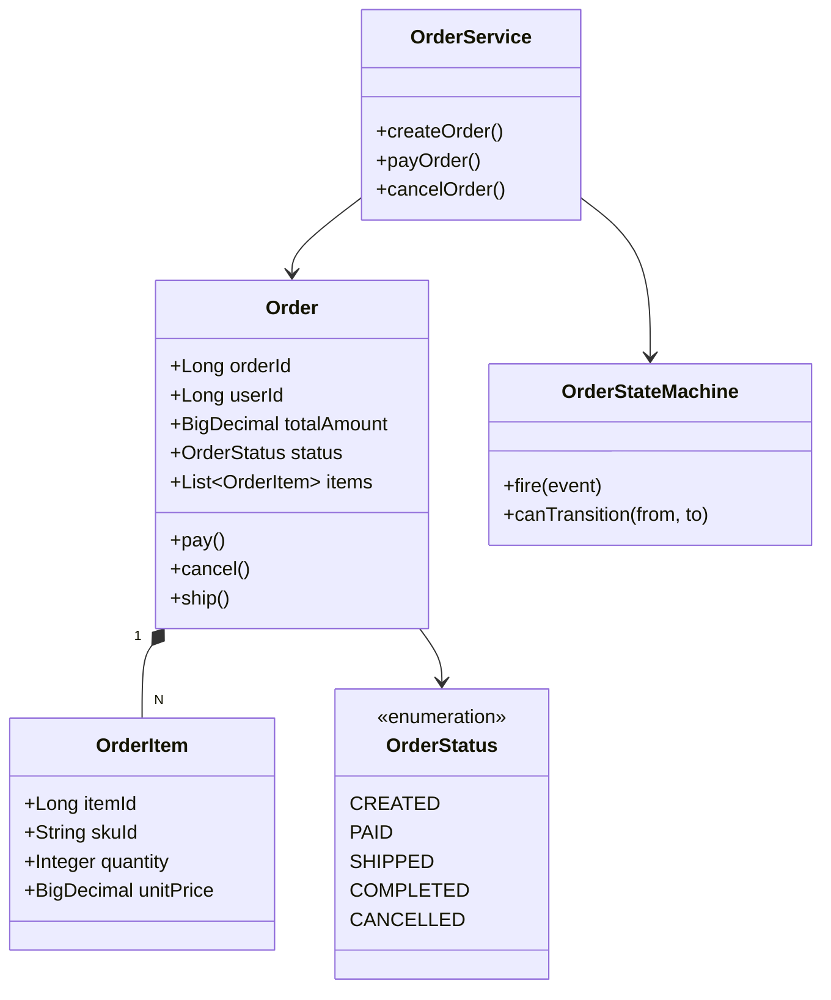

---

## 4. Dynamic Behavior Views

> Describes runtime behavior of key scenarios, supplementing C4 static views.

### 4.1 Core Process Sequence Diagram

#### Scenario: User Order Placement and Payment Full Flow

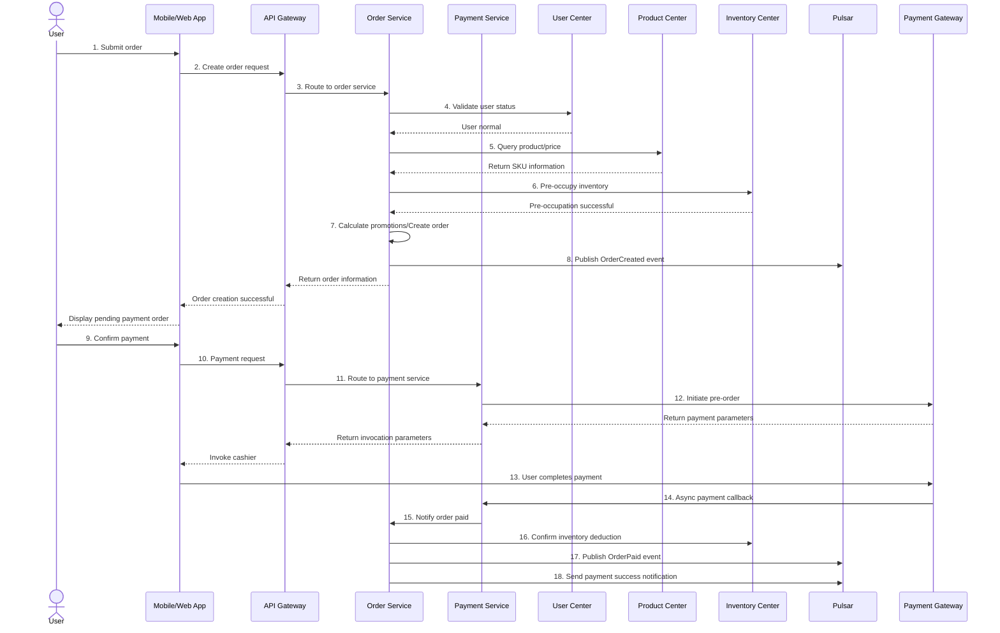

### 4.2 State Machine Diagram

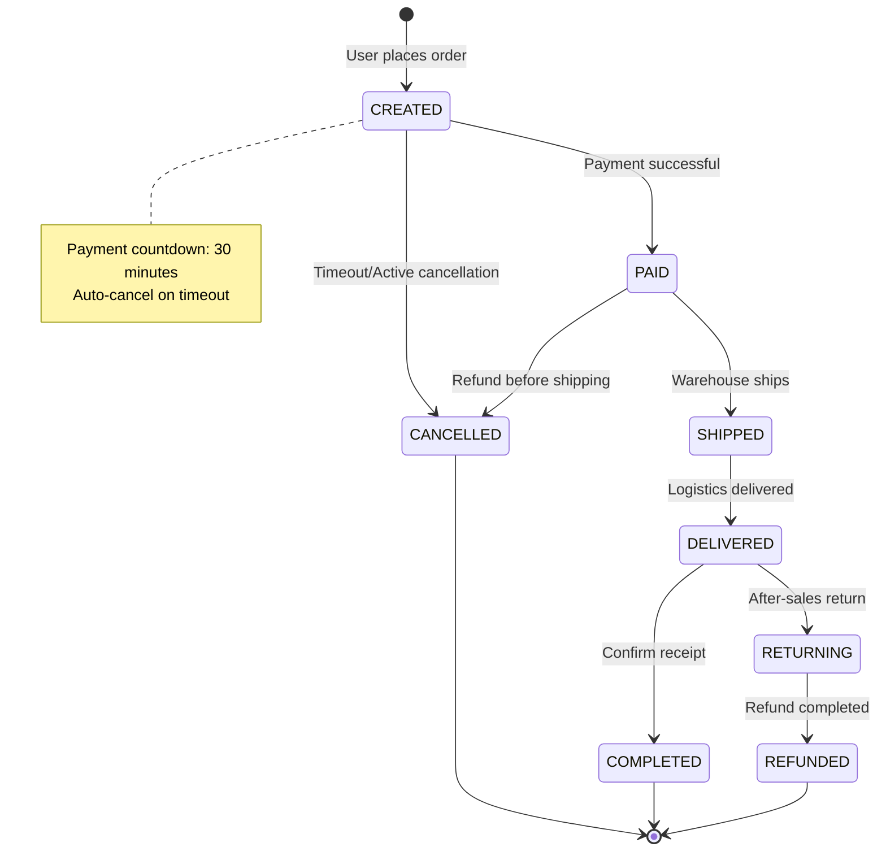

### 4.3 Exception/Compensation Process

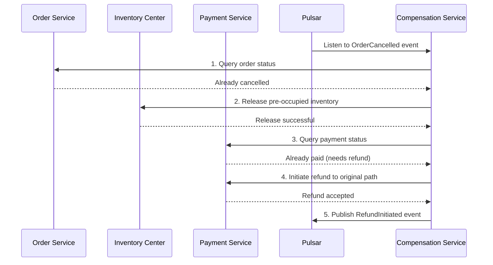

---

## 5. Deployment Architecture

> Describes how containers map to infrastructure, answering "where does it run, how to handle disaster recovery".

### 5.1 Deployment Topology

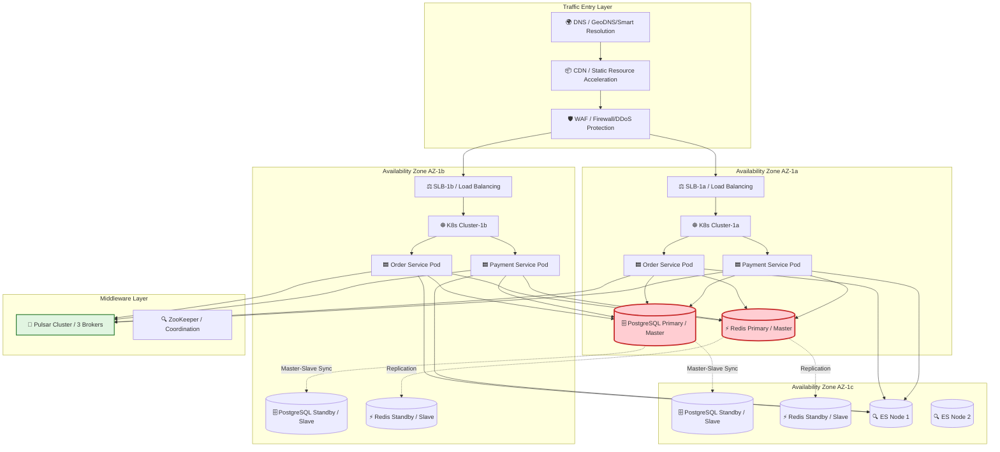

### 5.2 Multi-Active/Disaster Recovery Strategy

| Strategy | Implementation | RTO | RPO | Applicable Scenario |
| :--- | :--- | :---: | :--: | :--- |
| **Same-City Dual-Active** | AZ-1a/AZ-1b simultaneously handle traffic, database master-slave switchover | 30s | 0s | Data center-level failure |
| **Remote Cold Standby** | AZ-2 scheduled backup, manual switchover on failure | 30min | 5min | City-level disaster |
| **Multi-Data Replicas** | PostgreSQL semi-synchronous replication + Redis Cluster 3 masters 3 slaves | — | — | Data reliability |
| **Degradation Plan** | Inventory check degradation reads cache / Payment degradation uses fallback channel | 5s | — | Dependent service failure |

---

## 6. Data Architecture

### 6.1 Data Flow Diagram

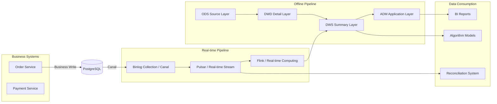

### 6.2 Data Sharding and Routing

| Data Type | Sharding Key | Sharding Strategy | Routing Method |
| :--- | :--- | :--- | :--- |
| Order Master Table | `user_id` | 128 shards, Hash modulo | ShardingSphere |
| Order Details | `order_id` | Same shard as master table (bound table) | Local routing |
| Payment Transactions | `order_id` | 128 shards | ShardingSphere |
| Logs/Audit | `create_time` | Monthly partitioning | Time range routing |

---

## 7. Core Algorithms and Mechanism Design

### 7.1 Global Unique ID Generation

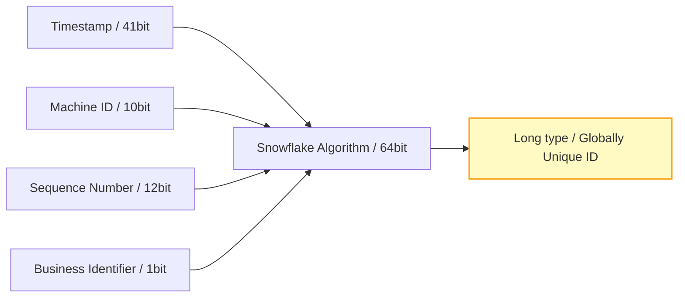

| Attribute | Design Value | Description |
| :--- | :--- | :--- |
| Timestamp bits | 41bit | Supports ~69 years (from custom start time) |
| Machine ID bits | 10bit | Supports 1024 nodes |
| Sequence Number bits | 12bit | 4096 IDs per node per millisecond |
| Business Identifier | 1bit | Distinguish different business lines (Order/Payment) |

### 7.2 Distributed Lock Design

| Scenario | Implementation | Key Design | Expiration Time | Renewal Strategy |
| :--- | :--- | :--- | :---: | :--- |
| Inventory deduction | Redis RedLock | `lock:stock:{skuId}` | 10s | Watchdog auto-renewal |
| Order creation deduplication | DB unique index | `uniq:order:{userId}:{date}` | Permanent | No renewal needed |
| Payment callback idempotency | Redis SET NX EX | `lock:pay:{orderId}` | 60s | Active release on business completion |

### 7.3 Caching Strategy

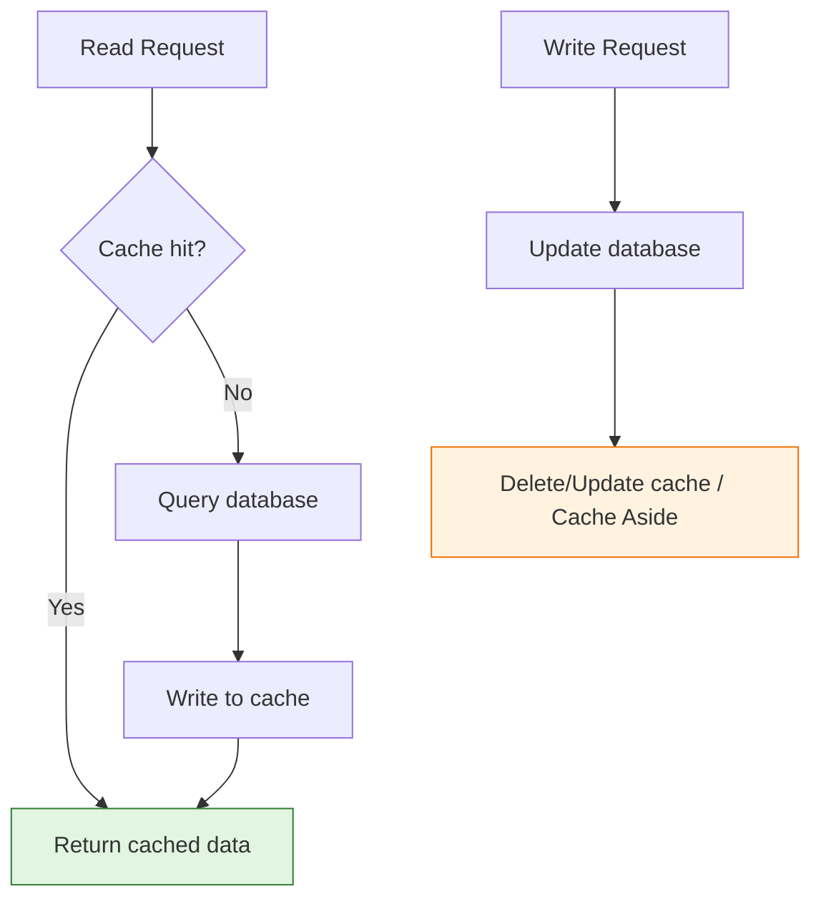

| Strategy | Applicable Scenario | Consistency Level | Implementation |
| :--- | :--- | :--- | :--- |
| Cache Aside | Order detail queries | Eventual consistency | Read from source on miss, delete cache on write |
| Write Through | Real-time inventory deduction | Strong consistency | Synchronous DB write + cache write |
| Read Through | Product basic information | Eventual consistency | Cache component auto-fetches from source |

---

## 8. Non-Functional Requirements Design (NFR / Quality Attributes)

### 8.1 Performance Design

| Metric | Target | Achievement Method |
| :--- | :--- | :--- |
| **Peak QPS** | ≥ 100,000 | Horizontal scaling + Cache warming + Async processing |
| **P99 Latency** | ≤ 200ms | Local cache + Database index optimization + Connection pool |
| **Concurrent Connections** | ≥ 50,000 | Gateway long connection optimization + K8s HPA |

> **Note**: xychart-beta is not compatible with Feishu, converted to table description (template sample data).

**Performance Capacity Planning**

| Time Point | QPS |
| :--- | :---: |
| Current | 5,000 |
| 3 months later | 30,000 |
| 6 months later | 80,000 |
| 12 months later | 120,000 |

### 8.2 High Availability Design

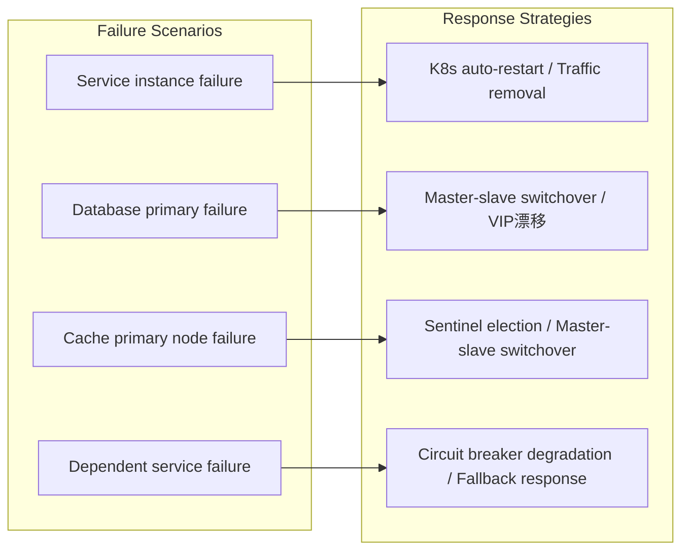

### 8.3 Security Design

| Layer | Measures | Implementation |
| :--- | :--- | :--- |
| **Access Layer** | HTTPS/TLS 1.3, WAF, DDoS protection | Cloud vendor security products |
| **Gateway Layer** | OAuth2.1 + JWT, Signature verification, Rate limiting | Spring Security + Custom filters |
| **Service Layer** | Zero trust network, mTLS, RBAC | Istio Service Mesh |
| **Data Layer** | Sensitive field encryption, SQL injection protection | AES-256-GCM + MyBatis parameterization |
| **Audit Layer** | Full link logging, Operation audit | SkyWalking + Audit tables |

---

## 9. Architecture Decision Records (ADR)

> All decisions affecting two or more services, or irreversible decisions must be recorded as ADR.

| Decision ID | Decision Content | Status | Context | Decision | Consequences | Date |
| :--- | :--- | :---: | :--- | :--- | :--- | :--- |
| **ADR-001** | Microservices vs Monolith | ✅ Adopted | Team >50 people, need independent iteration | Adopt microservices, split by domain | Increased operational complexity, need DevOps capabilities | YYYY-MM-DD |
| **ADR-002** | Database selection | ✅ Adopted | Team familiar with PostgreSQL, TiDB learning cost high | PostgreSQL master-slave + Sharding | Self-developed sharding logic, can migrate to TiDB in mid-term | YYYY-MM-DD |
| **ADR-003** | Distributed transaction scheme | ✅ Adopted | Performance priority, allow brief inconsistency | Saga + Local message table (eventual consistency) | Need reconciliation compensation mechanism, abandon strong consistency | YYYY-MM-DD |
| **ADR-004** | Cache consistency strategy | ✅ Adopted | High concurrency read-heavy | Cache Aside + Delayed double deletion | Brief inconsistency possible in extreme cases | YYYY-MM-DD |
| **ADR-005** | Deployment method | ✅ Adopted | Elastic scaling needs, cloud-native trend | K8s + Docker containerization | Need to build K8s operations capabilities | YYYY-MM-DD |

### ADR Detailed Example: ADR-003 Distributed Transaction

```markdown
## ADR-003: Distributed Transaction Consistency Scheme

### Status

Adopted ✅

### Context

Order creation involves three independent databases: order DB, inventory DB, coupon DB, data consistency must be ensured.

### Candidate Solutions

1. **2PC/XA**: Strong consistency, but blocking and poor performance, not suitable for high concurrency.
2. **TCC**: Better performance, but high business invasion, need to write Try/Confirm/Cancel for each operation.
3. **Saga + Local Message Table**: Eventual consistency, best performance, ensures consistency through async compensation.

### Decision

Choose solution 3: Saga + Local Message Table.

### Rationale

- Business scenario allows second-level inconsistency (inventory pre-occupation not immediately deducted doesn't affect user experience)
- Team already has message queue infrastructure (Pulsar)
- Avoids 2PC's blocking and single point of failure issues

### Consequences

- Need to develop reconciliation compensation service, periodically scan abnormally status orders
- Need to establish manual intervention process, handle compensation failed orders
- Monitoring needs to cover "long-standing unfinished transactions" alerts
```

---

## 10. Risk Assessment and Mitigation

> **Reference Note**: Project-level risks (business risks, market risks, personnel risks) please refer to **【Template】Project Charter.md §11.1**. This document only lists risks at the technical architecture level.

| Risk ID | Risk Description | Probability | Impact | Risk Level | Mitigation Measure | Owner |
| :--- | :--- | :---: | :---: | :---: | :--- | :--- |
| **R-001** | Poor cross-shard query performance after sharding | High | High | 🔴 | ES redundant full data, complex queries use search | [Name] |
| **R-002** | Cache avalanche causing DB overload | Medium | High | 🔴 | Multi-level cache + Random expiration + Circuit breaker degradation | [Name] |
| **R-003** | Message queue consumption delay causing inventory inconsistency | Medium | Medium | 🟡 | Monitor consumption delay, auto-scale consumers when exceeding threshold | [Name] |
| **R-004** | K8s cluster failure causing full service unavailability | Low | High | 🟡 | Same-city dual-active + Remote disaster recovery, core services retain VM deployment | [Name] |
| **R-005** | Third-party payment API changes | Medium | Medium | 🟡 | Abstract payment adaptation layer, support multi-channel rapid switching | [Name] |

> **Project-level Risks**: Complete risk register for project-level risks including policy risks, market risks, personnel risks (with trigger conditions and exit conditions) please refer to **【Template】Project Charter.md §11.1**.

> **Note**: This quadrant chart template has been converted to table description.

<!--
Original quadrantChart structure reference:
- title: Risk Heat Map (Probability vs Impact)
- x-axis: "Low Probability" --> "High Probability"
- y-axis: "Low Impact" --> "High Impact"
- quadrant-1: Key Focus (High/High)
- quadrant-2: Close Monitoring (Low/High)
- quadrant-3: General Attention (Low/Low)
- quadrant-4: Periodic Review (High/Low)
- Data points: "R-001 Shard Query": [0.8, 0.9]; "R-002 Cache Avalanche": [0.6, 0.9]; "R-003 Consumption Delay": [0.5, 0.6]; "R-004 K8s Failure": [0.3, 0.9]; "R-005 Payment Change": [0.5, 0.5]
  -->

| Quadrant | Area Characteristics | Strategy Suggestions |
| :--- | :--- | :--- |
| Quadrant 1 (High Probability · High Impact) | Key Focus (High/High) | Develop emergency plans, regular drills |
| Quadrant 2 (Low Probability · High Impact) | Close Monitoring (Low/High) | Set alert thresholds, continuous tracking |
| Quadrant 3 (Low Probability · Low Impact) | General Attention (Low/Low) | Regular management, no excessive attention needed |
| Quadrant 4 (High Probability · Low Impact) | Periodic Review (High/Low) | Establish process management |

| Name | X Value | Y Value | Quadrant |
| :--- | :---: | :---: | :--- |
| R-001 Shard Query | 0.8 | 0.9 | Quadrant 1 (Key Focus) |
| R-002 Cache Avalanche | 0.6 | 0.9 | Quadrant 1 (Key Focus) |
| R-003 Consumption Delay | 0.5 | 0.6 | Quadrant 1 (Key Focus) |
| R-004 K8s Failure | 0.3 | 0.9 | Quadrant 2 (Close Monitoring) |
| R-005 Payment Change | 0.5 | 0.5 | Midline Position |

---

## 11. Implementation Roadmap

> **Note**: Gantt chart is not compatible with Feishu, converted to table description.

| Phase | Task | Start Date | Duration | Status |
| :--- | :--- | :--- | :--: | :--: |
| Infrastructure | K8s cluster setup | YYYY-MM-DD | 14d | ⚪ |
| Infrastructure | Middleware deployment | After cluster setup | 10d | ⚪ |
| Core Services | Order service development | YYYY-MM-DD | 20d | ⚪ |
| Core Services | Payment service development | YYYY-MM-DD | 20d | ⚪ |
| Core Services | Integration testing | After development | 10d | ⚪ |
| Data Migration | Sharding scheme design | YYYY-MM-DD | 10d | ⚪ |
| Data Migration | Dual-write migration | After scheme design | 15d | ⚪ |
| Data Migration | Traffic switching verification | After dual-write migration | 10d | ⚪ |
| Launch | Canary release | After integration testing | 7d | ⚪ |
| Launch | Full release | After canary release | 3d | ⚪ |
| Launch | Monitoring alerts | After full release | 5d | ⚪ |

| Phase | Milestone | Time | Deliverables | Pass Criteria |
| :--- | :--- | :--- | :--- | :--- |
| **Phase 1** | Infrastructure ready | T+2 weeks | K8s cluster, Middleware | Load test passed |
| **Phase 2** | Core service development complete | T+6 weeks | Order/Payment service code | Unit test >80% |
| **Phase 3** | Data migration complete | T+10 weeks | Dual-write verification report | Data consistency check passed |
| **Phase 4** | Canary launch | T+12 weeks | Canary monitoring report | P0 incidents = 0, core metrics met |
| **Phase 5** | Full launch | T+13 weeks | Launch release report | Business verification passed |

---

## 12. Appendix

### 12.1 Glossary

| Term | Definition |
| :--- | :--- |
| **C4 Model** | Context/Container/Component/Code four-layer architecture description model |
| **ADR** | Architecture Decision Record |
| **Saga** | Distributed transaction pattern, achieves eventual consistency through local transactions + compensation |
| **RTO** | Recovery Time Objective |
| **RPO** | Recovery Point Objective |
| **QPS** | Queries Per Second |
| **P99** | 99th percentile latency |

### 12.2 Related Documents

| Document | Number | Link |
| :--- | :--- | :--- |
| Product Requirements Document (PRD) | PRD-2026-XXX | [Link] |
| Data Dictionary | DD-2026-XXX | [Link] |
| API Documentation | API-2026-XXX | [Link] |
| Test Plan | TEST-2026-XXX | [Link] |
| Operations Manual | OPS-2026-XXX | [Link] |

---

## 13. Review & Sign-off

| Role | Name | Signature | Date | Review Comments |
| :--- | :--- | :---: | :---: | :--- |
| Technical Lead | | | | |
| Architect | | | | |
| Development Representative | | | | |
| Testing Representative | | | | |
| Operations Representative | | | | |
| Security Lead | | | | |
| Project Director | | | | |