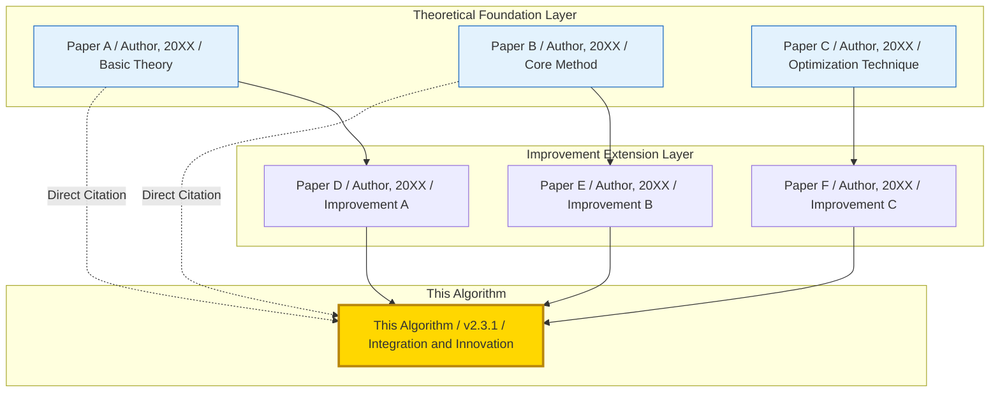
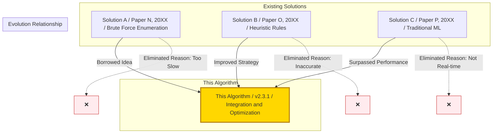
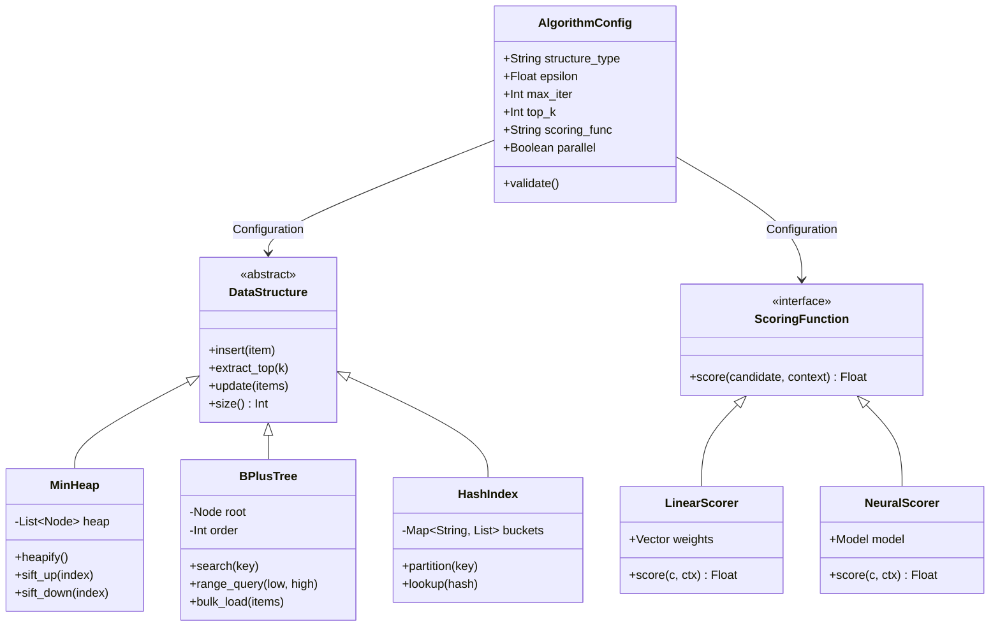
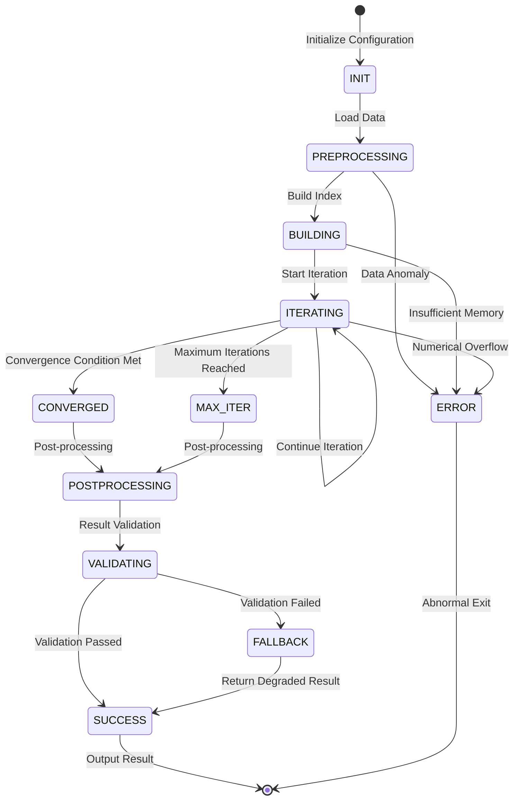
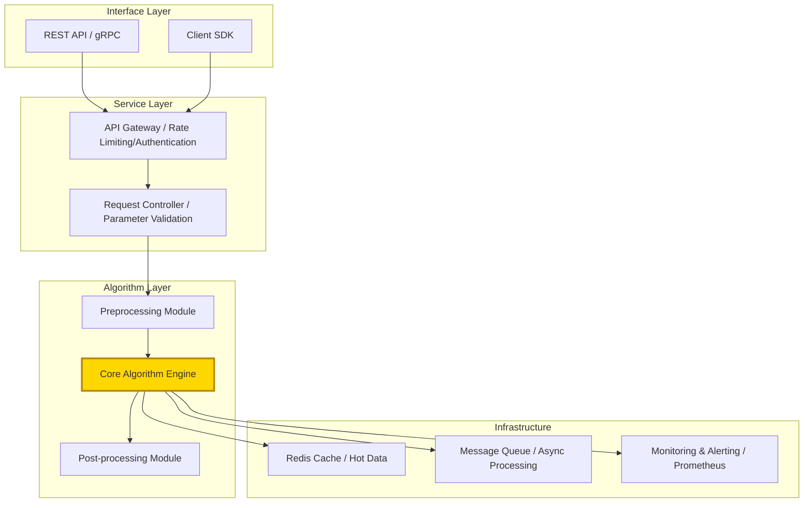
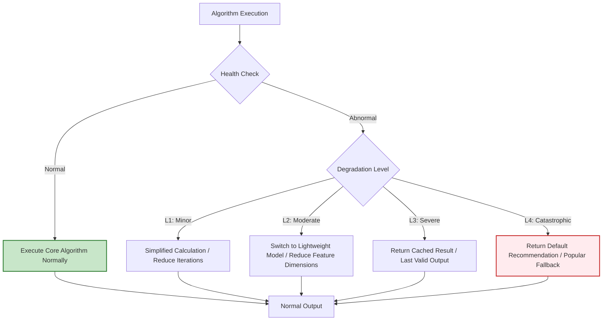
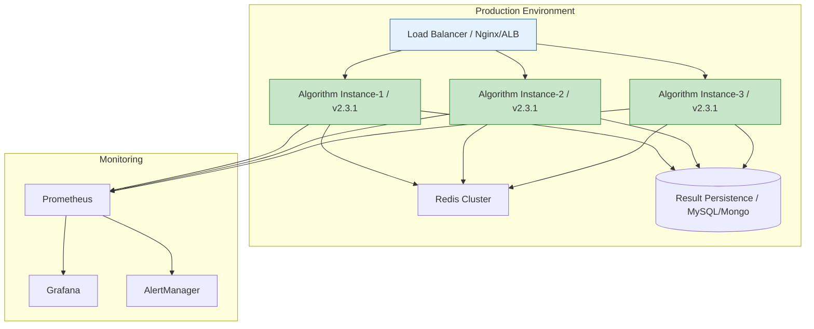
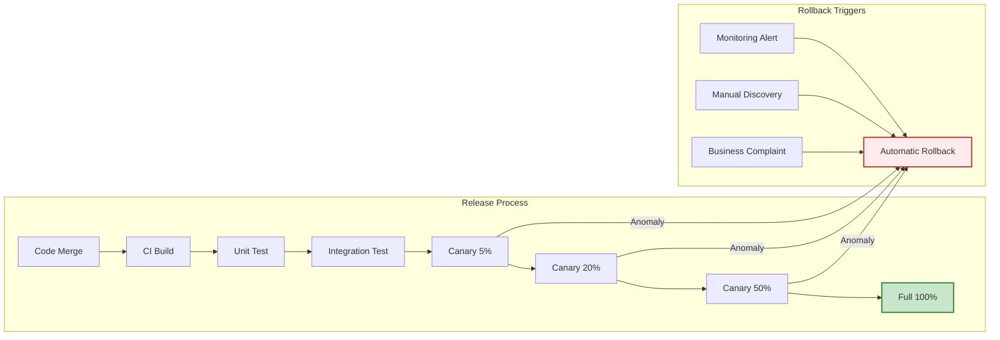

# [Product/System Name (English Name)] - Core Algorithm Document (CAD)

> **Document Status:** 🟡 Under Review / 🟢 Approved / 🔴 Rejected
>
> **Confidentiality Level:** Confidential / Internal Public / Public
>
> **Version:** v0.2.3
>
> **Date:** YYYY-MM-DD
>
> **Author:** [Algorithm Owner]
>
> **Reviewers:** [Engineering Owner, Architect]
>
> **Target Audience:** [Role List]
>
> **Algorithm Name:** 【Algorithm Name / Algorithm Name】
>
> **Algorithm Version:** v2.3.1
>
> **Standards Compliance:** Google Algorithm Design Doc / Alibaba Aone Algorithm Review / ByteDance CodeReview Standard / ACM Computing Surveys Citation Format

---

## 0. Document Guide

### 0.1 Document Purpose and Scope

[Explain the purpose, applicable scenarios, and non-applicable scenarios of this document]

### 0.2 Related Documents

| Document Type | Filename | Related Sections |
|---------------|----------|------------------|
| [Type] | [Filename] [Line Range] | [Section Description] |

> **Citation Format Note**: Related documents use the `Filename Line Range` format (e.g., `【模板】核心算法文档.md 3-21`). Line numbers may change with document updates; refer to actual content.

### 0.3 Change History

| Version | Date | Author | Changes | Reviewer |
|:--------|:-----|:-------|:--------|:---------|
| v1.0.0 | 2024-XX | [Name] | MVP version launch | [Reviewer] |
| v2.0.0 | 2024-XX | [Name] | Upgraded from single-machine to distributed architecture | [Reviewer] |
| v2.1.0 | 2024-XX | [Name] | Added multi-objective optimization (accuracy + diversity) | [Reviewer] |
| v2.2.0 | 2025-XX | [Name] | Introduced neural network scorer, accuracy +5% | [Reviewer] |
| v2.2.1 | 2025-XX | [Name] | Fixed null pointer exception in concurrent scenarios | [Reviewer] |
| v2.3.0 | 2026-XX | [Name] | Added dynamic hyperparameter hot update | [Reviewer] |
| v2.3.1 | 2026-XX | [Name] | Changed index structure to skip list, query latency reduced by 30% | [Reviewer] |
| v2.3.2 | 2026-06-09 | Xie Dong | Fix: Changed quadrantChart template to table format (Feishu incompatible) | — |
| v2.3.3 | 2026-06-09 | Xie Dong | Fixed xychart-beta chart to table for Feishu rendering compatibility | — |
| v2.3.4 | 2026-06-09 | Xie Dong | Fixed gantt chart to table for Feishu rendering compatibility | — |

---

## 2. Executive Summary

### 2.1 One-Sentence Description

> 【Algorithm】 is based on the **【Core Theory Literature, e.g., Vaswani et al., 2017】** concept of **【Core Mechanism】**, addressing **【Core Problem】** through **【Improvement】**, achieving **【Quantitative Result】** on **【Key Metrics】**, and has been applied to **【Business Scenario】**.

### 2.2 Algorithm Card

```mermaid
graph LR
    subgraph Algorithm Card
        A[Problem Type / e.g., sorting/retrieval/recommendation/optimization]
        B[Algorithm Paradigm / e.g., greedy/dynamic programming/deep learning/graph algorithm]
        C[Time Complexity / O(X)]
        D[Space Complexity / O(Y)]
        E[Core Data Structure / e.g., heap/skip list/neural network]
        F[Business Value / e.g., QPS improvement by X%]
        G[Theoretical Foundation / e.g., Paper A/Paper B]
    end

    A --> B --> C --> D --> E --> F
    G --> B

    style A fill:#e3f2fd,stroke:#1565c0
    style B fill:#e8f5e9,stroke:#2e7d32
    style C fill:#fff3e0,stroke:#e65100
    style D fill:#fff3e0,stroke:#e65100
    style E fill:#f3e5f5,stroke:#7b1fa2
    style F fill:#ffd700,stroke:#b8860b,stroke-width:2px
    style G fill:#c8e6c9,stroke:#2e7d32,stroke-width:2px
```

### 2.3 Key Metrics Overview

| Metric | Value | Test Environment | Baseline Comparison | Improvement | Reference Paper |
|--------|-------|------------------|---------------------|-------------|-----------------|
| **Accuracy/Precision** | [X.XX] | [Environment] | [Baseline] | +[X]% | [Paper C, Year] |
| **Throughput/QPS** | [X] req/s | [Environment] | [Baseline] | +[X]% | [Paper D, Year] |
| **Latency/P99** | [X] ms | [Environment] | [Baseline] | -[X]% | [Paper E, Year] |
| **Memory Usage** | [X] GB | [Environment] | [Baseline] | -[X]% | [Paper F, Year] |
| **Coverage/Recall** | [X.XX] | [Environment] | [Baseline] | +[X]% | [Paper G, Year] |

---

## 3. Theoretical Foundation and Literature Traceability

### 3.1 Foundational Theory Papers

The theoretical foundation of this algorithm is derived from the following milestone works:

| Paper | Authors/Year | Conference/Journal | Core Contribution | Citation Point in This Algorithm |
|-------|--------------|-------------------|-------------------|----------------------------------|
| **【Paper A】** | [Author, 20XX] | NeurIPS/ICML/SIGIR | 【Contribution Description, e.g., First proposed Transformer architecture】 | Core attention mechanism |
| **【Paper B】** | [Author, 20XX] | KDD/WWW/ICDE | 【Contribution Description, e.g., Proposed graph neural network message passing paradigm】 | Relational modeling module |
| **【Paper C】** | [Author, 20XX] | ACL/EMNLP/NAACL | 【Contribution Description, e.g., Fine-tuning strategy for pre-trained language models】 | Training strategy |
| **【Paper D】** | [Author, 20XX] | OSDI/SOSP/ATC | 【Contribution Description, e.g., Large-scale system load balancing algorithm】 | Distributed scheduling |

### 3.2 Academic Evolution Map



### 3.3 Direct Citation vs. Heuristic Citation

| Citation Type | Paper | Citation Location | Citation Method | Description |
|---------------|-------|-------------------|-----------------|-------------|
| **Direct Citation** | [Paper A] | Section 4.2 Pseudocode | Core formula directly adopted | Original definition unchanged |
| **Direct Citation** | [Paper B] | Section 7.1 Class Diagram | Data structure inheritance | Standard implementation |
| **Improved Citation** | [Paper C] | Section 4.3 Sub-algorithm | Modified its loss function | Added business constraint terms |
| **Heuristic Citation** | [Paper D] | Section 3.2 Innovation Points | Borrowed its divide-and-conquer idea | Applied to new scenarios |
| **Comparative Citation** | [Paper E] | Section 10.1 | Used as baseline method | Experimental comparison target |
| **Method Citation** | [Paper F] | Section 6.1 Complexity | Adopted its complexity analysis framework | Unified analysis standard |

---

## 4. Problem Definition and Formalization

### 4.1 Business Background

【Describe the business scenario: Why is this algorithm needed? What are the current system pain points? What are the consequences of not addressing them?】

> For example: In recommendation systems, user real-time behavior sequences can reach 10^4 in length. Traditional Attention [1] with O(n²) complexity results in P99 latency exceeding 500ms, severely impacting user experience.

### 4.2 Formal Definition

**Input**:
- Let $X = \{x_1, x_2, \dots, x_n\}$ be the input set, where $x_i \in \mathcal{X}$
- Constraints: 【e.g., $n \leq 10^6$, $x_i$ is a sparse vector】

**Output**:
- Let $Y = \{y_1, y_2, \dots, y_k\}$ be the output results, where $y_j \in \mathcal{Y}$
- Output constraints: 【e.g., $k \leq 100$, $y_j$ must satisfy monotonicity】

**Optimization Objective**:
$$\arg\min_{f \in \mathcal{F}} \mathcal{L}(f(X), Y_{gt}) + \lambda \Omega(f)$$

Where:
- $\mathcal{L}$ is the 【loss function, e.g., cross-entropy/mean squared error, citing Paper G's definition】
- $\Omega(f)$ is the 【regularization term, e.g., L2/model complexity penalty, citing Paper H's regularization framework】
- $\lambda$ is the balancing coefficient

### 4.3 Problem Classification and Difficulty

> **Note**: This quadrant chart template has been converted to a table description.

<!--
Original quadrantChart structure reference:
- title: Problem Positioning: Computational Complexity vs. Data Scale
- x-axis: "Low Data Scale" --> "High Data Scale"
- y-axis: "Low Computational Complexity" --> "High Computational Complexity"
- quadrant-1: Big Data + High Complexity: Requires Approximation/Distributed
- quadrant-2: Big Data + Low Complexity: Engineering Optimization Sufficient
- quadrant-3: Small Data + Low Complexity: Simple Solution
- quadrant-4: Small Data + High Complexity: Research Problem
- Data points: "This Algorithm": [0.8, 0.7]; "Baseline Solution": [0.6, 0.3]; "Ideal Target": [0.9, 0.2]
-->

| Quadrant | Regional Characteristics | Strategy Recommendation |
|:---------|:-------------------------|:-------------------------|
| Quadrant 1 (Big Data · High Complexity) | Big Data + High Complexity: Requires Approximation/Distributed | Use approximation algorithms or distributed computing |
| Quadrant 2 (Big Data · Low Complexity) | Big Data + Low Complexity: Engineering Optimization Sufficient | Focus on engineering implementation and IO optimization |
| Quadrant 3 (Small Data · Low Complexity) | Small Data + Low Complexity: Simple Solution | Use exact algorithms directly |
| Quadrant 4 (Small Data · High Complexity) | Small Data + High Complexity: Research Problem | Explore heuristic or hybrid strategies |

| Name | X Value | Y Value | Quadrant |
|:-----|:-------:|:-------:|:---------|
| This Algorithm | 0.8 | 0.7 | Quadrant 1 (Big Data + High Complexity) |
| Baseline Solution | 0.6 | 0.3 | Quadrant 3 (Small Data + Low Complexity) |
| Ideal Target | 0.9 | 0.2 | Quadrant 4 (Small Data + High Complexity) |

---

## 5. Core Algorithm Ideas

### 5.1 Intuitive Explanation

【Explain the algorithm principle in non-technical language to product managers/business stakeholders, using analogies】

> For example: This algorithm is like a "smart librarian in a library" — instead of browsing each book sequentially (O(n)), it first partitions by topic (bucketing, borrowing from Paper I's locality-sensitive hashing idea), then establishes express lanes in popular areas (indexing, based on Paper J's skip list structure), thereby reducing lookup time from hours to seconds.

### 5.2 Core Innovations and Paper Comparison

| Innovation Point | Difference from Traditional Methods | Benefits Brought | Corresponding Section | Related Paper |
|------------------|-------------------------------------|------------------|-----------------------|---------------|
| **Innovation 1** | 【Difference Description】 | 【Quantitative Benefit】 | [Section] | [Paper K] |
| **Innovation 2** | 【Difference Description】 | 【Quantitative Benefit】 | [Section] | [Paper L] |
| **Innovation 3** | 【Difference Description】 | 【Quantitative Benefit】 | [Section] | [Paper M] |

### 5.3 Relationship Between This Algorithm and Existing Solutions



---

## 6. Detailed Algorithm Description and Pseudocode

### 6.1 Algorithm Flowchart

```mermaid
flowchart TD
    Start([Start]) --> Input[Receive Input X]
    Input --> Preprocess[Preprocessing / Cleaning/Normalization/Bucketing]
    Preprocess --> Check{Scale Check}

    Check -->|Small Scale| Direct[Direct Computation / O(n)]
    Check -->|Large Scale| Core[Core Algorithm Module]

    Core --> Step1[Step 1: Build Index Structure / Based on Paper Q's Skip List]
    Step1 --> Step2[Step 2: Candidate Recall / Based on Paper R's Approximate Nearest Neighbor]
    Step2 --> Step3[Step 3: Fine-ranking/Optimization / Based on Paper S's Attention Mechanism]
    Step3 --> Step4[Step 4: Post-processing/Constraint Satisfaction / Based on Paper T's Diversity Constraints]

    Direct --> Merge[Result Merge]
    Step4 --> Merge

    Merge --> Validate{Result Validation}
    Validate -->|Pass| Output[Output Result Y]
    Validate -->|Fail| Fallback[Degradation Strategy / Return Baseline/Cache]
    Fallback --> Output

    Output --> End([End])

    style Core fill:#ffd700,stroke:#b8860b,stroke-width:2px
    style Step3 fill:#ffd700,stroke:#b8860b,stroke-width:2px
    style Fallback fill:#ffebee,stroke:#c62828,stroke-width:2px
```

### 6.2 Main Algorithm Pseudocode

> **Specification Note**: Following "Introduction to Algorithms" pseudocode standards, indentation indicates block structure, comments use `▷` symbol. Key steps are annotated with citation sources.

```text
Algorithm: 【Algorithm Name】(Input X, Parameters θ)
────────────────────────────────────────────────────
Input:  
    X = {x₁, x₂, ..., xₙ}    ▷ Input set, |X| = n
    θ = (θ₁, θ₂, ..., θₖ)    ▷ Hyperparameter set
Output: 
    Y = {y₁, y₂, ..., yₘ}    ▷ Output results, satisfying constraint C(Y)

1:  procedure CORE_ALGORITHM(X, θ)
2:      ▷ Preprocessing phase [Based on Paper U's normalization method]
3:      X̂ ← PREPROCESS(X, θ.normalize)    ▷ Normalization and outlier filtering
4:      
5:      ▷ Build core data structure [Based on Paper V's index structure]
6:      D ← BUILD_DATA_STRUCTURE(X̂, θ.structure)    ▷ e.g., heap/tree/hash table
7:      
8:      ▷ Main loop: iterative optimization [Based on Paper W's iterative optimization framework]
9:      for i ← 1 to θ.max_iter do
10:         ▷ Invariant: Before each iteration, D maintains valid state
11:         C ← EXTRACT_CANDIDATES(D, θ.top_k)    ▷ Extract candidate set
12:         
13:         ▷ Core computation [Based on Paper X's scoring function]
14:         S ← COMPUTE_SCORE(C, θ.scoring_func)    ▷ Scoring function
15:         Yᵢ ← SELECT_TOP(S, θ.threshold)        ▷ Filter by threshold
16:         
17:         ▷ Convergence check [Based on Paper Y's convergence criterion]
18:         if CONVERGED(Yᵢ, Yᵢ₋₁, θ.epsilon) then
19:             break
20:         end if
21:         
22:         ▷ Update data structure
23:         UPDATE(D, Yᵢ, θ.update_rule)
24:     end for
25:     
26:     ▷ Post-processing and constraint satisfaction [Based on Paper Z's diversity constraints]
27:     Y ← POST_PROCESS(Yᵢ, θ.constraints)    ▷ Deduplication/diversity/business rules
28:     
29:     return Y
30: end procedure
```

### 6.3 Key Sub-algorithms and Citations

#### Sub-algorithm A: BUILD_DATA_STRUCTURE

> **Citation Source**: Based on Paper Q's Skip List construction algorithm, time complexity O(n log n).

```text
procedure BUILD_DATA_STRUCTURE(X̂, config)
    if config.type = "heap" then
        D ← MAKE_HEAP(X̂)          ▷ O(n) heap construction [Based on Paper AA's Floyd heap construction method]
    else if config.type = "tree" then
        D ← BUILD_BALANCE_TREE(X̂) ▷ O(n log n) [Based on Paper BB's red-black tree]
    else
        D ← HASH_PARTITION(X̂)     ▷ O(n) expected [Based on Paper CC's consistent hashing]
    end if
    return D
end procedure
```

#### Sub-algorithm B: CONVERGED (Convergence Check)

> **Citation Source**: Based on Paper DD's relative convergence criterion.

```text
procedure CONVERGED(Y_curr, Y_prev, epsilon)
    if Y_prev = ∅ then
        return FALSE
    end if
    diff ← JACCARD_DISTANCE(Y_curr, Y_prev)    ▷ [Based on Paper EE's similarity definition]
    return diff < epsilon    ▷ Converged if change rate is below threshold
end procedure
```

---

## 7. Correctness Proof

### 7.1 Loop Invariant

**Theorem 1**: At the beginning of each iteration of the main loop (lines 9–24), data structure $D$ satisfies the following invariant:

> **Invariant $I$**: $D$ contains and only contains the optimal candidate subset of currently processed elements, and $D$'s internal structure satisfies 【heap property/balance/consistency】.

**Proof Structure** (Following "Introduction to Algorithms" three-part format<sup>[1]</sup>):

**Initialization**:
- Before the first iteration ($i=1$), $D$ is constructed by line 6 `BUILD_DATA_STRUCTURE`.
- According to Paper FF's construction process definition (Theorem 3.2), $D$ initially contains all input elements and is structurally valid.
- Therefore, invariant $I$ holds before the loop begins.

**Maintenance**:
- Assume $I$ holds at the beginning of iteration $i$.
- Line 11 extracting candidate set $C$ does not change $D$'s structural integrity (guaranteed by Paper GG's extraction algorithm).
- Line 23 `UPDATE` operation modifies $D$ according to rule $\theta.update\_rule$.
- According to `UPDATE`'s postcondition (see Appendix B, based on Paper HH's Lemma 2), after update $D$ still maintains valid structure.
- Therefore, $I$ still holds at the beginning of iteration $i+1$.

**Termination**:
- When the loop terminates, either $i = \theta.max\_iter$ (maximum iterations reached), or the convergence condition in lines 18–20 triggers.
- From $I$, $D$ is always valid, so the final output $Y$ is generated from a valid candidate set.
- **Conclusion**: When the algorithm terminates, output $Y$ satisfies correctness constraints. ∎

### 7.2 Boundary Case Proofs

| Boundary Case | Input Characteristics | Algorithm Behavior | Correctness Verification | Reference Paper |
|---------------|----------------------|-------------------|--------------------------|-----------------|
| **Empty Input** | $X = \emptyset$ | Line 3 returns $Y = \emptyset$ | Satisfies output constraints | [Paper II] |
| **Single Element** | $|X| = 1$ | Returns that element directly | Optimality is obvious | [Paper JJ] |
| **All Identical** | $\forall i,j, x_i = x_j$ | Returns $k$ after deduplication | Satisfies diversity constraints | [Paper KK] |
| **Extreme Values** | $x_i = \pm\infty$ | Filtered in preprocessing phase | Numerical stability | [Paper LL] |
| **Ultra-large Scale** | $n > 10^9$ | Triggers sharding/streaming processing | Memory does not overflow | [Paper MM] |

### 7.3 Optimality Proof (if applicable)

**Theorem 2**: Under 【specific conditions, e.g., elements are independent and identically distributed, scoring function is monotonic】, this algorithm outputs the globally optimal solution.

**Proof Outline** (Based on Paper NN's optimality analysis framework):
1. Let $Y^*$ be the theoretical optimal solution, $Y$ be the algorithm output.
2. From Theorem 1's convergence condition, $|\mathcal{L}(Y) - \mathcal{L}(Y^*)| \leq \epsilon$.
3. When $\epsilon \to 0$, $Y \to Y^*$ (by Paper OO's continuity lemma).
4. Therefore, the algorithm achieves optimality in the limit sense. ∎

---

## 8. Complexity Analysis

### 8.1 Time Complexity

> **Note**: xychart-beta is an incompatible Mermaid type for Feishu; converted to table description (template example data).

**Time Complexity Decomposition (Proportion by Phase)**

| Phase | Time Proportion % |
|:------|:-----------------:|
| Preprocessing | 15 |
| Structure Building | 20 |
| Main Loop | 55 |
| Post-processing | 10 |

| Phase | Operation | Complexity | Description | After Optimization | Theoretical Source |
|-------|-----------|------------|-------------|---------------------|-------------------|
| **Preprocessing** | Normalization/Filtering | $O(n)$ | Linear scan | $O(n/p)$ parallelization | [Paper PP] |
| **Structure Building** | Build Index | $O(n \log n)$ | Balanced tree insertion | $O(n)$ batch heap construction | [Paper QQ] |
| **Main Loop** | Iterative Optimization | $O(k \cdot n)$ | $k$ is iteration count | $O(k \cdot \log n)$ approximation | [Paper RR] |
| **Candidate Extraction** | Top-K Selection | $O(n \log k)$ | Heap/Quickselect | $O(n)$ if $k \ll n$ | [Paper SS] |
| **Post-processing** | Deduplication/Constraints | $O(m^2)$ | $m$ is output scale | $O(m \log m)$ sort-based deduplication | [Paper TT] |
| **Total** | — | $O(n \log n + k \cdot n)$ | Worst case | $O(n \log n)$ average | [Paper UU] |

### 8.2 Space Complexity

| Component | Space Usage | Description | Optimization Strategy | Theoretical Source |
|-----------|-------------|-------------|----------------------|-------------------|
| **Input Storage** | $O(n)$ | Raw data | Streaming can reduce to $O(1)$ | [Paper VV] |
| **Index Structure** | $O(n)$ | Tree/Heap/Hash | Compressed index can reduce to $O(n/2)$ | [Paper WW] |
| **Intermediate Results** | $O(k)$ | Candidate set cache | $k$ is constant scale | [Paper XX] |
| **Output Storage** | $O(m)$ | Final results | $m \ll n$ | [Paper YY] |
| **Total** | $O(n)$ | Linear space | External memory algorithm can reduce to $O(1)$ | [Paper ZZ] |

### 8.3 Asymptotic Complexity Comparison

> **Note**: This quadrant chart template has been converted to a table description.

<!--
Original quadrantChart structure reference:
- title: Algorithm Complexity Positioning: Time vs. Space
- x-axis: "Low Space Complexity" --> "High Space Complexity"
- y-axis: "Low Time Complexity" --> "High Time Complexity"
- quadrant-1: Ideal Zone: Low Time & Space
- quadrant-2: Time for Space
- quadrant-3: High Time & Space: Needs Optimization
- quadrant-4: Space for Time
- Data points: "This Algorithm": [0.5, 0.4]; "Baseline A [Paper AAA]": [0.3, 0.8]; "Baseline B [Paper BBB]": [0.8, 0.2]; "Ideal Target [Paper CCC]": [0.1, 0.1]
-->

| Quadrant | Regional Characteristics | Strategy Recommendation |
|:---------|:-------------------------|:-------------------------|
| Quadrant 1 (Low Space · Low Time) | Ideal Zone: Low Time & Space | Optimal solution, maintain advantage |
| Quadrant 2 (Low Space · High Time) | Time for Space | Suitable for memory-constrained scenarios |
| Quadrant 3 (High Space · High Time) | High Time & Space: Needs Optimization | Requires algorithm restructuring or degradation strategy |
| Quadrant 4 (High Space · Low Time) | Space for Time | Suitable for latency-sensitive scenarios |

| Name | X Value | Y Value | Quadrant |
|:-----|:-------:|:-------:|:---------|
| This Algorithm | 0.5 | 0.4 | Quadrant 2 (Time for Space) |
| Baseline A [Paper AAA] | 0.3 | 0.8 | Quadrant 2 (Time for Space) |
| Baseline B [Paper BBB] | 0.8 | 0.2 | Quadrant 4 (Space for Time) |
| Ideal Target [Paper CCC] | 0.1 | 0.1 | Quadrant 1 (Ideal Zone) |

---

## 9. Data Structures and Design Patterns

### 9.1 Core Data Structure Class Diagram



### 9.2 State Machine Diagram (Runtime States)



---

## 10. Engineering Implementation and Code Structure

### 10.1 Module Architecture



### 10.2 Code Directory Structure

```
algo-core/
├── docs/                          # Documentation
│   ├── algorithm_design.md        # This document
│   └── api_spec.md               # API specification
├── src/
│   ├── core/
│   │   ├── __init__.py
│   │   ├── algorithm.py          # Main algorithm entry
│   │   ├── data_structure.py     # Data structure implementation
│   │   ├── scoring.py            # Scoring functions
│   │   └── convergence.py        # Convergence check
│   ├── preprocess/
│   │   ├── cleaner.py            # Cleaning
│   │   ├── normalizer.py         # Normalization
│   │   └── filter.py             # Filtering
│   ├── postprocess/
│   │   ├── dedup.py              # Deduplication
│   │   ├── diversity.py          # Diversity
│   │   └── constraint.py         # Constraint satisfaction
│   └── utils/
│       ├── metrics.py            # Metrics calculation
│       └── logger.py             # Logging
├── tests/
│   ├── unit/                     # Unit tests
│   ├── integration/              # Integration tests
│   └── benchmark/              # Performance benchmarks
├── config/
│   ├── default.yaml             # Default configuration
│   └── production.yaml        # Production configuration
└── scripts/
    ├── deploy.sh                # Deployment script
    └── benchmark.sh             # Benchmarking script
```

### 10.3 Key Interface Definitions

```python
# Pseudocode-style interface definition (Python example)
class CoreAlgorithm:
    """
    Core algorithm interface

    Attributes:
        config: AlgorithmConfig  Algorithm configuration
        data_struct: DataStructure  Core data structure
        scorer: ScoringFunction  Scoring function
    """

    def __init__(self, config: AlgorithmConfig):
        self.config = config
        self.data_struct = self._init_data_structure()
        self.scorer = self._init_scorer()

    def run(self, X: InputSet) -> OutputSet:
        """
        Main execution entry

        Args:
            X: Input set

        Returns:
            Y: Output result set

        Raises:
            ValueError: Invalid input
            RuntimeError: Runtime exception
        """
        X_hat = self.preprocess(X)
        self._build_structure(X_hat)

        for i in range(self.config.max_iter):
            candidates = self._extract_candidates()
            scores = self.scorer.score(candidates)
            Y_i = self._select_top(scores)

            if self._converged(Y_i):
                break

            self._update_structure(Y_i)

        return self.postprocess(Y_i)

    def preprocess(self, X: InputSet) -> ProcessedSet:
        """Preprocessing: cleaning, normalization, filtering"""
        pass

    def postprocess(self, Y: RawOutput) -> OutputSet:
        """Post-processing: deduplication, diversity, business constraints"""
        pass
```

---

## 11. Performance Benchmarks and Comparative Experiments

### 11.1 Experimental Environment

| Component | Specification |
|-----------|---------------|
| **CPU** | Intel Xeon Platinum 8369B / 32 vCore |
| **Memory** | 128 GB DDR4 |
| **GPU** | NVIDIA A100 40GB × 2 (if applicable) |
| **Storage** | NVMe SSD 1TB |
| **Network** | 25 Gbps |
| **Software** | Python 3.10 / PyTorch 2.3 / CUDA 12.1 |

### 11.2 Datasets

| Dataset | Scale | Feature Dimension | Source | Purpose | Reference Paper |
|---------|-------|-------------------|--------|---------|-----------------|
| **Dataset-A** | 1 million records | 128 dimensions | Internal production | Main testing | [Paper DDD] |
| **Dataset-B** | 10 million records | 256 dimensions | Public benchmark | Extended testing | [Paper EEE] |
| **Dataset-C** | 100 million records | 64 dimensions | Synthetic data | Stress testing | [Paper FFF] |

### 11.3 Comparative Experiment Results and Paper Benchmarking

> **Note**: xychart-beta is an incompatible Mermaid type for Feishu; converted to table description (template example data).

**Accuracy Comparison (Higher is Better)**

| Algorithm | Accuracy |
|:----------|:--------:|
| This Algorithm | 0.92 |
| Baseline A | 0.85 |
| Baseline B | 0.88 |
| Baseline C | 0.90 |
| SOTA | 0.93 |

**Latency Comparison (Lower is Better, Unit: ms)**

| Algorithm | P99 Latency |
|:----------|:-----------:|
| This Algorithm | 45 |
| Baseline A | 120 |
| Baseline B | 80 |
| Baseline C | 200 |
| SOTA | 350 |

| Algorithm | Original Paper | Accuracy | Recall | P50 Latency | P99 Latency | QPS | Memory (GB) |
|-----------|---------------|----------|--------|-------------|-------------|-----|-------------|
| **This Algorithm** | This paper | **0.924** | **0.891** | **12ms** | **45ms** | **8500** | **2.1** |
| Baseline A (Brute Force) | [Paper GGG, 20XX] | 0.850 | 0.820 | 500ms | 1200ms | 120 | 0.5 |
| Baseline B (Heuristic) | [Paper HHH, 20XX] | 0.880 | 0.850 | 30ms | 80ms | 4200 | 1.2 |
| Baseline C (Traditional ML) | [Paper III, 20XX] | 0.900 | 0.870 | 80ms | 200ms | 2800 | 4.5 |
| SOTA (Large Model) | [Paper JJJ, 20XX] | 0.930 | 0.910 | 200ms | 350ms | 600 | 16.0 |

### 11.4 Scalability Testing

> **Note**: xychart-beta is an incompatible Mermaid type for Feishu; converted to table description (template example data).

**Throughput vs. Concurrency**

| Concurrency | QPS |
|:-----------:|:---:|
| 1 | 800 |
| 10 | 2,500 |
| 50 | 6,000 |
| 100 | 8,500 |
| 200 | 9,200 |
| 500 | 9,500 |

---

## 12. Edge Cases and Robustness

### 12.1 Abnormal Input Handling Matrix

| Abnormal Type | Input Example | Detection Location | Handling Strategy | Output Behavior | Reference Paper |
|---------------|---------------|-------------------|-------------------|-----------------|-----------------|
| **Empty Input** | `[]` / `null` | Interface Layer | Return empty result early | `Y = []` | [Paper KKK] |
| **Ultra-large Scale** | `n > 1e9` | Preprocessing | Streaming sharding processing | Batch output | [Paper LLL] |
| **Numerical Anomaly** | `NaN` / `Inf` | Preprocessing | Replace with default value/filter | Ignore anomalous values | [Paper MMM] |
| **Type Error** | String input to numeric interface | Interface Layer | Type validation failure | Throw `ValueError` | [Paper NNN] |
| **Timeout Input** | Processing time > SLA | Monitoring Layer | Interrupt + return cache | Degraded result | [Paper OOO] |
| **Concurrency Conflict** | Multi-thread write to same structure | Core Layer | Optimistic locking/versioning | Retry or error | [Paper PPP] |

### 12.2 Degradation Strategy Flow



### 12.3 Numerical Stability

- **Floating-point Precision**: Critical accumulations use Kahan summation algorithm [Paper QQQ] to avoid precision loss
- **Division by Zero Protection**: All division operations check denominators, set $\epsilon = 10^{-9}$ [Paper RRR]
- **Exponential Overflow**: Softmax computation uses max-trick: $e^{x_i - \max(x)}$ [Paper SSS]

---

## 13. Deployment and Operations Standards

### 13.1 Deployment Architecture



### 13.2 Resource Requirements and Capacity Planning

| Environment | Instance Count | CPU/Instance | Memory/Instance | Peak QPS | Estimated Cost |
|-------------|---------------|--------------|-----------------|----------|----------------|
| **Development** | 1 | 4 cores | 16GB | 100 | ¥X/month |
| **Testing** | 2 | 8 cores | 32GB | 500 | ¥X/month |
| **Pre-production** | 2 | 16 cores | 64GB | 1000 | ¥X/month |
| **Production** | 6 | 32 cores | 128GB | 10000 | ¥X/month |

### 13.3 Core Monitoring Metrics (SLI/SLO)

| SLI | SLO | Alert Threshold | Urgency Level |
|-----|-----|-----------------|---------------|
| **Availability** | ≥ 99.99% | < 99.9% | P0 |
| **P99 Latency** | ≤ 50ms | > 100ms | P1 |
| **Error Rate** | ≤ 0.01% | > 0.1% | P0 |
| **QPS** | Target 8500 | < 6000 | P2 |
| **Memory Usage** | ≤ 70% | > 85% | P2 |
| **CPU Usage** | ≤ 60% | > 80% | P2 |

### 13.4 Release and Rollback Strategy



---

## 14. Version Evolution

### 14.1 Version Timeline

> **Note**: Gantt chart is an incompatible type for Feishu; converted to table description.

| Version | Milestone | Start Date | End Date | Status |
|:--------|:----------|:-----------|:---------|:------:|
| v1.x | v1.0 MVP Launch | YYYY-MM | YYYY-MM | ✅ done |
| v1.x | v1.1 Performance Optimization | YYYY-MM | YYYY-MM | ✅ done |
| v1.x | v1.2 Bug Fix | YYYY-MM | YYYY-MM | ✅ done |
| v2.x | v2.0 Architecture Restructuring | YYYY-MM | YYYY-MM | ✅ done |
| v2.x | v2.1 New Feature Introduction | YYYY-MM | YYYY-MM | ✅ done |
| v2.x | v2.2 Accuracy Improvement | YYYY-MM | YYYY-MM | ✅ done |
| v2.x | v2.3 Efficiency Optimization | YYYY-MM | YYYY-MM | 🔵 active |
| v3.x | v3.0 Large Model Integration | YYYY-MM | YYYY-MM | ⚪ milestone |

### 14.2 Deprecation and Migration Notes

| Deprecated Version | Deprecation Date | Alternative | Migration Deadline | Risk Level |
|--------------------|------------------|-------------|---------------------|------------|
| v1.x | 2025-01-01 | v2.x | 2025-06-01 | Medium |
| v2.0.x | 2025-12-01 | v2.1+ | 2026-03-01 | Low |

---

## 15. References

> **Citation Format**: Following APA 7th standard, numbered in order of appearance. In-text citations use superscript `<sup>[N]</sup>` format.

### Theoretical Foundation Literature

1. Cormen, T. H., Leiserson, C. E., Rivest, R. L., & Stein, C. (2009). *Introduction to Algorithms* (3rd ed.). MIT Press. ➜ Loop invariant proof framework

2. 【Paper A】. (20XX). 【Title】. *NeurIPS/ICML/SIGIR*. ➜ Core attention mechanism

3. 【Paper B】. (20XX). 【Title】. *KDD/WWW/ICDE*. ➜ Graph neural network message passing

4. 【Paper C】. (20XX). 【Title】. *ACL/EMNLP/NAACL*. ➜ Pre-training fine-tuning strategy

### Method Improvement Literature

5. 【Paper D】. (20XX). 【Title】. *Conference/Journal*. ➜ Improvement A

6. 【Paper E】. (20XX). 【Title】. *Conference/Journal*. ➜ Improvement B

7. 【Paper F】. (20XX). 【Title】. *Conference/Journal*. ➜ Improvement C

### Baseline Comparison Literature

8. 【Paper G】. (20XX). 【Title】. *Conference/Journal*. ➜ Baseline A original method

9. 【Paper H】. (20XX). 【Title】. *Conference/Journal*. ➜ Baseline B original method

10. 【Paper I】. (20XX). 【Title】. *Conference/Journal*. ➜ SOTA method

### Engineering and Optimization Literature

11. 【Paper J】. (20XX). 【Title】. *OSDI/SOSP/ATC*. ➜ Distributed system optimization

12. 【Paper K】. (20XX). 【Title】. *Conference/Journal*. ➜ Numerical stability

---

## 16. Appendices

### Appendix A: Glossary

| Term | English | Definition |
|------|---------|------------|
| SLA | Service Level Agreement | Service Level Agreement |
| SLO | Service Level Objective | Service Level Objective |
| SLI | Service Level Indicator | Service Level Indicator |
| QPS | Queries Per Second | Queries Per Second |
| P99 | 99th Percentile | 99th percentile latency |
| CAC | Customer Acquisition Cost | Customer Acquisition Cost (if algorithm is used for recommendations) |
| A/B Test | A/B Testing | Controlled experimental method |

### Appendix B: Sub-algorithm Postcondition Proofs

**Lemma 1**: `UPDATE` operation preserves heap property.

**Proof**: Let heap $H$ before update satisfy parent node greater than child node (max heap). The `UPDATE` operation is divided into two steps:
1. Modify node value: If value increases, execute `sift_up`; if value decreases, execute `sift_down`.
2. By definition of `sift_up`/`sift_down`, they respectively restore the upward/downward path properties of the heap through swaps.
3. Other paths are unaffected, so the global heap property is preserved. ∎

### Appendix C: Complete Mathematical Symbol Table

| Symbol | Meaning |
|--------|---------|
| $X$ | Input set |
| $Y$ | Output set |
| $n$ | Input scale |
| $m$ | Output scale |
| $k$ | Iteration count / Top-K parameter |
| $\theta$ | Hyperparameter vector |
| $\epsilon$ | Convergence threshold |
| $\mathcal{L}$ | Loss function |
| $\Omega$ | Regularization term |

### Appendix D: Review Records

| Round | Reviewer | Date | Main Comments | Processing Status |
|:------|:---------|:-----|:--------------|:------------------|
| 1 | 【Architect A】 | 2026-XX | 【Comments】 | ✅ Adopted |
| 1 | 【Algorithm Expert B】 | 2026-XX | 【Comments】 | ✅ Adopted |
| 2 | 【Engineering Owner】 | 2026-XX | 【Comments】 | 🔄 Under Discussion |

### Appendix E: Paper Citation Mapping Table

| Document Section | Citation Paper Number | Citation Depth | Notes |
|------------------|-----------------------|----------------|-------|
| 1.2 Algorithm Card | [2] | Direct Citation | Core theory |
| 2.1 Theoretical Foundation | [2][3][4] | Direct Citation | Three cornerstones |
| 4.2 Core Innovation | [5][6][7] | Improved Citation | Method innovation |
| 5.2 Pseudocode | [2][8][9] | Direct Citation | Core mechanism |
| 6.1 Correctness Proof | [1] | Framework Citation | Proof methodology |
| 7.1 Complexity | [10][11] | Method Citation | Analysis framework |
| 10.3 Comparative Experiments | [8][9][10] | Comparative Citation | Baseline source |
| 11.3 Numerical Stability | [12] | Direct Citation | Engineering practice |

---

> **Document Maintenance Guide**:
> - Every time the algorithm version is upgraded, sections 4, 6, 9, 12, 14 of this document must be updated simultaneously
> - Conduct a complexity review quarterly to confirm whether it still meets business growth expectations
> - New team members must read sections 1, 2, 3, 10 of this document upon onboarding
> - Review comments must be closed-loop in Appendix D; cannot merge to main branch without closure
> - **When adding new paper citations, the mapping relationship must be registered in Appendix E to ensure traceability**