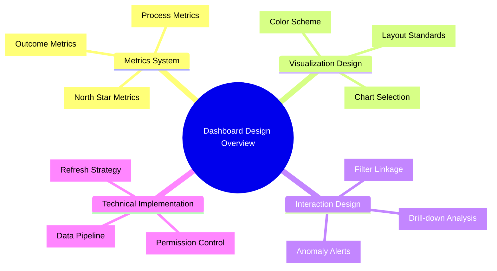
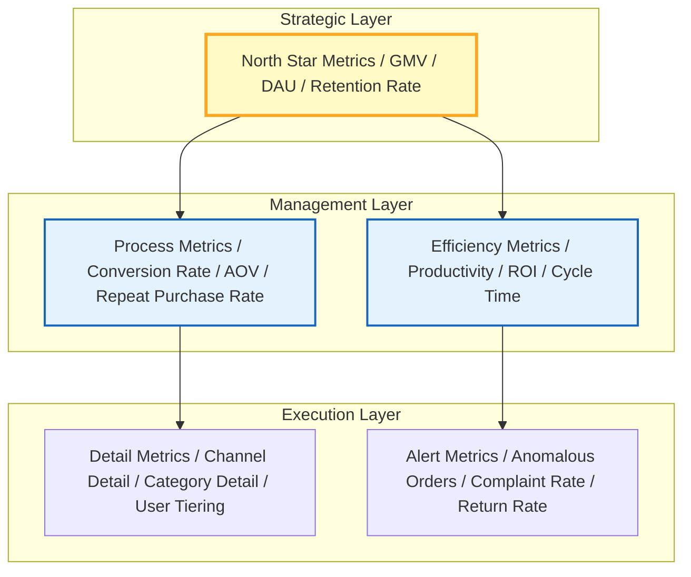
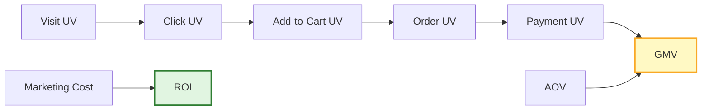
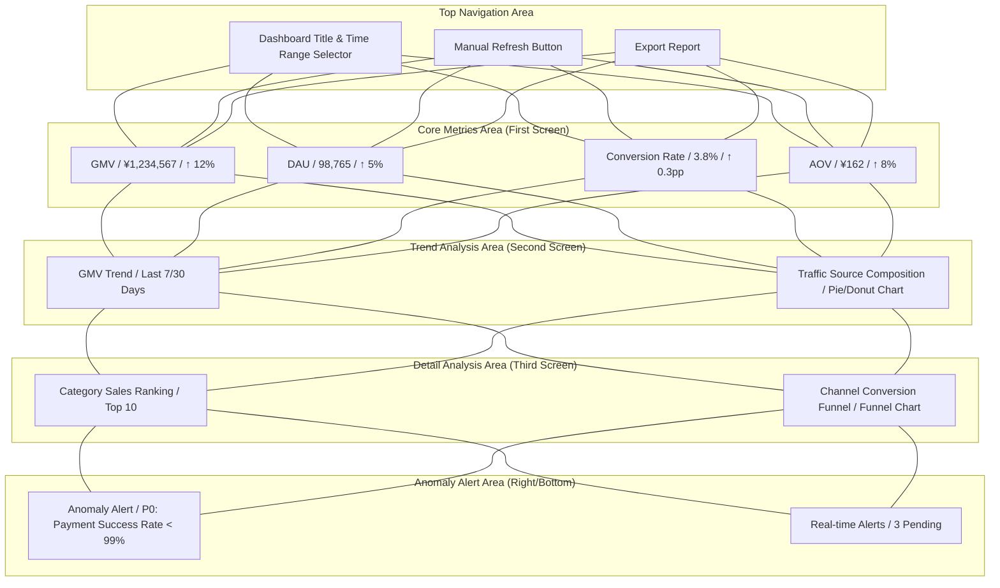
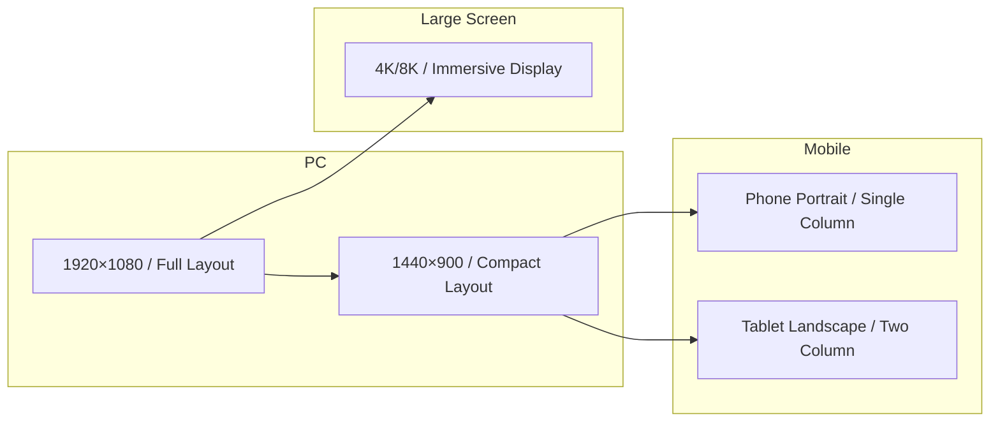
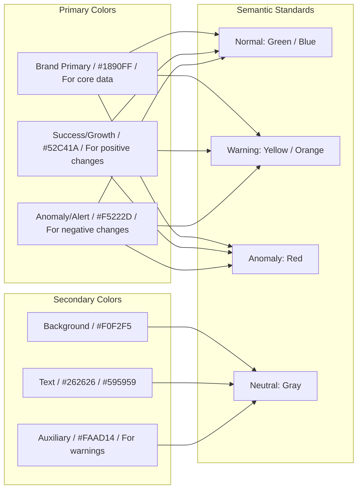
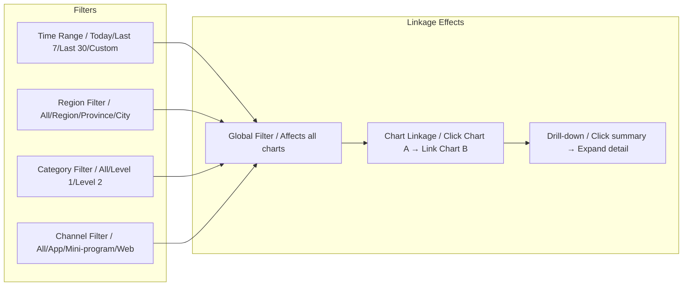
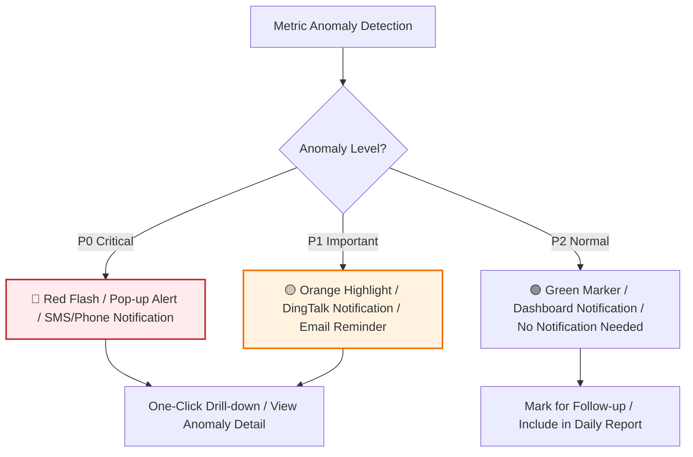
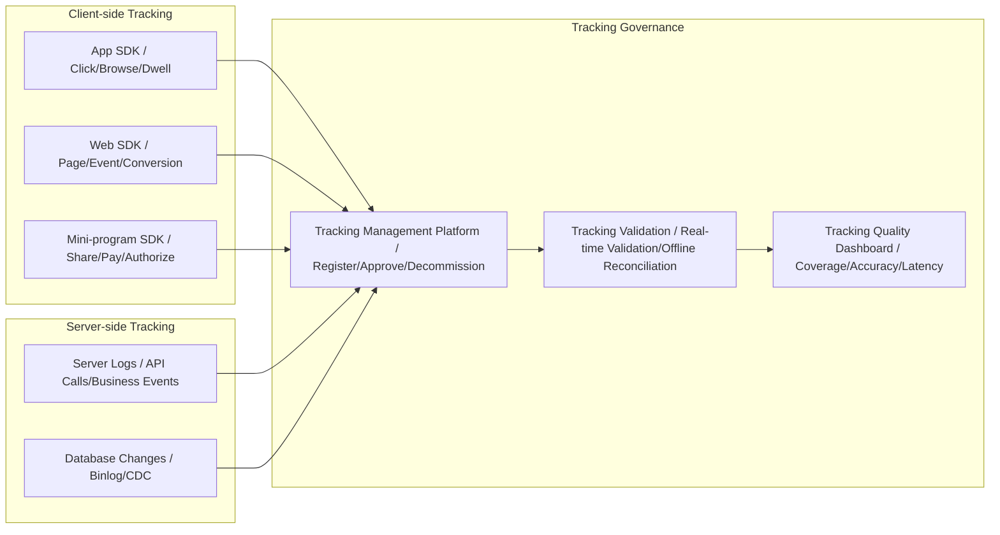
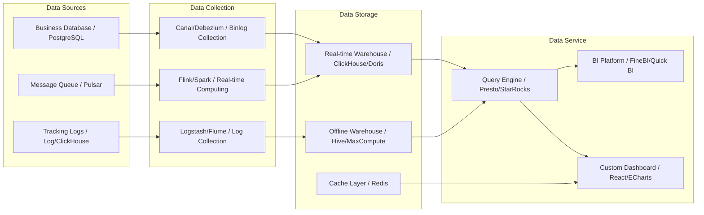

# [Product/System Name (English)] - Dashboard Design Document

> **Document Status:** 🟡 Under Review / 🟢 Released / 🔴 Archived
>
> **Confidentiality Level:** Confidential / Internal / Public
>
> **Version:** v0.3.1
>
> **Date:** YYYY-MM-DD
>
> **Author:** [Name/Role]
>
> **Reviewer:** [Name/Role]
>
> **Audience:** [CEO / Operations Director / Frontline Operations / Technical Ops]
>
> **Dashboard ID:** DASH-2026-XXX
>
> **Dashboard Name:** [e.g., E-commerce Transaction Core Monitoring Dashboard]
>
> **Maintenance Team:** [Data Product / BI Team / Business Data Group]
>
> **Refresh Frequency:** [Real-time / 5min / 1h / Daily]

---

## 0. Document Guide

### 0.1 Document Purpose & Scope

[Describe the purpose, applicable scenarios, and non-applicable scenarios of this document]

### 0.2 Related Documents

| Document Type | Filename | Related Sections |
| -------- | ------------------- | ---------- |
| [Type] | [Filename] [Line Range] | [Section Description] |

> **Reference Format**: Related documents use the `filename line range` format (e.g., `【Template】Technical Requirements Document (TRD).md 3-17`). Line numbers may change as documents are updated; refer to the actual content.

### 0.3 Change Log

| Version | Date | Author | Changes | Reviewer |
| :----- | :--------- | :----- | :------------------------------------------------------- | :--------------- |
| v0.1 | YYYY-MM-DD | [Name] | Initial draft: Metrics system + layout design | |
| v0.2 | YYYY-MM-DD | [Name] | Added interaction design + data pipeline | |
| v0.3 | YYYY-MM-DD | [Name] | Formal release | [Data Product Lead] |
| v0.3.1 | 2026-06-20 | Xie Dong | Message middleware example Kafka/RocketMQ→Pulsar (unified event bus standard) | — |

---

## 1. Executive Summary

> **Audience Guide:** What problem this dashboard solves, who it's for, and what the core metrics are.

| Element | Content |
| :------------- | :--------------------------------------------------- |
| **Dashboard Purpose** | [One sentence, e.g.: Real-time monitoring of e-commerce transaction core path, supporting operations decisions] |
| **Target Audience** | [e.g.: Operations Director + frontline operations, with technical ops in mind] |
| **Core Scenarios** | [e.g.: Real-time monitoring during promotions / Daily business analysis / Rapid anomaly identification] |
| **Key Metric Count** | [N] core metrics + [M] auxiliary metrics |
| **Data Source** | [e.g.: Order DB Binlog → Pulsar → Flink → ClickHouse] |
| **Refresh Strategy** | [e.g.: Core metrics 1min, trend charts 5min, detail 1h] |



---

## 2. Metrics Design

### 2.1 Metrics Layered Architecture

> Reference Alibaba data warehouse layering and industry metrics system practices; metrics are divided into three layers:



### 2.2 Core Metric Definitions

> **Reference**: For detailed metrics system, metric definitions, calculation methods, and target values, see **【Template】Operations Manual.md §2.2**. This document only references the core metrics the dashboard needs to display.

| Metric Layer | Metric Name | Metric Definition | Calculation | Target | Refresh Frequency | Reference |
| :--- | :--- | :--- | :--- | :--- | :---: | :--- |
| **North Star** | GMV | Total merchandise transaction value | Σ(Order paid amount) | 10% daily growth | 1min | Ref Operations Manual §2.2 |
| **North Star** | DAU | Daily active users | Daily unique logged-in users | 1M | 5min | Ref Operations Manual §2.2 |
| **L1** | Conversion Rate | Visitor to order ratio | Order UV / Visit UV | 3.5% | 5min | Ref Operations Manual §2.2 |
| **L1** | AOV | Average order value | GMV / Order count | ¥150 | 5min | Ref Operations Manual §2.2 |
| **L1** | 7-Day Retention | 7-day still active ratio | 7-day active / New users | 25% | Daily | Ref Operations Manual §2.2 |
| **L2** | Payment Success Rate | Payment completion ratio | Successful payments / Initiated payments | 99.5% | 1min | Ref Operations Manual §2.2 |
| **L2** | Refund Rate | Refunded order ratio | Refunded orders / Total orders | <2% | 1h | Ref Operations Manual §2.2 |
| **L3** | Channel ROI | Channel return on investment | Channel GMV / Channel cost | ≥3 | Daily | Ref Operations Manual §2.2 |

> **Complete Metrics System**: For metrics layered architecture, metric relationships, and data sources, see **【Template】Operations Manual.md §2.2**.

### 2.3 Metric Relationships



---

## 3. Layout Design

### 3.1 Page Structure

> Follow the F-pattern reading path; key information placed in the upper left.



### 3.2 Layout Standards

| Area | Position | Content | Visual Weight |
| :-------------- | :------------- | :-------------------------- | :--------- |
| **Core Metrics Area** | Top first row | 4-6 KPI indicator cards | ⭐⭐⭐⭐⭐ |
| **Trend Chart Area** | Second row left | Line/area chart, show time trends | ⭐⭐⭐⭐ |
| **Composition Chart Area** | Second row right | Pie/donut chart, show structure distribution | ⭐⭐⭐⭐ |
| **Ranking/Detail Area** | Third row | Table/bar chart, Top N ranking | ⭐⭐⭐ |
| **Alert/Alarm Area** | Right sidebar or bottom | Anomaly list, alert cards | ⭐⭐⭐⭐⭐ |
| **Filter Area** | Top or left sidebar | Time, region, category dimension filters | ⭐⭐⭐ |

### 3.3 Responsive Layout



---

## 4. Visualization Standards

### 4.1 Chart Selection Matrix

> Select the correct chart type based on data relationships.

| Data Relationship | Applicable Scenario | Recommended Chart | Prohibited Chart |
| :------- | :-------------------- | :----------------------- | :----------- |
| **Comparison** | Year-over-year/month-over-month, multi-dimension comparison | Bar, horizontal bar, radar | Pie, area |
| **Trend** | Time series change, prediction | Line, area | Pie, scatter |
| **Composition** | Part-to-whole ratio | Pie, donut, stacked bar | Line |
| **Distribution** | Data distribution, concentration | Histogram, box plot, scatter | Pie |
| **Correlation** | Correlation analysis, clustering | Scatter, bubble, heatmap | Bar |
| **Flow** | Conversion funnel, user path | Funnel, Sankey | Pie, line |

### 4.2 Color Scheme

> Primary colors no more than 3; accent colors used for anomaly alerts.



**Color Usage Standards:**

| Scenario | Color | Hex Value | Usage Example |
| :------- | :--- | :-------- | :--------------------- |
| Brand Primary | Blue | `#1890FF` | Core metrics, main trend lines |
| Positive Growth | Green | `#52C41A` | YoY↑, MoM↑, target achieved |
| Negative Decline | Red | `#F5222D` | YoY↓, MoM↓, anomaly alert |
| Warning | Orange | `#FAAD14` | Approaching threshold, needs attention |
| Background | Light Gray | `#F0F2F5` | Dashboard overall background |
| Card Background | White | `#FFFFFF` | Indicator cards, chart containers |
| Primary Text | Dark Gray | `#262626` | Titles, core data |
| Secondary Text | Medium Gray | `#595959` | Labels, description text |

### 4.3 Typography & Layout

| Element | Font | Size | Weight | Color |
| :--------- | :------------- | :--- | :------ | :-------------------- |
| Dashboard Title | System default sans-serif | 24px | Bold | `#262626` |
| Metric Value | DIN / Roboto | 32px | Bold | `#262626` |
| Metric Label | System default | 14px | Regular | `#595959` |
| Trend Change | System default | 16px | Medium | `#52C41A` / `#F5222D` |
| Chart Title | System default | 16px | Medium | `#262626` |
| Axis Label | System default | 12px | Regular | `#8C8C8C` |

---

## 5. Interaction Design

### 5.1 Global Interaction



### 5.2 Drill-down & Linkage Rules

| Trigger | Source Chart | Target Chart | Linkage Effect |
| :------- | :--------- | :--------- | :------------------------- |
| Click | Region Map | Trend Line Chart | Show selected region's GMV trend |
| Click | Category Pie | Category Detail Table | Show selected category's SKU ranking |
| Hover | Trend Line | Metric Card | Show specific value at that time point |
| Filter | Time Selector | All Charts | All charts refresh by selected time range |
| Drill-down | Region Bar | Province Bar | Drill from region to province dimension |

### 5.3 Anomaly Alert Interaction



---

No, the current dashboard design document does **not** include data tracking content.

Data tracking typically belongs to the **data collection layer** as prerequisite work, completed before dashboard design. If you need to add it, you can insert at the following location:

---

## Suggested Addition: Data Tracking Section

You can insert a new section before Chapter 5 "Data Pipeline Design":

````markdown
## 5. Data Tracking Design

### 5.1 Tracking Architecture


````

### 6.2 Core Tracking List

| Tracking ID | Tracking Name | Trigger Timing | Report Method | Related Metrics | Priority |
| :------------ | :----------- | :------------- | :------- | :-------------- | :----: |
| **TRACK-001** | Homepage Browse | Enter homepage | Client | DAU, UV | P0 |
| **TRACK-002** | Product Click | Click product card | Client | Click Rate, CTR | P0 |
| **TRACK-003** | Add to Cart | Click add-to-cart button | Client | Add-to-Cart Rate | P0 |
| **TRACK-004** | Order Submit | Click submit order | Server | Order Conversion Rate | P0 |
| **TRACK-005** | Payment Success | Receive payment callback | Server | Payment Success Rate, GMV | P0 |
| **TRACK-006** | Page Dwell Time | Calculate on page leave | Client | Average Dwell Time | P1 |
| **TRACK-007** | Search Query | Initiate search request | Server | Search Conversion Rate | P1 |

### 6.3 Tracking Standards

| Standard Item | Requirement | Example |
| :----------- | :----------------------------- | :-------------------------------------- |
| **Event Naming** | business_domain*action*object | `trade_click_sku`, `trade_submit_order` |
| **Parameter Standard** | Unified field names, no magic numbers | `sku_id`, `category_id`, `source_page` |
| **User Identity** | Device ID + Login ID dual-ID system | `device_id`, `user_id` |
| **Timestamp** | Client time + Server time dual-report | `client_time`, `server_time` |
| **Version Management** | Tracking changes require approval, no arbitrary decommission | Tracking management platform approval flow |

### 6.4 Tracking Quality Monitoring

| Monitoring Item | Metric | Alert Threshold |
| :--------- | :------------------- | :---------- |
| Tracking Coverage | Core path tracking coverage ratio | < 95% alert |
| Tracking Loss Rate | Report success / Trigger count | > 1% alert |
| Tracking Latency | Average time from trigger to storage | > 5min alert |
| Tracking Accuracy | Sample validation correct ratio | < 99% alert |

---

## 7. Data Pipeline

### 7.1 Data Architecture



### 7.2 Refresh Strategy

| Data Type | Refresh Frequency | Technical Implementation | Notes |
| :------------ | :----------- | :------------- | :-------------------- |
| **Core KPI** | 1min | WebSocket push | GMV, order volume, etc. |
| **Trend Charts** | 5min | Scheduled polling | Line charts, area charts |
| **Ranking/Detail** | 15min | Scheduled polling | Top N tables, funnel charts |
| **Offline Reports** | Daily/Weekly/Monthly | Offline scheduling | Retention, LTV, etc. |
| **Anomaly Alerts** | Real-time | Flink CEP | Payment success rate, error rate |

---

## 8. Security & Permissions

### 8.1 Role Permission Matrix

| Role | View Scope | Operation Permissions | Data Masking |
| :------------- | :--------- | :------------------- | :----------- |
| **CEO / Executive** | Full data | View, export | Not applicable |
| **Operations Director** | Full data | View, export, configure alerts | Not applicable |
| **Frontline Operations** | Department data | View, filter | User ID masking |
| **Technical Ops** | System metrics | View, configure monitoring | Not applicable |
| **External Partners** | Authorized data | View only | Sensitive field masking |

### 8.2 Data Security Standards

| Security Level | Handling Method | Applicable Scenario |
| :------- | :--------------------- | :----------------- |
| 🔴 Confidential | Approval required for access, full-chain encryption | Financial data, user privacy |
| 🟡 Sensitive | Role authorization, field-level masking | User behavior, transaction details |
| 🟢 Public | No authorization required, publicly accessible | Public reports, industry data |

---

## 9. Performance & UX

### 9.1 Performance Metrics

| Metric | Target | Optimization Method |
| :----------- | :------ | :--------------------- |
| First screen load time | < 2s | CDN, lazy loading, skeleton screen |
| Data query time | < 1s | Index optimization, pre-aggregation, caching |
| Chart render time | < 500ms | Virtual scrolling, data sampling |
| Concurrent users | > 500 | Load balancing, connection pooling |

### 9.2 UX Optimization

| Optimization | Implementation |
| :----------- | :----------------------------------- |
| **Skeleton Screen** | Gray placeholder during data loading, reduce white screen anxiety |
| **Progressive Loading** | Core metrics load first, charts load on demand |
| **Error Fallback** | Friendly message on data anomaly instead of blank |
| **Empty State** | Guide illustration + action suggestions when no data |
| **Dark Mode** | Support dark theme, adapt to night shift scenarios |

---

## 10. Appendix

### 10.1 Glossary

| Term | Definition |
| :------------ | :----------------------------------------- |
| **KPI** | Key Performance Indicator |
| **Drill-down** | Expanding from summary data layer by layer to detail data |
| **Linkage** | Interactive response between charts, one chart's action affects others |
| **Flink CEP** | Complex Event Processing |
| **pp** | Percentage point |

### 10.2 Related Documents

| Document | ID | Link |
| :----------- | :-------------- | :----- |
| Data Dictionary | DD-2026-XXX | [Link] |
| Metrics System Document | METRIC-2026-XXX | [Link] |
| API Documentation | API-2026-XXX | [Link] |
| Operations Manual | OPS-2026-XXX | [Link] |

## 11. Design Review Sign-off

| Role | Name | Signature | Date | Comments |
| :----------------- | :--- | :--: | :--: | :------------- |
| **Data Product Lead** | | | | [Approved / Rejected] |
| **Business Lead** | | | | [Metric definitions confirmed] |
| **Tech Lead** | | | | [Data pipeline confirmed] |
| **Design Lead** | | | | [Visual standards confirmed] |
| **Security Lead** | | | | [Permission strategy confirmed] |
