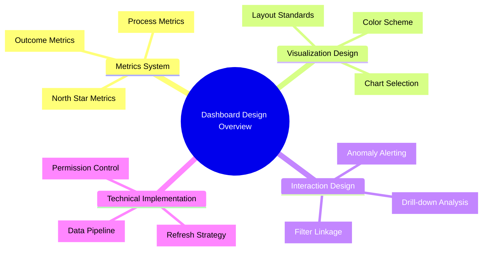
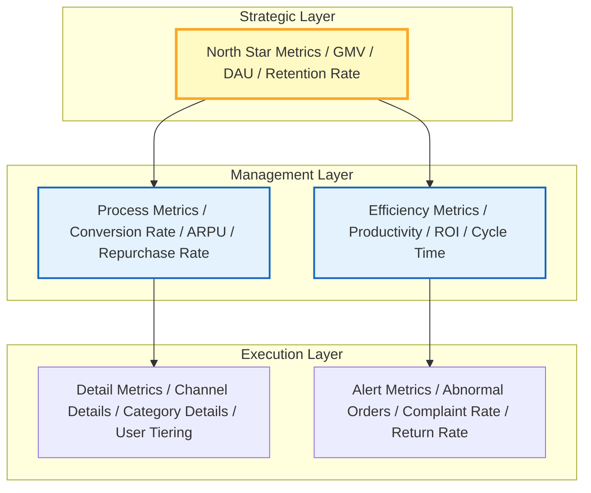
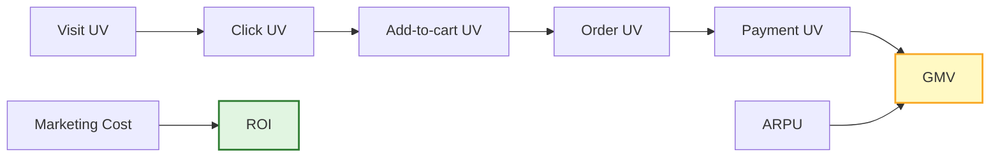
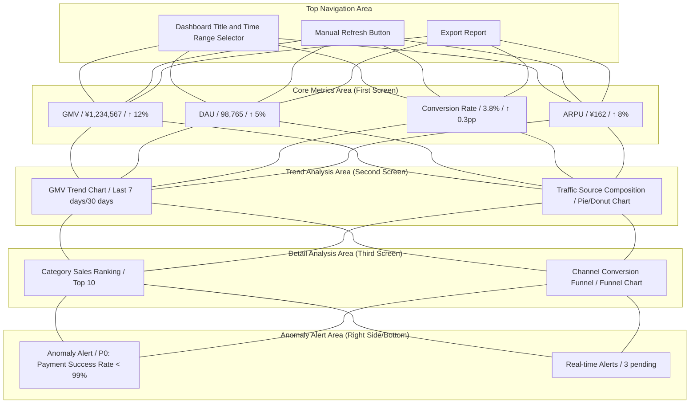
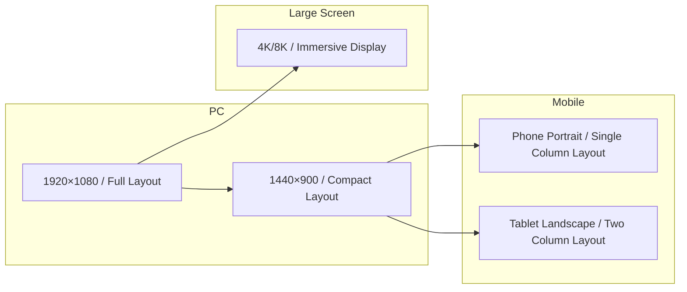
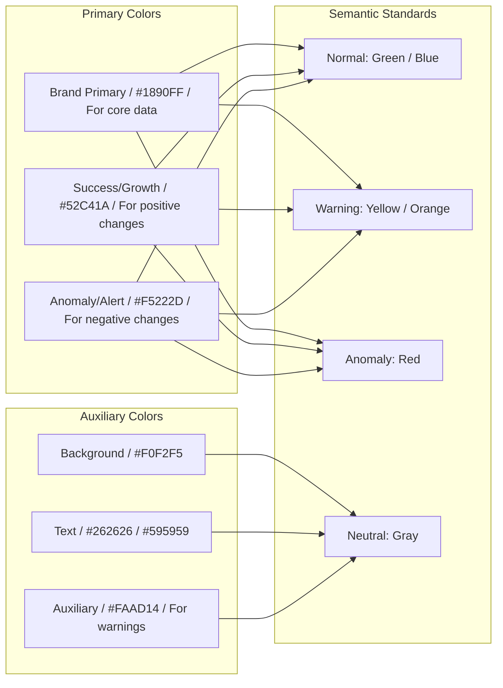
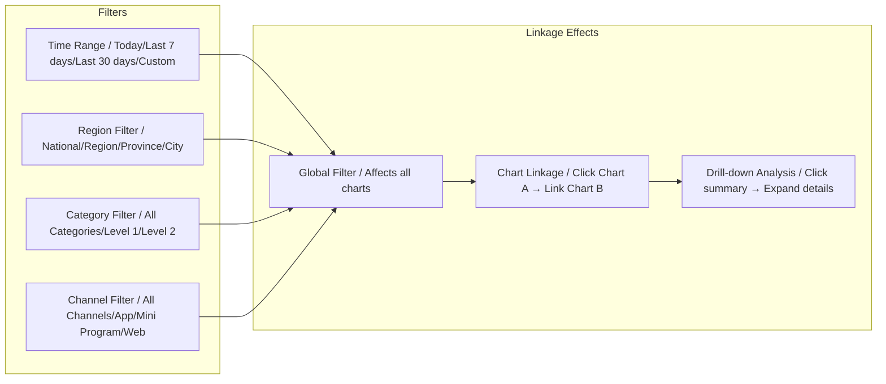
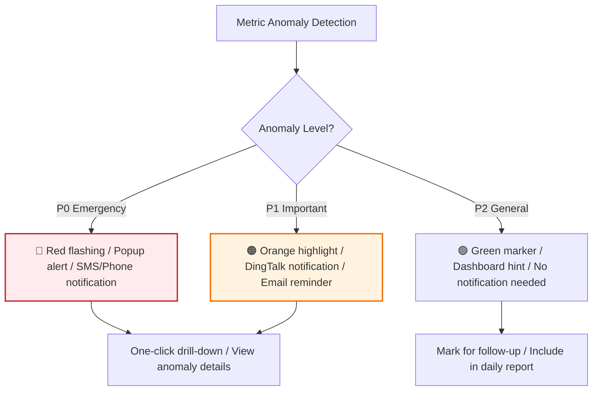
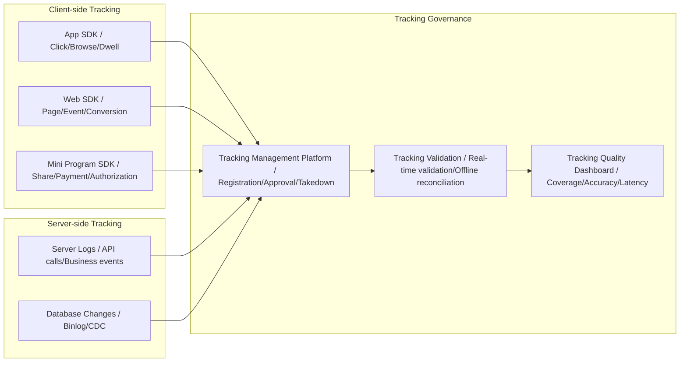

# [Product/System Name (English)] - Dashboard Design Document

> **Document Status:** 🟡 Under Review / 🟢 Published / 🔴 Archived
>
> **Confidentiality Level:** Confidential / Internal Public / Public
>
> **Version:** v0.3.1
>
> **Date:** YYYY-MM-DD
>
> **Author:** [Name/Role]
>
> **Reviewer:** [Name/Role]
>
> **Audience:** [CEO / Operations Director / Frontline Operations / Technical Operations]
>
> **Dashboard Number:** DASH-2026-XXX
>
> **Dashboard Name:** [e.g., E-commerce Transaction Core Monitoring Dashboard]
>
> **Maintenance Team:** [Data Product / BI Team / Business Data Group]
>
> **Refresh Frequency:** [Real-time / 5min / 1h / Daily]

---

## 0. Document Guide

### 0.1 Document Purpose and Scope

[Explain the purpose, applicable scenarios, and non-applicable scenarios of this document]

### 0.2 Related Documents

| Document Type | Filename | Related Sections |
| -------- | ------------------- | ---------- |
| [Type] | [Filename] [Line Range] | [Section Description] |

> **Reference Format Note**: Related documents use the `filename line range` format (e.g., `【Template】Technical Requirements Document(TRD).md 3-17`). Line numbers may change as documents are updated; please refer to actual content.

### 0.3 Change Log

| Version | Date | Reviser | Change Content | Reviewer |
| :--- | :--- | :--- | :--- | :--- |
| v0.1 | YYYY-MM-DD | [Name] | Initial draft: Metrics system + Layout design | |
| v0.2 | YYYY-MM-DD | [Name] | Added interaction design + Data pipeline | |
| v0.3 | YYYY-MM-DD | [Name] | Official release | [Data Product Lead] |
| v0.3.1 | 2026-06-20 | Xie Dong | Message middleware example Kafka/RocketMQ→Pulsar (unified event bus specification) | — |

---

## 1. Executive Summary

> **Audience Guide:** What problem this dashboard solves, who it's for, what the core metrics are.

| Element | Content |
| :--- | :--- |
| **Dashboard Positioning** | [One sentence, e.g., Real-time monitoring of e-commerce transaction core link, supporting operations decisions] |
| **Target Audience** | [e.g., Operations Director + Frontline Operations, also serving technical operations] |
| **Core Scenarios** | [e.g., Real-time monitoring during promotions / Daily business analysis / Rapid anomaly location] |
| **Key Metric Count** | [N] core metrics + [M] auxiliary metrics |
| **Data Sources** | [e.g., Order DB Binlog → Pulsar → Flink → ClickHouse] |
| **Refresh Strategy** | [e.g., Core metrics 1min, trend charts 5min, details 1h] |



---

## 2. Metrics System Design

### 2.1 Metrics Layered Architecture

> Referencing Alibaba data warehouse layering and big company metrics system practice, metrics are divided into three layers:



### 2.2 Core Metric Definitions

> **Reference Note**: Detailed metrics system, metric definitions, calculation methods and target values please refer to **【Template】Operations Manual.md §2.2**. This document only references core metrics that the dashboard needs to display.

| Metric Layer | Metric Name | Metric Definition | Calculation Method | Target Value | Refresh Frequency | Reference Document |
| :--- | :--- | :--- | :--- | :--- | :---: | :--- |
| **North Star** | GMV | Gross Merchandise Volume | Σ(Order Payment Amount) | Daily increase 10% | 1min | Reference Operations Manual §2.2 |
| **North Star** | DAU | Daily Active Users | Unique logged-in users today | 1 million | 5min | Reference Operations Manual §2.2 |
| **Level 1** | Conversion Rate | Visitor to order ratio | Order UV/Visit UV | 3.5% | 5min | Reference Operations Manual §2.2 |
| **Level 1** | ARPU | Average revenue per order | GMV/Order count | ¥150 | 5min | Reference Operations Manual §2.2 |
| **Level 1** | 7-day Retention Rate | Still active after 7 days | 7-day active/Today's new | 25% | Daily | Reference Operations Manual §2.2 |
| **Level 2** | Payment Success Rate | Payment completion ratio | Payment success/Payment initiated | 99.5% | 1min | Reference Operations Manual §2.2 |
| **Level 2** | Refund Rate | Refund order ratio | Refund orders/Total orders | <2% | 1h | Reference Operations Manual §2.2 |
| **Level 3** | Channel ROI | Channel return on investment | Channel GMV/Channel cost | ≥3 | Daily | Reference Operations Manual §2.2 |

> **Complete Metrics System**: Metrics layered architecture, metric relationships, data sources details please refer to **【Template】Operations Manual.md §2.2**.

### 2.3 Metric Relationships



---

## 3. Dashboard Layout Design

### 3.1 Page Structure

> Following F-shaped reading path, key information placed in top-left.



### 3.2 Layout Standards

| Area | Position | Content | Visual Weight |
| :--- | :--- | :--- | :--- |
| **Core Metrics Area** | Top first row | 4-6 KPI metric cards | ⭐⭐⭐⭐⭐ |
| **Trend Chart Area** | Second row left | Line/Area charts, showing time trends | ⭐⭐⭐⭐ |
| **Composition Chart Area** | Second row right | Pie/Donut charts, showing structural distribution | ⭐⭐⭐⭐ |
| **Ranking/Detail Area** | Third row | Table/Bar charts, Top N rankings | ⭐⭐⭐ |
| **Alert/Notification Area** | Right sidebar or bottom | Anomaly list, alert cards | ⭐⭐⭐⭐⭐ |
| **Filter Area** | Top or left sidebar | Time, region, category dimension filters | ⭐⭐⭐ |

### 3.3 Responsive Layout Adaptation



---

## 4. Visualization Design Standards

### 4.1 Chart Selection Matrix

> Select correct chart type based on data relationships.

| Data Relationship | Applicable Scenario | Recommended Chart | Prohibited Chart |
| :--- | :--- | :--- | :--- |
| **Comparison** | Year-over-year/Month-over-month, multi-dimensional comparison | Bar chart, Bar chart, Radar chart | Pie chart, Area chart |
| **Trend** | Time series changes, forecasting | Line chart, Area chart | Pie chart, Scatter plot |
| **Composition** | Part-to-whole proportions | Pie chart, Donut chart, Stacked bar chart | Line chart |
| **Distribution** | Data distribution, concentration | Histogram, Box plot, Scatter plot | Pie chart |
| **Relationship** | Correlation analysis, clustering | Scatter plot, Bubble chart, Heatmap | Bar chart |
| **Flow** | Conversion funnel, user path | Funnel chart, Sankey diagram | Pie chart, Line chart |

### 4.2 Color Scheme

> Primary colors no more than 3, accent colors used for anomaly alerts.



**Color Usage Standards:**

| Scenario | Color | Hex Value | Usage Example |
| :--- | :--- | :--- | :--- |
| Brand Primary | Blue | `#1890FF` | Core metrics, main trend lines |
| Positive Growth | Green | `#52C41A` | Year-over-year↑, Month-over-month↑, Goal achieved |
| Negative Decline | Red | `#F5222D` | Year-over-year↓, Month-over-month↓, Anomaly alert |
| Warning | Orange | `#FAAD14` | Approaching threshold, Needs attention |
| Background | Light Gray | `#F0F2F5` | Dashboard overall background |
| Card Background | White | `#FFFFFF` | Metric cards, Chart containers |
| Primary Text | Dark Gray | `#262626` | Titles, Core data |
| Auxiliary Text | Medium Gray | `#595959` | Labels, Description text |

### 4.3 Typography

| Element | Font | Font Size | Font Weight | Color |
| :--- | :--- | :--- | :--- | :--- |
| Dashboard Title | System default sans-serif | 24px | Bold | `#262626` |
| Metric Value | DIN / Roboto | 32px | Bold | `#262626` |
| Metric Label | System default | 14px | Regular | `#595959` |
| Trend Change | System default | 16px | Medium | `#52C41A` / `#F5222D` |
| Chart Title | System default | 16px | Medium | `#262626` |
| Axis Label | System default | 12px | Regular | `#8C8C8C` |

---

## 5. Interaction Design

### 5.1 Global Interaction



### 5.2 Drill-down and Linkage Rules

| Trigger Method | Source Chart | Target Chart | Linkage Effect |
| :--- | :--- | :--- | :--- |
| Click | Region Map | Trend Line Chart | Show GMV trend for selected region |
| Click | Category Pie Chart | Category Detail Table | Show SKU ranking for selected category |
| Hover | Trend Line Chart | Metric Card | Show specific value at that time point |
| Filter | Time Selector | All Charts | All charts refresh by selected time range |
| Drill-down | Region Bar Chart | Province Bar Chart | Drill from region to province dimension |

### 5.3 Anomaly Alert Interaction



---

This dashboard design document **does not contain data tracking相关内容**.

Data tracking typically belongs to the **data collection layer** as prerequisite work, which needs to be completed before dashboard design. If you need to supplement, you can add in the following location:

---

## Suggested Addition: Data Tracking Section

You can insert a new section before Section 5 "Data Pipeline Design":

````markdown
## 5. Data Tracking Design

### 5.1 Tracking System Architecture


````

### 6.2 Core Tracking List

| Tracking ID | Tracking Name | Trigger Timing | Reporting Method | Related Metric | Priority |
| :--- | :--- | :--- | :--- | :--- | :---: |
| **TRACK-001** | Homepage Browse | Enter homepage | Client-side | DAU, UV | P0 |
| **TRACK-002** | Product Click | Click product card | Client-side | Click rate, CTR | P0 |
| **TRACK-003** | Add to Cart | Click add-to-cart button | Client-side | Add-to-cart rate | P0 |
| **TRACK-004** | Order Submission | Click submit order | Server-side | Order conversion rate | P0 |
| **TRACK-005** | Payment Success | Receive payment callback | Server-side | Payment success rate, GMV | P0 |
| **TRACK-006** | Page Dwell Time | Calculate when leaving page | Client-side | Average dwell time | P1 |
| **TRACK-007** | Search Query | Initiate search request | Server-side | Search conversion rate | P1 |

### 6.3 Tracking Standards

| Standard Item | Requirement | Example |
| :--- | :--- | :--- |
| **Event Naming** | Business domain*action*object | `trade_click_sku`, `trade_submit_order` |
| **Parameter Standard** | Unified field names, no magic numbers | `sku_id`, `category_id`, `source_page` |
| **User Identification** | Device ID + Login ID dual ID system | `device_id`, `user_id` |
| **Timestamp** | Client time + Server time dual reporting | `client_time`, `server_time` |
| **Version Management** | Tracking changes require approval, no arbitrary takedown | Tracking management platform approval flow |

### 6.4 Tracking Quality Monitoring

| Monitoring Item | Metric | Alert Threshold |
| :--- | :--- | :--- |
| Tracking Coverage | Core link tracking coverage ratio | < 95% alert |
| Tracking Loss Rate | Report success / Trigger count | > 1% alert |
| Tracking Latency | Average time from trigger to storage | > 5min alert |
| Tracking Accuracy | Sampling verification correct ratio | < 99% alert |

---

## 7. Data Pipeline Design

### 7.1 Data Architecture


### 7.2 Refresh Strategy

| Data Type | Refresh Frequency | Technical Implementation | Description |
| :--- | :--- | :--- | :--- |
| **Core KPI** | 1min | WebSocket push | GMV, order volume and other core metrics |
| **Trend Charts** | 5min | Timed polling | Line charts, Area charts |
| **Ranking/Details** | 15min | Timed polling | Top N tables, Funnel charts |
| **Offline Reports** | Daily/Weekly/Monthly | Offline scheduling | Retention rate, LTV etc. |
| **Anomaly Alerts** | Real-time | Flink CEP | Payment success rate, Error rate |

---

## 8. Security & Permissions

### 8.1 Role Permission Matrix

| Role | View Scope | Operation Permissions | Data Desensitization |
| :--- | :--- | :--- | :--- |
| **CEO / Executive** | Full data | View, Export | Not applicable |
| **Operations Director** | Full data | View, Export, Configure alerts | Not applicable |
| **Frontline Operations** | Own department data | View, Filter | User ID desensitized |
| **Technical Operations** | System metrics | View, Configure monitoring | Not applicable |
| **External Partners** | Authorized data | View only | Sensitive fields desensitized |

### 8.2 Data Security Standards

| Security Level | Handling Method | Applicable Scenario |
| :--- | :--- | :--- |
| 🔴 Confidential | Requires approval for access, full link encryption | Financial data, User privacy |
| 🟡 Sensitive | Role authorization, Field-level desensitization | User behavior, Transaction details |
| 🟢 Public | No authorization needed, Publicly accessible | Public reports, Industry data |

---

## 9. Performance & UX

### 9.1 Performance Metrics

| Metric | Target | Optimization Method |
| :--- | :--- | :--- |
| First screen load time | < 2s | CDN, Lazy loading, Skeleton screen |
| Data query time | < 1s | Index optimization, Pre-aggregation, Caching |
| Chart rendering time | < 500ms | Virtual scrolling, Data sampling |
| Concurrent users | > 500 | Load balancing, Connection pool |

### 9.2 Experience Optimization

| Optimization Item | Implementation Method |
| :--- | :--- |
| **Skeleton Screen** | Show gray placeholders before data loads, reduce white screen anxiety |
| **Progressive Loading** | Core metrics load first, Charts load on demand |
| **Error Fallback** | Show friendly prompt on data anomaly, not blank |
| **Empty State** | Show guide image + action suggestions when no data |
| **Dark Mode** | Support dark theme, adapt to night duty scenarios |

---

## 10. Appendix

### 10.1 Glossary

| Term | Definition |
| :--- | :--- |
| **KPI** | Key Performance Indicator |
| **Drill-down** | Expand from summary data layer by layer to detail data |
| **Linkage** | Interactive response between charts, one chart operation affects others |
| **Flink CEP** | Complex Event Processing |
| **pp** | percentage point |

### 10.2 Related Documents

| Document | Number | Link |
| :--- | :--- | :--- |
| Data Dictionary | DD-2026-XXX | [Link] |
| Metrics System Document | METRIC-2026-XXX | [Link] |
| API Documentation | API-2026-XXX | [Link] |
| Operations Manual | OPS-2026-XXX | [Link] |

## 11. Design Review Sign-off

| Role | Name | Signature | Date | Comments |
| :--- | :--- | :---: | :---: | :--- |
| **Data Product Lead** | | | | [Approve/Reject] |
| **Business Lead** | | | | [Metric definition confirmed] |
| **Technical Lead** | | | | [Data pipeline confirmed] |
| **Design Lead** | | | | [Visual standards confirmed] |
| **Security Lead** | | | | [Permission strategy confirmed] |