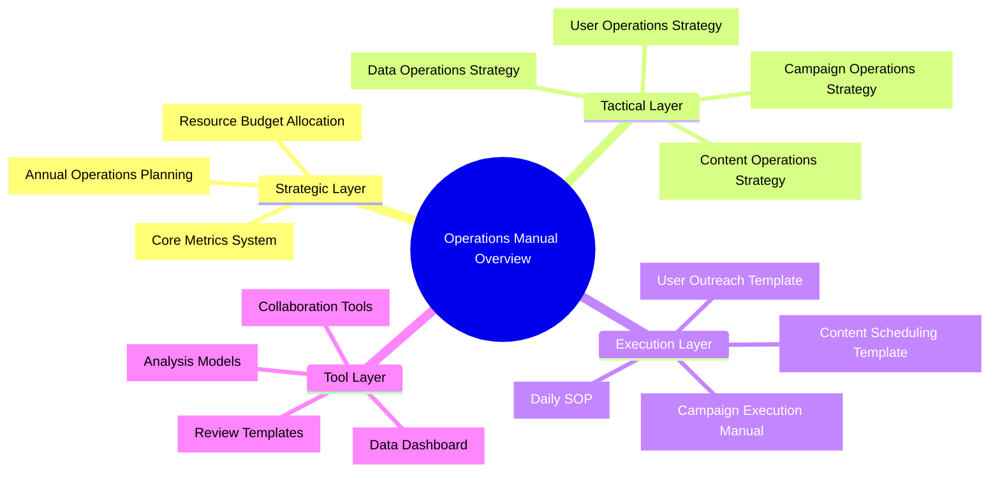
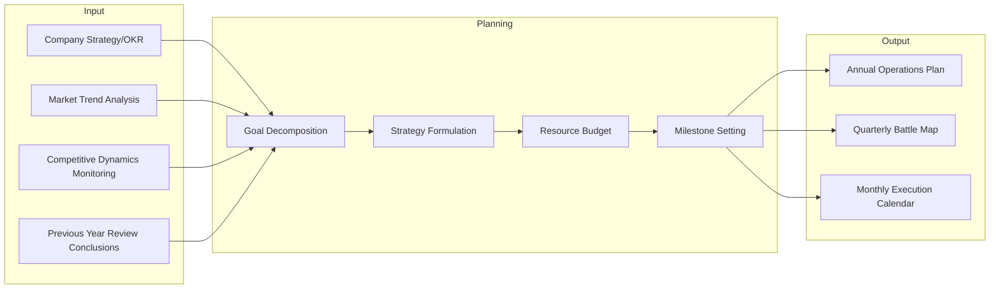
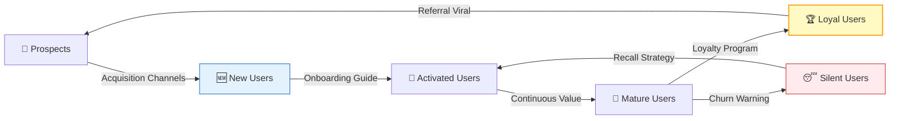
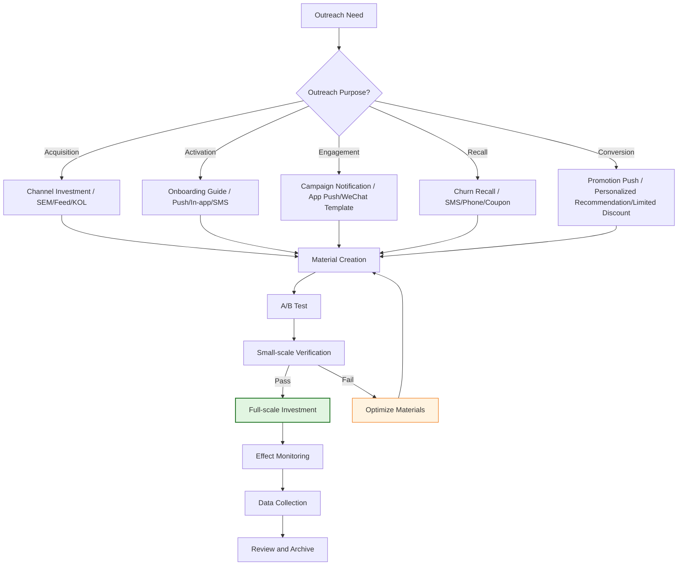
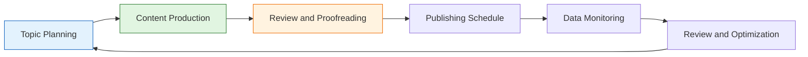
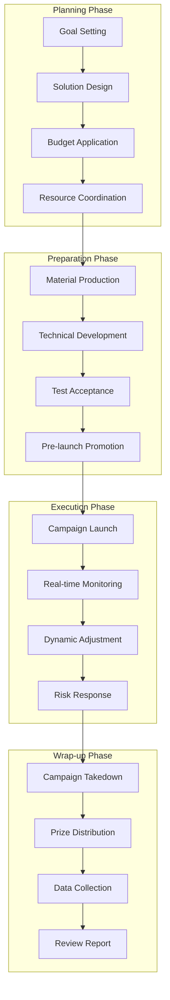
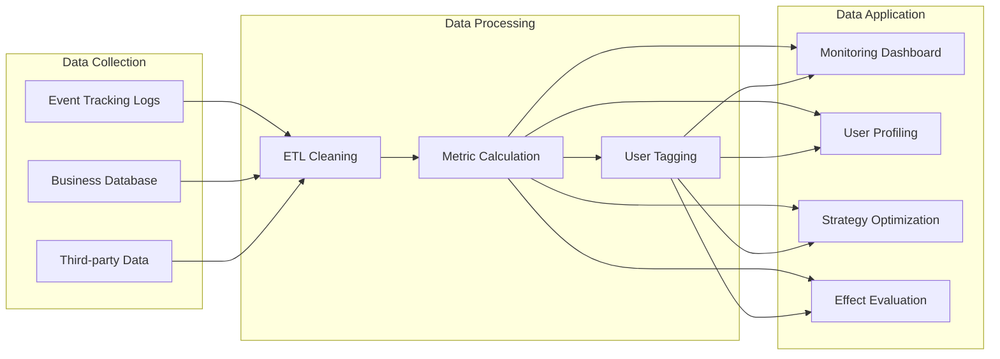
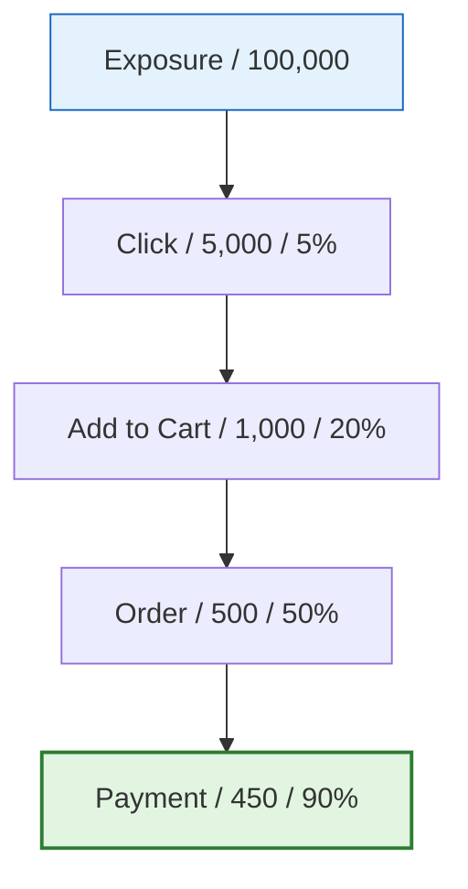

# [Product/System Name (English)] - Operations Manual

> **Document Status:** 🟢 Active / 🟡 Under Review / 🔴 Archived
>
> **Confidentiality Level:** Confidential / Internal Public / Public
>
> **Version:** v0.1.2
>
> **Date:** YYYY-MM-DD
>
> **Author:** [Name/Role]
>
> **Reviewer:** [Operations Director / VP]
>
> **Audience:** Operations Team / Product Operations / User Operations / Content Operations / Campaign Operations
>
> **Maintenance Team:** [Operations Middle Platform / User Growth Department / Operations Strategy Group]
>
> **Update Frequency:** Quarterly review, immediate update for major strategy adjustments

---

## 0. Document Guide

### 0.1 Document Purpose and Scope

[Explain the purpose, applicable scenarios, and non-applicable scenarios of this document]

### 0.2 Related Documents

| Document Type | Filename | Related Sections |
|---------|--------|---------|
| [Type] | [Filename] [Line Range] | [Section Description] |

> **Reference Format Note**: Related documents use the `filename line range` format (e.g., `【Template】Technical Requirements Document(TRD).md 3-17`). Line numbers may change as documents are updated; please refer to actual content.

### 0.3 Change Log

| Version | Date | Reviser | Change Content | Reviewer |
| :--- | :--- | :--- | :--- | :--- |
| v0.1 | YYYY-MM-DD | [Name] | Initial draft | [Reviewer] |
| v0.1.1 | 2026-06-09 | Xie Dong | Fixed quadrantChart template to table format (Feishu incompatible) | — |
| v0.1.2 | 2026-06-09 | Xie Dong | Fixed xychart-beta chart to table for Feishu rendering compatibility | — |

---

## 1. Executive Summary

> **New team member/Management 5-minute guide:** What this manual is, what problem it solves, how to use it.

| Element | Content |
| :--- | :--- |
| **Manual Positioning** | [One sentence, e.g., Full-link standardized operations guide for e-commerce business line] |
| **Coverage Scope** | User Operations / Content Operations / Campaign Operations / Data Operations / Channel Operations |
| **Core Objective** | [e.g., Unify operations standards, improve efficiency by 30%, reduce trial-and-error costs] |
| **Key Metrics** | DAU / Retention Rate / Conversion Rate / LTV / ROI |
| **Usage Method** | Select entry by role → Look up SOP by scenario → Execute by template |

---

## 2. Operations Strategy and Planning

### 2.1 Annual Operations Planning Framework

### 2.2 Core Metrics System (KPI / OKR)

> Metrics must be layered, quantifiable, and traceable.

| Layer | Metric Type | Metric Name | Definition | Calculation Method | Target Value | Monitoring Frequency |
| :--- | :--- | :--- | :--- | :--- | :--- | :---: |
| **North Star** | Outcome Metric | GMV | Gross Merchandise Volume | Σ(Order Payment Amount) | Annual increase 50% | Daily |
| **Level 1** | Process Metric | DAU | Daily Active Users | Number of users logged in today | 1 million | Daily |
| **Level 1** | Process Metric | Retention Rate | User continuous usage ratio | N-day retained users/New users | Next day 40% / 7-day 25% | Daily |
| **Level 2** | Conversion Metric | Conversion Rate | Visitor to order ratio | Order UV/Visit UV | 3.5% | Daily |
| **Level 2** | Efficiency Metric | ARPU | Average revenue per order | GMV/Order count | ¥150 | Daily |
| **Level 2** | Efficiency Metric | ROI | Return on investment | Revenue/Cost | ≥ 3 | Post-campaign |
| **Level 3** | Auxiliary Metric | Add-to-cart Rate | Add to cart ratio | Add-to-cart UV/Visit UV | 8% | Daily |
| **Level 3** | Auxiliary Metric | Bounce Rate | No interaction departure ratio | Bounce UV/Visit UV | < 50% | Daily |

> **Note**: xychart-beta is not compatible with Feishu, converted to table description (template sample data).

**Core Metrics Monitoring Example (Monthly Trend)**

| Week | Value |
| :--- | :---: |
| W1 | 100 |
| W2 | 105 |
| W3 | 110 |
| W4 | 115 |

---

## 3. User Operations

### 3.1 User Lifecycle Operations

### 3.2 User Tiering Model (RFM + Lifecycle)

| User Tier | Definition Standard | Operations Strategy | Outreach Frequency | Core Actions |
| :--- | :--- | :--- | :--- | :--- |
| **S-tier Super Users** | Top 1% spending / Active > 20 days/month | 1v1 dedicated service, new product beta, VIP community | 1-2 times weekly | Deep interviews, custom benefits |
| **A-tier High-value Users** | Top 10% spending / Active > 15 days/month | Membership benefits, exclusive discounts, birthday care | Once weekly | Member day, points redemption |
| **B-tier Growth Users** | Has spending / Active 5-15 days/month | Growth tasks, category expansion, repurchase incentives | Once every 3 days | Task system, coupons |
| **C-tier New Users** | Registered within 30 days | Welcome package, guided tutorial, first order discount | Daily for 7 days | New user tasks, onboarding |
| **D-tier Silent Users** | Inactive for 30 days | Recall SMS, large coupons, survey research | Once monthly | Recall campaigns, churn research |
| **R-tier Churned Users** | Inactive for 90 days | Large incentives, phone callback, survey research | Once quarterly | Recall experiments, cause analysis |

### 3.3 User Outreach SOP

**Outreach Channel Matrix:**

| Channel | Applicable Scenario | Reach Rate | Open Rate | Cost | Timeliness |
| :--- | :--- | :---: | :---: | :---: | :---: |
| App Push | Active user engagement | 95% | 15% | Low | Instant |
| SMS | Silent user recall | 99% | 3% | Medium | 5min |
| WeChat Template | Followed users | 90% | 8% | Low | Instant |
| Enterprise WeChat | High-value users | 85% | 25% | Low | Instant |
| Email | B-end users/Long content | 80% | 5% | Low | Delayed |
| Phone | Super users/Urgent recall | 60% | 80% | High | Instant |

---

## 4. Content Operations

### 4.1 Content Production Process

### 4.2 Content Scheduling Template

| Date | Channel | Content Type | Topic | Owner | Status | Target Data |
| :--- | :--- | :--- | :--- | :--- | :--- | :--- |
| 05-25 | Official Account | In-depth Article | "618 Shopping Guide" | Zhang San | ✅ Published | Reads 10k+ |
| 05-26 | Xiaohongshu | Image+Text Note | "Summer Outfit Recommendations" | Li Si | 🟡 Under Review | Likes 500+ |
| 05-27 | Douyin | Short Video | "Product Usage Tutorial" | Wang Wu | ⏳ Pending Filming | Views 100k+ |
| 05-28 | In-site | Banner | 618 Main Venue | Zhao Liu | ✅ Live | CTR 5% |

### 4.3 Content Quality Evaluation Standards

| Dimension | Weight | Evaluation Standard | Score |
| :--- | :---: | :--- | :---: |
| **Topic Value** | 20% | Hits user pain points/hot topics/needs | 1-5 |
| **Content Depth** | 25% | Information density, professionalism, originality | 1-5 |
| **Readability** | 20% | Clear structure, fluent language, image-text matching | 1-5 |
| **Conversion Ability** | 20% | Clear call-to-action, reasonable CTA design | 1-5 |
| **Compliance Safety** | 15% | No sensitive information, copyright compliance, factual accuracy | 1-5 |

**Content Rating Levels:**

- ⭐⭐⭐⭐⭐ (4.5-5.0): Benchmark content, full-channel promotion
- ⭐⭐⭐⭐ (4.0-4.4): High-quality content, key recommendation
- ⭐⭐⭐ (3.5-3.9): Qualified content, normal publishing
- ⭐⭐ (3.0-3.4): Needs optimization, publish after revision
- ⭐ (<3.0): Unqualified, re-produce

---

## 5. Campaign Operations

### 5.1 Campaign Planning Full Process

### 5.2 Campaign Execution Checklist

| Phase | Check Item | Owner | Deadline | Status |
| :--- | :--- | :--- | :--- | :--- |
| **Planning** | Campaign goals and KPI confirmed | Operations Manager | T-14d | ☐ |
| **Planning** | Campaign plan passed review | Operations Manager | T-10d | ☐ |
| **Planning** | Budget approved | Finance BP | T-10d | ☐ |
| **Preparation** | Campaign page UI design complete | Designer | T-7d | ☐ |
| **Preparation** | Campaign page frontend development complete | Frontend | T-5d | ☐ |
| **Preparation** | Backend API and prize logic development complete | Backend | T-5d | ☐ |
| **Preparation** | Test cases passed (functional/performance/compatibility) | QA | T-3d | ☐ |
| **Preparation** | Pre-launch materials created and approved | Content Operations | T-3d | ☐ |
| **Preparation** | Customer service scripts and FAQ trained | Customer Service | T-1d | ☐ |
| **Execution** | Campaign goes live on time | SRE | T+0 | ☐ |
| **Execution** | Monitoring dashboard configured | Data | T+0 | ☐ |
| **Execution** | Daily data report sent | Data | T+1~T+N | ☐ |
| **Wrap-up** | All prizes fully distributed | Operations | T+3d | ☐ |
| **Wrap-up** | Campaign review report submitted | Operations Manager | T+7d | ☐ |

### 5.3 Campaign Risk Response Plan

| Risk Type | Trigger Condition | Response Measure | Owner |
| :--- | :--- | :--- | :--- |
| **Traffic Overload** | QPS exceeds 80% of capacity | Activate rate limiting / Scaling / Queue mechanism | SRE |
| **Prize Over-disbursement** | Prize inventory < 10% | Emergency restocking / Replace prizes / Early takedown | Operations |
| **Fraud/Abuse** | Abnormal accounts concentrated participation | Risk control interception / Manual review / Disqualify | Risk Control |
| **Page Bug** | Core flow blocked | Hot fix / Rollback / Degrade to H5 | Technical |
| **PR Crisis** | Social media negative concentration | PR intervention / Official statement / Compensation plan | PR |

---

## 6. Data Operations

### 6.1 Data Analysis Framework

### 6.2 Daily Data Monitoring SOP

| Time Period | Action | Key Metrics | Anomaly Handling |
| :--- | :--- | :--- | :--- |
| **Daily 9:00** | Review yesterday's core data report | DAU / GMV / Conversion Rate / Retention | Immediate investigation if fluctuation > ±20% |
| **Daily 11:00** | Check real-time data dashboard | Real-time GMV / Order Volume / Traffic | Immediate alert if trend abnormal |
| **Every Monday** | Output weekly operations report | Week-over-week / Year-over-week / Goal completion rate | Develop catch-up plan if lagging goal > 10% |
| **1st of each month** | Output monthly operations report | Monthly goal achievement / Cost analysis / User growth | Monthly review meeting |
| **Every quarter** | Output quarterly operations review | Quarterly OKR / ROI / Strategy effectiveness | Quarterly planning meeting |

### 6.3 Core Analysis Models

| Model | Applicable Scenario | Key Metrics |
| :--- | :--- | :--- |
| **Funnel Analysis** | Conversion path optimization | Exposure → Click → Add to Cart → Order → Payment |
| **Cohort Analysis** | User retention evaluation | Cohort retention rate, LTV |
| **RFM Model** | User tiering operations | Recency, Frequency, Monetary |
| **AARRR** | Full-link growth analysis | Acquisition, Activation, Retention, Revenue, Referral |
| **Attribution Analysis** | Channel effect evaluation | First touch, Last touch, Linear attribution |

---

## 7. Channel Operations

### 7.1 Channel Matrix Management

> **Note**: This quadrant chart template has been converted to table description.

<!--
Original quadrantChart structure reference:
- title: Channel Value Matrix (Acquisition Cost vs User Quality)
- x-axis: "Low Acquisition Cost" --> "High Acquisition Cost"
- y-axis: "Low User Quality" --> "High User Quality"
- quadrant-1: Star Channel (High Quality/Low Cost)
- quadrant-2: Potential Channel (High Quality/High Cost)
- quadrant-3: Inefficient Channel (Low Quality/Low Cost)
- quadrant-4: Elimination Channel (Low Quality/High Cost)
- Data points: "Organic Search": [0.2, 0.8]; "Referral Viral": [0.15, 0.9]; "Feed Ads": [0.7, 0.6]; "KOL Collaboration": [0.6, 0.7]; "Ground Promotion": [0.8, 0.4]; "SMS Marketing": [0.1, 0.3]
-->

| Quadrant | Area Characteristics | Strategy Suggestions |
| :--- | :--- | :--- |
| Quadrant 1 (Low Cost · High Quality) | Star Channel (High Quality/Low Cost) | Increase investment, expand scale |
| Quadrant 2 (High Cost · High Quality) | Potential Channel (High Quality/High Cost) | Optimize efficiency, reduce acquisition cost |
| Quadrant 3 (Low Cost · Low Quality) | Inefficient Channel (Low Quality/Low Cost) | Evaluate if worth continuing investment |
| Quadrant 4 (High Cost · Low Quality) | Elimination Channel (Low Quality/High Cost) | Gradually reduce, shift to efficient channels |

| Name | X Value | Y Value | Quadrant |
| :--- | :---: | :---: | :--- |
| Organic Search | 0.2 | 0.8 | Quadrant 1 (Star Channel) |
| Referral Viral | 0.15 | 0.9 | Quadrant 1 (Star Channel) |
| Feed Ads | 0.7 | 0.6 | Quadrant 2 (Potential Channel) |
| KOL Collaboration | 0.6 | 0.7 | Quadrant 2 (Potential Channel) |
| Ground Promotion | 0.8 | 0.4 | Quadrant 4 (Elimination Channel) |
| SMS Marketing | 0.1 | 0.3 | Quadrant 3 (Inefficient Channel) |

### 7.2 Channel Operations SOP

| Channel | Daily Actions | Monitoring Metrics | Optimization Direction |
| :--- | :--- | :--- | :--- |
| **App Store** | Keyword optimization, review maintenance, version updates | Downloads, rating, keyword ranking | Improve conversion rate, reduce acquisition cost |
| **Feed** | Material iteration, targeting optimization, bid adjustment | CTR, CVR, CPA, ROI | Precise targeting, creative optimization |
| **Private Domain Community** | Content push, interactive activities, user Q&A | Activity level, conversion rate, repurchase rate | Refined tiering, personalized outreach |
| **KOL Collaboration** | Influencer selection, content review, effect tracking | CPE, CPM, GMV driven | Influencer matching, content quality |
| **Offline Ground Promotion** | Location selection, material preparation, personnel training | Per-location cost, conversion rate, coverage | Location optimization, script iteration |

---

## 8. Review and Iteration

### 8.1 Review Meeting Template

### 8.2 Review Report Template

| Module | Content |
| :--- | :--- |
| **Background** | Project/Campaign background, goals, time range |
| **Goal Achievement** | Core metrics actual vs target, completion rate |
| **Key Results** | 3-5 core results, with data |
| **Problems and Root Causes** | Issues not meeting expectations, 5-Why root cause analysis |
| **Lessons Learned** | Reusable experiences, pitfalls to avoid |
| **Improvement Actions** | Specific improvement items, Owner, Deadline |

### 8.3 Action Tracking Table

| Action ID | Improvement Item | Owner | Deadline | Status | Verification Standard |
| :--- | :--- | :--- | :--- | :--- | :--- |
| ACT-001 | Optimize onboarding guide flow, improve activation rate | Zhang San | 2026-06-15 | 🟡 In Progress | Activation rate from 25% → 35% |
| ACT-002 | Increase Push frequency, improve DAU | Li Si | 2026-06-10 | ⏳ Pending Start | DAU +10% |
| ACT-003 | Optimize landing page, improve conversion rate | Wang Wu | 2026-06-20 | ✅ Completed | Conversion rate from 2% → 3% |

---

## 9. Tools and Resources

### 9.1 Operations Tool List

| Category | Tool Name | Purpose | Owner |
| :--- | :--- | :--- | :--- |
| **Data Analysis** | Sensors Data / GrowingIO / Custom BI | User behavior analysis, funnel analysis | Data Team |
| **A/B Testing** | Volcano Engine / Tencent AB / Custom | Experiment design, effect evaluation | Growth Team |
| **Automated Marketing** | Alibaba Cloud Smart Guide / Custom MA | User tiering, automated outreach | User Operations |
| **Content Management** | Feishu Docs / Notion / Confluence | Content production, collaboration, archiving | Content Operations |
| **Project Management** | JIRA / Feishu Projects / Zentao | Requirement management, progress tracking | Operations Manager |
| **Design Collaboration** | Figma / Lanhu / MasterGo | UI design, asset export, annotation | Designer |

### 9.2 Common Template Library

| Template Name | Applicable Scenario | Link |
| :--- | :--- | :--- |
| Campaign Planning Template | Large campaign preparation | [Link] |
| Daily Data Report Template | Daily data monitoring | [Link] |
| User Research Survey Template | User research | [Link] |
| Competitive Analysis Template | Market analysis | [Link] |
| Review Report Template | Project review | [Link] |

---

## 10. Appendix

### 10.1 Glossary

| Term | Definition |
| :--- | :--- |
| **DAU** | Daily Active Users |
| **MAU** | Monthly Active Users |
| **LTV** | Life Time Value |
| **CAC** | Customer Acquisition Cost |
| **GMV** | Gross Merchandise Volume |
| **ROI** | Return on Investment |
| **Cohort** | Users sharing common characteristics within the same time window |
| **RFM** | Recency / Frequency / Monetary, user value analysis model |

### 10.2 Related Documents

| Document | Number | Link |
| :--- | :--- | :--- |
| Product Requirements Document (PRD) | PRD-2026-XXX | [Link] |
| User Manual | UM-2026-XXX | [Link] |
| Data Dictionary | DD-2026-XXX | [Link] |
| Brand Guidelines | BRAND-2026-XXX | [Link] |

## 11. Manual Sign-off

| Role | Name | Signature | Date | Comments |
| :--- | :--- | :---: | :---: | :--- |
| **Operations Director** | | | | [Approve / Reject / Need supplementation] |
| **Product Lead** | | | | [Product side confirmed] |
| **Data Lead** | | | | [Metric definition confirmed] |
| **Technical Lead** | | | | [Tool/System support confirmed] |
| **Finance BP** | | | | [Budget/Cost confirmed] |