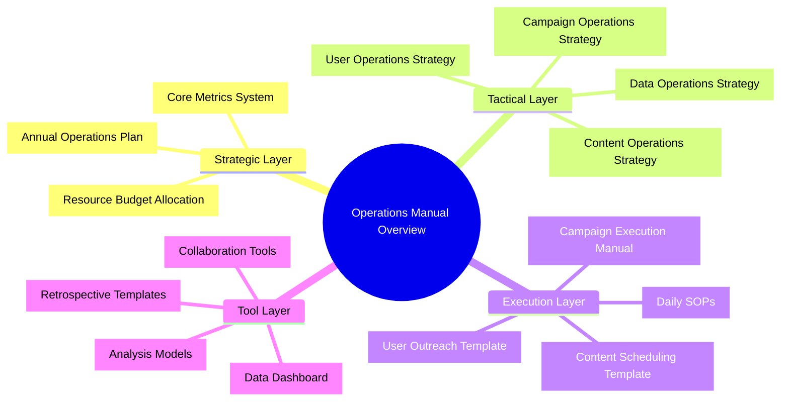
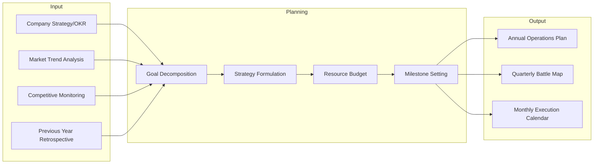
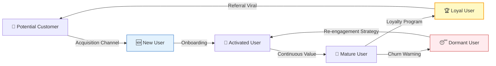
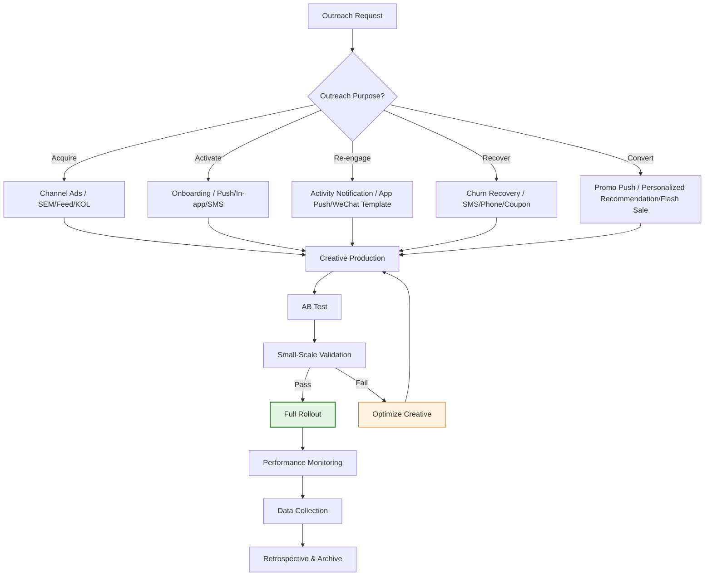
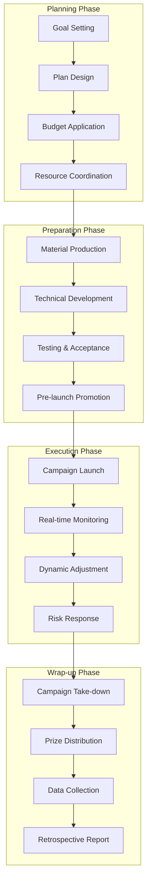
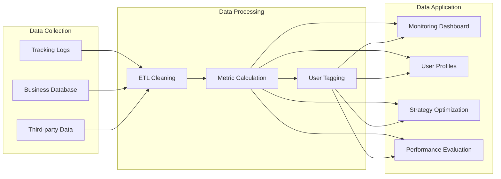
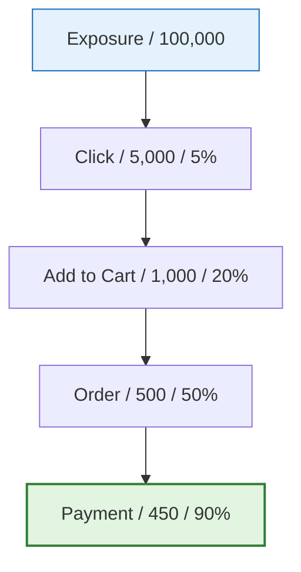
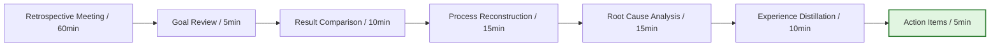

# [Product/System Name (English)] - Operations Manual

> **Document Status:** 🟢 Active / 🟡 Under Review / 🔴 Archived
>
> **Confidentiality Level:** Confidential / Internal / Public
>
> **Version:** v0.1.2
>
> **Date:** YYYY-MM-DD
>
> **Author:** [Name/Role]
>
> **Reviewer:** [Operations Director / VP]
>
> **Audience:** Operations Team / Product Operations / User Operations / Content Operations / Campaign Operations
>
> **Maintenance Team:** [Operations Platform / User Growth / Operations Strategy]
>
> **Update Frequency:** Quarterly review, immediate update for major strategy changes

---

## 0. Document Guide

### 0.1 Document Purpose & Scope

[Describe the purpose, applicable scenarios, and non-applicable scenarios of this document]

### 0.2 Related Documents

| Document Type | Filename | Related Sections |
|---------|--------|---------|
| [Type] | [Filename] [Line Range] | [Section Description] |

> **Reference Format**: Related documents use the `filename line range` format (e.g., `【Template】Technical Requirements Document (TRD).md 3-17`). Line numbers may change as documents are updated; refer to the actual content.

### 0.3 Change Log

| Version | Date | Author | Changes | Reviewer |
| :--- | :--- | :--- | :--- | :--- |
| v0.1 | YYYY-MM-DD | [Name] | Initial draft | [Reviewer] |
| v0.1.1 | 2026-06-09 | Xie Dong | Fix: quadrantChart template changed to table format (Feishu incompatible) | — |
| v0.1.2 | 2026-06-09 | Xie Dong | Fix xychart-beta chart to table for Feishu rendering compatibility | — |

---

## 1. Executive Summary

> **New Hire/Management 5-Minute Guide:** What this manual is, what problem it solves, and how to use it.

| Element | Content |
| :----------- | :--------------------------------------------------- |
| **Manual Purpose** | [One sentence, e.g.: Standardized operations guide for end-to-end e-commerce business line] |
| **Coverage** | User Operations / Content Operations / Campaign Operations / Data Operations / Channel Operations |
| **Core Objective** | [e.g.: Unify operations standards, improve efficiency by 30%, reduce trial-and-error cost] |
| **Key Metrics** | DAU / Retention / Conversion Rate / LTV / ROI |
| **Usage** | Select entry by role → Browse SOPs by scenario → Execute by template |

---

## 2. Strategy & Planning

### 2.1 Annual Operations Planning Framework

### 2.2 Core Metrics System (KPI / OKR)

> Metrics must be layered, quantifiable, and traceable.

| Layer | Metric Type | Metric Name | Definition | Calculation | Target | Monitoring Frequency |
| :--------- | :------- | :------- | :--------------- | :------------------- | :----------------- | :------: |
| **North Star** | Outcome Metric | GMV | Total merchandise transaction value | Σ(Order paid amount) | 50% annual growth | Daily |
| **L1** | Process Metric | DAU | Daily active users | Daily unique logged-in users | 1M | Daily |
| **L1** | Process Metric | Retention Rate | User continued usage ratio | N-day retained users / new users | Next-day 40% / 7-day 25% | Daily |
| **L2** | Conversion Metric | Conversion Rate | Visitor to order ratio | Order UV / Visit UV | 3.5% | Daily |
| **L2** | Efficiency Metric | AOV | Average order value | GMV / Order count | ¥150 | Daily |
| **L2** | Efficiency Metric | ROI | Return on investment | Revenue / Cost | ≥ 3 | Post-campaign |
| **L3** | Auxiliary Metric | Add-to-Cart Rate | Add to cart ratio | Add-to-cart UV / Visit UV | 8% | Daily |
| **L3** | Auxiliary Metric | Bounce Rate | Leave without interaction ratio | Bounce UV / Visit UV | < 50% | Daily |

> **Note**: xychart-beta is a Feishu-incompatible Mermaid type; replaced with table description (template sample data).

**Core Metrics Monitoring Example (Monthly Trend)**

| Week | Value |
| :--- | :---: |
| W1 | 100 |
| W2 | 105 |
| W3 | 110 |
| W4 | 115 |

---

## 3. User Operations

### 3.1 User Lifecycle Operations

### 3.2 User Tiering Model (RFM + Lifecycle)

| User Tier | Definition Criteria | Operations Strategy | Outreach Frequency | Core Actions |
| :----------------- | :---------------------------- | :----------------------------- | :----------- | :-------------------- |
| **S-tier Super User** | Top 1% spending / Active > 20 days/month | 1v1 exclusive service, new product beta, VIP community | 1-2x weekly | Deep interviews, custom benefits |
| **A-tier High-Value** | Top 10% spending / Active > 15 days/month | Membership benefits, exclusive offers, birthday care | 1x weekly | Membership day, points redemption |
| **B-tier Growing** | Has spending / Active 5-15 days/month | Growth tasks, category expansion, repeat purchase incentives | 1x every 3 days | Task system, coupons |
| **C-tier New User** | Registered within 30 days | Welcome gift, guided tutorial, first order discount | 7 consecutive days | New user tasks, onboarding |
| **D-tier Dormant** | 30 days inactive | Re-engagement SMS, high-value coupons, survey | 1x monthly | Re-engagement campaigns, churn survey |
| **R-tier Churned** | 90 days inactive | High-value incentive, phone callback, survey | 1x quarterly | Re-engagement experiment, cause analysis |

### 3.3 User Outreach SOP

**Outreach Channel Matrix:**

| Channel | Applicable Scenario | Delivery Rate | Open Rate | Cost | Timeliness |
| :--- | :--- | :---: | :---: | :---: | :---: |
| App Push | Active user re-engagement | 95% | 15% | Low | Instant |
| SMS | Dormant user recovery | 99% | 3% | Medium | 5min |
| WeChat Template | Subscribed users | 90% | 8% | Low | Instant |
| Enterprise WeChat | High-value users | 85% | 25% | Low | Instant |
| Email | B2B users / long content | 80% | 5% | Low | Delayed |
| Phone | Super users / urgent recovery | 60% | 80% | High | Instant |

---

## 4. Content Operations

### 4.1 Content Production Pipeline

### 4.2 Content Scheduling Template

| Date | Channel | Content Type | Topic | Owner | Status | Target Metrics |
| :---- | :----- | :------- | :--------------- | :----- | :-------- | :-------- |
| 05-25 | Official Account | Long-form article | "618 Shopping Guide" | Zhang San | ✅ Published | Reads 10k+ |
| 05-26 | Xiaohongshu | Image-text post | "Summer Outfit Recommendations" | Li Si | 🟡 Under Review | Likes 500+ |
| 05-27 | Douyin | Short video | "Product Tutorial" | Wang Wu | ⏳ Pending Shoot | Views 100k+ |
| 05-28 | In-site | Banner | 618 Main Venue | Zhao Liu | ✅ Live | CTR 5% |

### 4.3 Content Quality Evaluation Standards

| Dimension | Weight | Evaluation Criteria | Score |
| :--- | :---: | :--- | :---: |
| **Topic Value** | 20% | Does it address user pain points/trends/needs | 1-5 |
| **Content Depth** | 25% | Information density, expertise, originality | 1-5 |
| **Readability** | 20% | Clear structure, fluent language, balanced images/text | 1-5 |
| **Conversion Ability** | 20% | Clear call-to-action, reasonable CTA design | 1-5 |
| **Compliance & Safety** | 15% | No sensitive info, copyright compliance, factual accuracy | 1-5 |

**Content Rating Levels:**

- ⭐⭐⭐⭐⭐ (4.5-5.0): Benchmark content, promote across all channels
- ⭐⭐⭐⭐ (4.0-4.4): High-quality content, key recommendation
- ⭐⭐⭐ (3.5-3.9): Passable content, publish as normal
- ⭐⭐ (3.0-3.4): Needs optimization, publish after revision
- ⭐ (<3.0): Not passable, redo

---

## 5. Campaign Operations

### 5.1 Campaign Planning Full Pipeline

### 5.2 Campaign Execution Checklist

| Phase | Check Item | Owner | Deadline | Status |
| :------- | :----------------------------- | :------- | :------- | :--- |
| **Planning** | Campaign goals and KPIs confirmed | Ops Manager | T-14d | ☐ |
| **Planning** | Campaign plan passed review | Ops Manager | T-10d | ☐ |
| **Planning** | Budget approved | Finance BP | T-10d | ☐ |
| **Preparation** | Campaign page UI design complete | Designer | T-7d | ☐ |
| **Preparation** | Campaign page frontend development complete | Frontend | T-5d | ☐ |
| **Preparation** | Backend API and prize logic development complete | Backend | T-5d | ☐ |
| **Preparation** | Test cases passed (functional/performance/compatibility) | QA | T-3d | ☐ |
| **Preparation** | Pre-launch materials produced and approved | Content Ops | T-3d | ☐ |
| **Preparation** | Customer service scripts and FAQ trained | CS | T-1d | ☐ |
| **Execution** | Campaign launches on time | SRE | T+0 | ☐ |
| **Execution** | Monitoring dashboard configured | Data | T+0 | ☐ |
| **Execution** | Daily data reports sent | Data | T+1~T+N | ☐ |
| **Wrap-up** | All prizes distributed | Ops | T+3d | ☐ |
| **Wrap-up** | Campaign retrospective report submitted | Ops Manager | T+7d | ☐ |

### 5.3 Campaign Risk Contingency

| Risk Type | Trigger Condition | Response Measure | Owner |
| :----------- | :--------------- | :----------------------------- | :----- |
| **Traffic Overload** | QPS exceeds 80% of capacity | Enable rate limiting / scaling / queuing | SRE |
| **Prize Oversupply** | Prize inventory < 10% | Emergency restocking / alternative prizes / early take-down | Ops |
| **Fraud/Abuse** | Abnormal accounts concentrated | Risk control block / manual review / disqualification | Risk Control |
| **Page Bug** | Core flow blocked | Hotfix / rollback / degrade to H5 | Tech |
| **PR Crisis** | Social media negative concentration | PR intervention / official statement / compensation plan | PR |

---

## 6. Data Operations

### 6.1 Data Analysis Framework

### 6.2 Daily Data Monitoring SOP

| Time | Action | Focus Metrics | Anomaly Handling |
| :------------- | :------------------- | :--------------------------------- | :-------------------------- |
| **Daily 9:00** | Review yesterday's core data report | DAU / GMV / Conversion / Retention | Immediate investigation if fluctuation > ±20% |
| **Daily 11:00** | Check real-time data dashboard | Real-time GMV / Order volume / Traffic | Immediate alert on trend anomaly |
| **Weekly Monday** | Output weekly operations report | Week-over-week / Year-over-year / Target completion | Create catch-up plan if > 10% behind target |
| **1st of Month** | Output monthly operations report | Monthly target achievement / Cost analysis / User growth | Monthly retrospective meeting |
| **Quarterly** | Output quarterly operations review | Quarterly OKR / ROI / Strategy effectiveness | Quarterly planning meeting |

### 6.3 Core Analysis Models

| Model | Applicable Scenario | Key Metrics |
| :--------------- | :------------- | :------------------------------- |
| **Funnel Analysis** | Conversion path optimization | Exposure → Click → Add to Cart → Order → Payment |
| **Cohort Analysis** | User retention evaluation | Cohort retention rate, LTV |
| **RFM Model** | User tiering operations | Recency, Frequency, Monetary |
| **AARRR** | Full-pipeline growth analysis | Acquisition, Activation, Retention, Revenue, Referral |
| **Attribution Analysis** | Channel effectiveness evaluation | First touch, last touch, linear attribution |

---

## 7. Channel Operations

### 7.1 Channel Matrix Management

> **Note**: This quadrant chart template has been converted to a table description.

<!--
Original quadrantChart structure reference:
- title: Channel Value Matrix (Acquisition Cost vs User Quality)
- x-axis: "Low Acquisition Cost" --> "High Acquisition Cost"
- y-axis: "Low User Quality" --> "High User Quality"
- quadrant-1: Star Channel (High Quality/Low Cost)
- quadrant-2: Potential Channel (High Quality/High Cost)
- quadrant-3: Inefficient Channel (Low Quality/Low Cost)
- quadrant-4: Eliminate Channel (Low Quality/High Cost)
- Data points: "Organic Search": [0.2, 0.8]; "Referral Viral": [0.15, 0.9]; "Feed Ads": [0.7, 0.6]; "KOL Partnership": [0.6, 0.7]; "Ground Promotion": [0.8, 0.4]; "SMS Marketing": [0.1, 0.3]
-->

| Quadrant | Region Characteristics | Recommended Strategy |
| :--- | :--- | :--- |
| Quadrant 1 (Low Cost · High Quality) | Star Channel (High Quality/Low Cost) | Increase investment, expand scale |
| Quadrant 2 (High Cost · High Quality) | Potential Channel (High Quality/High Cost) | Optimize efficiency, reduce acquisition cost |
| Quadrant 3 (Low Cost · Low Quality) | Inefficient Channel (Low Quality/Low Cost) | Evaluate whether worth continuing investment |
| Quadrant 4 (High Cost · Low Quality) | Eliminate Channel (Low Quality/High Cost) | Gradually reduce, pivot to efficient channels |

| Name | X Value | Y Value | Quadrant |
| :--- | :---: | :---: | :--- |
| Organic Search | 0.2 | 0.8 | Quadrant 1 (Star Channel) |
| Referral Viral | 0.15 | 0.9 | Quadrant 1 (Star Channel) |
| Feed Ads | 0.7 | 0.6 | Quadrant 2 (Potential Channel) |
| KOL Partnership | 0.6 | 0.7 | Quadrant 2 (Potential Channel) |
| Ground Promotion | 0.8 | 0.4 | Quadrant 4 (Eliminate Channel) |
| SMS Marketing | 0.1 | 0.3 | Quadrant 3 (Inefficient Channel) |

### 7.2 Channel Operations SOP

| Channel | Daily Actions | Monitoring Metrics | Optimization Direction |
| :------------ | :----------------------------- | :------------------------- | :----------------------- |
| **App Store** | Keyword optimization, review maintenance, version updates | Downloads, rating, keyword ranking | Improve conversion, reduce acquisition cost |
| **Feed Ads** | Creative iteration, targeting optimization, bid adjustment | CTR, CVR, CPA, ROI | Precise targeting, creative optimization |
| **Private Community** | Content push, interactive events, user Q&A | Engagement, conversion, repeat purchase rate | Refined tiering, personalized outreach |
| **KOL Partnership** | Creator screening, content review, performance tracking | CPE, CPM, GMV driven | Creator fit, content quality |
| **Ground Promotion** | Location selection, material prep, staff training | Per-point cost, conversion, reach | Location optimization, script iteration |

---

## 8. Retrospective & Iteration

### 8.1 Retrospective Meeting Template

### 8.2 Retrospective Report Template

| Module | Content |
| :-------------- | :------------------------------- |
| **Background** | Project/campaign background, goals, timeframe |
| **Goal Achievement** | Core metrics actual vs target, completion rate |
| **Key Results** | 3-5 key results, with data |
| **Issues & Root Causes** | Underperforming items, 5-Whys root cause analysis |
| **Lessons Learned** | Reusable experiences, pitfalls to avoid |
| **Improvement Actions** | Specific improvement items, Owner, Deadline |

### 8.3 Action Tracking Table

| Action ID | Improvement Item | Owner | Deadline | Status | Verification Standard |
| :-------- | :--------------------------- | :----- | :--------- | :-------- | :----------------- |
| ACT-001 | Optimize onboarding flow, improve activation rate | Zhang San | 2026-06-15 | 🟡 In Progress | Activation rate from 25% → 35% |
| ACT-002 | Increase Push frequency, improve DAU | Li Si | 2026-06-10 | ⏳ Pending | DAU +10% |
| ACT-003 | Optimize landing page, improve conversion rate | Wang Wu | 2026-06-20 | ✅ Completed | Conversion rate from 2% → 3% |

---

## 9. Tools & Resources

### 9.1 Operations Tool List

| Category | Tool Name | Purpose | Owner |
| :------------- | :----------------------------- | :--------------------- | :------- |
| **Data Analysis** | Sensors Data / GrowingIO / Custom BI | User behavior analysis, funnel analysis | Data Team |
| **AB Testing** | Volcengine / Tencent AB / Custom | Experiment design, effectiveness evaluation | Growth Team |
| **Marketing Automation** | Alibaba Cloud Smart Guide / Custom MA | User tiering, automated outreach | User Operations |
| **Content Management** | Feishu Docs / Notion / Confluence | Content production, collaboration, knowledge base | Content Operations |
| **Project Management** | JIRA / Feishu Project / Zentao | Requirements management, progress tracking | Ops Manager |
| **Design Collaboration** | Figma / Lanhu / MasterGo | UI design, asset export, annotation | Designer |

### 9.2 Common Template Library

| Template Name | Applicable Scenario | Link |
| :--------------- | :----------- | :----- |
| Campaign Planning Template | Major campaign preparation | [Link] |
| Daily Data Report Template | Daily data monitoring | [Link] |
| User Survey Template | User research | [Link] |
| Competitive Analysis Template | Market analysis | [Link] |
| Retrospective Report Template | Project retrospective | [Link] |

---

## 10. Appendix

### 10.1 Glossary

| Term | Definition |
| :--------- | :----------------------------------------------- |
| **DAU** | Daily Active Users |
| **MAU** | Monthly Active Users |
| **LTV** | Life Time Value |
| **CAC** | Customer Acquisition Cost |
| **GMV** | Gross Merchandise Volume |
| **ROI** | Return on Investment |
| **Cohort** | A group of users sharing a common characteristic within the same time window |
| **RFM** | Recency / Frequency / Monetary - user value analysis model |

### 10.2 Related Documents

| Document | ID | Link |
| :------------------ | :------------- | :----- |
| Product Requirements Document (PRD) | PRD-2026-XXX | [Link] |
| User Manual | UM-2026-XXX | [Link] |
| Data Dictionary | DD-2026-XXX | [Link] |
| Brand Guidelines | BRAND-2026-XXX | [Link] |

## 11. Manual Sign-off

| Role | Name | Signature | Date | Comments |
| :--- | :--- | :---: | :---: | :--- |
| **Operations Director** | | | | [Approved / Rejected / Needs Supplement] |
| **Product Lead** | | | | [Product-side confirmed] |
| **Data Lead** | | | | [Metric definitions confirmed] |
| **Tech Lead** | | | | [Tool/system support confirmed] |
| **Finance BP** | | | | [Budget/cost confirmed] |
