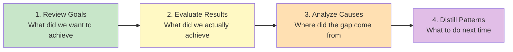
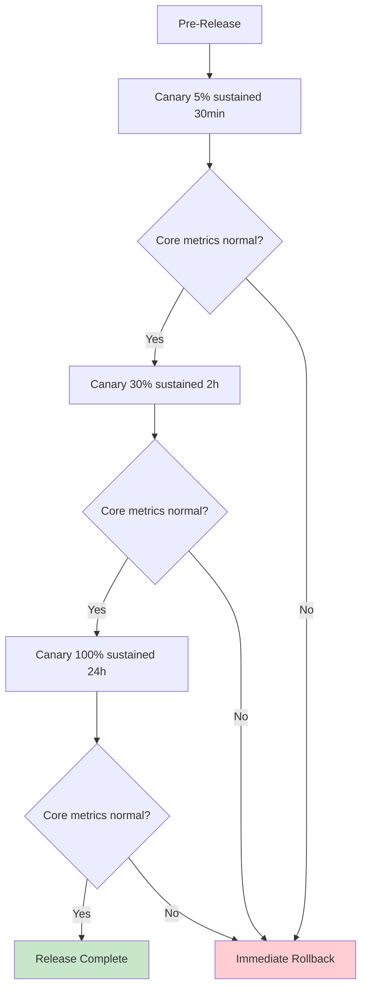

# [Project/Event Name] - Retrospective Report

> **Document Status:** 🟡 Under Review / 🟢 Archived / 🔴 Redo
>
> **Confidentiality Level:** Confidential / Internal
>
> **Version:** v1.0.0
>
> **Date:** YYYY-MM-DD
>
> **Retrospective Time:** YYYY-MM-DD HH:MM ~ HH:MM
>
> **Retrospective Location:** {Meeting Room / Online Meeting Link}
>
> **Facilitator:** [Name/Role]
>
> **Note Taker:** [Name/Role]
>
> **Participants:** [Name1 (Role1), Name2 (Role2), ...]
>
> **Retrospective Type:** 🟢 Project Delivery / 🟡 Incident / 🔴 Failure / ⚪ Periodic
>
> **Related Documents:** [Charter / PRD / Incident Report / Timeline]

---

## 0. Document Guide

### 0.1 Document Purpose & Scope

**Retrospective answers:** "What did we originally want to achieve, what did we actually achieve, where did the gap come from, and how to not repeat mistakes" — Converting one-time experiences into reusable assets.

**Methodology Basis**: Retrospective Four-Step Method (Reference kueiku Work Methodology)



**Applicable Scenarios:**

- ✅ Learning capture after project delivery (project retrospective)
- ✅ Root cause analysis of production incidents/failures (incident retrospective)
- ✅ Periodic summary (quarterly / semi-annual / annual retrospective)
- ✅ Key decision review (major decision retrospective)
- ❌ Blame game (for accountability, use performance process)
- ❌ Diary-style report (use weekly/monthly report)

### 0.2 Retrospective Principles

| Principle | Description |
| :--------------- | :------------------------------------------------------ |
| **Focus on Issues, Not People** | Discuss behaviors and decisions, not individuals |
| **Data-Driven** | Use data, avoid "I feel" / "roughly similar" |
| **Open & Transparent** | Encourage surfacing problems, no hiding |
| **Future-Oriented** | Focus on "what to do next time," not "who was wrong" |
| **Closed-Loop Verification** | Improvement actions must be actionable, trackable, verifiable |

### 0.3 Related Documents

| Document Type | Filename | Related Sections |
| :------- | :------------------ | :--------- |
| [Type] | [Filename] [Line Range] | [Section Description] |

> **Reference Format**: Related documents use the `filename line range` format. Line numbers may change as documents are updated; refer to the actual content.

### 0.4 Change Log

| Version | Date | Author | Changes | Reviewer |
| :----- | :--------- | :----- | :----------------------------- | :------- |
| v0.1 | YYYY-MM-DD | [Name] | Initial draft: Four-step skeleton | [Name] |
| v0.2 | YYYY-MM-DD | [Name] | Added improvement actions + owners | [Name] |
| v1.0 | YYYY-MM-DD | [Name] | Review passed, archived | [Owner] |

---

## 1. Retrospective Overview

> **5-Second Summary:** What is this retrospective, how broad is its scope, and what's the key conclusion.

| Element | Content |
| :--------------- | :-------------------------------------------------------------- |
| **Subject** | [e.g.: User Center v2.0 project / 2026-06 order timeout failure / Q2 quarter] |
| **Scope** | [e.g.: From 2026-04-01 project initiation to 2026-06-30 launch / Incident impact period] |
| **Key Conclusion** | [One-sentence summary, e.g.: Target achieved 80%, main gap in performance and documentation] |
| **Core Improvements** | [One-sentence summary, e.g.: 3 P0 improvements, 2 P1 SOP captures] |
| **Risk Level** | 🟢 Low / 🟡 Medium / 🔴 High |

---

## 2. Goal Review

> **Method**: Go back to the original goals. Do not use today's knowledge to alter historical goals. Cite original documents, note sources.

### 2.1 Original Goals

| Goal Type | Goal Description | Quantified Metric | Source Document |
| :----------- | :---------------------------------------- | :-------------------------------- | :----------------- |
| **Business Goal** | [e.g.: Improve paid conversion rate] | [e.g.: Conversion from 5% → 8%] | BRD §3.2 |
| **User Goal** | [e.g.: Reduce task completion time] | [e.g.: Single task from 30min → 10min] | PRD §1.2 |
| **Technical Goal** | [e.g.: Improve system availability] | [e.g.: SLO ≥ 99.95%] | TRD §4.1 |
| **Capability Goal** | [e.g.: Team masters Rust async development] | [e.g.: ≥ 3 people independently deliver modules] | Charter §5 |

### 2.2 Goal Priorities & Constraints

- **Core Goals** (non-negotiable): [e.g., Go-live timeline, security compliance]
- **Secondary Goals** (adjustable): [e.g., Performance optimization magnitude, user satisfaction]
- **Key Constraints**: [e.g., Headcount ≤ 5 / Budget ≤ ¥500k / Timeline ≤ 8 weeks]

### 2.3 Original Assumptions

> **Important**: Retrospective the assumptions, not the goals themselves. If assumptions are wrong, accurate goals are useless.

| Assumption ID | Assumption Content | Validation Method | Assumption Source |
| :------ | :------------------------------------ | :------------------------ | :------------------ |
| A-001 | [e.g.: Users use ≥ 3 times daily] | [e.g.: Seed user survey] | MRD §4.2 |
| A-002 | [e.g.: Third-party API stability ≥ 99.9%] | [e.g.: SLA agreement] | TRD §2.1 |
| A-003 | [e.g.: Team Rust experience sufficient] | [e.g.: Technical assessment] | Charter §6 |

---

## 3. Result Evaluation

> **Method**: Use data, compare item by item against goals, mark gaps. No sugar-coating, no exaggeration.

### 3.1 Goal Achievement

| Goal | Target | Actual | Achievement | Gap Analysis | Assessment |
| :----------- | :---------------- | :---------------- | :-----: | :--------------------- | :------- |
| Paid Conversion | 8% | 6.5% | 81% | [One sentence] | 🟡 Partial |
| Task Duration | 10min | 12min | 83% | [One sentence] | 🟡 Partial |
| SLO | 99.95% | 99.92% | 99.97% | [One sentence] | 🟡 Partial |
| Team Capability | 3 people independent | 2 independent + 1 assisted | 67% | [One sentence] | 🔴 Not Met |

### 3.2 Quantified Metrics Comparison

```mermaid
xychart-beta
    title "Target vs Actual Key Metrics Comparison"
    x-axis ["Conversion(%)", "Duration(min)", "SLO(%)", "Team(people)"]
    y-axis "Value" 0 --> 100
    bar [8, 10, 99.95, 3]
    bar [6.5, 12, 99.92, 2]
```



> **Note**: If the rendering environment doesn't support xychart-beta, use the table below instead.

| Metric | Target | Actual | Deviation |
| :---------- | :------ | :------ | :----------- |
| Conversion(%) | 8.0 | 6.5 | -1.5 |
| Duration(min) | 10.0 | 12.0 | +2.0 |
| SLO(%) | 99.95 | 99.92 | -0.03 |
| Team(people) | 3.0 | 2.0 | -1.0 |

### 3.3 Timeline Review

| Time Point | Planned Milestone | Actual Completion | Deviation | Cause |
| :------------ | :----------------- | :----------------- | :---------- | :-------------------- |
| 2026-04-15 | Requirements review complete | 2026-04-18 | +3 days | [e.g.: 2 requirement changes] |
| 2026-05-15 | Development complete | 2026-05-22 | +7 days | [e.g.: Third-party integration blocker] |
| 2026-06-15 | Testing complete | 2026-06-18 | +3 days | [e.g.: 12 regression bugs] |
| 2026-06-30 | Go-live | 2026-06-30 | On time | — |

### 3.4 Above/Below Expectations

| Category | Item | Notes |
| :----------- | :-------------------------------- | :---------------------------- |
| **Above Expectation** ✅ | [e.g.: CDN acceleration reduced first screen time by another 30%] | [Quantified data] |
| **Above Expectation** ✅ | [e.g.: Automated test coverage 85% > 80%] | [Quantified data] |
| **Below Expectation** ⚠️ | [e.g.: User satisfaction NPS only 45] | [Quantified data] |
| **Below Expectation** ⚠️ | [e.g.: 3 P1 bugs found post-launch] | [Quantified data] |

---

## 4. Cause Analysis

> **Method**: Distinguish "what went well" from "what went wrong." For the latter, use 5-Whys to find root causes. **Focus on issues, not people.**

### 4.1 What Went Well (Keep)

> **Retain & Continue**: Which practices were effective and should be solidified.

| # | Practice Description | Effect | Recommended Formalization |
| :-: | :---------------------------------------- | :---------------------------- | :---------------------- |
| 1 | [e.g.: Daily 15-min standup to sync blockers] | [e.g.: Average blocker resolution ≤ 4h] | [e.g.: Write into team SOP] |
| 2 | [e.g.: PRs must include unit tests] | [e.g.: Regression bug rate -40%] | [e.g.: CI mandatory gate] |
| 3 | [e.g.: Key decisions have ADR records] | [e.g.: Decision traceability 0 blockers] | [e.g.: Templated ADR process] |

### 4.2 What Went Wrong (Problem)

> **Improve & Fix**: Which practices were ineffective or harmful and need change.

| # | Problem Description | Impact | Severity |
| :-: | :---------------------------------------- | :---------------------------- | :-------- |
| 1 | [e.g.: Requirements review didn't include testers, causing late rework] | [e.g.: Test phase extended 5 days] | 🔴 High |
| 2 | [e.g.: Third-party API integration not scheduled in advance] | [e.g.: Development phase blocked 3 days] | 🟡 Medium |
| 3 | [e.g.: Canary percentage jumped 5% → 50%] | [e.g.: Abnormal traffic amplified 10x] | 🟡 Medium |

### 4.3 Root Cause Analysis (5-Whys)

> **For each 🔴 High severity problem, must use 5-Whys to trace to root cause.**

#### Problem #1: Requirements review didn't include testers

```text
Why 1: Why was the test phase extended by 5 days?
  → Because 12 regression bugs were discovered late in the test phase.
Why 2: Why were they discovered late?
  → Because test cases were written after development was complete, unable to intervene early.
Why 3: Why were test cases written late?
  → Because testers didn't attend requirements review, understanding was delayed.
Why 4: Why didn't they attend requirements review?
  → Because the review process didn't list testers as mandatory participants.
Why 5: Why didn't the process specify this? (Root Cause)
  → Because there was no project process SOP, depending on PM's personal habits for invitations.
```

**Root Cause**: Lack of project process SOP; key role participation depends on personal habits.

**Improvement Direction**: Develop project process SOP, define mandatory participants for each phase.

### 4.4 Assumption Verification

> **Go back to §2.3 assumptions, verify each one.**

| Assumption ID | Assumption Content | Actual Situation | Valid? | Impact |
| :------ | :----------------------------- | :----------------------------- | :-------: | :-------------------- |
| A-001 | Users use ≥ 3 times daily | Actual 1.8 times | ❌ Invalid | Root cause of conversion not meeting target |
| A-002 | Third-party API stability ≥ 99.9% | Actual 99.5% | ❌ Invalid | SLO not meeting target |
| A-003 | Team Rust experience sufficient | Actual 2 independent + 1 assisted | ⚠️ Partial | Development timeline extended |

---

## 5. Pattern Distillation

> **Method**: Extract one-time experiences into reusable methodologies / SOPs / checklists. **A retrospective without capture = no retrospective.**

### 5.1 Reusable Experiences

| # | Experience Description | Applicable Scenario | Asset Form |
| :-: | :---------------------------------------- | :---------------------------- | :---------------------- |
| 1 | [e.g.: Key decisions must have ADR records] | All ≥ 1 week projects | [e.g.: ADR template] |
| 2 | [e.g.: Canary percentage follows 5% → 30% → 100% three stages] | All consumer-facing releases | [e.g.: Release SOP] |
| 3 | [e.g.: Third-party dependencies must be coordinated 1 week in advance] | Projects with external dependencies | [e.g.: Scheduling checklist] |

### 5.2 Pitfall Records

| # | Pitfall Description | Trigger Condition | Avoidance Method |
| :-: | :---------------------------------------- | :---------------------------- | :---------------------- |
| 1 | [e.g.: Large canary jump amplified anomalies] | Canary percentage jump > 30% | [e.g.: Single jump ≤ 25%] |
| 2 | [e.g.: Large number of regression bugs found late in test phase] | Test cases written after development | [e.g.: TDD / Shift-left testing] |
| 3 | [e.g.: Third-party API quota insufficient causing throttling] | Didn't request quota in advance | [e.g.: Scheduling includes quota request] |

### 5.3 SOP Distillation

> **Standard operating procedures distilled from this retrospective**, to be written into the team knowledge base.

#### SOP-001: Project Release Canary Process



**Key Constraints:**

- Single canary percentage jump ≤ 25%
- Each stage duration ≥ 2x previous stage
- Rollback trigger: Error rate > 1% or P99 > threshold

### 5.4 Checklist

> **Pre-flight checklist for the next project**, to avoid repeating mistakes.

- [ ] Scheduling template includes "external dependency coordination" prerequisite task
- [ ] Requirements review invites testers to participate
- [ ] Key decisions have ADR records
- [ ] Canary plan follows SOP-001
- [ ] Assumption list has been validated (no guesswork)
- [ ] Team capability assessment matches goals

---

## 6. Action Items

> **Improvement actions must be SMART**: Specific, Measurable, Achievable, Relevant, Time-bound. **An action without an owner = a non-existent action.**

### 6.1 Action Item List

| ID | Priority | Improvement Action | Owner | Deadline | Acceptance Criteria | Status |
| :---- | :----: | :---------------------------------------- | :-------- | :--------- | :------------------------ | :------ |
| A-001 | P0 | Develop project process SOP, define mandatory participants per phase | [PM] | YYYY-MM-DD | SOP document review passed | ⚪ Todo |
| A-002 | P0 | Update scheduling template, add "external dependency" check item | [PM] | YYYY-MM-DD | Template updated and applied to next project | ⚪ Todo |
| A-003 | P1 | Develop ADR template and process | [Architect] | YYYY-MM-DD | Template archived + team training complete | ⚪ Todo |
| A-004 | P1 | Gray release SOP-001 team training | [SRE] | YYYY-MM-DD | Training complete + 100% pass rate | ⚪ Todo |
| A-005 | P2 | Build third-party API health dashboard | [SRE] | YYYY-MM-DD | Dashboard live + alert integration | ⚪ Todo |

### 6.2 Action Item Tracking

- **Tracking Mechanism**: Weekly standup sync progress, monthly review
- **Owner Responsibilities**: Complete on time + proactively expose blockers + provide evidence before acceptance
- **Escalation Mechanism**: Overdue → Escalate to Owner → Adjust resources if needed

### 6.3 Long-Term Capability Building

| Capability | Current State | Target | Path | Owner |
| :------------- | :-------------------- | :-------------------- | :------------------------------ | :-------- |
| Rust Async Development | 2 independent + 1 assisted | 4 independent | Internal training + hands-on projects | [TL] |
| Gray Release Standard | Ad-hoc | SOP-ized | Complete SOP-001 + training | [SRE] |
| Hypothesis-Driven Decisions | Guesswork | Data validation | Build A/B testing capability + decision template | [PM] |

---

## 7. Appendix

### 7.1 Full Timeline

| Time | Event | Decision Maker | Impact |
| :--------------- | :-------------------------------- | :-------- | :-------------------- |
| 2026-04-01 10:00 | Project kick-off meeting | [Owner] | Project initiated |
| 2026-04-15 14:00 | Requirements review | [PM] | Requirements baseline |
| 2026-05-22 18:00 | Development complete (delayed 7 days) | [TL] | Test cycle compressed |
| 2026-06-30 22:00 | Go-live | [Owner] | On-time launch |

### 7.2 Data Asset Archive

| Asset Type | Location | Retention | Owner |
| :----------- | :-------------------------------- | :---------- | :-------- |
| Project documents | {Wiki link} | Permanent | [PM] |
| Code repository | {Git repo} | Permanent | [TL] |
| Monitoring data | {Grafana link} | 1 year | [SRE] |
| Incident report | {Post-incident report link} | 3 years | [SRE] |
| User research | {Research report link} | 2 years | [PM] |

### 7.3 Participant Feedback

> **Anonymous post-retrospective collection**: Did this retrospective achieve its purpose? What can be improved?

| Dimension | Rating (1-5) | Suggestions |
| :--------------- | :----------: | :---------------------------- |
| Goal Achievement | | |
| Participation Level | | |
| Actionability of Conclusions | | |
| Time Management | | |
| Facilitation Quality | | |

### 7.4 Glossary

| Term | English | Definition |
| :------ | :------------------ | :---------------------------- |
| ADR | Architecture Decision Record | Architecture decision record |
| SOP | Standard Operating Procedure | Standard operating procedure |
| SLO | Service Level Objective | Service level objective |
| 5-Whys | 5 Whys | Five-why root cause analysis |
| KPT | Keep / Problem / Try | Keep / Problem / Try |

### 7.5 References

1. Qiu Zhaoliang. (2020). _Retrospective+: Converting Experience into Capability_. China Machine Press.
2. Eric Ries. (2011). _The Lean Startup_. Crown Business.
3. Derby, E., & Larsen, D. (2006). _Agile Retrospectives_. Pragmatic Bookshelf.

---

## 📌 Retrospective Report Writing Checklist

- [ ] §0 Document Guide: Purpose / Principles / Related Documents / Change Log
- [ ] §1 Retrospective Overview: Subject / Scope / Key Conclusion / Risk Level
- [ ] §2 Goal Review: ≥ 3 goal types + Quantified metrics + Source documents + Assumption list
- [ ] §3 Result Evaluation: Goal achievement rate + Timeline + Above/Below expectations
- [ ] §4 Cause Analysis: Keep / Problem / 5-Whys root cause / Assumption verification
- [ ] §5 Pattern Distillation: Reusable experiences + Pitfall records + SOP + Checklist
- [ ] §6 Action Items: SMART list + Owner + Deadline + Tracking mechanism
- [ ] §7 Appendix: Timeline + Asset archive + Participant feedback + Glossary
- [ ] Focus on issues, not people; no personal blame
- [ ] Data-driven, avoid "I feel"
- [ ] Each Problem has root cause analysis
- [ ] Each improvement action has owner + deadline + acceptance criteria
- [ ] Related document links are complete
