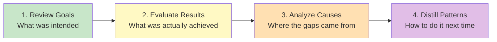
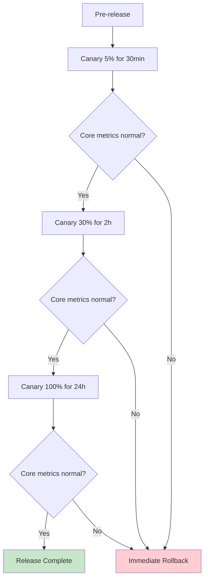

# [Project/Event Name] - Retrospective Report

> **Document Status:** 🟡 Under Review / 🟢 Archived / 🔴 Redo
>
> **Confidentiality Level:** Confidential / Internal Public
>
> **Version:** v1.0.0
>
> **Date:** YYYY-MM-DD
>
> **Retrospective Time:** YYYY-MM-DD HH:MM ~ HH:MM
>
> **Retrospective Location:** {Meeting Room / Online Meeting Link}
>
> **Facilitator:** [Name/Role]
>
> **Note Taker:** [Name/Role]
>
> **Participants:** [Name1 (Role1), Name2 (Role2), ...]
>
> **Retrospective Type:** 🟢 Project Delivery / 🟡 Event / 🔴 Incident / ⚪ Periodic
>
> **Related Documents:** [Charter / PRD / Incident Report / Timeline]

---

## 0. Document Guide

### 0.1 Document Purpose & Scope

**Retrospective answers:** "What was intended, what was actually achieved, where the gaps came from, and how to avoid repeating mistakes next time" — converting one-time experience into reusable assets.

**Methodology Foundation**: Retrospective four-step method (referencing kueiku methodology)



**Applicable Scenarios:**

- ✅ Learning capture after project delivery (Project Retrospective)
- ✅ Root cause analysis of production incidents (Event Retrospective)
- ✅ Periodic summary (Quarterly / Semi-annual / Annual)
- ✅ Key decision review (Major Decision Retrospective)
- ❌ Blame session (use performance process for accountability)
- ❌ Daily log report (use weekly/monthly reports)

### 0.2 Retrospective Principles

| Principle | Description |
| :--- | :--- |
| **Focus on Behavior, Not People** | Discuss actions and decisions, not individuals |
| **Data-Driven** | Use data, avoid "I feel" / "roughly" |
| **Open & Transparent** | Encourage exposing problems, not hiding them |
| **Future-Oriented** | Focus on "how to do it next time" rather than "who was wrong" |
| **Closed-Loop Verification** | Improvement actions must be actionable, traceable, and verifiable |

### 0.3 Related Documents

| Document Type | Filename | Related Sections |
| :--- | :--- | :--- |
| [Type] | [Filename] [Line Range] | [Section Description] |

> **Citation Format**: Related documents use the `filename line range` format. Line numbers may change with document updates; refer to actual content.

### 0.4 Change Log

| Version | Date | Author | Changes | Reviewer |
| :--- | :--- | :--- | :--- | :--- |
| v0.1 | YYYY-MM-DD | [Name] | Initial draft: four-step skeleton | [Name] |
| v0.2 | YYYY-MM-DD | [Name] | Added improvement actions + owners | [Name] |
| v1.0 | YYYY-MM-DD | [Name] | Review passed, archived | [Owner] |

---

## 1. Retrospective Overview

> **5-Second Read:** What this retrospective is about, its scope, and the key conclusion.

| Element | Content |
| :--- | :--- |
| **Retrospective Subject** | [e.g., User Center v2.0 Project / 2026-06 Order Timeout Incident / Q2 Quarterly] |
| **Scope** | [e.g., From 2026-04-01 initiation to 2026-06-30 launch / Incident impact window] |
| **Key Conclusion** | [One-line summary, e.g., Goal achieved 80%, main gaps in performance and documentation] |
| **Core Improvements** | [One-line summary, e.g., 3 P0 improvements, 2 P1 SOP captures] |
| **Risk Level** | 🟢 Low / 🟡 Medium / 🔴 High |

---

## 2. Goal Review

> **Methodology**: Go back to the original goals. Don't revise historical goals with today's knowledge. Cite original documents with source attribution.

### 2.1 Original Goals

| Goal Type | Goal Description | Quantified Metric | Source Document |
| :--- | :--- | :--- | :--- |
| **Business Goal** | [e.g., Improve paid conversion rate] | [e.g., Conversion rate from 5% → 8%] | BRD §3.2 |
| **User Goal** | [e.g., Reduce task completion time] | [e.g., Single task time from 30min → 10min] | PRD §1.2 |
| **Technical Goal** | [e.g., Improve system availability] | [e.g., SLO ≥ 99.95%] | TRD §4.1 |
| **Capability Goal** | [e.g., Team masters Rust async development] | [e.g., ≥ 3 people independently deliver modules] | Charter §5 |

### 2.2 Goal Priorities & Constraints

- **Core Goals** (Non-negotiable): [e.g., Launch timeline, security compliance]
- **Secondary Goals** (Adjustable): [e.g., Performance optimization magnitude, user satisfaction]
- **Key Constraints**: [e.g., Team ≤ 5 people / Budget ≤ ¥500K / Timeline ≤ 8 weeks]

### 2.3 Original Assumptions

> **Important**: Retrospective the assumptions, not the goals themselves. If assumptions are wrong, even accurate goals are useless.

| Assumption ID | Assumption Content | Verification Method | Assumption Source |
| :--- | :--- | :--- | :--- |
| A-001 | [e.g., Users use daily ≥ 3 times] | [e.g., Seed user survey] | MRD §4.2 |
| A-002 | [e.g., Third-party API stability ≥ 99.9%] | [e.g., SLA agreement] | TRD §2.1 |
| A-003 | [e.g., Team Rust experience is sufficient] | [e.g., Technical assessment] | Charter §6 |

---

## 3. Result Evaluation

> **Methodology**: Use data, compare against goals item by item, annotate gaps. Don't sugarcoat or exaggerate.

### 3.1 Goal Achievement

| Goal | Target | Actual | Achievement Rate | Gap Analysis | Assessment |
| :--- | :--- | :--- | :--- | :--- | :--- |
| Paid Conversion Rate | 8% | 6.5% | 81% | [One-line note] | 🟡 Partial |
| Task Completion Time | 10min | 12min | 83% | [One-line note] | 🟡 Partial |
| SLO | 99.95% | 99.92% | 99.97% | [One-line note] | 🟡 Partial |
| Team Capability | 3 people independent | 2 independent + 1 assisted | 67% | [One-line note] | 🔴 Not Met |

### 3.2 Quantified Metrics Comparison

```mermaid
xychart-beta
    title "Target vs Actual Key Metrics Comparison"
    x-axis ["Conversion(%)", "Time(min)", "SLO(%)", "Team(headcount)"]
    y-axis "Value" 0 --> 100
    bar [8, 10, 99.95, 3]
    bar [6.5, 12, 99.92, 2]
```



> **Note**: If the rendering environment doesn't support xychart-beta, use the following table instead.

| Metric | Target | Actual | Deviation |
| :--- | :--- | :--- | :--- |
| Conversion(%) | 8.0 | 6.5 | -1.5 |
| Time(min) | 10.0 | 12.0 | +2.0 |
| SLO(%) | 99.95 | 99.92 | -0.03 |
| Team(headcount) | 3.0 | 2.0 | -1.0 |

### 3.3 Timeline Review

| Timepoint | Planned Milestone | Actual Completion | Deviation | Reason |
| :--- | :--- | :--- | :--- | :--- |
| 2026-04-15 | Requirements Review Complete | 2026-04-18 | +3 days | [e.g., Requirements changed 2 times] |
| 2026-05-15 | Development Complete | 2026-05-22 | +7 days | [e.g., Third-party integration blocked] |
| 2026-06-15 | Testing Complete | 2026-06-18 | +3 days | [e.g., 12 regression bugs] |
| 2026-06-30 | Launch | 2026-06-30 | On time | — |

### 3.4 Above Expectations / Below Expectations

| Category | Item | Notes |
| :--- | :--- | :--- |
| **Above Expectations** ✅ | [e.g., CDN acceleration reduced first screen time by another 30%] | [Quantified data] |
| **Above Expectations** ✅ | [e.g., Automated test coverage 85% > 80% target] | [Quantified data] |
| **Below Expectations** ⚠️ | [e.g., User satisfaction NPS only 45] | [Quantified data] |
| **Below Expectations** ⚠️ | [e.g., 3 P1 bugs discovered after launch] | [Quantified data] |

---

## 4. Cause Analysis

> **Methodology**: Separate "what went well" from "what went wrong". For the latter, use 5-Whys to find root causes. **Focus on behavior, not people.**

### 4.1 What Went Well (Keep)

> **Preserve & Continue**: Which practices were effective and should be institutionalized.

| # | Practice | Effect | Recommended Formalization |
| :-: | :--- | :--- | :--- |
| 1 | [e.g., Daily 15-min standup to sync blockers] | [e.g., Average blocker resolution time ≤ 4h] | [e.g., Write into team SOP] |
| 2 | [e.g., PRs must include unit tests] | [e.g., Regression bug rate -40%] | [e.g., CI gate enforcement] |
| 3 | [e.g., Key decisions have ADR records] | [e.g., 0 decision-tracing blockers] | [e.g., ADR template process] |

### 4.2 What Went Wrong (Problem)

> **Improve & Resolve**: Which practices were ineffective or harmful and need to change.

| # | Problem Description | Impact | Severity |
| :-: | :--- | :--- | :--- |
| 1 | [e.g., Requirements review didn't invite QA, causing late rework] | [e.g., Testing phase extended 5 days] | 🔴 High |
| 2 | [e.g., Third-party API integration not scheduled in advance] | [e.g., Development phase blocked 3 days] | 🟡 Medium |
| 3 | [e.g., Canary percentage jumped from 5% to 50%] | [e.g., Abnormal traffic amplified 10x] | 🟡 Medium |

### 4.3 Root Cause Analysis (5-Whys)

> **For each 🔴 high-severity problem, use 5-Whys to trace to root cause.**

#### Problem #1: Requirements review didn't invite QA

```text
Why 1: Why was the testing phase extended 5 days?
  → Because 12 regression bugs were discovered late in testing.
Why 2: Why were they discovered late?
  → Because test cases were written after development completed, unable to intervene early.
Why 3: Why were test cases written late?
  → Because QA didn't attend requirements review, leading to delayed understanding.
Why 4: Why didn't QA attend?
  → Because the review process didn't list QA as a required participant.
Why 5: Why wasn't this in the process? (Root Cause)
  → Because there was no project process SOP; PM invited participants based on personal habits.
```

**Root Cause**: Lack of project process SOP; key role participation depended on individual habits.

**Improvement Direction**: Establish project process SOP, define required participants at each stage.

#### Problem #2: Third-party API integration not scheduled in advance

```text
Why 1: Why was the development phase blocked 3 days?
  → Because the third-party API test environment was unavailable.
Why 2: Why was it unavailable?
  → Because test accounts and quotas weren't applied for in advance.
Why 3: Why weren't they applied for in advance?
  → Because the project schedule didn't include "external dependency onboarding" as a prerequisite.
Why 4: Why wasn't it included?
  → Because the schedule template lacked an "external dependency" checklist item.
Why 5: Why did the template lack this? (Root Cause)
  → Because the schedule template was never optimized through retrospective.
```

**Root Cause**: Schedule template lacks external dependency checklist, never optimized through retrospective.

**Improvement Direction**: Update schedule template, add mandatory "external dependency" checklist item.

### 4.4 Assumption Validation

> **Return to §2.3 assumptions and validate each one.**

| Assumption ID | Assumption Content | Actual Situation | Valid | Impact |
| :--- | :--- | :--- | :--- | :--- |
| A-001 | Users use daily ≥ 3 times | Actual 1.8 times | ❌ Invalid | Root cause of conversion rate miss |
| A-002 | Third-party API stability ≥ 99.9% | Actual 99.5% | ❌ Invalid | SLO missed target |
| A-003 | Team Rust experience is sufficient | 2 independent + 1 needed assistance | ⚠️ Partial | Development cycle extended |

---

## 5. Pattern Distillation

> **Methodology**: Extract one-time experience into reusable methodologies / SOPs / checklists. **A retrospective without capture = no retrospective.**

### 5.1 Reusable Experience

| # | Experience | Applicable Scenario | Asset Form |
| :-: | :--- | :--- | :--- |
| 1 | [e.g., Key decisions must have ADR records] | All projects ≥ 1 week | [e.g., ADR template] |
| 2 | [e.g., Canary percentage in 3 stages: 5% → 30% → 100%] | All consumer-facing releases | [e.g., Release SOP] |
| 3 | [e.g., Third-party dependencies must be coordinated 1 week in advance] | Projects with external dependencies | [e.g., Schedule checklist] |

### 5.2 Pitfall Records

| # | Pitfall | Trigger Condition | Avoidance Method |
| :-: | :--- | :--- | :--- |
| 1 | [e.g., Large canary jump amplified anomalies] | Canary percentage jump > 30% | [e.g., Single jump ≤ 25%] |
| 2 | [e.g., Regression bugs discovered late in testing] | Test cases written after development | [e.g., TDD / Shift-left testing] |
| 3 | [e.g., Third-party API quota insufficient causing rate limiting] | Didn't apply for quota in advance | [e.g., Schedule includes quota application] |

### 5.3 SOP Extraction

> **Standard operating procedures distilled from this retrospective**, written to team knowledge base.

#### SOP-001: Project Release Canary Process



**Key Constraints:**

- Single canary percentage jump ≤ 25%
- Each stage duration ≥ 2x the previous stage
- Rollback trigger: Error rate > 1% or P99 > threshold

### 5.4 Checklist

> **Must-check list before starting the next project**, to avoid repeating mistakes.

- [ ] Schedule template includes "external dependency onboarding" prerequisite
- [ ] Requirements review invites QA participation
- [ ] Key decisions have ADR records
- [ ] Canary plan follows SOP-001
- [ ] Assumption list has been validated (no guessing)
- [ ] Team capability assessment matches goals

---

## 6. Improvement Actions

> **Improvement actions must be SMART**: Specific, Measurable, Achievable, Relevant, Time-bound. **An action without an owner = non-existent action.**

### 6.1 Improvement Action List

| ID | Priority | Improvement Action | Owner | Deadline | Acceptance Criteria | Status |
| :--- | :---: | :--- | :--- | :--- | :--- | :--- |
| A-001 | P0 | Establish project process SOP, define required participants at each stage | [PM] | YYYY-MM-DD | SOP document review passed | ⚪ To Do |
| A-002 | P0 | Update schedule template, add "external dependency" checklist | [PM] | YYYY-MM-DD | Template updated and applied to next project | ⚪ To Do |
| A-003 | P1 | Create ADR template and process | [Architect] | YYYY-MM-DD | Template archived + team training completed | ⚪ To Do |
| A-004 | P1 | Canary SOP-001 team training | [SRE] | YYYY-MM-DD | Training completed + 100% pass rate | ⚪ To Do |
| A-005 | P2 | Establish third-party API health dashboard | [SRE] | YYYY-MM-DD | Dashboard live + alert integration | ⚪ To Do |

### 6.2 Action Tracking

- **Tracking Mechanism**: Weekly standup sync, monthly review
- **Owner Responsibilities**: Complete on time + proactively expose blockers + provide evidence before acceptance
- **Escalation Mechanism**: Overdue → Escalate to Owner → Adjust resources if needed

### 6.3 Long-term Capability Building

| Capability | Current State | Target | Path | Owner |
| :--- | :--- | :--- | :--- | :--- |
| Rust Async Development | 2 independent + 1 assisted | 4 independent | Internal training + practice projects | [TL] |
| Canary Release Standardization | Ad-hoc | SOP-based | Complete SOP-001 + training | [SRE] |
| Assumption-Driven Decision Making | Gut feeling | Data-validated | Build A/B testing capability + decision templates | [PM] |

---

## 7. Appendix

### 7.1 Complete Timeline

| Time | Event | Decision Maker | Impact |
| :--- | :--- | :--- | :--- |
| 2026-04-01 10:00 | Project kickoff meeting | [Owner] | Initiation |
| 2026-04-15 14:00 | Requirements review | [PM] | Requirements baseline |
| 2026-05-22 18:00 | Development complete (7 days late) | [TL] | Compressed testing cycle |
| 2026-06-30 22:00 | Launch | [Owner] | On-time launch |

### 7.2 Data Asset Archival

| Asset Type | Location | Retention Period | Owner |
| :--- | :--- | :--- | :--- |
| Project Documents | {Wiki Link} | Permanent | [PM] |
| Code Repository | {Git Repository} | Permanent | [TL] |
| Monitoring Data | {Grafana Link} | 1 year | [SRE] |
| Incident Reports | {Post-incident Report Link} | 3 years | [SRE] |
| User Research | {Research Report Link} | 2 years | [PM] |

### 7.3 Participant Feedback

> **Anonymous post-retrospective collection**: Did this retrospective achieve its purpose? What can be improved?

| Dimension | Score (1-5) | Suggestion |
| :--- | :---: | :--- |
| Goal Achievement | | |
| Participation | | |
| Actionability of Conclusions | | |
| Time Management | | |
| Facilitation Quality | | |

### 7.4 Glossary

| Term | English | Definition |
| :--- | :--- | :--- |
| ADR | Architecture Decision Record | Architecture decision record |
| SOP | Standard Operating Procedure | Standard operating procedure |
| SLO | Service Level Objective | Service level objective |
| 5-Whys | 5 Whys | Five-why root cause analysis |
| KPT | Keep / Problem / Try | Keep / Problem / Try |

### 7.5 References

1. Qiu Zhaoliang. (2020). _Retrospective+: Converting Experience into Capability_. China Machine Press.
2. Eric Ries. (2011). _The Lean Startup_. Crown Business.
3. Derby, E., & Larsen, D. (2006). _Agile Retrospectives_. Pragmatic Bookshelf.

---

## 📌 Retrospective Report Writing Checklist

- [ ] §0 Document Guide: Purpose / Principles / Related Documents / Change Log
- [ ] §1 Retrospective Overview: Subject / Scope / Key Conclusion / Risk Level
- [ ] §2 Goal Review: ≥ 3 goal types + quantified metrics + source documents + assumption list
- [ ] §3 Result Evaluation: Goal achievement rate + timeline + above/below expectations
- [ ] §4 Cause Analysis: Keep / Problem / 5-Whys root cause / Assumption validation
- [ ] §5 Pattern Distillation: Reusable experience + pitfall records + SOP + checklist
- [ ] §6 Improvement Actions: SMART list + owner + deadline + tracking mechanism
- [ ] §7 Appendix: Timeline + asset archival + participant feedback + glossary
- [ ] Focus on behavior, not people; no individual blame
- [ ] Data-driven, avoid "I feel"
- [ ] Every Problem has root cause analysis
- [ ] Every improvement action has owner + deadline + acceptance criteria
- [ ] Related document links complete
