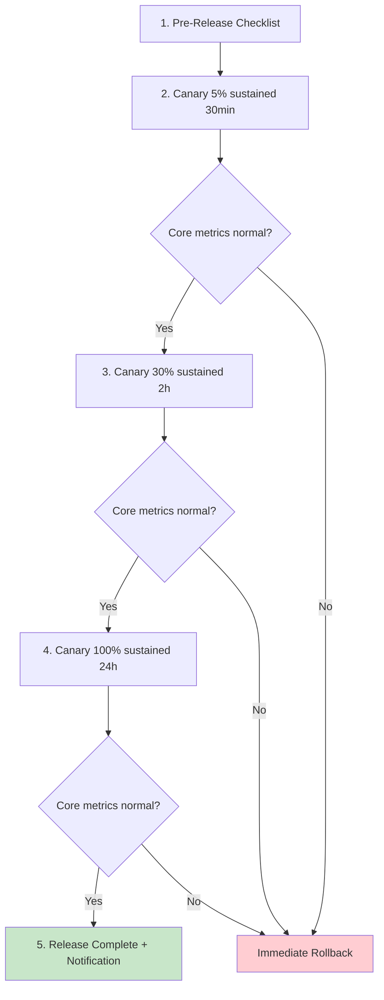
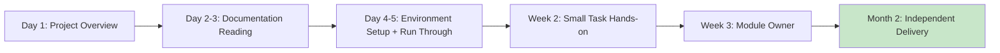

# [Project/System Name] - Knowledge Base

> **Document Status:** 🟢 Continuously Maintained / 🟡 Under Review / 🔴 Archived
>
> **Confidentiality Level:** Confidential / Internal
>
> **Version:** v1.0.0
>
> **Date:** YYYY-MM-DD
>
> **Author:** [Project Owner / Knowledge Manager]
>
> **Reviewer:** [TL / Architect]
>
> **Audience:** Team members, new hires, cross-team collaborators, successors
>
> **Maintenance Frequency:** Monthly review, new experiences captured in real-time
>
> **Related Documents:** [Retrospective Report](./【Template】Retrospective.md) / [Operations Manual](../Operations Layer/【Template】Operations Manual.md) / [TRD](../Technical Layer/【Template】Technical Requirements Document (TRD).md)

---

## 0. Document Guide

### 0.1 Document Purpose & Scope

**Knowledge Base answers:** "Project is done, what experiences must be captured, what pitfalls must not be repeated, what practices should become SOPs" — Converting individual/team tacit knowledge into organizational assets.

**Difference from Retrospective Report:**

| Dimension | Retrospective Report | Knowledge Base |
| :------- | :--------------------- | :-------------------------------- |
| **Timing** | After a single project/event | Full project lifecycle + continuous maintenance |
| **Perspective** | Goals vs Results vs Causes | Experiences / Pitfalls / Best Practices / SOPs |
| **Purpose** | Learn how not to make mistakes next time | Enable anyone to reuse and avoid repeating pitfalls |
| **Lifecycle** | One-time archive | Living document, continuously updated |

**Applicable Scenarios:**

- ✅ Core experience capture after project delivery
- ✅ New hire onboarding material
- ✅ Cross-team knowledge transfer
- ✅ SOP / Checklist / Anti-pattern capture
- ❌ Diary-style project record (use weekly/monthly report)
- ❌ Individual performance summary (use performance process)

### 0.2 Capture Principles

| Principle | Description |
| :--------------- | :------------------------------------------------------ |
| **Reusable** | Captured content must be reusable by others, otherwise don't include |
| **Searchable** | Include keywords, tags, categories for easy retrieval |
| **Verifiable** | Experiences must be validated through practice; don't capture "I think" |
| **Iterable** | Living document; update or archive when outdated |
| **Quality over Quantity** | Better fewer but more refined; prevent knowledge base from becoming a dumpster |

### 0.3 Related Documents

| Document Type | Filename | Related Sections |
| :------- | :------------------ | :--------- |
| [Type] | [Filename] [Line Range] | [Section Description] |

> **Reference Format**: Related documents use the `filename line range` format. Line numbers may change as documents are updated; refer to the actual content.

### 0.4 Change Log

| Version | Date | Author | Changes | Reviewer |
| :----- | :--------- | :----- | :-------------------------------------- | :------- |
| v0.1 | YYYY-MM-DD | [Name] | Initial draft: Core experiences + pitfall records | [Name] |
| v0.2 | YYYY-MM-DD | [Name] | Added SOP distillation + anti-patterns | [Name] |
| v1.0 | YYYY-MM-DD | [Name] | Review passed, archived | [Owner] |

---

## 1. Knowledge Overview

> **5-Second Summary:** What project's knowledge is captured, which domains it covers, and where the key assets are.

| Element | Content |
| :--------------- | :-------------------------------------------------------------- |
| **Subject** | [e.g.: User Center v2.0 project] |
| **Domains Covered** | [e.g.: Architecture design / Performance optimization / Data migration / Third-party integration / Troubleshooting] |
| **Core Experience Count** | [e.g.: 8 core experiences + 12 pitfall records + 5 SOPs] |
| **Key Assets** | [e.g.: Architecture decision records / Performance baseline / Troubleshooting manual / New hire onboarding] |
| **Maintainer** | [Name / Role] |

---

## 2. Core Insights

> **Method**: Each experience must include "scenario + approach + quantified effect." Vague statements like "focus on quality" don't count as experience.

### 2.1 Architecture Design Experience

| # | Experience Description | Applicable Scenario | Quantified Effect | Verified Version |
| :-: | :---------------------------------------- | :---------------------------- | :---------------------- | :-------- |
| 1 | [e.g.: Decouple core business logic from IO for independent testability] | [e.g.: All backend services] | [e.g.: Test coverage +25%] | v1.0+ |
| 2 | [e.g.: Use CQRS for read-heavy/write-light scenarios] | [e.g.: User Center, Product Center] | [e.g.: QPS +3x] | v1.2+ |
| 3 | [e.g.: Cross-service calls must have timeout + retry + circuit breaker] | [e.g.: All RPC calls] | [e.g.: Failure propagation -90%] | v1.0+ |

#### INS-001 Detail: {Experience Title}

- **Scenario**: [e.g.: User Center read-heavy, single DB can't handle peak 5k QPS]
- **Approach**: [e.g.: Separate read/write, MySQL for writes, Redis + ES for reads]
- **Effect**: [e.g.: QPS from 1k to 5k, P99 from 800ms to 120ms]
- **Trade-off**: [e.g.: Data delay ≤ 5s, business must tolerate eventual consistency]
- **Code Location**: `{file}:{line}`
- **Reference**: [Architecture Design Document §3.2]

### 2.2 Performance Optimization Experience

| # | Experience Description | Applicable Scenario | Quantified Effect |
| :-: | :---------------------------------------- | :---------------------------- | :---------------------- |
| 1 | [e.g.: Batch operations instead of loop single calls] | [e.g.: DB / API calls] | [e.g.: Duration -80%] |
| 2 | [e.g.: Hot data preloading + async refresh] | [e.g.: Homepage / Dashboard] | [e.g.: First screen -50%] |
| 3 | [e.g.: Stream processing for large objects] | [e.g.: File upload / Export] | [e.g.: Memory -70%] |

### 2.3 Data Migration Experience

| # | Experience Description | Applicable Scenario | Quantified Effect |
| :-: | :---------------------------------------- | :---------------------------- | :---------------------- |
| 1 | [e.g.: Batch migration + dual-write verification] | [e.g.: DB table structure changes] | [e.g.: 0 data loss] |
| 2 | [e.g.: Full backup before migration + rollback rehearsal] | [e.g.: All migrations] | [e.g.: Rollback ≤ 5min] |

### 2.4 Team Collaboration Experience

| # | Experience Description | Applicable Scenario | Quantified Effect |
| :-: | :---------------------------------------- | :---------------------------- | :---------------------- |
| 1 | [e.g.: Daily 15-min standup to sync blockers] | [e.g.: All projects] | [e.g.: Blocker resolution ≤ 4h] |
| 2 | [e.g.: Key decisions must have ADR] | [e.g.: Architecture / selection decisions] | [e.g.: Decision traceability 0 blockers] |

---

## 3. Pitfall Records

> **Method**: Each pitfall includes "symptom / root cause / solution / avoidance method." **Pitfalls not captured = the next person will repeat them.**

### 3.1 Pitfall List

| # | Pitfall Title | Severity | Impact Scope | Status |
| :-: | :------------------------------ | :-------- | :---------------- | :---------- |
| 1 | [e.g.: Large canary jump amplified anomalies] | 🔴 High | [e.g.: Consumer full volume] | ✅ Fixed |
| 2 | [e.g.: Third-party API rate limit not pre-requested] | 🟡 Medium | [e.g.: Development phase] | ✅ Fixed |
| 3 | [e.g.: Timezone not unified caused order confusion] | 🔴 High | [e.g.: Cross-timezone users] | ✅ Fixed |
| 4 | [e.g.: JSON number precision loss] | 🟡 Medium | [e.g.: Amount calculations] | ✅ Fixed |

### 3.2 Pitfall Details

#### PIT-001: {Pitfall Title}

- **Symptom**: [e.g.: After canary jumped from 5% to 50%, error rate spiked to 30%]
- **Trigger Condition**: [e.g.: Single canary jump > 25%]
- **Root Cause**:

```text
Why 1: Why did error rate spike?
  → Because downstream services were overwhelmed.
Why 2: Why were they overwhelmed?
  → Because traffic increased 10x, downstream capacity insufficient.
Why 3: Why was capacity insufficient?
  → Because canary jump didn't do capacity assessment.
Why 4: Why wasn't it assessed?
  → Because gray release SOP was missing.
Why 5: Why was SOP missing? (Root Cause)
  → Because there was no release process capture.
```

- **Solution**: [e.g.: Canary follows 5% → 30% → 100% three stages, single jump ≤ 25%]
- **Avoidance Method**: [e.g.: Check against SOP-001 checklist before release]
- **Related Document**: [Retrospective Report §4.3]
- **Code Location**: `{file}:{line}`

---

## 4. Best Practices

> **Method**: "Should do it this way" lists distilled from experience, categorized by scenario.

### 4.1 General Best Practices

| # | Practice | Anti-pattern | Applicable Scenario |
| :-: | :---------------------------- | :---------------------------- | :---------------- |
| 1 | Config via environment variables | Hardcoded in code | All projects |
| 2 | Secrets managed via KMS / Vault | Written to git / config files | All projects |
| 3 | Errors explicitly thrown / reported | Swallowed errors with default values | All code |
| 4 | Structured JSON logs | Concatenated string logs | All services |
| 5 | DB queries use indexes | Full table scans | All DB operations |
| 6 | API response follows envelope pattern | Different structure per endpoint | All APIs |

### 4.2 Backend Best Practices

| # | Practice | Anti-pattern | Quantified Benefit |
| :-: | :---------------------------- | :---------------------------- | :---------------- |
| 1 | Write operations must be idempotent | Relying on client not to double-click | Duplicate orders -100% |
| 2 | Read operations use cache + fallback | Cache miss directly hitting DB | DB load -70% |
| 3 | Long transactions split into local message table | Cross-service distributed transactions | TPS +3x |
| 4 | Async tasks use message queues | Synchronous blocking calls | P99 -50% |

### 4.3 Frontend Best Practices

| # | Practice | Anti-pattern | Quantified Benefit |
| :-: | :---------------------------- | :---------------------------- | :---------------- |
| 1 | Virtual scrolling for large lists | Full DOM rendering | First screen -60% |
| 2 | Lazy loading images + responsive | Loading full original images | Traffic -80% |
| 3 | Preload critical resources | Waiting for HTML parse | LCP -30% |

### 4.4 Database Best Practices

| # | Practice | Anti-pattern | Quantified Benefit |
| :-: | :---------------------------- | :---------------------------- | :---------------- |
| 1 | Regular slow query review | No attention after go-live | P99 stable |
| 2 | Indexes built per query pattern | Adding index to every field | Write +20% |
| 3 | Large table partitioning / archiving | Unlimited single table growth | Query stable |

---

## 5. SOP Distillation (Standard Operating Procedures)

> **Method**: Convert "experience" into "process" so anyone following the steps gets the right result.

### 5.1 SOP Index

| SOP ID | Name | Applicable Scenario | Owner | Version |
| :-------- | :---------------------------- | :------------------------ | :-------- | :------ |
| SOP-001 | Project Release Canary Process | All consumer-facing releases | [SRE] | v1.0 |
| SOP-002 | Database Migration Process | DB table structure changes | [DBA] | v1.0 |
| SOP-003 | Third-party API Integration Process | Introducing new external dependencies | [TL] | v1.0 |
| SOP-004 | Incident Emergency Response Process | P0 / P1 incidents | [SRE] | v1.0 |
| SOP-005 | New Hire Onboarding Process | New member onboarding | [HR / TL] | v1.0 |

### 5.2 SOP-001: Project Release Canary Process

**Purpose**: Standardize release canary process to prevent incidents from large canary jumps.

**Prerequisites:**

- [ ] Test environment validation passed
- [ ] Gray release plan reviewed by SRE
- [ ] Rollback script rehearsal passed

**Steps:**



**Key Constraints:**

- Single canary percentage jump ≤ 25%
- Each stage duration ≥ 2x previous stage
- Rollback trigger: Error rate > 1% or P99 > threshold

**Rollback Steps:**

1. Trigger one-click rollback script: `bash scripts/rollback.sh {version}`
2. Notify on-call group: `{template}`
3. Incident retrospective: Submit retrospective report within 24 hours

**Owner**: SRE on-call personnel

---

## 6. Anti-Patterns

> **Method**: Record "should not do it this way" lists, with negative examples and correct approaches. **Anti-patterns are more educational than best practices.**

### 6.1 Architecture Anti-patterns

| # | Anti-pattern | Consequence | Correct Approach |
| :-: | :------------------------------ | :---------------------------- | :------------------------ |
| 1 | Monolith does everything | Deployment coupling, difficult scaling | Split by business domain into microservices |
| 2 | Distributed transactions with 2PC | Performance bottleneck, poor availability | Saga + local message table |
| 3 | Shared database across services | Strong coupling, high change risk | Independent database per service |
| 4 | Synchronous chains too long | Latency accumulation, cascading failure | Async + message queues |

### 6.2 Code Anti-patterns

| # | Anti-pattern | Consequence | Correct Approach |
| :-: | :------------------------------ | :---------------------------- | :------------------------ |
| 1 | God class / God function | Hard to maintain, hard to test | Single responsibility split |
| 2 | Magic values scattered | Hard to understand, easy to error | Centralized constant management |
| 3 | Swallowing errors with defaults | Problems hidden, hard to debug | Explicit throw + reporting |
| 4 | Global mutable state | Concurrency issues, hard to test | Dependency injection + immutability |

---

## 7. Knowledge Asset Inventory

> **Method**: Inventory all knowledge assets from this project for easy retrieval and transfer.

### 7.1 Document Assets

| Type | Name | Location | Maintainer | Status |
| :--------------- | :---------------------------- | :---------------------------- | :-------- | :---------- |
| Architecture docs | [Architecture Design Document] | [Path] | [Architect] | 🟢 Maintained |
| Technical docs | [TRD] | [Path] | [TL] | 🟢 Maintained |
| API docs | [API Documentation] | [Path] | [Backend TL] | 🟢 Maintained |
| Retrospective | [v2.0 Retrospective] | [Path] | [PM] | ✅ Archived |
| Ops manual | [Ops SOP] | [Path] | [SRE] | 🟢 Maintained |

### 7.2 Code Assets

| Type | Name | Location | Description |
| :--------------- | :---------------------------- | :---------------------------- | :---------------- |
| Core library | {library-name} | `path/to/lib` | {Description} |
| Utility scripts | {scripts} | `scripts/` | {Description} |
| Shared components | {component} | `packages/{component}` | {Description} |

### 7.3 Data Assets

| Type | Name | Location | Retention |
| :--------------- | :---------------------------- | :---------------------------- | :---------- |
| Monitoring dashboard | [Grafana Dashboard] | {URL} | Permanent |
| Alert rules | [Alert Config] | `alerts/` | Permanent |
| Performance baseline | [Baseline Data] | `benchmarks/` | 1 year |

### 7.4 Training Assets

| Type | Name | Audience | Maintainer |
| :--------------- | :---------------------------- | :---------------------------- | :-------- |
| New hire onboarding | [Onboarding Manual] | New members | [HR] |
| Internal training videos | [Architecture Introduction] | Everyone | [Architect] |
| Tech sharing | [Special Topic Sharing] | Everyone | [TL] |

---

## 8. Knowledge Transfer & Maintenance

### 8.1 New Hire Onboarding Path



| Phase | Must-Read Documents | Must-Do Tasks | Acceptance |
| :-------------- | :------------------------------------ | :------------------------ | :---------------- |
| Day 1 | README / Project Charter | Set up dev environment | Run hello world |
| Day 2-3 | Architecture docs / TRD / API docs | Read + Ask ≥ 3 questions | Q&A passed |
| Day 4-5 | Ops manual / Monitoring dashboard | Complete first PR | PR merged |
| Week 2 | Knowledge base / Retrospective | Fix 1 bug | Bug closed |
| Week 3 | SOP / Anti-patterns | Own 1 small module independently | Module delivered |

### 8.2 Knowledge Update Process

| Trigger Event | Update Action | Owner | Timeline |
| :--------------- | :-------------------------------- | :-------- | :---------- |
| Major incident | Capture pitfalls + anti-patterns + SOP | [TL] | Within 1 week |
| New technology introduction | Capture experience + best practices | [Architect] | Within 1 month |
| Project retrospective | Capture experience + SOP | [PM] | 1 week after retro |
| Quarterly review | Check outdated content + archive | [Owner] | Quarterly |
| Personnel change | Onboarding asset handoff | [TL] | 1 week before departure |

### 8.3 Knowledge Search

**Keyword Index:**

| Keyword | Related Sections |
| :--------------- | :-------------------------------------------------- |
| Performance optimization | §2.2 / §4.1 / §6.1 |
| Data migration | §2.3 / SOP-002 |
| Gray release | SOP-001 / PIT-001 |
| Amount precision | PIT-002 / §4.4 |
| Third-party integration | §2.1 / SOP-003 |

---

## 9. Appendix

### 9.1 Glossary

| Term | English | Definition |
| :------ | :---------------------------- | :---------------------------- |
| ADR | Architecture Decision Record | Architecture decision record |
| SOP | Standard Operating Procedure | Standard operating procedure |
| CQRS | Command Query Responsibility Segregation | Command Query Responsibility Segregation |
| KMS | Key Management Service | Key Management Service |
| Living Document | — | A continuously maintained living document |

### 9.2 References

1. Qiu Zhaoliang. (2020). _Retrospective+: Converting Experience into Capability_. China Machine Press.
2. Bosch, J. (2023). _Building and Managing Knowledge in Software Organizations_. O'Reilly.
3. Microsoft. (2023). _Azure Architecture Center — Best Practices_. https://learn.microsoft.com/azure/architecture/best-practices

---

## 📌 Knowledge Base Writing Checklist

- [ ] §0 Document Guide: Purpose / Principles / Related Documents / Change Log
- [ ] §1 Knowledge Overview: Subject / Domains / Asset inventory
- [ ] §2 Core Experiences: ≥ 4 categories (Architecture / Performance / Data / Collaboration), each with quantified effect
- [ ] §3 Pitfall Records: Each pitfall includes symptom / root cause / solution / avoidance method
- [ ] §4 Best Practices: General + Backend + Frontend + DB, with anti-pattern comparison
- [ ] §5 SOPs: ≥ 3 standard processes, with steps + owner + acceptance
- [ ] §6 Anti-patterns: ≥ 3 categories, with negative examples and correct approaches
- [ ] §7 Knowledge Assets: Complete inventory of docs / code / data / training
- [ ] §8 Knowledge Transfer: New hire path + Update process + Search index
- [ ] §9 Appendix: Glossary / References
- [ ] Experiences have quantified effect validation; don't capture "I think"
- [ ] Pitfalls have code locations / related documents, traceable
- [ ] Related document links are complete
