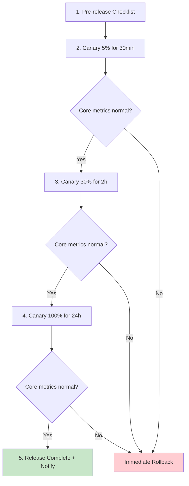
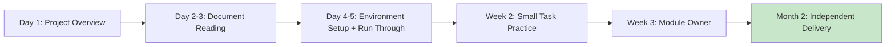

# [Project/System Name] - Knowledge Base

> **Document Status:** 🟢 Actively Maintained / 🟡 Under Review / 🟢 Archived
>
> **Confidentiality Level:** Confidential / Internal Public
>
> **Version:** v1.0.0
>
> **Date:** YYYY-MM-DD
>
> **Author:** [Project Owner / Knowledge Manager]
>
> **Reviewer:** [TL / Architect]
>
> **Target Audience:** Team members, new hires, cross-team collaborators, successors
>
> **Update Frequency:** Monthly review, new experiences captured immediately
>
> **Related Documents:** [Retrospective Report](./【Template】Retrospective Report.md) / [Operations Manual](../Operations Layer/【Template】Operations Manual.md) / [TRD](../Technical Layer/【Template】Technical Requirements Document (TRD).md)

---

## 0. Document Guide

### 0.1 Document Purpose & Scope

**Knowledge Base answers:** "After the project is done, what experiences must be captured, what pitfalls must not be repeated, and what practices should become SOPs" — converting individual/team tacit knowledge into organizational assets.

**Difference from Retrospective Report:**

| Dimension | Retrospective Report | Knowledge Base |
| :--- | :--- | :--- |
| **Timing** | After a single project / incident | Full project lifecycle + ongoing maintenance |
| **Perspective** | Goal vs Result vs Cause | Experience / Pitfall / Best Practice / SOP |
| **Purpose** | Learn how to avoid mistakes next time | Enable anyone to reuse and avoid repeated pitfalls |
| **Lifecycle** | One-time archival | Living document, continuously updated |

**Applicable Scenarios:**

- ✅ Core experience capture after project delivery
- ✅ New hire onboarding materials
- ✅ Cross-team knowledge transfer
- ✅ SOP / Checklist / Anti-pattern capture
- ❌ Daily log project records (use weekly/monthly reports)
- ❌ Personal performance summary (use performance process)

### 0.2 Capture Principles

| Principle | Description |
| :--- | :--- |
| **Reusable** | Captured content must be reusable by others; otherwise don't include |
| **Searchable** | Tagged with keywords, labels, categories for easy retrieval |
| **Verifiable** | Experience must be battle-tested; don't capture "I think" |
| **Iterable** | Living document; update or archive when outdated |
| **Quality over Quantity** | Better to have fewer entries than fill with junk |

### 0.3 Related Documents

| Document Type | Filename | Related Sections |
| :--- | :--- | :--- |
| [Type] | [Filename] [Line Range] | [Section Description] |

> **Citation Format**: Related documents use the `filename line range` format. Line numbers may change with document updates; refer to actual content.

### 0.4 Change Log

| Version | Date | Author | Changes | Reviewer |
| :--- | :--- | :--- | :--- | :--- |
| v0.1 | YYYY-MM-DD | [Name] | Initial draft: core experience + pitfall records | [Name] |
| v0.2 | YYYY-MM-DD | [Name] | Added SOP extraction + anti-patterns | [Name] |
| v1.0 | YYYY-MM-DD | [Name] | Review passed, archived | [Owner] |

---

## 1. Knowledge Overview

> **5-Second Read:** What project's knowledge is captured, which domains are covered, and where the key assets are.

| Element | Content |
| :--- | :--- |
| **Subject** | [e.g., User Center v2.0 Project] |
| **Coverage** | [e.g., Architecture Design / Performance Optimization / Data Migration / Third-party Integration / Troubleshooting] |
| **Core Experience Count** | [e.g., 8 core experiences + 12 pitfall records + 5 SOPs] |
| **Key Assets** | [e.g., Architecture Decision Records / Performance Baselines / Troubleshooting Manual / New Hire Onboarding] |
| **Maintainer** | [Name / Role] |

---

## 2. Core Insights

> **Methodology**: Each experience must include "scenario + approach + quantified effect". Vague statements like "focus on quality" don't count as experience.

### 2.1 Architecture Design Experience

| # | Experience | Applicable Scenario | Quantified Effect | Verified Version |
| :-: | :--- | :--- | :--- | :--- |
| 1 | [e.g., Core business logic decoupled from IO, independently testable] | [e.g., All backend services] | [e.g., Test coverage +25%] | v1.0+ |
| 2 | [e.g., CQRS for read-heavy/write-light scenarios, separate read/write models] | [e.g., User Center, Product Center] | [e.g., QPS +3x] | v1.2+ |
| 3 | [e.g., Cross-service calls must have timeout + retry + circuit breaker] | [e.g., All RPC calls] | [e.g., Fault propagation -90%] | v1.0+ |

#### INS-001 Detailed: {Experience Title}

- **Scenario**: [e.g., User Center is read-heavy/write-light; single DB can't handle peak 5k QPS]
- **Approach**: [e.g., Read-write separation; write DB MySQL, read DB Redis + ES]
- **Effect**: [e.g., QPS from 1k to 5k, P99 from 800ms to 120ms]
- **Trade-off**: [e.g., Data latency ≤ 5s, business must tolerate eventual consistency]
- **Code Location**: `{file}:{line}`
- **Reference Document**: [Architecture Design Document §3.2]

### 2.2 Performance Optimization Experience

| # | Experience | Applicable Scenario | Quantified Effect |
| :-: | :--- | :--- | :--- |
| 1 | [e.g., Batch operations instead of loop single calls] | [e.g., DB / API calls] | [e.g., Latency -80%] |
| 2 | [e.g., Hot data pre-loading + async refresh] | [e.g., Homepage / Dashboard] | [e.g., First screen -50%] |
| 3 | [e.g., Streaming processing for large objects] | [e.g., File upload / Export] | [e.g., Memory -70%] |

### 2.3 Data Migration Experience

| # | Experience | Applicable Scenario | Quantified Effect |
| :-: | :--- | :--- | :--- |
| 1 | [e.g., Batch migration + dual-write verification] | [e.g., DB schema changes] | [e.g., Zero data loss] |
| 2 | [e.g., Full backup before migration + rollback drill] | [e.g., All migrations] | [e.g., Rollback ≤ 5min] |

### 2.4 Team Collaboration Experience

| # | Experience | Applicable Scenario | Quantified Effect |
| :-: | :--- | :--- | :--- |
| 1 | [e.g., Daily 15-min standup to sync blockers] | [e.g., All projects] | [e.g., Blocker resolution ≤ 4h] |
| 2 | [e.g., Key decisions must have ADRs] | [e.g., Architecture / selection decisions] | [e.g., 0 decision-tracing blockers] |

---

## 3. Pitfall Records

> **Methodology**: Each pitfall includes "symptom / root cause / solution / avoidance method". **If pitfalls aren't captured, the next person will step on the same one.**

### 3.1 Pitfall List

| # | Pitfall Title | Severity | Impact Scope | Status |
| :-: | :--- | :--- | :--- | :--- |
| 1 | [e.g., Large canary jump amplified anomalies] | 🔴 High | [e.g., All consumers] | ✅ Fixed |
| 2 | [e.g., Third-party API rate limit not pre-applied] | 🟡 Medium | [e.g., Development phase] | ✅ Fixed |
| 3 | [e.g., Timezone not unified causing order confusion] | 🔴 High | [e.g., Cross-timezone users] | ✅ Fixed |
| 4 | [e.g., JSON number precision loss] | 🟡 Medium | [e.g., Amount calculations] | ✅ Fixed |

### 3.2 Pitfall Details

#### PIT-001: {Pitfall Title}

- **Symptom**: [e.g., After canary jumped from 5% to 50%, error rate spiked to 30%]
- **Trigger Condition**: [e.g., Canary percentage single jump > 25%]
- **Root Cause**:

```text
Why 1: Why did the error rate spike?
  → Because downstream services were overwhelmed.
Why 2: Why were they overwhelmed?
  → Because traffic grew 10x, exceeding downstream capacity.
Why 3: Why was capacity insufficient?
  → Because the canary jump didn't include capacity assessment.
Why 4: Why wasn't it assessed?
  → Because canary SOP was missing.
Why 5: Why was the SOP missing? (Root Cause)
  → Because there was no release process capture.
```

- **Solution**: [e.g., Canary in 3 stages: 5% → 30% → 100%, single jump ≤ 25%]
- **Avoidance Method**: [e.g., Pre-release checklist against SOP-001]
- **Related Document**: [Retrospective Report §4.3]
- **Code Location**: `{file}:{line}`

#### PIT-002: {Pitfall Title}

- **Symptom**: [e.g., Amount calculation shows 0.000001 deviation]
- **Trigger Condition**: [e.g., JSON deserialization of large numbers]
- **Root Cause**: [e.g., JS Number double-precision float loses precision above 2^53]
- **Solution**: [e.g., Amounts transmitted as strings, smallest currency unit as integer]
- **Avoidance Method**: [e.g., All amount fields forced to string type]
- **Code Location**: `{file}:{line}`

---

## 4. Best Practices

> **Methodology**: "Should do it this way" checklist extracted from experience, categorized by scenario.

### 4.1 General Best Practices

| # | Practice | Anti-pattern | Applicable Scenario |
| :-: | :--- | :--- | :--- |
| 1 | Configuration via environment variables | Hardcoded in code | All projects |
| 2 | Secrets managed via KMS / Vault | Stored in git / config files | All projects |
| 3 | Errors explicitly thrown / reported | Swallowed with default values | All code |
| 4 | Structured JSON logging | String concatenation logs | All services |
| 5 | DB queries use indexes | Full table scans | All DB operations |
| 6 | API responses use unified envelope | Different structure per endpoint | All APIs |

### 4.2 Backend Best Practices

| # | Practice | Anti-pattern | Quantified Benefit |
| :-: | :--- | :--- | :--- |
| 1 | Write operations must be idempotent | Relying on client not to double-click | Duplicate orders -100% |
| 2 | Read operations use cache + fallback | Cache miss hits DB directly | DB load -70% |
| 3 | Long transactions split into local message tables | Cross-service distributed transactions | TPS +3x |
| 4 | Async tasks use message queues | Synchronous blocking calls | P99 -50% |

### 4.3 Frontend Best Practices

| # | Practice | Anti-pattern | Quantified Benefit |
| :-: | :--- | :--- | :--- |
| 1 | Virtual scrolling for large lists | Full DOM rendering | First screen -60% |
| 2 | Image lazy loading + responsive | Loading full original images | Traffic -80% |
| 3 | Critical resource preload | Waiting for HTML parsing | LCP -30% |

### 4.4 Database Best Practices

| # | Practice | Anti-pattern | Quantified Benefit |
| :-: | :--- | :--- | :--- |
| 1 | Regular slow query review | Ignore after launch | P99 stable |
| 2 | Index by query pattern | Add index to every field | Write +20% |
| 3 | Large table partitioning / archiving | Unbounded single table growth | Query stability |

---

## 5. SOP Extraction (Standard Operating Procedures)

> **Methodology**: Convert "experience" into "process" so anyone following the steps gets the correct result.

### 5.1 SOP Index

| SOP ID | Name | Applicable Scenario | Owner | Version |
| :--- | :--- | :--- | :--- | :--- |
| SOP-001 | Project Release Canary Process | All consumer-facing releases | [SRE] | v1.0 |
| SOP-002 | Database Migration Process | DB schema changes | [DBA] | v1.0 |
| SOP-003 | Third-party API Integration Process | Introducing new external dependencies | [TL] | v1.0 |
| SOP-004 | Incident Emergency Response Process | P0 / P1 incidents | [SRE] | v1.0 |
| SOP-005 | New Hire Onboarding Process | New member joining | [HR / TL] | v1.0 |

### 5.2 SOP-001: Project Release Canary Process

**Purpose**: Standardize release canary process to avoid incidents from canary jumps.

**Prerequisites:**

- [ ] Test environment verification passed
- [ ] Canary plan reviewed by SRE
- [ ] Rollback script drill completed

**Steps:**



**Key Constraints:**

- Single canary percentage jump ≤ 25%
- Each stage duration ≥ 2x the previous stage
- Rollback trigger: Error rate > 1% or P99 > threshold

**Rollback Steps:**

1. Trigger one-click rollback script: `bash scripts/rollback.sh {version}`
2. Notify on-call group: `{template}`
3. Post-incident review: Submit retrospective report within 24 hours

**Owner**: SRE on-call personnel

### 5.3 SOP-002: Database Migration Process

**Purpose**: Standardize database change process to ensure zero data loss and rollback capability.

**Prerequisites:**

- [ ] DBA reviews SQL scripts
- [ ] Full backup completed
- [ ] Rollback script drill completed

**Steps:**

| Step | Operation | Owner | Acceptance Criteria |
| :-: | :--- | :--- | :--- |
| 1 | Write migration scripts (with up / down) | [Dev] | Script review passed |
| 2 | Test environment drill | [Dev] | Drill passed + data verification |
| 3 | Full backup of production DB | [DBA] | Backup file verification passed |
| 4 | Execute migration during off-peak hours | [DBA] | Migration time ≤ estimate |
| 5 | Data consistency verification | [Dev] | Verification script passed |
| 6 | Apply canary release | [SRE] | Follow SOP-001 |
| 7 | Observe for 24 hours | [SRE] | No abnormal alerts |

**Rollback Conditions:**

- Data verification failed
- Application startup failed
- Performance metrics abnormal

---

## 6. Anti-Patterns

> **Methodology**: "Don't do it this way" checklist with counter-examples and correct approaches. **Anti-patterns are more educational than best practices.**

### 6.1 Architecture Anti-patterns

| # | Anti-pattern | Consequence | Correct Approach |
| :-: | :--- | :--- | :--- |
| 1 | Monolith handles everything | Deployment coupling, scaling difficulty | Split into domain-based microservices |
| 2 | Distributed transactions with 2PC | Performance bottleneck, poor availability | Saga + local message table |
| 3 | Shared database across services | Strong coupling, high change risk | Each service owns its database |
| 4 | Synchronous call chains too long | Latency accumulation, cascading failure | Async + message queues |

### 6.2 Code Anti-patterns

| # | Anti-pattern | Consequence | Correct Approach |
| :-: | :--- | :--- | :--- |
| 1 | God class / God function | Hard to maintain, hard to test | Single responsibility split |
| 2 | Magic values scattered | Hard to understand, error-prone | Centralized constant management |
| 3 | Swallow errors, return defaults | Problems hidden, hard to troubleshoot | Explicit throw + reporting |
| 4 | Global mutable state | Concurrency issues, hard to test | Dependency injection + immutability |

### 6.3 Counter-Examples

#### CASE-001: {Anti-pattern Title}

- **Scenario**: [e.g., Early User Center used single DB for all reads/writes]
- **Approach**: [e.g., All reads/writes hit primary DB, no read-write separation]
- **Consequence**: [e.g., Peak hours DB CPU 100%, P99 spiked to 5s]
- **Correct Approach**: [e.g., Read-write separation + Redis cache]
- **Code Location**: `{file}:{line}` (refactored)
- **Related Retrospective**: [Retrospective Report §4.3]

---

## 7. Knowledge Asset Inventory

> **Methodology**: Inventory all knowledge assets captured in this project for easy retrieval and transfer.

### 7.1 Document Assets

| Type | Name | Location | Maintainer | Status |
| :--- | :--- | :--- | :--- | :--- |
| Architecture Docs | [Architecture Design Document] | [Path] | [Architect] | 🟢 Actively Maintained |
| Technical Docs | [TRD] | [Path] | [TL] | 🟢 Actively Maintained |
| API Docs | [API Documentation] | [Path] | [Backend TL] | 🟢 Actively Maintained |
| Retrospective Report | [v2.0 Retrospective] | [Path] | [PM] | ✅ Archived |
| Ops Manual | [Ops SOP] | [Path] | [SRE] | 🟢 Actively Maintained |

### 7.2 Code Assets

| Type | Name | Location | Description |
| :--- | :--- | :--- | :--- |
| Core Library | {library-name} | `path/to/lib` | {Description} |
| Utility Scripts | {scripts} | `scripts/` | {Description} |
| Shared Components | {component} | `packages/{component}` | {Description} |

### 7.3 Data Assets

| Type | Name | Location | Retention Period |
| :--- | :--- | :--- | :--- |
| Monitoring Dashboards | [Grafana Dashboard] | {URL} | Permanent |
| Alert Rules | [Alert Configuration] | `alerts/` | Permanent |
| Performance Baselines | [Baseline Data] | `benchmarks/` | 1 year |

### 7.4 Training Assets

| Type | Name | Audience | Maintainer |
| :--- | :--- | :--- | :--- |
| New Hire Onboarding | [Onboarding Handbook] | New members | [HR] |
| Internal Training Video | [Architecture Introduction] | All | [Architect] |
| Tech Sharing | [Topic Sharing] | All | [TL] |

---

## 8. Knowledge Transfer & Maintenance

### 8.1 New Hire Onboarding Path



| Phase | Required Documents | Required Tasks | Acceptance |
| :--- | :--- | :--- | :--- |
| Day 1 | README / Project Charter | Set up development environment | Run hello world |
| Day 2-3 | Architecture Doc / TRD / API Docs | Read + ask ≥ 3 questions | Q&A passed |
| Day 4-5 | Ops Manual / Monitoring Dashboard | Complete first PR | PR merged |
| Week 2 | Knowledge Base / Retrospective Report | Fix 1 bug | Bug closed |
| Week 3 | SOP / Anti-patterns | Independently own 1 small module | Module delivered |

### 8.2 Knowledge Update Process

| Trigger Event | Update Action | Owner | Timeline |
| :--- | :--- | :--- | :--- |
| Major incident | Capture pitfall + anti-pattern + SOP | [TL] | Within 1 week |
| New technology introduction | Capture experience + best practice | [Architect] | Within 1 month |
| Project retrospective | Capture experience + SOP | [PM] | 1 week after retro |
| Quarterly review | Check outdated content + archive | [Owner] | Every quarter |
| Personnel change | Onboarding asset handoff | [TL] | 1 week before departure |

### 8.3 Knowledge Retrieval

**Keyword Index:**

| Keyword | Related Sections |
| :--- | :--- |
| Performance Optimization | §2.2 / §4.1 / §6.1 |
| Data Migration | §2.3 / SOP-002 |
| Canary Release | SOP-001 / PIT-001 |
| Amount Precision | PIT-002 / §4.6 |
| Third-party Integration | §2.1 / SOP-003 |

---

## 9. Appendix

### 9.1 Glossary

| Term | English | Definition |
| :--- | :--- | :--- |
| ADR | Architecture Decision Record | Architecture decision record |
| SOP | Standard Operating Procedure | Standard operating procedure |
| CQRS | Command Query Responsibility Segregation | Command query responsibility segregation |
| KMS | Key Management Service | Key management service |
| Living Document | — | Continuously maintained active document |

### 9.2 References

1. Qiu Zhaoliang. (2020). _Retrospective+: Converting Experience into Capability_. China Machine Press.
2. Bosch, J. (2023). _Building and Managing Knowledge in Software Organizations_. O'Reilly.
3. Microsoft. (2023). _Azure Architecture Center — Best Practices_. https://learn.microsoft.com/azure/architecture/best-practices

---

## 📌 Knowledge Base Writing Checklist

- [ ] §0 Document Guide: Purpose / Principles / Related Documents / Change Log
- [ ] §1 Knowledge Overview: Subject / Domains / Asset inventory
- [ ] §2 Core Insights: ≥ 4 categories (Architecture / Performance / Data / Collaboration), each with quantified effect
- [ ] §3 Pitfall Records: Each pitfall includes symptom / root cause / solution / avoidance method
- [ ] §4 Best Practices: General + Backend + Frontend + DB, with anti-pattern comparison
- [ ] §5 SOP: ≥ 3 standard processes, with steps + owner + acceptance
- [ ] §6 Anti-patterns: ≥ 3 categories, with counter-examples and correct approaches
- [ ] §7 Knowledge Assets: Complete inventory of documents / code / data / training
- [ ] §8 Knowledge Transfer: New hire path + update process + retrieval index
- [ ] §9 Appendix: Glossary / References
- [ ] Experience has quantified effect verification; no "I think" captures
- [ ] Pitfalls have code locations / related documents, are traceable
- [ ] Related document links complete
