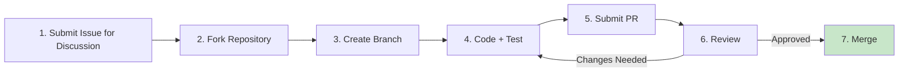

# Contributing Guide (CONTRIBUTING)

> **Document Type:** Contributing Guide
>
> **Version:** v1.0.0
>
> **Date:** YYYY-MM-DD
>
> **Maintainer:** [Project Owner / Maintainer Team]
>
> **Applicable Repository:** {org}/{repo}
>
> **Related Documents:** [README.md](./README.md) / [CHANGELOG.md](./CHANGELOG.md) / [CODE_OF_CONDUCT.md](./CODE_OF_CONDUCT.md)

Contributions are welcome! This document explains how to contribute code, documentation, and issue reports to {Project Name}. By participating, you agree to follow the [Code of Conduct](./CODE_OF_CONDUCT.md).

## Table of Contents

- [Code of Conduct](#code-of-conduct)
- [How to Contribute](#how-to-contribute)
- [Development Environment Setup](#development-environment-setup)
- [Code Standards](#code-standards)
- [Commit Standards](#commit-standards)
- [Pull Request Process](#pull-request-process)
- [Testing Requirements](#testing-requirements)
- [Documentation Contributions](#documentation-contributions)
- [Issue Standards](#issue-standards)
- [Review Criteria](#review-criteria)
- [Acknowledgements](#acknowledgements)

---

## Code of Conduct

This project follows the [Contributor Covenant 2.1](https://www.contributor-covenant.org/version/2/1/code_of_conduct/) Code of Conduct.

- **Focus on the code, not the person**: Critique code, not people
- **Open and inclusive**: Contributors of all backgrounds and skill levels are welcome
- **Data-driven**: Speak with data and facts, avoid subjective assumptions
- **Respect everyone's time**: Maintainers are volunteers; please be patient with reviews

For inappropriate behavior, please contact {conduct-email} via email.

---

## How to Contribute

### Contribution Types

| Type         | Description                                    | Entry Point                          |
| :----------- | :-------------------------------------- | :---------------------------- |
| **Bug Fix** | Fix existing issues                            | [Submit Issue](../../issues)    |
| **New Feature**   | Propose and implement new features                        | Submit Issue for discussion first               |
| **Documentation Improvement** | Fix typos, add explanations, translate              | Submit PR directly                     |
| **Performance Optimization** | Improve performance, reduce resource usage                  | Include benchmark test data                |
| **Test Coverage** | Improve test coverage                          | Submit PR directly                     |
| **Issue Report** | Report bugs or suggest improvements                     | [Submit Issue](../../issues)    |

### Contribution Process Overview



### First-time Contributors

- Issues labeled [`good first issue`](../../issues?q=label%3A%22good+first+issue%22) are great for getting started
- Issues labeled [`help wanted`](../../issues?q=label%3A%22help+wanted%22) welcome community assistance
- Not sure how to start? Leave a comment on an Issue or participate in [Discussions](../../discussions)

---

## Development Environment Setup

### Prerequisites

| Dependency          | Minimum Version | Description                         |
| :------------ | :------- | :--------------------------- |
| {Node.js}     | 18+      | Runtime environment                     |
| {git}         | 2.30+    | Version control                     |
| {Other}        | {Version}   | {Description}                       |

### Steps

```bash
# 1. Fork the repository (via GitHub UI)

# 2. Clone your fork
git clone https://github.com/{your-username}/{repo}.git
cd {repo}

# 3. Add upstream remote
git remote add upstream https://github.com/{org}/{repo}.git

# 4. Install dependencies
{install-command}

# 5. Start development environment
{dev-command}

# 6. Run tests (ensure environment is working)
{test-command}
```

### Recommended IDE Configuration

- **VS Code**: Install recommended extensions (`.vscode/extensions.json`)
- **JetBrains**: Import `.editorconfig` and code style configuration
- **Unified Formatting**: Use `.editorconfig` + project-built-in formatter

---

## Code Standards

### General Principles

- **Readability first**: Code is written for humans; machines just happen to run it
- **Single responsibility**: One function / class does one thing
- **Explicit over implicit**: No magic values, no hidden side effects
- **Concise but not crude**: If it can be done in 5 lines, don't write 50, but don't sacrifice clarity for brevity

### Naming Conventions

| Type         | Convention                | Example                          |
| :----------- | :------------------ | :---------------------------- |
| Variables / Functions  | `snake_case` / `camelCase` (per language convention) | `user_id` / `userId` |
| Constants         | `UPPER_SNAKE_CASE`  | `MAX_RETRY_COUNT`             |
| Classes / Types    | `PascalCase`        | `UserService`                 |
| Filenames       | Per language convention          | `user_service.py` / `UserService.ts` |
| Private Members     | `_` prefix or language convention | `_internal_cache`             |

### Language-specific Standards

| Language     | Linter                | Formatter           | Style Guide                                   |
| :------- | :-------------------- | :------------------ | :----------------------------------------- |
| Rust     | `cargo clippy`        | `cargo fmt`         | [Rust API Guidelines]                      |
| Python   | `ruff`                | `black`             | [PEP 8] / [PEP 257]                        |
| Node/TS  | `eslint`              | `prettier`          | [Google TS Style Guide]                    |
| Java     | `checkstyle`          | `google-java-format`| [Google Java Style]                        |
| Go       | `golangci-lint`       | `gofmt` / `goimports`| [Effective Go]                             |

### Error Handling

- **Errors must be explicit**: Errors must be thrown or returned; swallowing is prohibited
- **Error messages should be actionable**: Include context, cause, and suggested next steps
- **Distinguish error types**: Business errors / System errors / External dependency errors
- **Log levels**: ERROR / WARN / INFO / DEBUG; production defaults to INFO

```python
# ✅ Good
def get_user(user_id: str) -> User:
    if not user_id:
        raise ValueError("user_id cannot be empty")
    user = db.find(user_id)
    if user is None:
        raise UserNotFoundError(f"User {user_id} does not exist")
    return user

# ❌ Bad (swallowing errors)
def get_user(user_id):
    try:
        return db.find(user_id)
    except:
        return None
```

### Comment Standards

- **Why > What**: Explain why something is written this way, not what it does
- **No noise comments**: `# Set i to 0` `i = 0`
- **Public APIs must have docstrings**: Including parameters, return values, exceptions, examples
- **TODOs must include Issue numbers**: `# TODO(#123): Optimize query performance`

---

## Commit Standards

### Commit Message Format

Follow [Conventional Commits 1.0.0](https://www.conventionalcommits.org/en/v1.0.0/):

```
<type>(<scope>): <subject>

<body>

<footer>
```

### Type List

| Type        | Description                                                  |
| :---------- | :---------------------------------------------------- |
| `feat`      | New feature                                                |
| `fix`       | Bug fix                                              |
| `docs`      | Documentation changes                                              |
| `style`     | Code formatting (does not affect functionality)                                |
| `refactor`  | Refactoring (neither new feature nor bug fix)                |
| `perf`      | Performance optimization                                              |
| `test`      | Test-related                                              |
| `build`     | Build system / external dependency changes                               |
| `ci`        | CI configuration changes                                           |
| `chore`     | Miscellaneous (no src or test modifications)                      |
| `revert`    | Revert a previous commit                                     |

### Examples

```
feat(user): Support phone number login

Added phone number + verification code login, coexisting with existing email login.
Verification code valid for 5 minutes, limited to 5 per phone number per day.

Closes #123
```

```
fix(auth): Fix Token not auto-refreshing after expiration

Root cause: refresh_token check timing was outside the request interceptor,
causing multiple refreshes during concurrent requests. Changed to singleton lock + serial refresh.

Fixes #456
```

### Rules

- **subject**: Imperative mood, lowercase first letter, no more than 50 characters, no period at the end
- **body**: Explain What + Why, each line ≤ 72 characters
- **footer**: Link issues (`Closes #123` / `Fixes #456` / `Refs #789`)
- **BREAKING CHANGE**: Mark in footer as `BREAKING CHANGE: <description>`
- One commit does one thing; mixed changes must be split

---

## Pull Request Process

### 1. Create Branch

```bash
# Pull latest from main
git checkout main
git pull upstream main

# Create feature branch (naming convention below)
git checkout -b feat/user-login
```

**Branch Naming Convention:**

| Type     | Prefix       | Example                        |
| :------- | :--------- | :-------------------------- |
| New Feature   | `feat/`    | `feat/user-login`           |
| Bug Fix | `fix/`     | `fix/token-refresh`         |
| Documentation     | `docs/`    | `docs/api-reference`        |
| Refactoring     | `refactor/`| `refactor/auth-module`      |
| Performance     | `perf/`    | `perf/query-cache`          |
| Tests     | `test/`    | `test/user-service`         |

### 2. Code and Commit

```bash
# Commit (follow § Commit Standards)
git add .
git commit -m "feat(user): Support phone number login"
```

### 3. Push and Create PR

```bash
# Push to your Fork
git push origin feat/user-login

# Create PR on GitHub, target branch: main
```

### 4. PR Title and Description

**PR Title**: Matches the first commit message

**PR Description Template:**

```markdown
## Description

<!-- One paragraph explaining what this PR does and why -->

## Change Type

- [ ] New feature (feat)
- [ ] Bug fix (fix)
- [ ] Documentation (docs)
- [ ] Refactoring (refactor)
- [ ] Performance (perf)
- [ ] Other:

## Related Issues

Closes #123

## Testing

- [ ] Unit tests added
- [ ] Integration tests added (if applicable)
- [ ] Manual verification passed (with screenshots / logs)

## Checklist

- [ ] Code follows project standards
- [ ] Self-reviewed code
- [ ] Difficult-to-understand parts are commented
- [ ] Documentation updated (if applicable)
- [ ] No hardcoded secrets / tokens
- [ ] Backward compatible (or BREAKING CHANGE noted)
```

### 5. Review

- **Reviewer requirement**: ≥ 1 Maintainer approval
- **CI must pass**: lint / test / build all green
- **Response time**: Contributors must respond to review feedback within 7 days, or the PR may be closed
- **After changes**: Force push to the same branch; don't open a new PR

### 6. Merge

- **Squash Merge** (default): Multiple commits merged into one
- **Merge Commit**: Preserves full history (for large feature branches only)
- **Rebase**: Linear history (Maintainer's decision)

Delete the source branch after merging.

---

## Testing Requirements

### Coverage Gates

| Module Type     | Line Coverage    | Branch Coverage  |
| :----------- | :---------- | :---------- |
| Core Business Logic | ≥ 85%       | ≥ 75%       |
| Utility Classes       | ≥ 70%       | ≥ 60%       |
| Overall Project     | ≥ 80%       | ≥ 70%       |

### Test Types

| Type         | Description                            | Tools                          |
| :----------- | :------------------------------ | :---------------------------- |
| **Unit Tests** | Individual function / class logic             | {pytest / vitest / cargo test}|
| **Integration Tests** | Multi-module collaboration                      | {testcontainers / supertest}  |
| **Contract Tests** | API consistency with documentation                  | {Pact / Dredd}                |
| **E2E Tests** | End-to-end user flows                  | {Playwright / Cypress}        |
| **Performance Tests** | QPS / Latency / Memory               | {k6 / wrk / criterion}        |

### Test Standards

- **Arrange-Act-Assert**: Three-part test structure, clear organization
- **One test verifies one behavior**: Avoid assertion explosions
- **Test names express intent**: `test_throws_error_when_phone_number_is_empty`
- **No execution order dependency**: Each test is independently runnable
- **Mock external dependencies**: DB / Network / File system
- **Don't test the framework itself**: Don't test `assertEqual(1, 1)`

```python
# ✅ Good
def test_throws_error_when_phone_number_is_empty():
    # Arrange
    service = UserService()
    # Act + Assert
    with pytest.raises(ValueError, match="Phone number cannot be empty"):
        service.send_code("")

# ❌ Bad
def test_send_code():
    service = UserService()
    try:
        service.send_code("")
    except:
        pass
```

---

## Documentation Contributions

### Documentation Contributions Welcome

- Fix typos, grammar errors: Submit PR directly
- Add examples, FAQ: Submit PR directly
- Translate documentation: Submit Issue first to discuss language strategy
- New documentation sections: Submit Issue first to discuss outline

### Documentation Standards

- **Markdown**: Follow [GitHub Flavored Markdown](https://github.github.com/gfm/)
- **Chinese-English mixed text**: Add spaces between Chinese and English (e.g., `Use Node.js 18+`)
- **Code blocks**: Tag language (```bash / ```python / ```typescript)
- **Links**: Use relative paths (same repo) / absolute paths (external)
- **Images**: Place in `docs/images/`, name in `kebab-case.png`

---

## Issue Standards

### Bug Report Template

```markdown
**Environment**
- OS: [e.g., Ubuntu 22.04]
- {Project} version: [e.g., v1.2.3]
- {Language} version: [e.g., Node.js 18.17.0]

**Steps to Reproduce**
1. ...
2. ...
3. ...

**Expected Behavior**
...

**Actual Behavior**
...

**Error Logs**
```
<Full stack trace, sensitive information redacted>
```

**Additional Information**
<Screenshots / Configuration / Other>
```

### Feature Request Template

```markdown
**Problem**
<What problem are you encountering>

**Desired Solution**
<What new feature would you like>

**Alternatives Considered**
<Have you considered other approaches>

**Additional Information**
<Screenshots / References / Other>
```

### Issue Response Timelines

| Type         | First Response      | Closure Timeline      |
| :----------- | :------------ | :------------ |
| Bug Report     | ≤ 3 days        | Depends on complexity      |
| Feature Request     | ≤ 7 days        | Decided after discussion    |
| Security Vulnerability     | ≤ 24 hours     | After fix        |

---

## Review Criteria

### PR Approval Conditions

- [ ] CI all green (lint / test / build / coverage)
- [ ] ≥ 1 Maintainer approval
- [ ] Public API changes have documentation updates
- [ ] BREAKING CHANGE has migration guide
- [ ] No hardcoded secrets / tokens
- [ ] Test coverage does not decrease
- [ ] Commit messages follow Conventional Commits

### Review Focus Areas

| Dimension         | Focus Points                                            |
| :----------- | :------------------------------------------------ |
| **Correctness**   | Is the logic correct? Are edge cases handled?                |
| **Readability**   | Are names clear? Is the structure reasonable?                       |
| **Robustness**   | Is error handling complete? Are exception paths covered?               |
| **Performance**     | Are there performance bottlenecks? Performance under large data volumes?                |
| **Security**     | Are there injection / XSS / privilege escalation risks?                      |
| **Testing**     | Are tests effective? Do they cover critical paths?                  |
| **Documentation**     | Do public APIs have documentation? Are changes recorded?                |

---

## Acknowledgements

Thanks to all contributors! Everyone makes the project better.

[](https://github.com/{org}/{repo}/graphs/contributors)

See [CONTRIBUTORS.md](./CONTRIBUTORS.md) for the full list.

---

## 📌 CONTRIBUTING Writing Checklist

- [ ] Code of Conduct clear
- [ ] Contribution types and process diagram clear
- [ ] Development environment setup steps complete
- [ ] Code standards (general + language-specific)
- [ ] Commit standards (Conventional Commits)
- [ ] PR process (branch naming / description template / review requirements)
- [ ] Testing requirements (coverage gates + types + standards)
- [ ] Documentation contribution standards
- [ ] Issue templates (Bug / Feature request)
- [ ] Review criteria (approval conditions + review focus areas)
- [ ] Acknowledgements and contributor links
