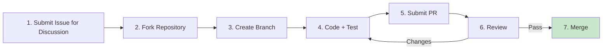

# Contributing Guide (CONTRIBUTING)

> **Document Type:** Contributing Guide
>
> **Version:** v1.0.0
>
> **Date:** YYYY-MM-DD
>
> **Maintainer:** [Project Owner / Maintainer Team]
>
> **Applicable Repository:** {org}/{repo}
>
> **Related Documents:** [README.md](./README.md) / [CHANGELOG.md](./CHANGELOG.md) / [CODE_OF_CONDUCT.md](./CODE_OF_CONDUCT.md)

Welcome! This document explains how to contribute code, documentation, and feedback to {Project Name}. Participation implies agreement to follow the [Code of Conduct](./CODE_OF_CONDUCT.md).

## Table of Contents

- [Code of Conduct](#code-of-conduct)
- [How to Contribute](#how-to-contribute)
- [Development Environment Setup](#development-environment-setup)
- [Code Standards](#code-standards)
- [Commit Standards](#commit-standards)
- [Pull Request Process](#pull-request-process)
- [Testing Requirements](#testing-requirements)
- [Documentation Contributions](#documentation-contributions)
- [Issue Standards](#issue-standards)
- [Review Criteria](#review-criteria)
- [Acknowledgments](#acknowledgments)

---

## Code of Conduct

This project follows the [Contributor Covenant 2.1](https://www.contributor-covenant.org/version/2/1/code_of_conduct/) code of conduct.

- **Focus on issues, not people**: Critique code, not individuals
- **Open and inclusive**: Welcome contributors of all backgrounds and skill levels
- **Data-driven**: Use data and facts, avoid subjective assumptions
- **Respect time**: Maintainers are volunteers; please be patient with reviews

For inappropriate behavior, contact {conduct-email}.

---

## How to Contribute

### Contribution Types

| Type | Description | Entry Point |
| :----------- | :-------------------------------------- | :---------------------------- |
| **Bug Fix** | Fix existing issues | [Submit Issue](../../issues) |
| **New Feature** | Propose and implement new functionality | Discuss via Issue first |
| **Documentation** | Fix typos, add explanations, translate | Submit PR directly |
| **Performance** | Improve performance, reduce resource usage | Include benchmark data |
| **Test Coverage** | Improve test coverage | Submit PR directly |
| **Bug Report** | Report bugs or suggest improvements | [Submit Issue](../../issues) |

### Contribution Flow Overview



### First-Time Contributors

- Label [`good first issue`](../../issues?q=label%3A%22good+first+issue%22) is great for beginners
- Label [`help wanted`](../../issues?q=label%3A%22help+wanted%22) welcomes community help
- Not sure where to start? Comment on an Issue or join [Discussions](../../discussions)

---

## Development Environment Setup

### Prerequisites

| Dependency | Minimum Version | Description |
| :------------ | :------- | :--------------------------- |
| {Node.js} | 18+ | Runtime environment |
| {git} | 2.30+ | Version control |
| {Other} | {Version} | {Description} |

### Steps

```bash
# 1. Fork repository (GitHub page operation)

# 2. Clone your fork
git clone https://github.com/{your-username}/{repo}.git
cd {repo}

# 3. Add upstream repository
git remote add upstream https://github.com/{org}/{repo}.git

# 4. Install dependencies
{install-command}

# 5. Start development environment
{dev-command}

# 6. Run tests (ensure environment works)
{test-command}
```

### Recommended IDE Configuration

- **VS Code**: Install recommended extensions (`.vscode/extensions.json`)
- **JetBrains**: Import `.editorconfig` and code style configuration
- **Unified Formatting**: Use `.editorconfig` + project-built-in formatter

---

## Code Standards

### General Principles

- **Readability first**: Code is written for humans; machines just happen to run it
- **Single responsibility**: One function/class does one thing
- **Explicit over implicit**: No magic values, no hidden side effects
- **Concise but not crude**: If 5 lines work, don't write 50; but don't sacrifice clarity for line count

### Naming Conventions

| Type | Convention | Example |
| :----------- | :------------------ | :---------------------------- |
| Variables/Functions | `snake_case` / `camelCase` (per language convention) | `user_id` / `userId` |
| Constants | `UPPER_SNAKE_CASE` | `MAX_RETRY_COUNT` |
| Classes/Types | `PascalCase` | `UserService` |
| Filenames | Per language convention | `user_service.py` / `UserService.ts` |
| Private Members | Prefix `_` or per language convention | `_internal_cache` |

### Language-Specific Standards

| Language | Linter | Formatter | Standards Doc |
| :------- | :-------------------- | :------------------ | :----------------------------------------- |
| Rust | `cargo clippy` | `cargo fmt` | [Rust API Guidelines] |
| Python | `ruff` | `black` | [PEP 8] / [PEP 257] |
| Node/TS | `eslint` | `prettier` | [Google TS Style Guide] |
| Java | `checkstyle` | `google-java-format` | [Google Java Style] |
| Go | `golangci-lint` | `gofmt` / `goimports` | [Effective Go] |

### Error Handling

- **Failures must be explicit**: Errors must be thrown or returned; never swallowed
- **Error messages actionable**: Include context, cause, suggested next step
- **Distinguish error types**: Business error / System error / External dependency error
- **Log levels**: ERROR / WARN / INFO / DEBUG; production defaults to INFO

```python
# ✅ Good
def get_user(user_id: str) -> User:
    if not user_id:
        raise ValueError("user_id cannot be empty")
    user = db.find(user_id)
    if user is None:
        raise UserNotFoundError(f"User {user_id} not found")
    return user

# ❌ Bad (swallowing errors)
def get_user(user_id):
    try:
        return db.find(user_id)
    except:
        return None
```

### Comment Standards

- **Why > What**: Explain why, not what
- **No useless comments**: `# Set i to 0` `i = 0`
- **Public APIs must have doc comments**: Including parameters, return values, exceptions, examples
- **TODOs must reference Issue numbers**: `# TODO(#123): Optimize query performance`

---

## Commit Standards

### Commit Message Format

Follow [Conventional Commits 1.0.0](https://www.conventionalcommits.org/en/v1.0.0/):

```
<type>(<scope>): <subject>

<body>

<footer>
```

### Type List

| Type | Description |
| :---------- | :---------------------------------------------------- |
| `feat` | New feature |
| `fix` | Bug fix |
| `docs` | Documentation changes |
| `style` | Code formatting (no functionality change) |
| `refactor` | Refactoring (neither new feature nor bug fix) |
| `perf` | Performance optimization |
| `test` | Testing related |
| `build` | Build system / external dependency changes |
| `ci` | CI configuration changes |
| `chore` | Miscellaneous (no src or test changes) |
| `revert` | Revert previous commit |

### Examples

```
feat(user): Support phone number login

Added phone + verification code login method, coexisting with existing email login.
Verification code valid for 5 minutes, max 5 times per phone per day.

Closes #123
```

```
fix(auth): Fix auto-refresh issue after token expiration

Root cause: refresh_token check timing was outside the request interceptor,
causing multiple refreshes during concurrent requests. Changed to singleton lock + serial refresh.

Fixes #456
```

### Rules

- **subject**: Imperative mood, lowercase first letter, max 50 characters, no period at end
- **body**: Explain What + Why, each line ≤ 72 characters
- **footer**: Link Issues (`Closes #123` / `Fixes #456` / `Refs #789`)
- **BREAKING CHANGE**: Annotate in footer as `BREAKING CHANGE: <description>`
- One commit does one thing; mixed changes must be split

---

## Pull Request Process

### 1. Create Branch

```bash
# Pull latest from main
git checkout main
git pull upstream main

# Create feature branch (naming convention below)
git checkout -b feat/user-login
```

**Branch Naming Convention:**

| Type | Prefix | Example |
| :------- | :--------- | :-------------------------- |
| New Feature | `feat/` | `feat/user-login` |
| Bug Fix | `fix/` | `fix/token-refresh` |
| Documentation | `docs/` | `docs/api-reference` |
| Refactoring | `refactor/` | `refactor/auth-module` |
| Performance | `perf/` | `perf/query-cache` |
| Testing | `test/` | `test/user-service` |

### 2. Code & Commit

```bash
# Commit (follow §Commit Standards)
git add .
git commit -m "feat(user): Support phone number login"
```

### 3. Push & Create PR

```bash
# Push to your Fork
git push origin feat/user-login

# Create PR on GitHub page, target branch: main
```

### 4. PR Title & Description

**PR Title**: Match the first commit message

**PR Description Template:**

```markdown
## Changes

<!-- One paragraph describing what this PR does and why -->

## Change Type

- [ ] New feature (feat)
- [ ] Bug fix (fix)
- [ ] Documentation (docs)
- [ ] Refactoring (refactor)
- [ ] Performance (perf)
- [ ] Other:

## Related Issues

Closes #123

## Testing

- [ ] Unit tests added
- [ ] Integration tests added (if applicable)
- [ ] Manual verification passed (with screenshot / log)

## Checklist

- [ ] Code follows project standards
- [ ] Self-reviewed code
- [ ] Commented hard-to-understand parts
- [ ] Documentation updated (if applicable)
- [ ] No hardcoded secrets / tokens
- [ ] Backward compatible (or BREAKING CHANGE annotated)
```

### 5. Review

- **Reviewer requirement**: ≥ 1 Maintainer approval
- **CI must pass**: lint / test / build all green
- **Response time**: Contributor responds to review within 7 days, otherwise may be closed
- **After changes**: Force push to the same branch, don't open a new PR

### 6. Merge

- **Squash Merge** (default): Multiple commits merged into one
- **Merge Commit**: Preserve full history (large feature branches only)
- **Rebase**: Linear history (Maintainer's decision)

Delete source branch after merge.

---

## Testing Requirements

### Coverage Gates

| Module Type | Line Coverage | Branch Coverage |
| :----------- | :---------- | :---------- |
| Core business logic | ≥ 85% | ≥ 75% |
| Utilities | ≥ 70% | ≥ 60% |
| Overall project | ≥ 80% | ≥ 70% |

### Test Types

| Type | Description | Tools |
| :----------- | :------------------------------ | :---------------------------- |
| **Unit Test** | Single function/class logic | {pytest / vitest / cargo test} |
| **Integration Test** | Multi-module collaboration | {testcontainers / supertest} |
| **Contract Test** | API matches documentation | {Pact / Dredd} |
| **E2E Test** | End-to-end user flow | {Playwright / Cypress} |
| **Performance Test** | QPS / latency / memory | {k6 / wrk / criterion} |

### Testing Standards

- **Arrange-Act-Assert**: Three-part test structure, clear organization
- **One test verifies one behavior**: Avoid assertion explosion
- **Test names express intent**: `test_phone_number_empty_throws_ValueError`
- **No execution order dependency**: Each test independently runnable
- **Mock external dependencies**: DB / network / file system
- **Don't test the framework itself**: Don't test `assertEqual(1, 1)`

```python
# ✅ Good
def test_phone_number_empty_throws_error():
    # Arrange
    service = UserService()
    # Act + Assert
    with pytest.raises(ValueError, match="phone number cannot be empty"):
        service.send_code("")

# ❌ Bad
def test_send_code():
    service = UserService()
    try:
        service.send_code("")
    except:
        pass
```

---

## Documentation Contributions

### Welcome Documentation Contributions

- Fix typos, grammar errors: Submit PR directly
- Add examples, FAQ: Submit PR directly
- Translate documentation: Discuss language strategy via Issue first
- New documentation sections: Discuss outline via Issue first

### Documentation Standards

- **Markdown**: Follow [GitHub Flavored Markdown](https://github.github.com/gfm/)
- **Chinese-English mixed**: Add space between Chinese and English (e.g., `使用 Node.js 18+`)
- **Code blocks**: Annotate language (```bash / ```python / ```typescript)
- **Links**: Use relative paths (same repo) / absolute paths (external sites)
- **Images**: Place in `docs/images/`, name in `kebab-case.png`

---

## Issue Standards

### Bug Report Template

```markdown
**Environment**
- OS: [e.g., Ubuntu 22.04]
- {Project} version: [e.g., v1.2.3]
- {Language} version: [e.g., Node.js 18.17.0]

**Reproduction Steps**
1. ...
2. ...
3. ...

**Expected Behavior**
...

**Actual Behavior**
...

**Error Log**
```
<full stack trace, sensitive info masked>
```

**Additional Info**
<screenshot / configuration / other>
```

### Feature Request Template

```markdown
**Problem**
<What problem are you encountering>

**Desired Solution**
<What feature would you like added>

**Alternatives Considered**
<Have you considered other approaches>

**Additional Info**
<screenshot / reference / other>
```

### Issue Response Timeline

| Type | First Response | Resolution Timeline |
| :----------- | :------------ | :------------ |
| Bug Report | ≤ 3 days | Depends on complexity |
| Feature Request | ≤ 7 days | After discussion |
| Security Vulnerability | ≤ 24 hours | After fix |

---

## Review Criteria

### PR Acceptance Conditions

- [ ] CI all green (lint / test / build / coverage)
- [ ] ≥ 1 Maintainer approval
- [ ] Public API changes have documentation updates
- [ ] BREAKING CHANGE has migration guide
- [ ] No hardcoded secrets / tokens
- [ ] Test coverage doesn't decrease
- [ ] Commit message follows Conventional Commits

### Review Focus Areas

| Dimension | Focus Points |
| :----------- | :------------------------------------------------ |
| **Correctness** | Logic correct? Edge cases handled? |
| **Readability** | Clear naming? Reasonable structure? |
| **Robustness** | Error handling complete? Exception paths covered? |
| **Performance** | Performance bottlenecks introduced? Behavior under large data? |
| **Security** | Injection / XSS / authorization risks? |
| **Testing** | Tests effective? Key paths covered? |
| **Documentation** | Public APIs documented? Changes recorded? |

---

## Acknowledgments

Thanks to all contributors! Every one of you makes the project better.

[](https://github.com/{org}/{repo}/graphs/contributors)

See [CONTRIBUTORS.md](./CONTRIBUTORS.md) for the contributor list.

---

## 📌 CONTRIBUTING Writing Checklist

- [ ] Code of conduct clear
- [ ] Contribution types and flow diagram clear
- [ ] Development environment setup steps complete
- [ ] Code standards (general + language-specific)
- [ ] Commit standards (Conventional Commits)
- [ ] PR process (branch naming / description template / review requirements)
- [ ] Testing requirements (coverage gates + types + standards)
- [ ] Documentation contribution standards
- [ ] Issue templates (Bug / Feature request)
- [ ] Review criteria (acceptance conditions + review focus)
- [ ] Acknowledgments and contributor links
