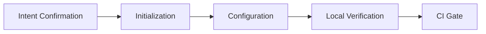

# {Project Name} ({English Name})

> **Document Type:** Project Entry Document (README)
>
> **Version:** v1.0.0
>
> **Date:** YYYY-MM-DD
>
> **Maintainer:** [Project Owner / Team]
>
> **Related Documents:** [CHANGELOG.md](./CHANGELOG.md) / [CONTRIBUTING.md](./CONTRIBUTING.md) / [LICENSE](./LICENSE)

[](https://github.com/{org}/{repo}/releases)
[](LICENSE)
[](https://github.com/{org}/{repo}/actions)
[](https://codecov.io/gh/{org}/{repo})

{One-line project positioning, e.g., "An industrial-grade project initialization skill for AI agents, transforming an empty directory into a production-grade project with complete quality gates."}

## Features

- **Feature 1**: [One-line description, e.g., One-click initialization for 9 languages]
- **Feature 2**: [One-line description, e.g., CI quality gates + tag-triggered Release workflow]
- **Feature 3**: [One-line description, e.g., Local pre-commit/lefthook dual industrial-grade checks]
- **Feature 4**: [One-line description, e.g., Coverage gate industry baseline 80%]

> See [§ Capability Overview](#capability-overview) for the complete capability matrix.

## Installation

### Prerequisites

| Dependency | Minimum Version | Description |
| :--------- | :------- | :--------------------------- |
| {Node.js} | 18+ | Runtime environment |
| {git} | 2.30+ | Version control |
| {Other} | {Version} | {Description} |

### Method 1: Install via Package Manager (Recommended)

```bash
# npm
npm install {package-name}

# pnpm
pnpm add {package-name}

# uv (Python)
uv add {package-name}

# cargo (Rust)
cargo add {crate-name}
```

### Method 2: Build from Source

```bash
git clone https://github.com/{org}/{repo}.git
cd {repo}
{build-command}
```

### Method 3: Download Binary Directly

```bash
# Download platform-specific binary from GitHub Releases
curl -L https://github.com/{org}/{repo}/releases/latest/download/{binary}-{os}-{arch}.tar.gz | tar xz
```

## Quick Start

```bash
# 1. Enter target directory
cd /path/to/project

# 2. Initialize
{init-command}

# 3. Verify
{verify-command}
```

**Expected Output:**

```
{expected output example}
```

## Usage Examples

```bash
# Example 1: Basic usage
{command-1}

# Example 2: With parameters
{command-2} --option value

# Example 3: Advanced usage
{command-3}
```

More examples in [`docs/examples/`](./docs/examples/).

## Configuration

### Configuration File

Main config file at `{config-path}`, key fields:

| Field | Type | Default | Description |
| :--------------- | :------ | :-------- | :---------------------------- |
| `{field_1}` | string | `default` | {Description} |
| `{field_2}` | integer | `80` | {Description} |
| `{field_3}` | boolean | `false` | {Description} |
| `{field_env}` | string | — | Prefer reading from env var `{ENV_VAR}` |

### Environment Variables

| Variable Name | Required | Default | Description |
| :--------------- | :--: | :----- | :---------------------------- |
| `{ENV_API_KEY}` | ✅ | — | API key |
| `{ENV_LOG_LEVEL}` | — | `info` | Log level |
| `{ENV_TIMEOUT}` | — | `30` | Request timeout (seconds) |

> **Security Reminder**: Sensitive information like keys and tokens must not be hardcoded in config files; must be injected via environment variables or KMS.

## Capability Overview

### `references/` — Reference Documentation

| File | Content | When to Read |
| ---- | ---- | ------ |
| [`references/{file}.md`](references/{file}.md) | {Description} | {Timing} |

### `scripts/` — Utility Scripts

| Script | Purpose |
| ---- | ---- |
| `scripts/{script-1}.sh` | {Description} |
| `scripts/{script-2}.sh` | {Description} |

### `templates/` — Templates

```
templates/
├── {category-1}/   # {Description}
└── {category-2}/   # {Description}
```

## Full Pipeline



1. **Phase 0 · Intent Confirmation**: {Description}
2. **Phase 1 · Initialization**: {Description}
3. **Phase 2 · Configuration**: {Description}
4. **Phase 3 · CI Gate**: {Description}
5. **🛑 Phase 4 · Verification (STOP)**: {Description}

## Contributing

Contributions welcome! See [CONTRIBUTING.md](./CONTRIBUTING.md) for:

- Fork / Branch / PR conventions
- Code style and testing requirements
- Commit message conventions
- Code of Conduct

### Contributors

Thanks to all contributors:

[](https://github.com/{org}/{repo}/graphs/contributors)

## Roadmap

- [x] {Completed feature 1}
- [x] {Completed feature 2}
- [ ] {Planned feature 1}
- [ ] {Planned feature 2}

See [Roadmap](./docs/ROADMAP.md).

## FAQ

See [FAQ.md](./FAQ.md). If you can't find an answer, [submit an Issue](https://github.com/{org}/{repo}/issues/new).

## Changelog

See [CHANGELOG.md](./CHANGELOG.md).

## License

[MIT](./LICENSE) © {Year} {Author/Organization}

## Acknowledgments

- {Dependency 1} — {Description}
- {Dependency 2} — {Description}
- {Inspiration Source}

## Contact

- **Issues**: [Submit Issue](https://github.com/{org}/{repo}/issues)
- **Discussions**: [GitHub Discussions](https://github.com/{org}/{repo}/discussions)
- **Email**: {email}
- **Slack/Discord**: {invite link}

---

## 📌 README Writing Checklist

- [ ] Title + one-line positioning
- [ ] Badges (Release / License / Build / Coverage)
- [ ] Features (≥ 4 items)
- [ ] Installation (≥ 2 methods, with prerequisites)
- [ ] Quick Start (with expected output)
- [ ] Usage examples (≥ 3, covering basic to advanced)
- [ ] Configuration (config file + env var table)
- [ ] Capability overview (directory structure description)
- [ ] Full pipeline (with verification STOP point)
- [ ] Contributing link + contributor badge
- [ ] Roadmap
- [ ] FAQ / CHANGELOG / LICENSE links complete
- [ ] License + Acknowledgments + Contact
